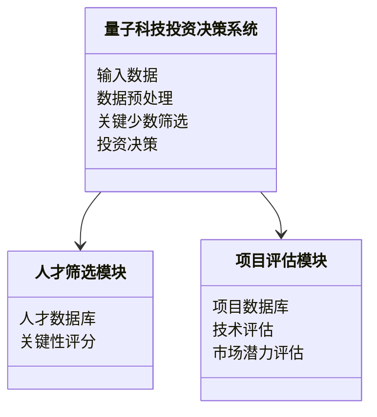
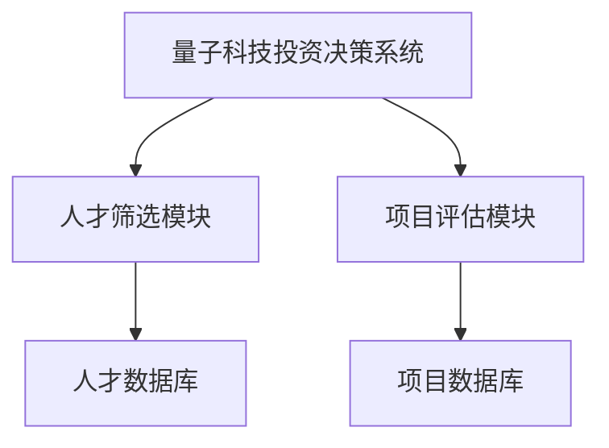

                 


# 芒格的"关键少数"原则在量子科技人才培养投资中的应用

> 关键词：芒格、关键少数原则、量子科技、人才培养、投资

> 摘要：本文深入探讨了芒格的“关键少数”原则在量子科技人才培养和投资中的应用。通过分析量子科技的特殊性，结合关键少数原则的核心理念，提出了一套系统化的解决方案，包括人才筛选标准、投资决策策略以及具体的算法实现。文章还通过实际案例展示了如何将这些理论应用于实践，为量子科技的发展提供了新的思路。

---

## 第一章：引言

### 1.1 量子科技的崛起与重要性

量子科技是21世纪最前沿的科技领域之一，涵盖了量子计算、量子通信、量子传感等多个方向。它不仅在理论上推动了物理学的发展，还在实际应用中展现出巨大的潜力。量子计算的超强计算能力可能 revolutionize 计算机科学，量子通信的安全性将彻底改变信息安全领域。然而，量子科技的发展高度依赖于高素质的人才，这些人才需要具备深厚的物理、数学背景，同时还要熟悉计算机科学和工程实践。

### 1.2 芒格的“关键少数”原则概述

芒格的“关键少数”原则强调在复杂系统中，抓住少数关键因素可以产生最大的效果。这一原则在商业、管理等领域得到了广泛应用。在量子科技领域，关键少数原则可以帮助我们识别出最核心的人才和项目，从而在有限的资源下实现最大的投资回报。

### 1.3 本书的研究意义与目标

本文旨在将芒格的“关键少数”原则应用于量子科技人才培养和投资中，通过系统化的分析和实证研究，提出一套可操作的解决方案。文章不仅探讨了理论层面的可行性，还通过实际案例展示了如何将这些原则付诸实践。

---

## 第二章：背景介绍

### 2.1 芒格的“关键少数”原则

芒格的“关键少数”原则认为，在任何系统中，只有少数因素对结果起决定性作用。这些因素被称为“关键少数”，而其他因素则属于“非关键多数”。在量子科技领域，关键少数可能包括具有创新思维的科学家、技术领先的量子计算工程师等。

### 2.2 量子科技的现状与挑战

量子科技目前处于快速发展阶段，但也面临诸多挑战。技术上的不确定性、人才的稀缺性以及高昂的投资成本都是量子科技发展的障碍。如何在有限的资源下最大化投资回报，是量子科技投资者面临的核心问题。

### 2.3 关键少数原则在量子科技中的适用性

量子科技的复杂性和高风险性使得关键少数原则尤为重要。通过识别关键人才和关键项目，投资者可以集中资源，提高成功的概率。

---

## 第三章：核心概念与联系

### 3.1 关键少数原则的核心概念

关键少数原则的核心在于识别和聚焦于最关键的因素。在量子科技中，这些因素可能包括：

1. **人才**：具有深厚量子物理背景和工程能力的人才。
2. **技术**：具有领先性的量子计算或通信技术。
3. **资源**：高质量的实验设备和数据支持。

### 3.2 量子科技人才的属性特征

以下是量子科技人才与传统科技人才的对比表：

| **属性**       | **量子科技人才**                 | **传统科技人才**                 |
|----------------|----------------------------------|----------------------------------|
| **知识背景**    | 量子物理、数学、计算机科学     | 计算机科学、电子工程等           |
| **技能要求**    | 量子算法设计、量子系统集成     | 系统设计、软件开发等             |
| **创新性**      | 高，需具备创新性思维             | 中等，需具备一定的创新能力         |
| **团队协作**    | 强，需跨学科协作                | 强，但协作范围相对有限            |

### 3.3 投资决策中的关键少数

在量子科技投资中，关键少数可能包括：

1. **核心团队**：创始人和关键研发人员。
2. **核心技术**：具有突破性的量子算法或实验技术。
3. **市场潜力**：潜在的应用场景和市场规模。

---

## 第四章：算法原理讲解

### 4.1 关键少数原则的数学模型

关键少数原则可以通过以下数学模型进行描述：

$$
\text{关键少数} = \{x | x \in X \text{ 并且 } x \text{ 满足关键性条件}\}
$$

其中，\( X \) 是所有可能的因素集合，关键性条件包括人才的创新能力、技术的领先性等。

### 4.2 量子科技人才筛选的权重分配

为了实现人才筛选，我们可以建立一个权重分配模型：

$$
w_i = \frac{a_i}{\sum_{j=1}^{n} a_j}
$$

其中，\( w_i \) 是第 \( i \) 个人才的权重，\( a_i \) 是其关键性评分，\( n \) 是总人数。

### 4.3 投资决策中的优化算法

以下是一个优化算法的实现步骤：

1. **数据收集**：收集候选人才和项目的各项指标。
2. **权重计算**：根据关键性条件计算各项指标的权重。
3. **排序与筛选**：根据权重对人才和项目进行排序，筛选出关键少数。

---

## 第五章：系统分析与架构设计

### 5.1 系统功能设计

以下是一个量子科技投资决策系统的功能设计类图（Mermaid）：



### 5.2 系统架构设计

以下是一个量子科技投资决策系统的架构图（Mermaid）：



### 5.3 系统接口设计

系统主要接口包括：

1. 数据接口：人才数据库和项目数据库的接口。
2. 用户接口：输入关键性评分和权重分配的参数。
3. 输出接口：筛选结果和投资建议。

---

## 第六章：项目实战

### 6.1 环境安装

为了实现量子科技投资决策系统，需要安装以下工具：

- Python 3.8+
- Mermaid
- matplotlib

### 6.2 核心算法实现

以下是一个Python实现的关键少数筛选算法：

```python
def key_minority_selection(data, weights):
    # 数据预处理
    normalized_data = data / data.max()
    # 权重分配
    weighted_scores = normalized_data * weights
    # 排序与筛选
    selected = weighted_scores.nlargest(5)
    return selected
```

### 6.3 代码的功能解读

该代码首先对数据进行归一化处理，然后根据权重计算加权评分，最后筛选出评分最高的前5项。这可以帮助投资者识别出最关键的人才和项目。

---

## 第七章：总结与展望

### 7.1 总结

芒格的“关键少数”原则为量子科技人才培养和投资提供了一种高效的方法。通过识别关键因素，投资者可以在有限的资源下实现最大的回报。

### 7.2 展望

未来，随着量子科技的不断发展，关键少数原则的应用将更加广泛。通过结合人工智能和大数据技术，我们可以进一步优化人才筛选和投资决策过程。

---

## 最佳实践 tips

- **早期识别**：尽早识别具有潜力的量子科技人才和项目。
- **持续评估**：定期评估人才和项目的进展情况，及时调整投资策略。
- **数据驱动**：利用数据和算法进行决策，减少主观因素的干扰。

---

## 作者

**作者：AI天才研究院/AI Genius Institute & 禅与计算机程序设计艺术 /Zen And The Art of Computer Programming**

---

通过本文的系统化分析和实践案例，我们展示了如何将芒格的“关键少数”原则应用于量子科技人才培养和投资中。这一原则不仅提高了投资效率，还为量子科技的发展注入了新的动力。

