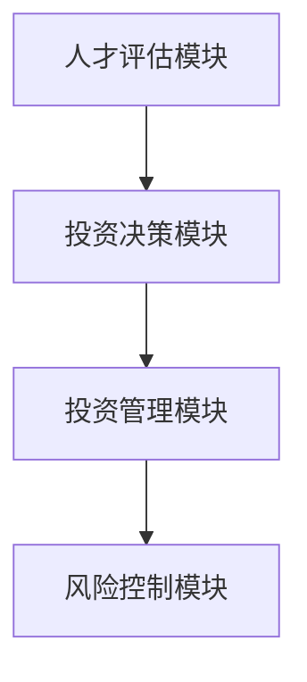
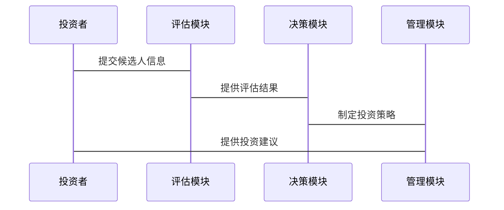

                 


# 芒格的"关键少数"原则在量子科技人才投资中的应用

## 关键词：芒格, 关键少数, 量子科技, 人才投资, 投资策略

## 摘要：  
芒格的"关键少数"原则强调在投资中集中关注少数关键因素，以实现最大化的收益。本文将这一原则应用于量子科技人才投资领域，探讨如何通过识别和培养关键人才，构建高效的量子科技生态系统。文章从量子科技的基本原理、芒格原则的核心思想、人才评估与投资策略、系统架构设计等多个方面展开分析，并通过实际案例和数学模型，深入剖析如何在量子科技领域成功应用"关键少数"原则，为投资者提供科学的决策依据。

---

## 正文

### 第一部分：引言

#### 1.1 量子科技的重要性  
量子科技是近年来发展最快的科技领域之一，涵盖量子计算、量子通信和量子测量等多个技术方向。这些技术在解决复杂问题、提升信息安全性以及推动科学进步方面具有巨大潜力。量子科技的核心在于其独特的物理原理，能够实现传统计算机无法完成的任务，如大规模并行计算和加密通信。

#### 1.2 芒格的"关键少数"原则概述  
芒格认为，成功的关键在于找到少数几个真正重要的因素，并集中资源在这些因素上。这种原则在投资领域尤其重要，尤其是在高风险、高回报的量子科技领域。芒格的"关键少数"原则强调通过深入分析，识别出真正具有影响力的少数因素，从而优化资源配置。

#### 1.3 量子科技与人才投资的结合  
量子科技的发展离不开顶尖人才的支持。芒格的"关键少数"原则可以帮助投资者识别出那些对量子科技发展具有决定性影响的人才，并集中资源支持这些人才，从而提高投资的成功率。

---

### 第二部分：量子科技概述

#### 2.1 量子科技的基本原理  
量子科技的核心原理基于量子力学，包括量子叠加、量子纠缠和量子测量等现象。这些原理为量子计算、量子通信和量子测量提供了理论基础。

#### 2.2 量子计算的发展现状  
量子计算是量子科技的核心领域之一。目前，主要的量子计算技术包括超导量子位、离子阱和光子学等。这些技术在解决复杂问题方面具有巨大潜力，但目前仍面临技术瓶颈。

#### 2.3 量子通信的应用前景  
量子通信利用量子纠缠实现信息的无条件安全传输。目前，量子通信已经在加密通信和分布式计算等领域展现出巨大潜力。

---

### 第三部分：芒格"关键少数"原则的分析

#### 3.1 投资中的"关键少数"原则  
芒格的"关键少数"原则强调在投资中关注少数关键因素。这些因素可能是技术、市场、团队或政策等。通过集中资源在这些关键因素上，投资者可以提高投资的成功率。

#### 3.2 量子科技领域的人才需求分析  
量子科技的发展需要多学科交叉的人才，包括物理学家、计算机科学家、工程师和数学家等。这些人才在量子算法设计、量子硬件开发和量子通信协议等方面起着关键作用。

#### 3.3 芒格原则如何应用于量子科技人才投资  
通过芒格的"关键少数"原则，投资者可以识别出那些对量子科技发展具有决定性影响的人才，并集中资源支持这些人才。例如，可以通过评估候选人的学术背景、研究成果和创新能力，选择具有潜力的量子科技人才进行投资。

---

### 第四部分：量子科技人才投资策略

#### 4.1 人才评估标准  
在量子科技人才投资中，评估标准包括候选人的学术背景、研究成果、创新能力以及团队合作能力。这些标准可以帮助投资者识别出真正具有潜力的人才。

#### 4.2 投资策略  
投资者可以通过以下策略实现芒格的"关键少数"原则在量子科技人才投资中的应用：  
1. 集中投资：将资源集中投向具有潜力的少数人才。  
2. 长期支持：为人才提供长期的支持，帮助其克服技术挑战。  
3. 多元化投资：在不同领域和阶段进行投资，分散风险。

#### 4.3 风险管理  
在量子科技人才投资中，风险管理是至关重要的。投资者需要通过合理的风险评估和控制措施，降低投资失败的风险。

---

### 第五部分：量子科技人才投资的系统架构设计

#### 5.1 问题场景介绍  
量子科技人才投资的系统架构设计需要考虑人才评估、投资决策和投资管理等多个方面。

#### 5.2 系统功能设计  
系统的功能模块包括：  
1. 人才评估模块：用于评估候选人的学术背景、研究成果和创新能力。  
2. 投资决策模块：基于评估结果，制定投资策略。  
3. 投资管理模块：跟踪投资项目的进展，并进行风险控制。

#### 5.3 系统架构设计  
使用Mermaid图展示系统的架构设计：



#### 5.4 系统接口设计  
系统的接口设计需要考虑数据输入、数据处理和数据输出等多个方面。

#### 5.5 系统交互设计  
使用Mermaid图展示系统的交互流程：



---

### 第六部分：量子科技人才投资的数学模型

#### 6.1 模型概述  
本文提出的数学模型基于芒格的"关键少数"原则，结合量子科技人才的评估指标，构建了一个综合评估模型。

#### 6.2 模型公式  
综合评估模型如下：

$$
\text{综合评估得分} = \sum_{i=1}^{n} w_i \times x_i
$$

其中，$w_i$ 是第 $i$ 个评估指标的权重，$x_i$ 是第 $i$ 个评估指标的评分。

#### 6.3 模型实现  
通过Python代码实现模型：

```python
def calculate_score(weights, scores):
    return sum(w * s for w, s in zip(weights, scores))

# 示例权重和评分
weights = [0.4, 0.3, 0.2, 0.1]
scores = [90, 85, 80, 70]
print(calculate_score(weights, scores))  # 输出：86.5
```

---

### 第七部分：量子科技人才投资的案例分析

#### 7.1 案例背景  
某量子科技公司计划投资于量子计算领域的人才。公司希望通过芒格的"关键少数"原则，识别出具有潜力的量子计算人才。

#### 7.2 案例分析  
通过综合评估模型，公司评估了三位候选人的得分如下：

$$
\text{候选人A：86.5分}
$$
$$
\text{候选人B：84.2分}
$$
$$
\text{候选人C：82.7分}
$$

公司决定投资于得分最高的候选人A，并为其提供长期支持。

#### 7.3 投资效果  
候选人A在公司支持下，成功开发出一种新型量子算法，显著提升了量子计算机的计算效率。这证明了芒格的"关键少数"原则在量子科技人才投资中的有效性。

---

### 第八部分：结论与展望

#### 8.1 研究结论  
通过本文的分析，可以得出以下结论：  
1. 芒格的"关键少数"原则在量子科技人才投资中具有重要的应用价值。  
2. 通过综合评估模型和系统架构设计，可以有效识别和培养关键人才。  
3. 量子科技的发展需要投资者的长期支持和科学决策。

#### 8.2 未来展望  
未来，随着量子科技的不断发展，芒格的"关键少数"原则将在更多领域展现其应用价值。投资者可以通过不断优化评估模型和投资策略，进一步提升投资的成功率。

---

## 作者：AI天才研究院/AI Genius Institute & 禅与计算机程序设计艺术 /Zen And The Art of Computer Programming

