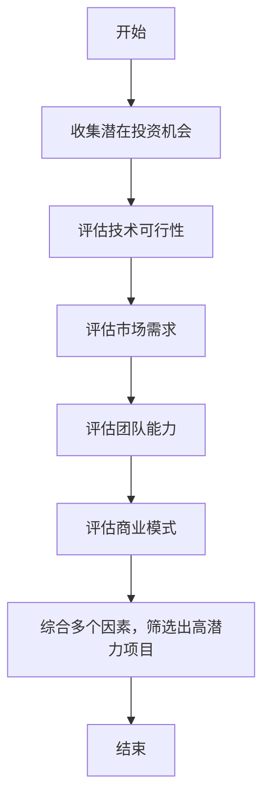
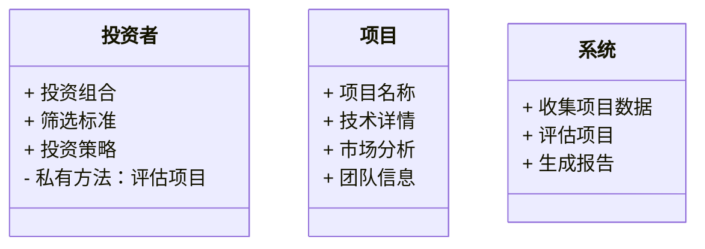
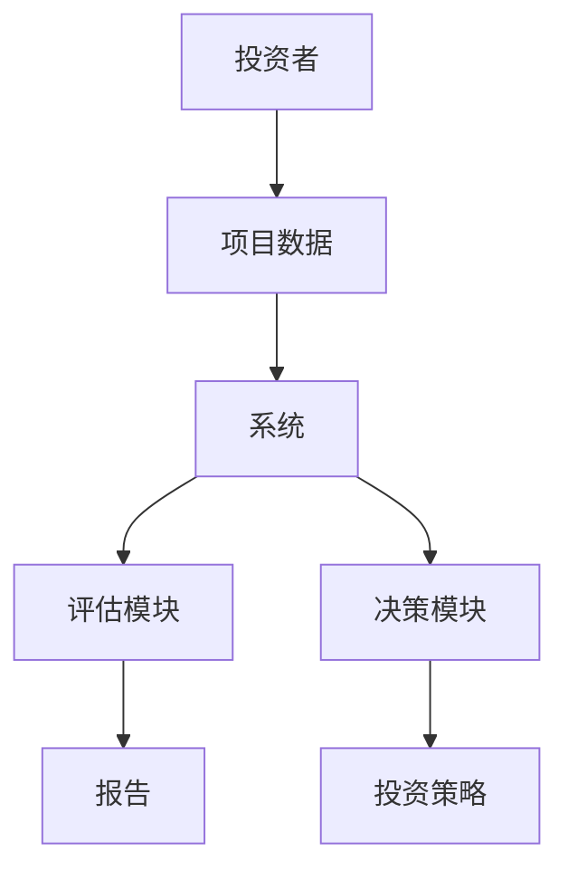

                 


# 芒格的"关键少数"原则在量子科技创业投资中的应用

> 关键词：芒格、关键少数原则、量子科技、创业投资、决策模型

> 摘要：本文探讨了芒格的"关键少数"原则在量子科技创业投资中的应用，通过分析量子科技的特点、创业投资的背景以及关键少数原则的核心要素，结合实际案例和数学模型，展示了该原则在筛选投资机会、评估项目潜力和优化投资策略中的重要性。本文还提供了详细的算法流程、系统架构设计和Python代码实现，帮助读者理解如何在实际操作中应用这一原则。

---

## 第一部分：背景介绍

### 第1章：芒格的"关键少数"原则概述

#### 1.1 芒格的"关键少数"原则

- **1.1.1 原则的核心概念**
  - 芒格的"关键少数"原则，也称为“lollapaloza”思维，强调在决策过程中综合考虑多个高概率的正相关因素，以实现非线性收益。
  - 这一原则认为，成功的投资往往来自于多个有利因素的叠加，而非单个因素的孤立作用。

- **1.1.2 原则的起源与背景**
  - 该原则由查理·芒格提出，源于他对心理学、经济学和决策科学的深刻理解。
  - 芒格认为，人类的认知偏差和决策错误可以通过系统性地分析关键因素来规避。

- **1.1.3 原则在投资中的应用**
  - 在投资决策中，芒格强调关注那些具有多个有利因素的少数机会，这些机会往往具有更高的成功概率和更大的潜在回报。

#### 1.2 量子科技的基本概念

- **1.2.1 量子科技的定义**
  - 量子科技是基于量子力学原理的技术，主要包括量子计算、量子通信和量子传感等领域。
  - 量子计算利用量子叠加和量子纠缠等特性，能够在某些问题上远超经典计算机的计算能力。

- **1.2.2 量子科技的核心技术**
  - **量子计算**：通过量子比特（qubit）进行并行计算，解决复杂问题。
  - **量子通信**：利用量子纠缠实现超安全的通信。
  - **量子传感**：利用量子特性进行高精度测量。

- **1.2.3 量子科技的现状与未来**
  - 当前，量子科技处于快速发展阶段，但许多技术仍处于实验和 prototype 阶段。
  - 未来，量子科技有望在密码学、材料科学、药物研发等领域带来革命性变化。

### 第2章：量子科技创业投资的背景

#### 2.1 创业投资的基本概念

- **2.1.1 创业投资的定义**
  - 创业投资是指将资金投入新兴企业，以获取高回报的投资行为。
  - 创业投资通常涉及高风险和高回报，投资周期较长。

- **2.1.2 创业投资的类型**
  - **风险投资（VC）**：主要投资于初创企业，期望通过企业的高增长获得回报。
  - **天使投资**：个人投资者对早期企业的直接投资。
  - **私募股权**：对非公开交易企业的投资。

- **2.1.3 创业投资的流程**
  - 识别机会 → 尽职调查 → 投资决策 → 监管与退出。

#### 2.2 量子科技创业投资的特点

- **2.2.1 高风险高回报**
  - 量子科技的研发投入大、周期长，但一旦成功，回报也极其丰厚。
  - 技术的不确定性和市场接受度是主要风险。

- **2.2.2 技术复杂性**
  - 量子科技涉及复杂的物理和技术挑战，需要深厚的专业知识。
  - 投资者需要具备技术评估能力，或依赖专家团队。

- **2.2.3 投资周期长**
  - 量子科技从研发到商业化需要较长时间，投资周期较长。
  - 投资者需要有长期视角和耐心。

---

## 第二部分：核心概念与联系

### 第3章：关键少数原则与量子科技投资的结合

#### 3.1 关键少数原则的核心要素

- **3.1.1 高质量的决策**
  - 关键少数原则强调在决策中综合考虑多个高概率的有利因素。
  - 这些因素通常包括技术可行性、市场需求、团队能力和商业模式。

- **3.1.2 多因素的结合**
  - 芒格认为，成功的投资往往来自于多个有利因素的叠加。
  - 在量子科技投资中，需要关注技术、市场、团队和资金等多个维度。

- **3.1.3 非对称性思维**
  - 非对称性思维意味着关注那些能够带来高回报且风险可控的机会。
  - 在量子科技中，这种思维可以帮助投资者识别具有指数级增长潜力的项目。

#### 3.2 量子科技投资中的关键少数原则

- **3.2.1 量子计算的投资机会**
  - 量子计算在解决复杂问题方面具有巨大潜力，尤其是在密码学和优化问题上。
  - 投资者应关注那些在量子算法和量子纠错技术上有突破的公司。

- **3.2.2 量子通信的投资机会**
  - 量子通信基于量子纠缠实现超安全通信，是未来信息安全的重要方向。
  - 投资者应关注量子通信技术的商业化进展和市场需求。

- **3.2.3 量子传感的投资机会**
  - 量子传感在高精度测量领域具有广泛应用，如医疗和环境监测。
  - 投资者应关注量子传感器的性能提升和成本下降。

### 第4章：关键少数原则与传统投资的对比

#### 4.1 传统投资方法

- **4.1.1 基本面分析**
  - 传统投资方法依赖于对财务数据和市场趋势的分析。
  - 通常关注市盈率、市净率等指标。

- **4.1.2 技术分析**
  - 技术分析依赖于价格走势和成交量等市场数据。
  - 常见工具包括K线图、均线和指标。

- **4.1.3 股票筛选方法**
  - 传统筛选方法基于单一或少数几个因素，如历史表现、行业地位等。

#### 4.2 关键少数原则的优势

- **4.2.1 高效性**
  - 关键少数原则通过综合考虑多个因素，提高了筛选效率。
  - 在量子科技投资中，这种方法可以帮助投资者快速识别高潜力项目。

- **4.2.2 准确性**
  - 通过综合多个因素，关键少数原则提高了投资决策的准确性。
  - 在量子科技中，这种方法可以帮助投资者避免仅依赖单一因素带来的误判。

- **4.2.3 风险控制**
  - 关键少数原则通过识别多个有利因素，降低了投资风险。
  - 在量子科技投资中，这种方法可以帮助投资者分散风险，避免过度依赖单一项目。

---

## 第三部分：算法原理讲解

### 第5章：关键少数原则的算法实现

#### 5.1 算法流程



#### 5.2 算法实现代码

```python
def key_few_principle(investments):
    factors = ['技术可行性', '市场需求', '团队能力', '商业模式']
    score = {}
    for inv in investments:
        total = 1
        for f in factors:
            # 假设每个因素的权重为0.25
            total *= (inv[f] + 1) * 0.25
        score[inv['name']] = total
    # 按评分降序排序
    sorted_investments = sorted(investments, key=lambda x: score[x['name']], reverse=True)
    return sorted_investments[:5]  # 返回前5个高潜力项目

# 示例数据
investments = [
    {'name': '量子计算公司', '技术可行性': 0.9, '市场需求': 0.8, '团队能力': 0.85, '商业模式': 0.7},
    {'name': '量子通信公司', '技术可行性': 0.85, '市场需求': 0.9, '团队能力': 0.75, '商业模式': 0.8},
    {'name': '量子传感公司', '技术可行性': 0.75, '市场需求': 0.7, '团队能力': 0.9, '商业模式': 0.6}
]

result = key_few_principle(investments)
print(result)
```

#### 5.3 数学模型

- **5.3.1 综合评分公式**
  $$ \text{总评分} = \sum_{i=1}^{n} w_i \times f_i $$
  其中，\( w_i \) 是第 \( i \) 个因素的权重，\( f_i \) 是第 \( i \) 个因素的评分。

- **5.3.2 非线性关系**
  $$ \text{投资回报} = \prod_{i=1}^{k} (1 + r_i) $$
  其中，\( r_i \) 是第 \( i \) 个因素带来的回报率，\( k \) 是关键少数因素的数量。

---

## 第四部分：系统分析与架构设计

### 第6章：量子科技投资决策支持系统

#### 6.1 系统功能设计



#### 6.2 系统架构设计



---

## 第五部分：项目实战

### 第7章：量子科技投资案例分析

#### 7.1 量子计算公司案例

- **环境配置**
  ```bash
  pip install numpy
  pip install pandas
  pip install matplotlib
  ```

- **代码实现**
  ```python
  import numpy as np
  import pandas as pd
  import matplotlib.pyplot as plt

  def evaluate_quantum_companies(companies):
      scores = []
      for comp in companies:
          # 假设评分基于多个因素
          score = comp['技术可行性'] * 0.3 + comp['市场需求'] * 0.3 + comp['团队能力'] * 0.2 + comp['商业模式'] * 0.2
          scores.append(score)
      return scores

  companies = [
      {'name': '量子计算公司', '技术可行性': 0.9, '市场需求': 0.8, '团队能力': 0.85, '商业模式': 0.7},
      {'name': '量子通信公司', '技术可行性': 0.85, '市场需求': 0.9, '团队能力': 0.75, '商业模式': 0.8},
      {'name': '量子传感公司', '技术可行性': 0.75, '市场需求': 0.7, '团队能力': 0.9, '商业模式': 0.6}
  ]

  scores = evaluate_quantum_companies(companies)
  plt.bar([comp['name'] for comp in companies], scores)
  plt.title('量子科技公司评分')
  plt.show()
  ```

#### 7.2 投资决策

- **实际案例分析**
  - 通过关键少数原则，投资者可以识别出量子计算公司在技术可行性、市场需求和团队能力方面具有较高评分，因此值得投资。

---

## 第六部分：总结与展望

### 第8章：总结与建议

#### 8.1 最佳实践 tips

- **关注多个因素的叠加效应**
  - 在量子科技投资中，关注那些在技术、市场、团队和商业模式方面都有较高评分的项目。

- **长期视角**
  - 量子科技的投资周期较长，投资者需要具备耐心和长期视角。

- **风险管理**
  - 通过关键少数原则，投资者可以分散风险，避免过度依赖单一项目。

#### 8.2 项目小结

- 本文通过详细分析芒格的关键少数原则在量子科技投资中的应用，展示了该原则在筛选高潜力项目和优化投资策略中的重要性。
- 通过实际案例和数学模型，本文提供了具体的实现方法和应用建议。

#### 8.3 注意事项

- 投资者需要具备一定的技术背景和市场敏感度，才能准确评估量子科技项目的潜力。
- 在实际操作中，投资者需要结合具体情况进行调整和优化。

#### 8.4 拓展阅读

- 推荐阅读查理·芒格的《穷查理宝典》，深入了解关键少数原则的其他应用场景。
- 关注量子科技领域的最新进展，了解技术发展趋势和市场动态。

---

## 作者

作者：AI天才研究院/AI Genius Institute & 禅与计算机程序设计艺术 /Zen And The Art of Computer Programming

---

以上是《芒格的"关键少数"原则在量子科技创业投资中的应用》的技术博客文章的完整大纲和内容。希望这篇文章能为读者提供深入的见解，并帮助他们在量子科技投资中应用关键少数原则。

