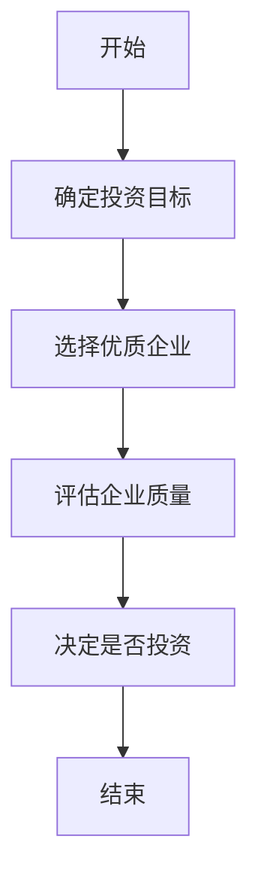
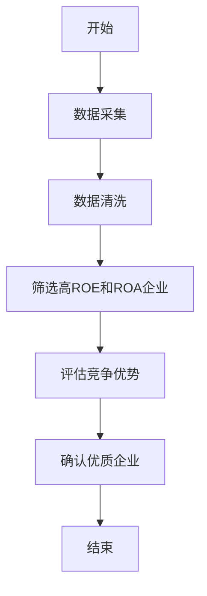
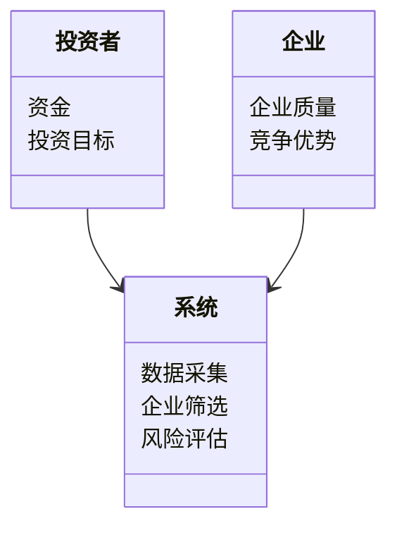
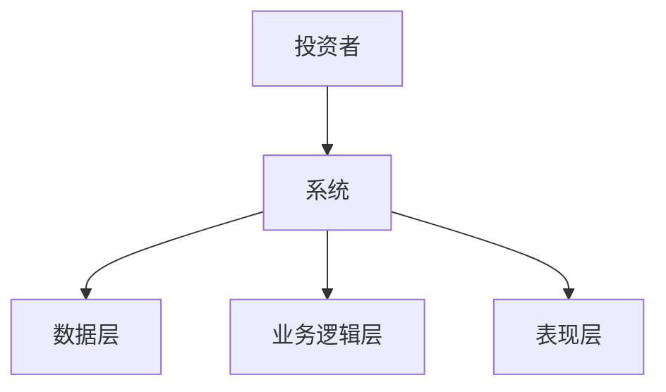

                 


# 芒格的"关键少数"原则：集中投资的智慧

---

## 关键词：
芒格、关键少数、集中投资、投资策略、投资哲学、系统分析

---

## 摘要：
本文深入探讨了芒格的“关键少数”原则，分析其在投资决策中的应用智慧。通过背景介绍、核心概念、算法原理、数学模型、系统架构、项目实战等多维度的详细阐述，揭示了集中投资策略的科学性与实用性。文章结合理论与实践，为投资者提供了从理论到实践的完整指南。

---

## 第一部分: 芒格投资哲学与关键少数原则

### 第1章: 芒格投资哲学概述

#### 1.1 芒格的生平与投资理念
##### 1.1.1 芒格的生平简介
查理·芒格（Charlie Munger）是美国著名投资者、伯克希尔哈撒韦公司副董事长，被誉为“价值投资的第二人”。他不仅在投资领域有着卓越的成就，还以其独特的思维方式和决策框架闻名于世。芒格的智慧不仅体现在投资上，更体现在他对人类心理和决策过程的深刻理解。

##### 1.1.2 芒格的投资哲学核心思想
芒格的投资哲学强调“逆向思维”和“Margin of Safety”（安全边际）概念。他认为，投资者应避免随大流，而是寻找那些被市场低估的机会。芒格的价值投资理念强调长期持有优质资产，避免频繁交易和市场波动的影响。

##### 1.1.3 芒格与巴菲特的合作关系
芒格与巴菲特的合作是投资史上的经典案例。芒格为巴菲特提供了许多投资机会，并帮助他建立了一套严谨的投资决策体系。两人共同的理念是寻找具有持续竞争优势的企业，长期持有，获得复利效应。

#### 1.2 关键少数原则的定义与特点
##### 1.2.1 关键少数原则的定义
关键少数原则是指在投资组合中，集中投资于少数优质企业，而不是分散投资于众多低质量企业。这一原则强调选择具有竞争优势、良好管理和强大护城河的企业。

##### 1.2.2 关键少数原则的核心特点
- **集中投资**：将资金集中投入到少数优质资产中，以提高投资回报率。
- **长期持有**：避免频繁交易，长期持有优质企业，享受复利效应。
- **高质量企业**：选择具有强大竞争优势和良好管理的企业。

##### 1.2.3 关键少数原则与其他投资策略的对比
- **与分散投资对比**：分散投资通过降低风险来提高回报，但往往忽略了质量。关键少数原则更注重资产质量，而非数量。
- **与趋势投资对比**：趋势投资依赖于市场趋势，而关键少数原则更关注企业基本面。
- **与价值投资对比**：两者都注重内在价值，但关键少数原则更强调集中投资。

#### 1.3 关键少数原则在投资决策中的应用边界
##### 1.3.1 应用场景的界定
关键少数原则适用于长期投资，尤其适合那些具有强大护城河和持续竞争优势的企业。

##### 1.3.2 应用范围的限制
- **不适合短期投资**：关键少数原则不适合短期交易，因为其强调长期持有。
- **不适合高波动性资产**：该原则适用于低波动性、稳定增长的企业，而非高波动性资产。

##### 1.3.3 边界条件的分析
- **企业质量**：必须选择具有高质量的企业。
- **市场环境**：适用于相对稳定的市场环境，避免剧烈波动。
- **投资者能力**：投资者需具备识别高质量企业的能力。

---

## 第2章: 关键少数原则的核心概念与联系

### 2.1 关键少数原则的核心要素
#### 2.1.1 投资标的筛选标准
- **财务健康**：企业应具备健康的财务状况，包括低债务、高利润率和稳定的现金流。
- **竞争优势**：企业应具备强大的竞争优势，如专利、品牌或成本优势。
- **管理团队**：管理团队应具备优秀的能力和诚信。

#### 2.1.2 投资组合的构建逻辑
- **集中投资**：将资金集中投入到少数优质企业中，减少投资组合的复杂性。
- **长期持有**：避免频繁交易，长期持有优质企业，享受复利效应。

#### 2.1.3 风险控制的机制
- **分散风险**：通过选择不同行业的优质企业，分散行业风险。
- **安全边际**：确保投资价格低于内在价值，以降低投资风险。

### 2.2 核心概念的属性特征对比
#### 2.2.1 关键少数与非关键少数的对比
| 特性                | 关键少数                          | 非关键少数                        |
|---------------------|----------------------------------|------------------------------------|
| 投资标的数量        | 少                                 | 多                                 |
| 企业质量            | 高                                 | 低                                 |
| 风险                | 低                                 | 高                                 |
| 投资回报率          | 高                                 | 低                                 |

#### 2.2.2 投资标的质量与数量的权衡
- **高质量**：选择具有强大竞争优势和良好管理的企业。
- **少量**：集中投资于少数优质企业，减少投资组合的复杂性。

#### 2.2.3 集中投资与分散投资的风险收益比
- **集中投资**：风险较高，但潜在回报也高。
- **分散投资**：风险较低，但潜在回报也较低。

### 2.3 实体关系图与流程图
#### 2.3.1 关键少数原则的ER实体关系图
```mermaid
erDiagram
    actor 投资者 {
        <属性> 资金
        <属性> 投资目标
    }
    actor 企业 {
        <属性> 企业质量
        <属性> 竞争优势
    }
    relation 投资关系 {
        <外键> 投资者.资金
        <外键> 企业.企业质量
    }
```

#### 2.3.2 投资决策的流程图


---

## 第3章: 关键少数原则的算法原理

### 3.1 关键少数筛选算法的流程
#### 3.1.1 数据采集与预处理
- **数据来源**：从财务报表、行业报告等获取企业数据。
- **数据清洗**：去除无效数据，处理缺失值。

#### 3.1.2 标的筛选标准的数学模型
- **财务指标**：ROE（净资产收益率）、ROA（资产净利率）、毛利率。
- **竞争优势**：品牌、专利、成本优势。

#### 3.1.3 筛选流程
1. 筛选高ROE和ROA的企业。
2. 评估企业的竞争优势。
3. 确保管理团队的诚信和能力。

### 3.2 算法流程图


### 3.3 算法实现
#### 3.3.1 Python代码实现
```python
def key_minor_selection(stocks):
    selected_stocks = []
    for stock in stocks:
        if stock.roe > 0.15 and stock.roa > 0.1 and stock.competition_advantages:
            selected_stocks.append(stock)
    return selected_stocks
```

#### 3.3.2 算法数学模型
- **ROE（净资产收益率）**：$$ROE = \frac{净利润}{平均净资产}$$
- **ROA（资产净利率）**：$$ROA = \frac{净利润}{平均总资产}$$

---

## 第4章: 关键少数原则的数学模型

### 4.1 投资组合的优化模型
#### 4.1.1 CAPM模型
$$CAPM = R_f + \beta (R_m - R_f)$$
其中，$$R_f$$是无风险利率，$$R_m$$是市场预期收益率，$$\beta$$是β系数，衡量系统性风险。

#### 4.1.2 夏普比率
$$\text{夏普比率} = \frac{E(R_i) - R_f}{\sigma_i}$$
其中，$$E(R_i)$$是资产的预期收益，$$R_f$$是无风险利率，$$\sigma_i$$是资产收益的标准差。

### 4.2 风险评估模型
#### 4.2.1 风险调整后的收益模型
$$\text{风险调整后收益} = \text{预期收益} - \text{风险调整成本}$$

#### 4.2.2 风险分散化模型
$$\text{投资组合风险} = \sqrt{\sum w_i^2 \sigma_i^2 + \sum w_i w_j \sigma_{ij}}$$
其中，$$w_i$$是资产i的权重，$$\sigma_i$$是资产i的风险，$$\sigma_{ij}$$是资产i和j的相关风险。

---

## 第5章: 关键少数原则的系统分析与架构设计

### 5.1 投资决策系统场景介绍
- **目标**：帮助投资者筛选优质企业，构建投资组合。
- **用户角色**：投资者、投资顾问。
- **功能需求**：数据采集、企业筛选、风险评估。

### 5.2 系统功能设计
#### 5.2.1 领域模型类图


#### 5.2.2 系统架构图


#### 5.2.3 接口与交互序列图
```mermaid
sequenceDiagram
    投资者 -> 系统: 请求筛选企业
    系统 -> 数据层: 获取企业数据
    数据层 -> 系统: 返回数据
    系统 -> 业务逻辑层: 筛选企业
    业务逻辑层 -> 系统: 返回结果
    系统 -> 表现层: 显示结果
    投资者 <- 系统: 筛选结果
```

---

## 第6章: 关键少数原则的项目实战

### 6.1 环境安装与配置
- **工具**：Python、Pandas、Matplotlib。
- **数据源**：股票数据（如Yahoo Finance）。

### 6.2 系统核心实现
#### 6.2.1 数据采集
```python
import pandas as pd
import requests

def get_stock_data(ticker):
    url = f"https://query1.finance.yahoo.com/ws/v1/finance/quote/{ticker}"
    response = requests.get(url)
    data = response.json()
    return data
```

#### 6.2.2 核心筛选逻辑
```python
def select_stocks(stocks):
    selected = []
    for stock in stocks:
        if stock.roe > 0.15 and stock.roa > 0.1:
            selected.append(stock)
    return selected
```

#### 6.2.3 风险评估
```python
def calculate_sharpe_ratio(stock_returns, risk_free_rate):
    excess_returns = stock_returns - risk_free_rate
    sharpe_ratio = excess_returns.mean() / excess_returns.std()
    return sharpe_ratio
```

### 6.3 实际案例分析
- **案例1**：假设市场有10家企业，筛选出ROE和ROA高于行业平均水平的企业。
- **案例2**：评估某投资组合的夏普比率，判断其风险调整后收益。

### 6.4 项目小结
通过Python代码实现关键少数筛选系统，帮助投资者识别优质企业，构建高效的投资组合。

---

## 第7章: 关键少数原则的最佳实践

### 7.1 小结
关键少数原则强调集中投资于少数优质企业，避免分散投资的风险。通过严格筛选和长期持有，投资者可以实现稳定的高回报。

### 7.2 注意事项
- **选择优质企业**：确保企业具备强大的竞争优势和良好的管理。
- **长期持有**：避免频繁交易，享受复利效应。
- **风险管理**：通过分散投资和安全边际降低风险。

### 7.3 拓展阅读
- 《巴菲特致股东的信》
- 《投资的艺术》

---

## 作者：AI天才研究院 & 禅与计算机程序设计艺术

---

通过本文的详细分析，读者可以全面理解芒格的“关键少数”原则，并将其应用于实际投资决策中，实现长期稳定的收益。

