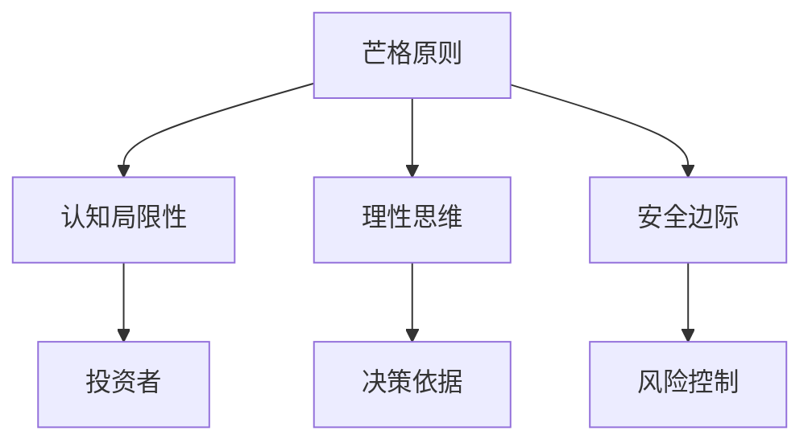
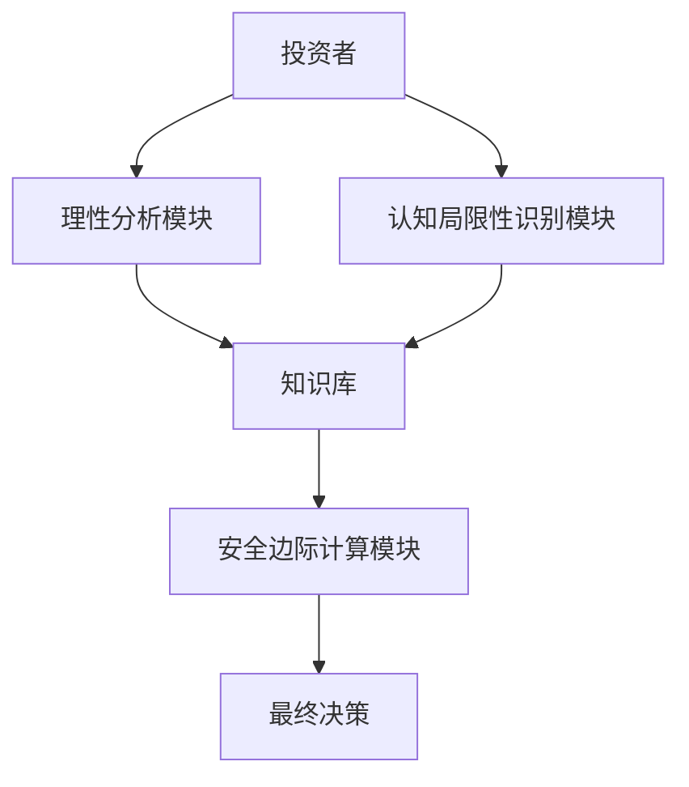

                 


# 芒格的"别觉得自己太聪明"原则：保持谦逊

> 关键词：芒格, 投资原则, 谦逊, 理性思维, 投资决策

> 摘要：芒格的“别觉得自己太聪明”原则强调谦逊和理性思考的重要性。本文通过逻辑清晰、结构紧凑的方式，详细解析这一原则的核心思想，结合技术语言和实际案例，探讨其在投资、个人成长和企业管理中的应用。

---

## 第1章 背景介绍：芒格与“别觉得自己太聪明”原则

### 1.1 节点背景概述

#### 1.1.1 节点背景的定义与特点
芒格的“别觉得自己太聪明”原则是投资大师查理·芒格在其投资哲学中提出的重要理念。该原则强调投资者应保持谦逊，避免过度自信，认识到自己的知识和能力的局限性。

#### 1.1.2 节点背景的核心要素组成
- **认知局限性**：人类知识的有限性和认知偏差。
- **理性思维**：通过逻辑推理和事实依据做出决策。
- **安全边际**：在投资中留出足够的安全空间以应对不确定性。

#### 1.1.3 节点背景的边界与外延
该原则不仅适用于投资领域，也可扩展应用于个人成长、企业管理和社会决策。

### 1.2 节点背景的核心要素对比
- 节点背景与其他投资原则（如价值投资）的对比。
- 谦逊与自信的平衡。

### 1.3 节点背景的ER实体关系图


---

## 第2章 核心概念与联系

### 2.1 核心概念的原理

#### 2.1.1 节点背景的定义与特点
芒格的“别觉得自己太聪明”原则强调投资者应保持谦逊，认识到市场的不可预测性和自身的知识局限。

#### 2.1.2 节点背景的核心要素
- **认知局限性**：投资者的决策受到知识、经验和社会环境的限制。
- **理性思维**：通过逻辑分析和数据支持做出决策，避免情绪化。
- **安全边际**：在投资中留出足够的空间以应对潜在的不确定性。

### 2.2 节点背景的属性特征对比
- 对比其他投资原则（如技术分析）的属性特征。
- 谦逊与自信的平衡。

### 2.3 节点背景的ER实体关系图


---

## 第3章 算法原理讲解

### 3.1 算法原理分析

#### 3.1.1 算法的基本概念
“别觉得自己太聪明”原则可以被视为一种决策框架，通过逻辑推理和事实依据来减少决策错误。

#### 3.1.2 算法的核心原理
- 理性分析：基于事实和数据做出决策。
- 安全边际：在决策中留出足够的空间以应对不确定性。

#### 3.1.3 算法的实现步骤
1. 确定决策目标。
2. 收集相关信息并进行理性分析。
3. 识别认知局限性并调整决策。
4. 确保决策有足够安全边际。

### 3.2 算法实现的代码示例

#### 3.2.1 算法代码实现
```python
def humbleness_assessment(information):
    # 理性分析
    rational_analysis = information.get('rational_analysis', '')
    # 认知局限性
    cognitive_limitations = information.get('cognitive_limitations', '')
    # 安全边际
    safety_margin = information.get('safety_margin', 0)
    
    # 谦逊评估
    humbleness = rational_analysis + cognitive_limitations + safety_margin
    return humbleness
```

#### 3.2.2 代码的详细解读
- `rational_analysis`：基于事实和数据的理性分析。
- `cognitive_limitations`：认知局限性，包括知识和经验的限制。
- `safety_margin`：安全边际，用于应对不确定性。

---

## 第4章 数学模型与公式

### 4.1 数学模型的定义
芒格的“别觉得自己太聪明”原则可以用以下数学模型表示：

$$ humbleness = \frac{1}{1 + e^{-k}} $$

其中：
- \( k \) 表示理性分析的程度。
- \( humbleness \) 表示谦逊程度。

### 4.2 公式推导与分析
- 当 \( k \) 越大，表示理性分析越充分，谦逊程度越高。
- 通过调整 \( k \) 的值，可以量化谦逊程度与理性分析之间的关系。

---

## 第5章 系统分析与架构设计

### 5.1 系统分析

#### 5.1.1 问题场景介绍
投资者在做出投资决策时，需要综合考虑市场环境、个人知识和认知局限性。

### 5.2 系统架构设计

#### 5.2.1 系统功能设计
- 理性分析模块：基于数据和事实进行分析。
- 认知局限性识别模块：识别知识和经验的限制。
- 安全边际计算模块：计算投资决策中的安全空间。

#### 5.2.2 系统架构图


---

## 第6章 项目实战

### 6.1 项目环境安装

#### 6.1.1 环境配置
- Python 3.8及以上版本。
- 安装必要的库（如numpy, pandas）。

### 6.2 系统核心实现源代码

#### 6.2.1 代码实现
```python
import numpy as np
import pandas as pd

def calculate_safety_margin(portfolio):
    # 计算安全边际
    safety_margin = np.mean(portfolio['returns']) - np.std(portfolio['returns'])
    return safety_margin

# 示例数据
portfolio = pd.DataFrame({
    'returns': [0.05, -0.02, 0.03, 0.01, -0.01]
})

safety_margin = calculate_safety_margin(portfolio)
print(f"安全边际: {safety_margin}")
```

#### 6.2.2 代码应用解读
- 代码计算投资组合的平均收益和标准差，得出安全边际。
- 通过安全边际评估投资决策的合理性。

---

## 第7章 总结与反思

### 7.1 总结
芒格的“别觉得自己太聪明”原则强调谦逊和理性思考的重要性。通过本文的分析，我们可以看到，这一原则不仅适用于投资领域，也可以应用于个人成长和企业管理。

### 7.2 最佳实践 tips
- 定期回顾自己的决策，识别认知局限性。
- 在决策中留出足够的安全边际。

### 7.3 注意事项
- 避免过度自信，保持谦逊态度。
- 在实际应用中结合具体情境调整决策框架。

### 7.4 拓展阅读
- 查理·芒格的《穷查理宝典》。
- 投资经典书籍《聪明的投资者》。

---

作者：AI天才研究院/AI Genius Institute & 禅与计算机程序设计艺术 /Zen And The Art of Computer Programming

