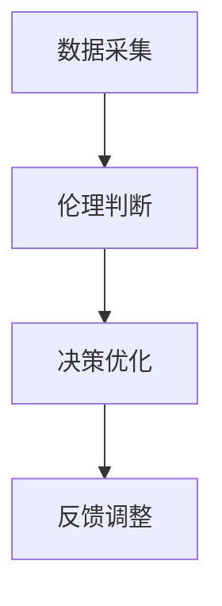
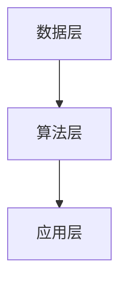

                 


# 芒格的"别觉得自己太聪明"在人工智能伦理决策中的应用

## 关键词：
芒格, 人工智能, 伦理决策, 理性思维, 系统设计

## 摘要：
本文探讨了芒格的"别觉得自己太聪明"理念在人工智能伦理决策中的应用。通过分析芒格的决策框架，结合人工智能的伦理决策机制，提出了一种基于理性思维和谦逊态度的AI伦理决策方法。文章详细介绍了AI伦理决策的算法原理、系统架构设计及实际案例分析，为人工智能领域的伦理决策提供了新的视角和实践指导。

---

# 第1章：芒格的"别觉得自己太聪明"理念概述

## 1.1 芒格的"别觉得自己太聪明"的核心思想
芒格的"别觉得自己太聪明"理念强调了理性分析和谦逊心态的重要性。这种思维方式要求我们在决策时保持开放和谦逊，避免因过度自信而忽视潜在的问题。

### 1.1.1 芒格的决策框架
芒格的决策框架以理性分析为核心，强调多维度思考和长期价值的追求。他提出的"多元思维模型"要求我们在决策时考虑多个角度和领域的影响。

### 1.1.2 谦逊与理性的重要性
谦逊是一种重要的品质，它使我们能够更好地接受他人的观点和建议。理性分析则帮助我们在复杂的情况下做出最优决策。芒格的理念提醒我们，无论多么自信，都应保持谦逊和理性。

### 1.1.3 芒格理念在现代的应用
在现代人工智能领域，芒格的理念同样适用。AI系统的决策过程需要结合理性分析和谦逊态度，避免因过度依赖算法而忽视人类的伦理判断。

## 1.2 人工智能伦理决策的基本概念
人工智能的决策机制依赖于算法和数据，但其伦理决策需要考虑社会、法律和伦理等多个方面的影响。

### 1.2.1 人工智能的决策机制
人工智能通过算法和数据进行决策，但其决策结果可能受到数据偏见和算法设计的影响。

### 1.2.2 伦理决策的定义与挑战
伦理决策是指在遵循伦理规范的前提下做出的决策。人工智能伦理决策的挑战在于如何将人类的伦理判断融入算法模型中。

### 1.2.3 人工智能伦理决策的现状与未来
当前，人工智能伦理决策的研究主要集中在算法的透明性和可解释性上。未来，随着技术的发展，AI伦理决策将更加注重人机协作和伦理判断的动态调整。

---

# 第2章：芒格决策框架在AI伦理决策中的应用

## 2.1 芒格决策框架的核心要素
芒格的决策框架以理性分析和多元思维模型为核心，要求我们在决策时保持开放和谦逊。

### 2.1.1 理性分析的重要性
理性分析是芒格决策框架的核心，它要求我们在决策时基于事实和数据，避免情绪化和主观判断。

### 2.1.2 谦逊与开放心态的培养
谦逊是一种重要的品质，它使我们能够更好地接受他人的观点和建议。开放心态则要求我们在决策时考虑多种可能性。

### 2.1.3 多元思维模型的构建
多元思维模型要求我们在决策时考虑多个角度和领域的影响，从而做出更加全面和合理的决策。

## 2.2 芒格理念与AI伦理决策的结合
芒格理念在AI伦理决策中的应用，要求我们在算法设计和决策过程中保持理性分析和谦逊态度。

### 2.2.1 芒格理念对AI决策的影响
芒格的理念提醒我们，无论多么自信，都应保持谦逊和理性。在AI决策中，这意味着我们需要在算法设计中融入伦理判断和动态调整机制。

### 2.2.2 AI伦理决策中的理性与谦逊
理性分析和谦逊态度是AI伦理决策的核心。我们需要在算法中融入伦理判断，并在实际应用中根据反馈不断优化决策模型。

### 2.2.3 多元思维模型在AI伦理中的应用
多元思维模型要求我们在AI伦理决策中考虑多个角度和领域的影响，从而做出更加全面和合理的决策。

---

# 第3章：AI伦理决策的算法原理

## 3.1 基于概率论的伦理决策模型
概率论是AI伦理决策的重要工具之一，它帮助我们量化决策的不确定性和风险。

### 3.1.1 概率论的基本概念
概率论研究的是随机事件的发生概率。在AI伦理决策中，我们可以利用概率论来量化决策的不确定性和风险。

### 3.1.2 概率论在伦理决策中的应用
通过概率论，我们可以量化不同决策方案的优劣，并基于概率分布进行最优选择。

### 3.1.3 基于概率的决策优化
概率论可以帮助我们在不确定性和风险中找到最优的决策方案，从而提高决策的准确性和可靠性。

## 3.2 基于统计学的伦理决策分析
统计学是另一种重要的工具，它可以帮助我们分析数据并做出基于数据的决策。

### 3.2.1 统计学的基本原理
统计学研究的是数据的收集、分析和解释。在AI伦理决策中，我们可以利用统计学方法来分析数据并做出基于数据的决策。

### 3.2.2 统计学在伦理决策中的应用
通过统计学，我们可以量化数据的分布和趋势，并基于数据的特征进行决策。

### 3.2.3 统计模型的优化与改进
统计模型可以帮助我们优化决策过程，并通过数据反馈不断改进模型的准确性。

---

# 第4章：AI伦理决策系统的架构设计

## 4.1 系统功能设计
AI伦理决策系统需要具备多种功能，包括数据采集、伦理判断和决策优化。

### 4.1.1 问题场景介绍
在AI伦理决策系统中，我们需要解决的问题是如何在算法设计和决策过程中融入伦理判断和动态调整机制。

### 4.1.2 系统功能模块划分
AI伦理决策系统可以划分为数据采集、伦理判断、决策优化和反馈调整四个模块。

### 4.1.3 系统功能流程图
以下是AI伦理决策系统的功能流程图：



## 4.2 系统架构设计
AI伦理决策系统的架构设计需要考虑系统的层次和组件之间的关系。

### 4.2.1 系统架构的层次划分
AI伦理决策系统的架构可以分为数据层、算法层和应用层三个层次。

### 4.2.2 系统组件之间的关系
以下是系统组件之间的关系图：



## 4.3 系统接口设计
AI伦理决策系统的接口设计需要考虑系统的交互和数据流。

### 4.3.1 系统接口的定义与规范
系统接口需要定义输入和输出的数据格式以及接口的调用方式。

### 4.3.2 系统接口的实现方式
以下是系统接口的实现示例：

```python
def ethical_decision-making(data):
    # 数据处理
    processed_data = preprocess(data)
    # 伦理判断
    judgment = judge(processed_data)
    # 决策优化
    decision = optimize(judgment)
    return decision
```

### 4.3.3 系统接口的测试与验证
系统接口需要通过测试用例进行验证，确保其功能正常。

---

# 第5章：AI伦理决策系统的实战应用

## 5.1 项目环境安装与配置
AI伦理决策系统的开发需要安装相应的开发环境和依赖库。

### 5.1.1 开发环境的选择与安装
我们需要选择适合的开发环境，例如Python和相关库的安装。

### 5.1.2 项目依赖库的安装与配置
以下是项目依赖库的安装命令：

```bash
pip install numpy
pip install pandas
pip install scikit-learn
```

## 5.2 系统核心实现
AI伦理决策系统的实现需要基于概率论和统计学的算法。

### 5.2.1 核心算法的实现代码
以下是核心算法的实现示例：

```python
import numpy as np
from sklearn import tree

# 数据预处理
data = preprocess(input_data)
# 伦理判断
judgment = judge(data)
# 决策优化
decision = optimize(judgment)
```

### 5.2.2 系统功能模块的实现
以下是系统功能模块的实现示例：

```python
class EthicalDecisionSystem:
    def __init__(self):
        self.model = self.build_model()
    
    def build_model(self):
        # 构建决策树模型
        model = tree.DecisionTreeClassifier()
        return model
    
    def make_decision(self, data):
        # 数据预处理
        processed_data = self.preprocess(data)
        # 预测决策
        prediction = self.model.predict(processed_data)
        return prediction
```

### 5.2.3 系统接口的实现与测试
以下是系统接口的实现与测试示例：

```python
def test_ethical_decision():
    system = EthicalDecisionSystem()
    input_data = np.array([[1, 2, 3]])
    output = system.make_decision(input_data)
    print(output)
    
test_ethical_decision()
```

## 5.3 实际案例分析
通过实际案例分析，我们可以更好地理解AI伦理决策系统的应用。

### 5.3.1 案例背景介绍
假设我们有一个医疗AI系统，需要在诊断过程中做出伦理决策。

### 5.3.2 案例分析与解决过程
我们通过芒格的决策框架和AI伦理决策算法，分析和解决医疗AI系统的伦理问题。

### 5.3.3 案例总结与经验分享
通过案例分析，我们可以总结出AI伦理决策系统在实际应用中的优势和不足，并提出改进建议。

---

# 第6章：总结与展望

## 6.1 本章小结
通过本文的探讨，我们了解了芒格的"别觉得自己太聪明"理念在人工智能伦理决策中的应用，以及基于概率论和统计学的AI伦理决策算法。

### 6.1.1 芒格理念对AI伦理决策的影响
芒格的理念提醒我们在AI伦理决策中保持理性分析和谦逊态度。

### 6.1.2 AI伦理决策算法的实现与优化
通过概率论和统计学的算法，我们可以优化AI伦理决策的准确性和可靠性。

### 6.1.3 系统设计与实现的经验总结
在系统设计和实现过程中，我们需要注重模块化设计和接口规范，确保系统的可扩展性和可维护性。

## 6.2 最佳实践与注意事项
### 6.2.1 芒格理念在AI伦理决策中的应用建议
在AI伦理决策中，我们需要结合芒格的决策框架，注重理性分析和谦逊态度。

### 6.2.2 AI伦理决策系统的优化与改进
通过不断优化算法和改进系统架构，我们可以提高AI伦理决策系统的准确性和可靠性。

### 6.2.3 系统设计与实现的注意事项
在系统设计和实现过程中，我们需要注重模块化设计和接口规范，确保系统的可扩展性和可维护性。

---

# 作者：AI天才研究院/AI Genius Institute & 禅与计算机程序设计艺术 /Zen And The Art of Computer Programming

感谢您的阅读！如果对本文内容感兴趣，欢迎进一步交流与探讨。

