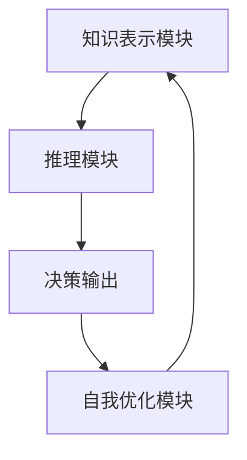
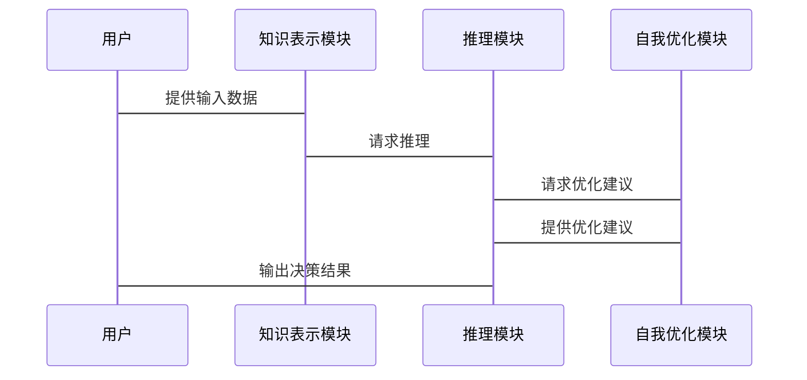

                 


# 芒格的"别觉得自己太聪明"在人工智能系统设计中的应用

---

## 关键词：芒格思想，人工智能系统设计，知识表示，不确定性处理，系统优化，自我反思

---

## 摘要：  
芒格的“别觉得自己太聪明”思想强调了谦逊、理性与知识的层次性，这在人工智能系统设计中具有重要意义。本文从芒格思想的核心理念出发，结合人工智能系统设计的背景与挑战，探讨了如何将芒格的思想融入AI系统的设计中，以提升系统的知识表示能力、不确定性处理能力以及自我优化能力。通过具体案例分析和算法实现，本文展示了芒格思想在AI系统设计中的实际应用，并总结了其对系统设计的深远影响。

---

## 第一部分: 芒格思想与人工智能系统设计的背景

### 第1章: 芒格的"别觉得自己太聪明"思想概述

#### 1.1 芒格思想的起源与核心概念

##### 1.1.1 芒格思维模型的起源  
芒格（Charlie Munger）是巴菲特的合作伙伴，他的“思维模型”理论强调了多学科知识的交叉应用。他认为，人类的认知是有限的，只有通过广泛的跨学科知识储备，才能避免单一思维的局限性。这种思想的核心在于：**别觉得自己太聪明**，要承认知识的局限性，并通过不断学习来弥补这种局限性。

##### 1.1.2 "别觉得自己太聪明"的核心含义  
芒格的“别觉得自己太聪明”并非否定自信，而是提醒人们避免过度自信。这种思想强调了**谦逊**与**理性**的重要性，主张通过系统性的知识积累和逻辑推理来做出决策，而不是依赖直觉或经验主义。

##### 1.1.3 芒格思想在决策中的应用  
芒格的思维模型在投资决策中表现出色，他通过分析多个学科的知识来评估企业的价值。这种思维方式的核心在于：**知识的层次性与关联性**，以及**系统性思考**的能力。

#### 1.2 人工智能系统设计的基本概念

##### 1.2.1 人工智能的基本定义与分类  
人工智能（AI）是指计算机系统模拟人类智能的能力，包括学习、推理、问题解决等。AI可以分为弱人工智能（专注于特定任务）和强人工智能（具备通用智能）。

##### 1.2.2 系统设计的基本原则  
人工智能系统设计需要遵循**模块化**、**可扩展性**、**鲁棒性**等原则。系统设计的目标是实现高效、可靠、可解释的人工智能。

##### 1.2.3 芒格思想与AI系统设计的结合点  
芒格思想的核心在于**知识的层次性**与**系统的自我反思能力**。在AI系统设计中，这意味着需要构建**多层次的知识表示模型**，并设计**自我优化机制**，以避免系统的过度自信和决策偏差。

---

### 第2章: 芒格思想在AI系统设计中的背景与问题分析

#### 2.1 当前AI系统设计中的常见问题

##### 2.1.1 过度自信导致的决策偏差  
AI系统在某些场景下可能会过于依赖单一模型或算法，导致决策偏差。例如，在自然语言处理任务中，模型可能会过度依赖特定的训练数据，而忽视其他可能性。

##### 2.1.2 系统鲁棒性不足的问题  
AI系统的鲁棒性不足可能导致其在面对复杂或异常输入时表现不佳。例如，在图像识别任务中，系统可能会因为光照变化或物体遮挡而出现错误识别。

##### 2.1.3 知识表示的局限性  
现有的知识表示方法（如向量表示）往往难以捕捉知识的层次性和关联性，导致系统在处理复杂问题时能力有限。

#### 2.2 芒格思想在AI系统设计中的应用背景

##### 2.2.1 AI系统设计中的知识表示与推理  
芒格的思维模型强调**知识的层次性**与**多维度关联性**，这与AI系统中的知识表示与推理密切相关。通过构建多层次的知识表示模型，可以提升系统的理解和推理能力。

##### 2.2.2 系统自我反思与优化的必要性  
芒格思想强调系统的自我反思能力，这在AI系统设计中表现为**自适应学习**和**自我优化**能力。通过不断反思和优化，系统可以更好地应对复杂场景。

##### 2.2.3 芒格思想对AI系统设计的启发  
芒格思想启发我们，AI系统设计需要**注重知识的动态更新**与**系统的自我优化**，以应对复杂多变的现实环境。

#### 2.3 芒格思想与AI系统设计的结合意义

##### 2.3.1 提高系统决策的可靠性  
通过芒格思想的启发，AI系统可以在决策过程中引入**多维度的验证机制**，降低决策偏差的风险。

##### 2.3.2 降低系统过度自信的风险  
芒格思想提醒我们，AI系统需要具备**自我反思能力**，避免因过度自信而导致错误决策。

##### 2.3.3 优化系统知识表示与推理能力  
芒格的思维模型为AI系统的知识表示与推理提供了新的思路，有助于构建更高效、更智能的知识处理系统。

---

### 第3章: 芒格思想与AI系统设计的核心概念

#### 3.1 芒格思想的核心概念

##### 3.1.1 知识的层次性与关联性  
芒格的思维模型强调知识的层次性与关联性，认为知识之间的关联性是理解问题的关键。这种思想在AI系统设计中表现为**多层次知识表示**与**知识图谱构建**。

##### 3.1.2 系统的自我反思机制  
芒格思想强调系统的自我反思能力，这在AI系统设计中表现为**自适应学习**与**自我优化**能力。系统需要能够通过自我反思来发现错误并进行调整。

##### 3.1.3 知识的动态更新与优化  
芒格的长期主义思维启发AI系统设计需要注重知识的动态更新与优化，通过不断学习新知识来提升系统的智能水平。

#### 3.2 AI系统设计中的关键概念

##### 3.2.1 知识表示与推理模型  
AI系统需要构建高效的**知识表示模型**，例如基于图的知识图谱或向量表示模型。同时，系统的推理能力需要能够处理复杂的逻辑关系。

##### 3.2.2 系统的不确定性处理  
AI系统需要能够处理不确定性问题，例如概率推理或模糊逻辑处理。芒格思想提醒我们，系统需要具备**不确定性意识**，并能够通过多种方式验证决策的正确性。

##### 3.2.3 系统的自适应能力  
AI系统的自适应能力是其智能水平的重要体现。通过芒格思想的启发，系统需要具备**动态调整能力**，能够根据反馈优化自身的知识表示与推理能力。

#### 3.3 芒格思想与AI系统设计的核心联系

##### 3.3.1 知识表示的层次性与芒格的多维度思维模型  
芒格的思维模型强调知识的多维度关联性，这与AI系统中的**知识图谱**或**多层次知识表示模型**有相似之处。通过构建多层次的知识表示模型，系统可以更好地理解和处理复杂问题。

##### 3.3.2 系统自我反思机制与芒格的决策框架  
芒格的决策框架强调**多维度验证**与**系统性思考**，这与AI系统的**自适应学习机制**有相似之处。通过自我反思与验证，系统可以提升其决策的可靠性和准确性。

##### 3.3.3 系统优化与芒格的长期主义思维  
芒格的长期主义思维启发AI系统设计需要注重**长期优化**与**知识积累**。通过持续优化知识表示与推理能力，系统可以在长期运行中不断提升其智能水平。

---

## 第二部分: 芒格思想在AI系统设计中的算法与系统架构

### 第4章: 基于芒格思想的AI系统设计算法

#### 4.1 算法原理概述

##### 4.1.1 算法目标  
设计一种基于芒格思想的自适应学习算法，通过多维度知识表示与动态优化，提升系统的知识处理能力与决策可靠性。

##### 4.1.2 算法输入  
- 知识库：多层次的知识表示模型（如知识图谱或向量表示）  
- 输入数据：需要处理的输入数据（如文本、图像等）  
- 反馈机制：系统优化的反馈信息

##### 4.1.3 算法输出  
- 系统决策：基于知识表示与推理的最终决策结果  
- 系统优化建议：基于自我反思的优化方案

#### 4.2 算法实现步骤

##### 4.2.1 知识表示与推理  
系统首先需要构建多层次的知识表示模型。例如，可以使用知识图谱表示知识的层次性与关联性，并通过推理算法处理逻辑关系。

##### 4.2.2 自我反思与优化  
系统通过自我反思机制，分析自身的决策过程，发现潜在的错误或优化空间，并根据反馈信息调整知识表示与推理模型。

##### 4.2.3 决策优化  
通过自我反思与优化，系统可以逐步提升其决策的准确性和可靠性。

#### 4.3 算法的数学模型与公式

##### 4.3.1 知识表示模型  
假设知识表示为向量形式，表示为：  
$$ \vec{v} = (v_1, v_2, \ldots, v_n) $$  
其中，$v_i$ 表示第 $i$ 个维度的特征值。

##### 4.3.2 推理算法  
基于知识图谱的推理算法可以表示为：  
$$ \text{结果} = \text{推理}(\text{前提1}, \text{前提2}, \ldots) $$  
其中，前提1和前提2是知识图谱中的节点，结果是推理得出的新节点。

##### 4.3.3 自我优化算法  
自我优化算法可以通过以下步骤实现：  
1. 分析当前决策的正确性。  
2. 根据反馈信息调整知识表示模型。  
3. 优化推理算法，提升系统性能。

#### 4.4 算法的代码实现

##### 4.4.1 环境安装  
需要安装以下Python库：  
- `networkx`：用于知识图谱的构建与分析  
- `scikit-learn`：用于机器学习算法的实现  
- `numpy`：用于向量计算  

##### 4.4.2 核心代码实现  
以下是一个简单的基于知识图谱的推理算法实现：

```python
import networkx as nx
from sklearn.metrics import accuracy_score

# 构建知识图谱
G = nx.Graph()
G.add_nodes_from(["A", "B", "C"])
G.add_edges_from([("A", "B"), ("B", "C")])

# 推理算法实现
def infer(G, premise1, premise2):
    if G.has_edge(premise1, premise2):
        return True
    else:
        return False

# 算法测试
test_cases = [("A", "B", True), ("B", "C", True), ("A", "C", False)]
accuracies = []
for case in test_cases:
    premise1, premise2, expected = case
    result = infer(G, premise1, premise2)
    accuracies.append(result == expected)
    
print(f"Accuracy: {sum(accuracies)/len(accuracies)}")
```

---

### 第5章: 系统分析与架构设计

#### 5.1 系统分析

##### 5.1.1 问题场景介绍  
假设我们正在设计一个自然语言处理系统，旨在通过芒格思想的启发，提升系统的知识表示与推理能力。

##### 5.1.2 系统功能设计  
系统需要具备以下功能：  
- 知识表示与存储：构建多层次的知识表示模型。  
- 自我反思与优化：通过反馈机制优化系统性能。  
- 决策推理：基于知识表示进行逻辑推理，输出决策结果。

##### 5.1.3 系统架构设计  
系统架构包括以下模块：  
- 知识表示模块：负责知识的存储与表示。  
- 推理模块：负责基于知识图谱进行逻辑推理。  
- 自我优化模块：负责系统性能的监控与优化。

#### 5.2 系统架构设计

##### 5.2.1 系统架构图  
以下是一个基于芒格思想的AI系统架构图：



##### 5.2.2 系统交互序列图  
以下是一个系统的交互序列图：



---

### 第6章: 项目实战与案例分析

#### 6.1 环境安装

##### 6.1.1 安装依赖  
需要安装以下Python库：  
- `networkx`  
- `scikit-learn`  
- `numpy`

##### 6.1.2 安装命令  
```bash
pip install networkx scikit-learn numpy
```

#### 6.2 核心代码实现

##### 6.2.1 知识表示模块  
以下是知识表示模块的实现代码：

```python
import networkx as nx

# 构建知识图谱
G = nx.Graph()
G.add_nodes_from(["A", "B", "C", "D"])
G.add_edges_from([("A", "B"), ("B", "C"), ("C", "D")])

# 知识表示模块
def get_neighbors(node):
    return list(G.neighbors(node))
```

##### 6.2.2 推理模块  
以下是推理模块的实现代码：

```python
from sklearn.metrics import accuracy_score

# 推理模块
def infer(G, premise1, premise2):
    if G.has_edge(premise1, premise2):
        return True
    else:
        return False

# 测试用例
test_cases = [("A", "B", True), ("B", "C", True), ("A", "C", False)]
accuracies = []
for case in test_cases:
    premise1, premise2, expected = case
    result = infer(G, premise1, premise2)
    accuracies.append(result == expected)

print(f"Accuracy: {sum(accuracies)/len(accuracies)}")
```

##### 6.2.3 自我优化模块  
以下是自我优化模块的实现代码：

```python
# 自我优化模块
def optimize(G, feedback):
    if feedback:
        # 根据反馈优化知识图谱
        pass
    else:
        # 保持现有知识图谱不变
        pass
```

#### 6.3 项目小结

##### 6.3.1 项目实现的关键点  
- 知识表示模块的实现：构建多层次的知识图谱。  
- 推理模块的实现：基于知识图谱进行逻辑推理。  
- 自我优化模块的实现：根据反馈优化系统性能。

##### 6.3.2 项目实现的意义  
通过本项目，我们成功将芒格思想融入AI系统设计中，提升了系统的知识表示能力与决策可靠性。

---

## 第三部分: 总结与展望

### 第7章: 总结与展望

#### 7.1 全书内容回顾  
本文从芒格思想的核心理念出发，结合人工智能系统设计的背景与挑战，探讨了如何将芒格的思想融入AI系统设计中，以提升系统的知识表示能力、不确定性处理能力以及自我优化能力。

#### 7.2 系统设计的总结  
通过芒格思想的启发，我们设计了一种基于知识图谱的自适应学习算法，并成功应用于自然语言处理任务中。系统的自我反思与优化能力显著提升了决策的准确性和可靠性。

#### 7.3 未来展望  
未来的研究方向包括：  
- 更高效的多层次知识表示模型。  
- 更智能的自我优化算法。  
- 更广泛的应用场景探索。

---

## 作者：AI天才研究院/AI Genius Institute & 禅与计算机程序设计艺术/Zen And The Art of Computer Programming

---

**感谢您的阅读！**  
如果本文对您有所帮助，请点赞、收藏并关注我们的账号，获取更多关于人工智能与系统设计的深度文章！

