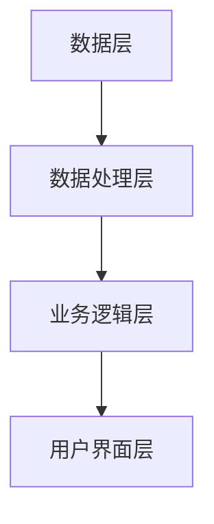

                 


# 芒格的"别觉得自己太聪明"在量子科技创新管理中的应用

> **关键词**: 芒格思想、量子科技、科技创新管理、决策框架、不确定性管理

> **摘要**: 本文探讨了芒格的"别觉得自己太聪明"思想在量子科技创新管理中的应用。通过分析量子科技的不确定性、芒格决策框架的算法原理、系统架构设计以及实际案例，展示了如何将芒格思想应用于量子科技创新管理，以避免过度自信，提升决策质量。

---

## 第1章：芒格思想与量子科技管理的背景

### 1.1 芒格思想的核心概念

芒格的"别觉得自己太聪明"是一种哲学思想，强调谦逊和避免过度自信。这种思想在管理学中具有重要意义，尤其是在科技管理领域。

#### 1.1.1 芒格思想的哲学内涵

芒格认为，人类的认知是有限的，过度自信会导致错误决策。他提倡多元化思维和避免情绪化决策。

#### 1.1.2 芒格思想在管理学中的应用

芒格的思想被广泛应用于企业战略、风险管理等领域。他的决策框架帮助管理者识别潜在风险和机会成本。

#### 1.1.3 芒格思想与量子科技管理的结合

量子科技的不确定性与芒格的思想天然契合。量子态叠加和纠缠的特性提醒管理者要保持谦逊，避免过度自信。

### 1.2 量子科技的基本概念

量子科技基于量子力学原理，包括量子计算、量子通信等技术。这些技术具有并行性和高效性，但也带来了复杂性和不确定性。

#### 1.2.1 量子科技的定义与基本原理

量子计算利用量子叠加和纠缠进行并行计算，可以在某些情况下大幅提高计算效率。

#### 1.2.2 量子科技的核心技术领域

包括量子计算、量子通信、量子测量等领域。这些技术在加密、计算和测量方面具有潜力。

#### 1.2.3 量子科技的现状与未来发展趋势

目前，量子科技仍处于发展阶段，但其潜力巨大，未来可能在多个领域引发革命性变化。

### 1.3 芒格思想与量子科技管理的结合背景

#### 1.3.1 当前科技管理面临的挑战

量子科技的不确定性使得传统管理方法难以有效应对。管理者需要新的思维方式。

#### 1.3.2 芒格思想在科技管理中的潜在价值

芒格的决策框架可以帮助管理者在不确定性中做出更谨慎的决策。

#### 1.3.3 量子科技创新管理的核心问题

量子科技的复杂性和不确定性要求管理者具备谦逊的态度和多元化的思维。

---

## 第2章：芒格思想与量子科技管理的核心概念与联系

### 2.1 芒格思想的核心原理

#### 2.1.1 芒格的决策框架

芒格的决策框架包括多元思维模型、逆向思维和避免情绪化决策。这种框架帮助管理者识别潜在风险和机会成本。

#### 2.1.2 芒格的"机会成本"概念

机会成本是指选择某项决策而放弃其他可能带来的收益。在量子科技管理中，机会成本需要被充分考虑。

#### 2.1.3 芒格的"逆向思维"方法

逆向思维是从反面思考问题，帮助管理者发现潜在风险和挑战。

### 2.2 量子科技管理的核心要素

#### 2.2.1 量子科技的不确定性原理

量子态的不确定性使得量子科技的预测和管理充满挑战。

#### 2.2.2 量子态叠加与纠缠的管理意义

量子态的叠加和纠缠特性提醒管理者保持谦逊，避免过度自信。

#### 2.2.3 量子科技的实验与应用挑战

量子科技的实验和应用需要克服技术、资金和人才等多重挑战。

### 2.3 芒格思想与量子科技管理的联系

#### 2.3.1 芒格思想对量子科技创新的启发

芒格的思想帮助管理者在不确定性中保持谦逊，避免过度自信。

#### 2.3.2 量子科技管理中的不确定性与芒格的"别太聪明"思想

量子科技的不确定性与芒格的"别太聪明"思想相契合，提醒管理者保持谨慎。

#### 2.3.3 芒格的决策框架在量子科技管理中的应用

芒格的决策框架可以帮助管理者制定更谨慎的量子科技项目计划。

---

## 第3章：芒格思想与量子科技管理的算法原理

### 3.1 芒格决策框架的算法模型

#### 3.1.1 芒格决策框架的数学模型

芒格决策框架可以通过数学模型表示，例如多元思维模型的权重分配。

#### 3.1.2 芒格决策框架的算法流程

1. **多元思维模型**: 识别问题相关的多个学科模型。
2. **逆向思维**: 从反面思考问题。
3. **避免情绪化决策**: 基于事实和逻辑做出决策。

#### 3.1.3 芒格决策框架的实现代码示例

```python
def芒格决策框架(问题):
    思维模型 = ["经济模型", "物理模型", "心理学模型"]
    for 模型 in 思维模型:
        分析问题(模型)
    识别机会成本
    制定决策
    return 决策
```

### 3.2 量子科技创新管理的算法模型

#### 3.2.1 量子科技创新管理的数学模型

量子科技创新管理涉及多个变量，例如技术复杂性、不确定性等。可以使用概率论和统计学模型进行分析。

#### 3.2.2 量子科技创新管理的算法流程

1. **问题建模**: 将量子科技管理问题转化为数学模型。
2. **不确定性分析**: 使用概率论评估不同变量的影响。
3. **决策优化**: 通过优化算法选择最佳方案。

#### 3.2.3 量子科技创新管理的实现代码示例

```python
import numpy as np
from scipy.optimize import minimize

def 量子科技优化函数(x):
    return np.sum(x**2)

约束条件 = {
    'type': 'ineq',
    'fun': lambda x: 1 - np.sum(x)
}

初始解 = np.ones(len(x))
结果 = minimize(量子科技优化函数, 初始解, constraints=约束条件)
return 结果.x
```

---

## 第4章：芒格思想与量子科技管理的系统分析与架构设计

### 4.1 系统功能设计

#### 4.1.1 系统功能模块划分

量子科技管理系统包括数据采集、处理、分析和决策支持模块。

#### 4.1.2 系统功能模块的交互流程

1. 数据采集模块收集量子科技相关的数据。
2. 数据处理模块对数据进行清洗和预处理。
3. 数据分析模块使用芒格决策框架进行分析。
4. 决策支持模块提供优化建议和决策支持。

#### 4.1.3 系统功能模块的实现代码示例

```python
class 量子科技管理系统:
    def __init__(self):
        self.data_collector = 数据采集模块()
        self.data_processor = 数据处理模块()
        self.data_analyzer = 数据分析模块()
        self.decision_support = 决策支持模块()

    def 运行(self):
        数据 = self.data_collector.收集数据()
        处理后的数据 = self.data_processor.处理数据(数据)
        分析结果 = self.data_analyzer.分析数据(处理后的数据)
        决策建议 = self.decision_support 提供决策支持(分析结果)
        return 决策建议
```

### 4.2 系统架构设计

#### 4.2.1 系统架构的分层设计

量子科技管理系统采用分层架构，包括数据层、业务逻辑层和用户界面层。

#### 4.2.2 系统架构的mermaid架构图



---

## 第5章：芒格思想与量子科技管理的项目实战

### 5.1 项目背景与目标

#### 5.1.1 项目背景

本项目旨在通过芒格决策框架优化量子计算项目管理。

#### 5.1.2 项目目标

通过芒格思想降低项目风险，提高决策质量。

### 5.2 项目实施步骤

#### 5.2.1 环境配置

安装必要的量子计算库和数据分析工具。

#### 5.2.2 系统核心实现源代码

```python
def 优化量子计算项目():
    from 芒格决策框架 import 决策框架
    问题 = "量子计算项目管理"
    决策 = 决策框架(问题)
    return 决策
```

#### 5.2.3 代码应用解读与分析

通过芒格决策框架，识别项目中的潜在风险和机会成本，制定更谨慎的决策。

### 5.3 实际案例分析

#### 5.3.1 案例介绍

某公司计划开发量子计算应用，使用芒格决策框架进行项目管理。

#### 5.3.2 案例分析

通过芒格框架，公司识别了潜在的技术和市场风险，制定了更稳健的项目计划。

### 5.4 项目小结

芒格思想帮助公司在量子计算项目中避免过度自信，提高了决策质量。

---

## 第6章：芒格思想与量子科技管理的最佳实践

### 6.1 小结

芒格的"别觉得自己太聪明"思想在量子科技管理中具有重要价值，帮助管理者在不确定性中做出更谨慎的决策。

### 6.2 注意事项

在应用芒格思想时，需要结合具体问题和实际情况，避免机械套用。

### 6.3 拓展阅读

推荐阅读《芒格的决策框架》和《量子科技入门》等书籍。

---

## 作者：AI天才研究院 & 禅与计算机程序设计艺术

---

**声明**: 本文由AI天才研究院原创撰写，转载请注明出处。

