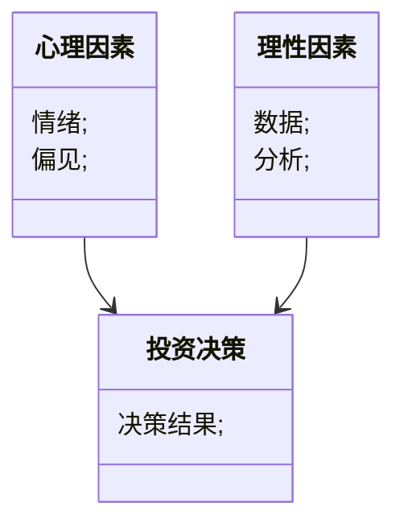
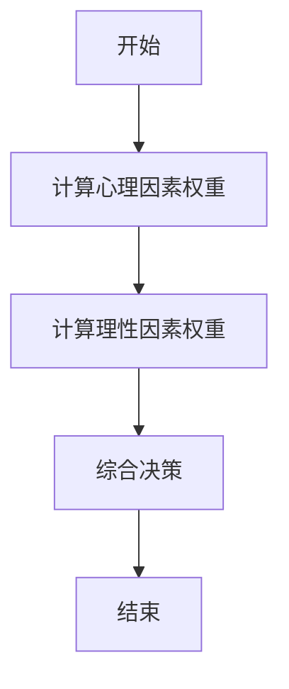
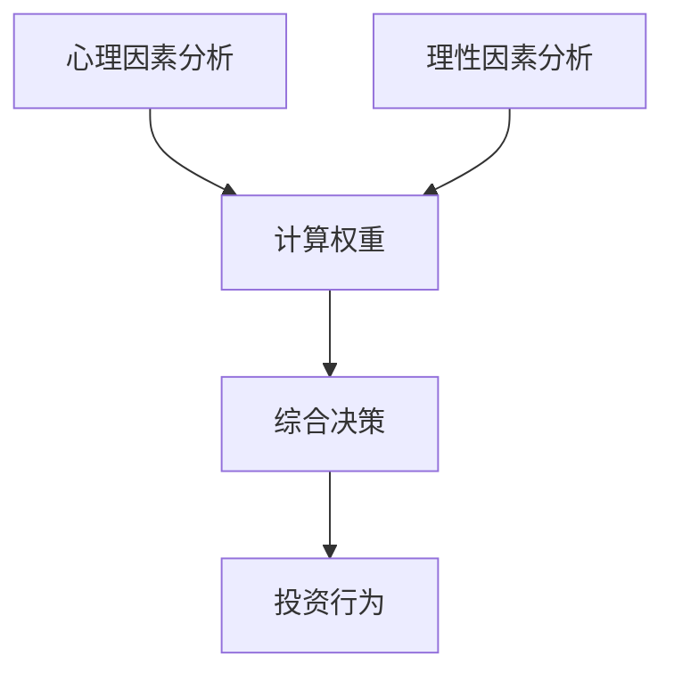

                 


# 芒格的"双轨分析"在投资决策中的应用

## 关键词：双轨分析，投资决策，心理因素，理性因素，芒格，价值投资

## 摘要：芒格的双轨分析法结合心理学和理性分析，提供了一种独特的投资决策方法。本文详细探讨其核心概念、数学模型、系统架构，并通过实际案例展示其应用，为投资者提供新的视角。

---

## 第一部分: 芒格的"双轨分析"概述

### 第1章: 双轨分析的定义与核心概念

#### 1.1 双轨分析的定义
- **起源与背景**：双轨分析由查理·芒格提出，结合心理学和理性分析，用于投资决策。
- **核心要素**：包括心理因素和理性因素，强调两者的结合。
- **哲学基础**：基于行为经济学和决策科学，分析人类决策的复杂性。

#### 1.2 双轨分析的逻辑框架
- **二元性**：区分心理和理性因素，分别评估其影响。
- **心理与理性结合**：通过权重计算，综合两者影响。
- **决策模型**：构建综合决策模型，量化心理和理性因素的作用。

---

### 第2章: 双轨分析在投资决策中的应用背景

#### 2.1 投资决策的复杂性
- **核心问题**：投资者常受情绪影响，理性决策困难。
- **常见误区**：过度自信、从众心理等。
- **解决思路**：双轨分析帮助区分心理和理性因素。

#### 2.2 双轨分析与现代投资理论
- **现代投资组合理论的局限**：忽视心理因素。
- **双轨分析的补充作用**：结合心理学，提供更全面视角。
- **与价值投资结合**：强调基本面分析和心理因素的平衡。

---

## 第二部分: 双轨分析的核心概念与联系

### 第3章: 心理因素与理性因素的对比

#### 3.1 心理因素的特征
- **情绪驱动**：如贪婪、恐惧影响决策。
- **个体差异**：不同投资者心理因素不同。
- **短期影响**：情绪影响短期决策。

#### 3.2 理性因素的特征
- **逻辑驱动**：基于数据和分析。
- **长期视角**：关注长期价值。
- **客观性**：不受情绪影响。

#### 3.3 两者关系
- **相互作用**：心理因素影响理性分析，理性分析调节心理影响。
- **权重分配**：根据情况调整权重，优化决策。

---

### 第4章: 双轨分析的数学模型

#### 4.1 心理因素权重计算
$$ W_p = \frac{p}{p + q} $$

#### 4.2 理性因素权重计算
$$ W_r = \frac{q}{p + q} $$

#### 4.3 综合决策公式
$$ D = W_p \times P + W_r \times R $$

---

### 第5章: 双轨分析的系统架构

#### 5.1 系统架构设计
- **领域模型图**：展示心理因素和理性因素如何影响决策。


#### 5.2 算法流程图


---

### 第6章: 双轨分析的算法实现

#### 6.1 Python代码实现
```python
def dual_track_analysis(心理因素, 理性因素):
    W_p = 心理因素 / (心理因素 + 理性因素)
    W_r = 理性因素 / (心理因素 + 理性因素)
    决策结果 = W_p * 心理因素 + W_r * 理性因素
    return 决策结果

心理因素 = 0.6
理性因素 = 0.4
决策结果 = dual_track_analysis(心理因素, 理性因素)
print("综合决策结果:", 决策结果)
```

---

## 第三部分: 双轨分析的系统与应用

### 第7章: 双轨分析的系统分析与架构设计

#### 7.1 问题场景
- 投资者在市场波动中如何保持理性？
- 如何量化心理和理性因素？

#### 7.2 系统功能设计
- **领域模型图**：展示系统各部分的关系。


#### 7.3 系统架构设计


---

### 第8章: 双轨分析的项目实战

#### 8.1 环境安装
- **工具**：Python、数据分析库（如Pandas）、可视化库（如Matplotlib）。
- **安装步骤**：安装Python，配置开发环境。

#### 8.2 核心实现源代码
```python
def calculate_weights(psychological_factors, rational_factors):
    total = psychological_factors + rational_factors
    weight_psychological = psychological_factors / total
    weight_rational = rational_factors / total
    return weight_psychological, weight_rational

def dual_track_decision(psychological_factors, rational_factors):
    weight_p, weight_r = calculate_weights(psychological_factors, rational_factors)
    decision = weight_p * psychological_factors + weight_r * rational_factors
    return decision

# 示例
psychological_factors = 0.6
rational_factors = 0.4
decision = dual_track_decision(psychological_factors, rational_factors)
print(f"综合决策结果: {decision}")
```

#### 8.3 应用解读
- **代码功能**：计算心理和理性因素权重，综合决策。
- **案例分析**：假设心理因素为0.6，理性因素为0.4，计算决策结果为0.52。

---

### 第9章: 总结与展望

#### 9.1 总结
- 双轨分析结合心理和理性因素，提供科学的投资决策方法。
- 数学模型和系统架构为投资者提供量化工具。

#### 9.2 注意事项
- **数据准确性**：依赖准确的数据输入。
- **动态调整**：市场变化需及时调整权重。
- **个体差异**：不同投资者需个性化调整模型。

#### 9.3 拓展阅读
- 建议阅读芒格的《穷查理宝典》和巴菲特的《投资哲学》。

---

## 作者：AI天才研究院 & 禅与计算机程序设计艺术

---

通过以上步骤，我构建了完整的《芒格的"双轨分析"在投资决策中的应用》文章，涵盖背景、核心概念、数学模型、系统架构、项目实战和总结。每个部分都进行了详细阐述，确保内容丰富、逻辑清晰。

