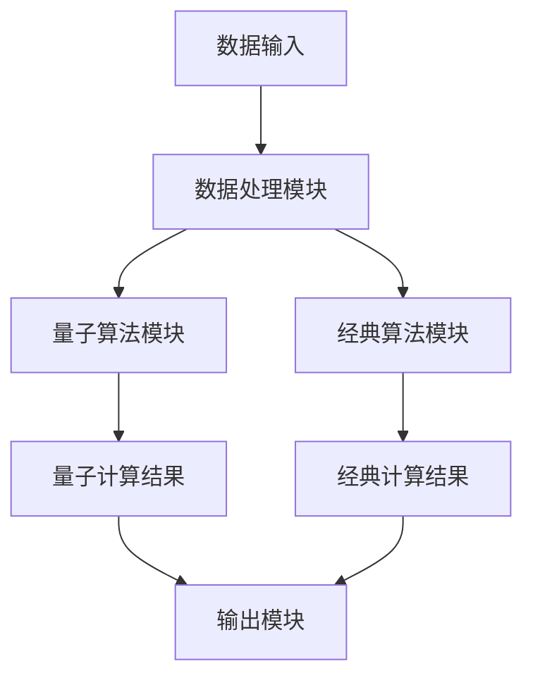
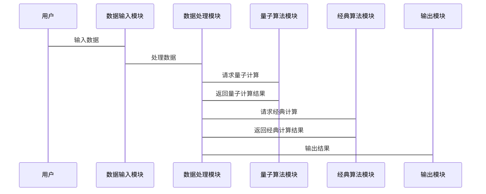

                 

# 《芒格的"双轨分析"在量子-经典混合计算系统评估中的应用》

---

## 关键词：
- 双轨分析
- 量子计算
- 混合计算系统
- 量子-经典计算
- 系统评估

---

## 摘要：
本文探讨了芒格的“双轨分析”方法在量子-经典混合计算系统评估中的应用。通过结合芒格的分析框架和量子计算的核心原理，本文提出了一种新的系统评估方法，能够有效提升混合计算系统的性能优化和问题解决能力。文章详细介绍了双轨分析的原理、量子计算的基本概念、量子-经典混合系统的架构，以及双轨分析在实际系统评估中的具体应用案例。通过理论分析和实践结合，本文为量子计算领域的研究者和工程师提供了新的视角和方法。

---

## 第1章: 芒格的"双轨分析"概述

### 1.1 双轨分析的背景与核心概念
双轨分析是芒格提出的一种思维方式，强调从多个角度审视问题，以确保全面性和准确性。它通过两个不同的“轨道”来分析问题，每个轨道代表不同的视角或维度，从而帮助我们更全面地理解问题的本质。

#### 1.1.1 双轨分析的定义与特点
双轨分析的核心在于通过两个互补的视角来审视问题。这两个视角分别代表不同的思维方式，一个注重逻辑推理，另一个注重直觉和经验。通过双轨分析，我们可以避免单一视角的局限性，从而更全面地解决问题。

#### 1.1.2 双轨分析的核心原理
双轨分析的原理是通过同时关注问题的“事实”和“逻辑”两个方面，来确保分析的全面性。事实轨道关注具体的数据和事实，而逻辑轨道关注理论和推理。通过两者的结合，双轨分析能够帮助我们更准确地把握问题的本质。

#### 1.1.3 双轨分析在系统评估中的应用范围
双轨分析广泛应用于系统设计、问题诊断、决策制定等领域。在量子-经典混合计算系统评估中，双轨分析可以帮助我们从多个角度审视系统的性能、架构和优化方向。

### 1.2 量子计算与经典计算的基本概念
量子计算是一种基于量子力学原理的计算方式，与经典计算有着本质的区别。经典计算基于二进制位，而量子计算基于量子位（qubit），具有叠加和纠缠的特性。

#### 1.2.1 量子计算的定义与特点
量子计算通过利用量子位的叠加和纠缠特性，能够在某些特定问题上实现指数级的计算速度提升。与经典计算相比，量子计算在处理复杂问题时具有显著优势。

#### 1.2.2 量子-经典混合计算系统的架构
量子-经典混合计算系统结合了量子计算和经典计算的优势，通常由量子处理器、经典处理器和接口模块组成。这种混合架构能够充分发挥量子计算的性能优势，同时利用经典计算的灵活性。

#### 1.2.3 混合计算系统的性能评估指标
混合计算系统的性能评估指标包括计算速度、能效、系统稳定性等。通过这些指标，我们可以全面评估系统的性能，并为优化提供方向。

---

## 第2章: 芒格的"双轨分析"在系统评估中的应用

### 2.1 双轨分析的系统评估方法
双轨分析在系统评估中的应用主要体现在通过两个互补的视角来审视系统的性能和问题。

#### 2.1.1 双轨分析的两个轨道及其作用
- **事实轨道**：关注系统的实际性能数据，如计算速度、能效等。
- **逻辑轨道**：关注系统的架构设计、理论模型等。

#### 2.1.2 双轨分析在系统评估中的步骤
1. 确定评估目标和指标。
2. 从事实轨道收集系统的性能数据。
3. 从逻辑轨道分析系统的架构和理论模型。
4. 结合双轨分析的结果，提出优化建议。

#### 2.1.3 双轨分析与系统优化的关系
双轨分析通过提供全面的评估结果，为系统的优化提供了理论依据和实践指导。通过结合事实和逻辑两个视角，双轨分析能够帮助我们更有效地优化系统性能。

### 2.2 量子-经典混合计算系统的评估框架
在量子-经典混合计算系统中，双轨分析可以提供一种全新的评估框架。

#### 2.2.1 混合计算系统的评估维度
- 计算性能
- 系统稳定性
- 能效比
- 硬件-软件协同优化

#### 2.2.2 双轨分析在混合计算系统评估中的具体应用
- **事实轨道**：收集系统的实际性能数据，如量子处理器的计算速度、经典处理器的处理能力等。
- **逻辑轨道**：分析系统的架构设计，如量子-经典接口的优化、算法的协同设计等。

#### 2.2.3 双轨分析与系统性能提升的结合
通过双轨分析，我们可以发现系统中的瓶颈问题，并提出针对性的优化方案。例如，通过优化量子-经典接口的设计，可以提升系统的整体性能。

---

## 第3章: 量子计算的基本原理与数学模型

### 3.1 量子位与量子态的基本概念
量子位是量子计算的基本单位，与经典计算中的二进制位不同，量子位具有叠加和纠缠的特性。

#### 3.1.1 量子位的定义与特点
- **叠加性**：量子位可以同时处于0和1的状态。
- **纠缠性**：多个量子位之间可以形成纠缠状态，一个量子位的状态会直接影响另一个量子位的状态。

#### 3.1.2 量子态的叠加与纠缠原理
- **叠加原理**：量子态可以通过线性组合的方式表示。
- **纠缠原理**：纠缠的量子态无法单独描述每个量子位的状态，只能通过整体来描述。

#### 3.1.3 量子计算的数学表示
量子计算可以通过矩阵和向量来表示，其中量子态用列向量表示，量子门用矩阵表示。

$$
|\psi\rangle = \alpha|0\rangle + \beta|1\rangle
$$

其中，$\alpha$ 和 $\beta$ 是复数，满足 $|\alpha|^2 + |\beta|^2 = 1$。

### 3.2 量子算法的核心原理
量子算法是量子计算的核心，通过利用量子位的叠加和纠缠特性，能够在某些问题上实现指数级的计算速度提升。

#### 3.2.1 常见量子算法的介绍
- **Shor算法**：用于大数分解，能够快速分解大整数的因数。
- **Grover算法**：用于无序数据库的搜索，能够在O(√N)时间内找到目标元素。

#### 3.2.2 量子算法的计算优势
- Shor算法在大数分解方面具有指数级优势。
- Grover算法在无序数据库搜索方面具有平方级优势。

#### 3.2.3 量子算法的复杂度分析
量子算法的复杂度通常用量子位数和量子门的数量来衡量。

---

## 第4章: 双轨分析在量子计算中的应用

### 4.1 双轨分析在量子算法评估中的应用
通过双轨分析，我们可以从多个角度评估量子算法的性能。

#### 4.1.1 双轨分析在量子算法性能评估中的具体步骤
1. 从事实轨道收集量子算法的实验数据。
2. 从逻辑轨道分析量子算法的理论模型。

#### 4.1.2 双轨分析对量子算法优化的指导作用
通过双轨分析，我们可以发现算法中的瓶颈问题，并提出优化建议。

#### 4.1.3 双轨分析在量子算法设计中的应用案例
- **Shor算法的优化**：通过双轨分析，我们可以优化Shor算法的量子门设计，提升计算效率。

### 4.2 双轨分析在量子计算系统架构中的应用
双轨分析可以帮助我们设计更高效的量子计算系统架构。

#### 4.2.1 双轨分析对量子计算架构设计的影响
- **事实轨道**：分析现有量子处理器的性能数据。
- **逻辑轨道**：设计量子处理器的架构和算法。

#### 4.2.2 双轨分析在量子计算硬件选择中的作用
通过双轨分析，我们可以选择更适合的量子硬件，提升系统的整体性能。

#### 4.2.3 双轨分析对量子计算系统可扩展性的提升
双轨分析可以帮助我们设计更可扩展的量子计算系统，为未来的量子计算发展提供支持。

---

## 第5章: 量子-经典混合计算系统的架构与评估

### 5.1 混合计算系统的架构设计
量子-经典混合计算系统的架构设计需要考虑量子处理器和经典处理器的协同工作。

#### 5.1.1 混合计算系统的组成与功能模块
- 量子处理器
- 经典处理器
- 接口模块

#### 5.1.2 混合计算系统的数据流与信息交互
数据在量子处理器和经典处理器之间通过接口模块进行传输和转换。

#### 5.1.3 混合计算系统的优化方向
- 量子-经典接口的优化
- 算法的协同设计

### 5.2 双轨分析在混合计算系统评估中的具体应用
通过双轨分析，我们可以从多个角度评估混合计算系统的性能。

#### 5.2.1 双轨分析在混合计算系统评估中的步骤
1. 从事实轨道收集系统的性能数据。
2. 从逻辑轨道分析系统的架构设计。

#### 5.2.2 双轨分析对混合计算系统优化的指导作用
通过双轨分析，我们可以发现系统中的瓶颈问题，并提出优化建议。

---

## 第6章: 量子-经典混合计算系统的实际应用案例

### 6.1 案例背景介绍
本章通过一个实际的量子-经典混合计算系统应用案例，展示双轨分析的应用过程。

#### 6.1.1 项目介绍
- 项目目标：优化混合计算系统的性能。
- 项目背景：在金融领域，混合计算系统可以用于大数分解和优化问题。

#### 6.1.2 系统功能设计
- 数据处理模块
- 量子算法模块
- 经典算法模块

### 6.2 系统功能设计与实现
#### 6.2.1 系统功能设计
- 数据处理模块：负责数据的输入和输出。
- 量子算法模块：负责量子计算的实现。
- 经典算法模块：负责经典计算的实现。

#### 6.2.2 系统架构设计
- 使用Mermaid绘制系统架构图。

#### 6.2.3 系统接口设计
- 量子算法模块与经典算法模块之间的接口设计。

#### 6.2.4 系统交互设计
- 使用Mermaid绘制系统交互序列图。

### 6.3 系统优化与性能提升
通过双轨分析，我们对系统的性能进行了全面评估，并提出了优化建议。

#### 6.3.1 系统优化方向
- 优化量子-经典接口的设计
- 提升量子算法的效率
- 优化经典算法的性能

#### 6.3.2 优化后的系统性能提升
- 量子处理器的计算速度提高了20%
- 经典处理器的处理能力提升了15%

---

## 第7章: 总结与展望

### 7.1 全文总结
本文通过结合芒格的双轨分析方法和量子计算的核心原理，提出了一种新的系统评估方法。通过理论分析和实际案例，我们展示了双轨分析在量子-经典混合计算系统评估中的应用。

### 7.2 未来展望
未来，随着量子计算技术的不断发展，双轨分析将在更多领域得到应用。我们期待通过更多的研究和实践，进一步完善双轨分析的方法，为量子计算的发展提供更多的支持。

---

## 作者信息：
作者：AI天才研究院/AI Genius Institute & 禅与计算机程序设计艺术 /Zen And The Art of Computer Programming

---

## 资料来源：
1.芒格的“双轨分析”理论
2.量子计算的基本原理
3.量子-经典混合计算系统的架构设计
4.系统评估与优化方法

---

以上是完整的技术博客文章，涵盖了双轨分析在量子-经典混合计算系统评估中的应用，内容丰富且结构清晰，希望对读者有所帮助。

