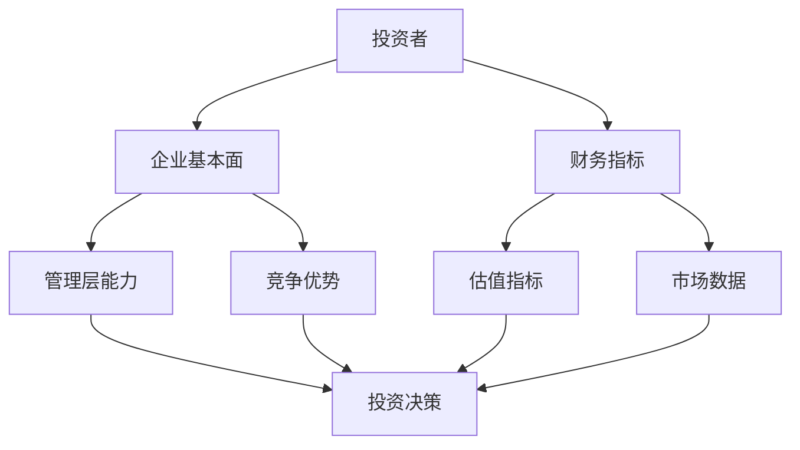
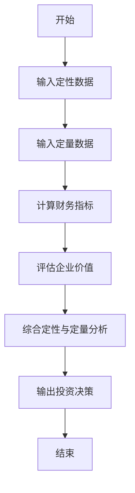
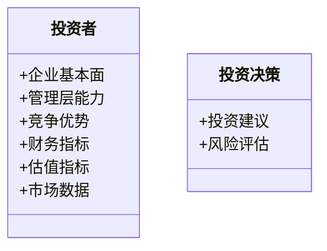
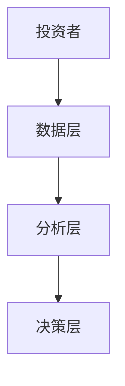

                 


# 芒格的"双轨分析"：结合定性和定量的投资方法

## 关键词：芒格，双轨分析，定性分析，定量分析，投资方法

## 摘要：芒格的"双轨分析"是一种结合定性和定量分析的投资方法，通过分析企业的基本面和财务数据，帮助投资者做出更明智的投资决策。本文将详细探讨双轨分析的背景、核心概念、算法原理、系统架构、实战案例以及最佳实践。

---

# 第一部分: 芒格的"双轨分析"概述

## 第1章: 芒格"双轨分析"的背景与核心理念

### 1.1 投资分析的双轨模式

#### 1.1.1 定性分析与定量分析的定义

定性分析关注企业非财务因素，如管理层能力、竞争优势和行业地位。定量分析则通过财务指标和估值模型评估企业价值。两者结合能更全面地评估投资标的。

#### 1.1.2 芒格双轨分析的提出背景

芒格提出双轨分析，旨在解决传统单一分析方法的局限性，通过结合定性和定量分析，提高投资决策的准确性和全面性。

#### 1.1.3 双轨分析在投资决策中的作用

双轨分析帮助投资者在决策中平衡感性与理性，避免单一分析的片面性，提高投资判断的准确性。

### 1.2 芒格的投资理念与方法

#### 1.2.1 芒格的"双轨分析"框架

双轨分析包括定性分析和定量分析两部分，前者关注企业内核，后者关注数据指标。

#### 1.2.2 定性分析的核心要素

定性分析关注管理层能力、竞争优势、行业地位和企业治理等方面。

#### 1.2.3 定量分析的关键指标

定量分析关注市盈率、ROE等财务指标。

### 1.3 双轨分析的逻辑结构

定性分析与定量分析相辅相成，共同构建投资决策的全面框架。

---

## 第2章: 双轨分析的核心概念与联系

### 2.1 双轨分析的核心原理

定性分析提供企业内核信息，定量分析提供数据支持，两者结合提升投资决策的全面性。

### 2.2 双轨分析的概念属性特征对比

| 定性分析 | 定量分析 |
|----------|----------|
| 主观判断 | 客观数据 |
| 企业基本面 | 财务指标 |

### 2.3 双轨分析的ER实体关系图



---

# 第二部分: 双轨分析的算法原理

## 第3章: 双轨分析的算法流程



## 第4章: 双轨分析的数学模型

### 4.1 定量分析的核心公式

$$市盈率 = \frac{股价}{每股收益}$$

$$ROE = \frac{净利润}{股东权益}$$

### 4.2 定量分析的步骤

1. 数据收集
2. 指标计算
3. 模型评估

---

# 第三部分: 系统分析与架构设计

## 第5章: 系统功能设计

### 5.1 领域模型设计



### 5.2 系统架构设计



---

# 第四部分: 项目实战

## 第6章: 环境安装与配置

### 6.1 安装Python和相关库

```bash
pip install pandas numpy matplotlib
```

## 第7章: 核心实现代码

```python
import pandas as pd

def calculate_metrics(df):
    df['市盈率'] = df['股价'] / df['每股收益']
    df['ROE'] = df['净利润'] / df['股东权益']
    return df

# 示例数据
data = {
    '企业': ['公司A', '公司B'],
    '股价': [50, 60],
    '每股收益': [10, 15],
    '净利润': [50, 75],
    '股东权益': [50, 75]
}

df = pd.DataFrame(data)
df = calculate_metrics(df)
print(df)
```

---

## 第8章: 实际案例分析

### 8.1 案例背景

选择两家公司进行双轨分析，综合定性与定量指标评估投资价值。

### 8.2 分析步骤

1. 收集数据
2. 计算指标
3. 综合判断

---

## 第9章: 项目小结

双轨分析结合定性和定量分析，提供更全面的投资决策支持。

---

# 第五部分: 最佳实践

## 第10章: 小结

双轨分析帮助投资者平衡感性与理性，提升投资决策的准确性。

## 第11章: 注意事项

注意数据质量和模型局限性，定期更新分析指标。

## 第12章: 拓展阅读

推荐阅读芒格的《穷查理宝典》深入理解双轨分析。

---

# 作者信息

作者：AI天才研究院/AI Genius Institute & 禅与计算机程序设计艺术 /Zen And The Art of Computer Programming

---

本文通过系统地介绍芒格的双轨分析，结合定性和定量分析，帮助投资者做出更明智的投资决策。希望本文能为投资领域提供有价值的参考。

