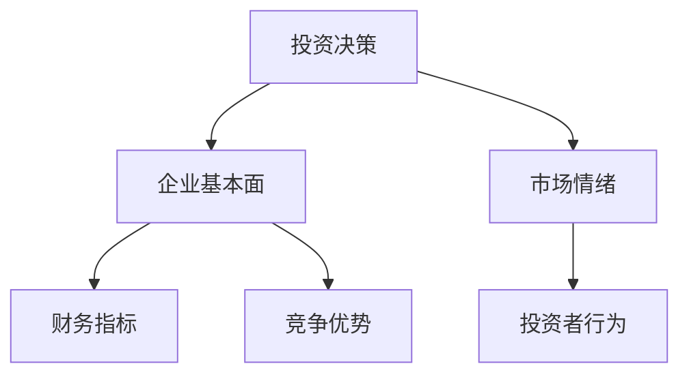
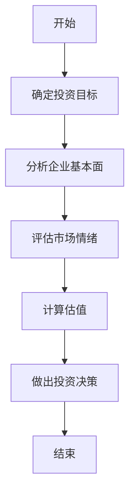
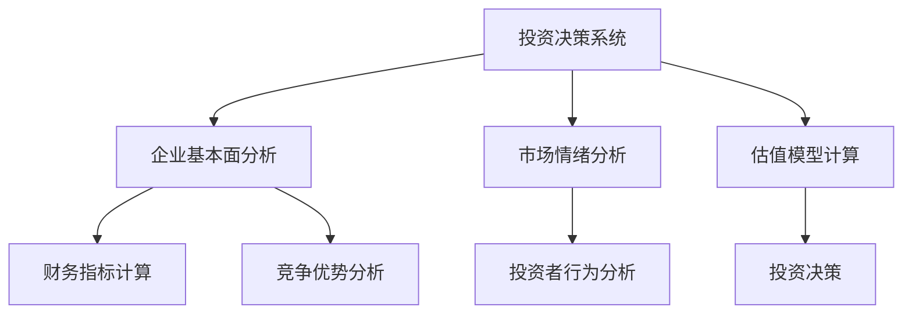

                 


# 芒格的"反向工程"思维在投资中的应用

## 关键词
- 芒格投资理念
- 反向工程思维
- 投资决策模型
- 企业基本面分析
- 市场情绪分析
- 估值模型

## 摘要
芒格的“反向工程”思维是一种从结果推导原因的逆向思维方式，广泛应用于投资领域。本文通过详细分析芒格的投资哲学，构建其决策模型，并结合实际案例，展示反向工程思维在投资中的应用。文章分为背景介绍、核心概念、算法原理、系统分析、项目实战和最佳实践等部分，全面解析芒格的反向工程思维及其在投资中的实践应用。

---

## 第一部分: 芒格的"反向工程"思维概述

### 第1章: "反向工程"思维的定义与背景

#### 1.1 "反向工程"思维的核心概念

##### 1.1.1 从正向思维到反向思维的转变
正向思维是从原因推导结果，而反向思维则是从结果推导原因。在投资中，这意味着我们不是寻找市场上涨的原因，而是从市场的行为中反推出其背后的逻辑。例如，当某只股票价格持续下跌时，反向思维会促使投资者思考：价格下跌的原因是什么？这背后可能隐藏着哪些投资机会。

##### 1.1.2 "反向工程"思维的定义与特点
反向工程思维是一种逆向思考的方法，通过分析结果来推断原因。其特点包括：
- **逆向性**：从结果出发，反推原因。
- **逻辑性**：依赖于严密的逻辑推理。
- **实用性**：在投资中，能够帮助投资者发现被市场低估的机会。

##### 1.1.3 投资领域中的应用背景
在传统投资中，许多投资者习惯于从市场趋势和价格波动中寻找投资机会。然而，这种正向思维往往容易受到市场情绪的影响。反向工程思维则提供了一种不同的视角，帮助投资者在市场低谷中发现价值。

---

#### 1.2 芒格投资理念的背景介绍

##### 1.2.1 芒格的生平与投资哲学
查理·芒格是世界著名投资者，巴菲特的长期合作伙伴。芒格的投资哲学强调价值投资和安全边际，主张通过深入分析企业的基本面，寻找具有持续竞争优势的企业进行投资。

##### 1.2.2 芒格投资理念的核心思想
芒格认为，投资的核心是理解企业内在价值，而不是关注市场的短期波动。他强调通过反向工程思维，从市场的非理性中寻找低估的投资机会。

##### 1.2.3 "反向工程"思维在芒格投资中的地位
反向工程思维是芒格投资理念的重要组成部分。他通过分析市场的非理性行为，反推出市场的低估企业，并在市场恐慌时寻找投资机会。

---

#### 1.3 传统投资思维与反向思维的对比

##### 1.3.1 传统投资思维的特点
传统投资思维通常是基于市场趋势和价格波动进行投资决策，容易受到市场情绪的影响。这种思维模式在市场繁荣时可能表现良好，但在市场下跌时容易受到冲击。

##### 1.3.2 反向思维的优势与局限性
- **优势**：反向思维能够帮助投资者在市场低谷时发现低估的机会，避免盲目跟随市场情绪。
- **局限性**：反向思维需要投资者具备较高的分析能力和耐心，尤其是在市场恐慌时，需要有足够的信心坚持投资。

##### 1.3.3 两种思维模式的结合与平衡
在实际投资中，可以将正向思维和反向思维结合起来。例如，在市场上涨时，可以结合趋势分析和基本面分析；在市场下跌时，可以运用反向思维寻找低估机会。

---

### 第2章: "反向工程"思维的核心要素

#### 2.1 投资决策中的关键要素

##### 2.1.1 企业基本面分析
企业基本面分析是反向工程思维的重要组成部分。通过分析企业的财务状况、盈利能力、竞争优势等因素，可以推断出企业的内在价值。

##### 2.1.2 市场情绪与行为
市场情绪与行为是反向工程思维的重要输入。通过分析市场的非理性行为，可以反推出市场的低估机会。

##### 2.1.3 财务指标与估值方法
财务指标（如市盈率、市净率等）和估值方法（如内在价值计算）是反向工程思维的核心工具。通过这些工具，可以推断出市场的低估或高估状态。

---

#### 2.2 "反向工程"思维的逻辑框架

##### 2.2.1 从结果推导原因的逻辑
反向工程思维的核心是通过分析结果（如市场价格）推导原因（如企业的内在价值）。例如，当市场价格远低于内在价值时，可以推断出市场低估了该企业的价值。

##### 2.2.2 投资决策中的逆向思维
在投资决策中，逆向思维可以帮助投资者在市场恐慌时寻找机会。例如，在市场恐慌导致股票价格下跌时，可以通过分析企业的基本面，判断是否存在低估的投资机会。

##### 2.2.3 芒格决策模型的构建
芒格决策模型是一种基于反向工程思维的投资决策框架。通过分析市场的非理性行为和企业的基本面，推断出投资机会。

---

#### 2.3 芒格决策模型的ER实体关系图



---

### 第3章: "反向工程"思维的算法原理

#### 3.1 芒格决策模型的算法流程



---

#### 3.2 芒格决策模型的数学模型

$$
\text{投资价值} = f(\text{企业基本面}, \text{竞争优势}, \text{市场情绪})
$$

---

#### 3.3 企业估值的数学公式

$$
\text{内在价值} = \sum_{t=1}^{n} \frac{\text{现金流}_t}{(1 + r)^t}
$$

---

#### 3.4 投资决策的逻辑举例

##### 例1: 高市盈率股票的反向分析
假设某股票的市盈率远高于行业平均水平，反向思维会促使投资者分析其原因，例如是否因为市场对公司的未来盈利预期过高，还是因为公司基本面存在某些优势。

##### 例2: 低估值企业的竞争优势识别
假设某企业的市盈率远低于行业平均水平，反向思维会促使投资者分析其原因，例如是否因为市场低估了企业的竞争优势，或者是否存在某些潜在的问题。

---

### 第4章: 投资决策系统的系统分析

#### 4.1 系统功能设计

##### 4.1.1 企业基本面分析模块
该模块负责分析企业的财务状况、盈利能力、竞争优势等因素。

##### 4.1.2 市场情绪与行为分析模块
该模块负责分析市场的非理性行为和情绪。

##### 4.1.3 估值模型计算模块
该模块负责计算企业的内在价值，并与市场价格进行对比。

---

#### 4.2 系统架构设计



---

## 第二部分: 项目实战

### 第5章: 项目实战

#### 5.1 环境配置与数据收集

##### 5.1.1 环境配置
- 操作系统：Windows 10 或 macOS
- Python版本：Python 3.8+
- 需要安装的库：Pandas, NumPy, Matplotlib, Scipy

##### 5.1.2 数据收集
从公开的财务数据源（如Yahoo Finance）获取企业的财务数据和市场数据。

---

#### 5.2 核心实现代码

##### 5.2.1 企业基本面分析代码

```python
import pandas as pd
import numpy as np

# 示例数据：企业财务数据
data = {
    '收入': [100, 200, 300],
    '净利润': [20, 40, 60],
    '股东权益': [50, 100, 150],
    '经营活动现金流': [10, 20, 30]
}

df = pd.DataFrame(data)

# 计算市盈率
df['市盈率'] = df['收入'] / df['净利润']

print("企业基本面分析结果：")
print(df)
```

##### 5.2.2 估值模型计算代码

```python
def calculate_intrinsic_value(现金流, 折现率):
    return sum(现金流 / (1 + 折现率)**t for t in range(len(现金流)))

现金流 = [100, 200, 300]
折现率 = 0.1

内在价值 = calculate_intrinsic_value(现金流, 折现率)
print(f"企业的内在价值为：{内在价值}")
```

---

#### 5.3 案例分析与结果解读

##### 5.3.1 案例分析
假设某企业的财务数据如下：
- 收入：100万
- 净利润：20万
- 股东权益：50万
- 经营活动现金流：10万

假设折现率为10%，计算企业的内在价值。

##### 5.3.2 结果解读
通过计算，企业的内在价值为130万。如果当前市场价格低于130万，则可能存在低估机会。

---

### 第6章: 总结与展望

#### 6.1 总结
芒格的反向工程思维是一种从结果推导原因的逆向思维方式，能够帮助投资者在市场中找到低估的投资机会。通过构建芒格决策模型，投资者可以系统地分析企业的基本面和市场情绪，做出更明智的投资决策。

#### 6.2 展望
未来，随着人工智能和大数据技术的发展，反向工程思维在投资中的应用将更加广泛和深入。投资者可以通过技术手段进一步提升分析效率和精度，发现更多的投资机会。

---

## 作者：AI天才研究院/AI Genius Institute & 禅与计算机程序设计艺术 /Zen And The Art of Computer Programming

---

以上是完整的《芒格的"反向工程"思维在投资中的应用》的技术博客文章大纲和内容。文章内容详细讲解了反向工程思维的核心概念、算法原理和实际应用，帮助投资者更好地理解芒格的投资理念，并在实际操作中加以应用。

