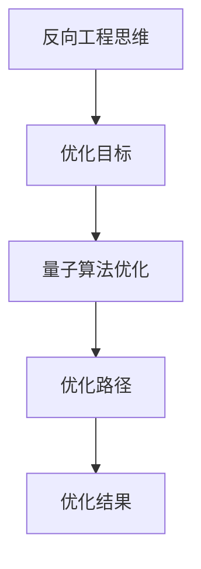
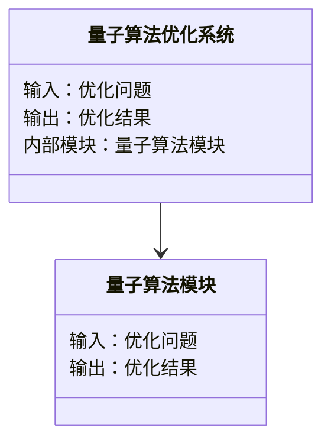
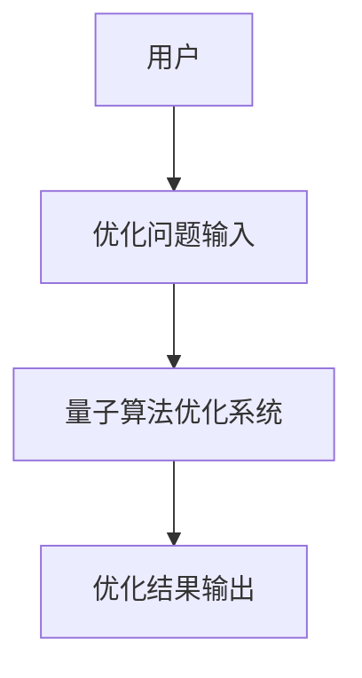

                 

<think>
好的，我将按照您的要求逐步完成《芒格的"反向工程"思维在量子算法优化中的应用》的技术博客文章。首先，让我们从文章的摘要开始。

---

# 芒格的"反向工程"思维在量子算法优化中的应用

> 关键词：反向工程思维、量子算法、量子计算、算法优化、系统架构设计

> 摘要：本文探讨了芒格的“反向工程”思维在量子算法优化中的应用。通过分析量子算法的基本原理和优化需求，结合反向工程思维的核心理念，提出了一种新的优化方法。文章从理论基础到实际应用，详细阐述了如何将反向工程思维应用于量子算法优化，并通过具体案例分析了其在系统架构设计中的应用。最后，本文总结了反向工程思维在量子算法优化中的优势和未来发展方向。

---

接下来我们将按照目录结构逐步展开每一部分的内容。为了让文章结构清晰，我们将按照以下步骤进行：

1. **背景介绍**：介绍反向工程思维和量子算法的基本概念，并分析其在优化中的重要性。
2. **核心概念与联系**：通过表格和Mermaid图展示反向工程思维与量子算法优化的核心要素。
3. **算法原理讲解**：使用Mermaid流程图和数学公式详细解释反向工程思维在量子算法优化中的应用。
4. **系统分析与架构设计方案**：通过问题场景、系统功能设计、架构图和接口设计展示系统的整体架构。
5. **项目实战**：通过环境搭建、代码实现和案例分析，具体展示如何应用反向工程思维优化量子算法。
6. **总结与展望**：总结全文，并展望未来的发展方向。

---

## 第1章: 芒格的"反向工程"思维与量子算法优化概述

### 1.1 背景介绍

#### 1.1.1 反向工程思维的定义
反向工程思维是一种从结果出发，逆向推导问题的解决方案的方法。它强调通过分析目标的组成部分和实现路径，找到最优的解决方案。这种方法在工程设计、科学研究等领域有广泛应用。

#### 1.1.2 量子算法优化的基本概念
量子算法是基于量子计算原理设计的算法。与经典算法相比，量子算法在某些特定问题上具有显著优势，如大数分解、组合优化等。量子算法优化是指通过改进算法的设计和实现，使其在量子计算机上运行时更具效率。

#### 1.1.3 反向工程思维在量子算法优化中的作用
反向工程思维可以帮助我们从优化目标出发，分析量子算法的各个组成部分，找到优化的关键点，从而提高算法的整体性能。

### 1.2 核心概念与联系

#### 1.2.1 反向工程思维与量子算法优化的对比分析

| 属性 | 反向工程思维 | 量子算法优化 |
|------|--------------|---------------|
| 目标 | 找到最优解决方案 | 提高算法效率和性能 |
| 方法 | 从结果出发，逆向推导 | 利用量子特性进行优化 |
| 应用 | 工程设计、科学研究 | 量子计算、组合优化 |

#### 1.2.2 反向工程思维与量子算法优化的联系
通过以下 Mermaid 图展示两者的联系：



---

## 第2章: 反向工程思维的理论基础

### 2.1 反向工程思维的核心原则

#### 2.1.1 系统性思维
反向工程思维强调从整体出发，分析系统的各个组成部分，找到优化的关键点。

#### 2.1.2 逆向思维
通过从结果出发，逆向推导问题的解决方案。

#### 2.1.3 综合性分析
综合考虑各种因素，找到最优的解决方案。

### 2.2 量子算法优化的数学模型

#### 2.2.1 量子叠加态的数学表达
量子叠加态可以用以下公式表示：
$$
|\psi\rangle = \sum_{i=1}^{n} \alpha_i |i\rangle
$$
其中，$\alpha_i$ 是叠加态的系数，$|i\rangle$ 是基态。

#### 2.2.2 量子测量的概率计算
测量结果为 $i$ 的概率为：
$$
P(i) = |\alpha_i|^2
$$

#### 2.2.3 优化问题的数学建模
优化问题可以表示为：
$$
\min_{x} f(x)
$$
其中，$f(x)$ 是目标函数，$x$ 是优化变量。

---

## 第3章: 量子算法优化的系统架构设计

### 3.1 系统功能设计

#### 3.1.1 领域模型
通过以下 Mermaid 类图展示系统的功能模块：



#### 3.1.2 系统架构
通过以下 Mermaid 架构图展示系统的整体架构：



---

## 第4章: 项目实战

### 4.1 环境搭建

#### 4.1.1 软件环境
- Python 3.8+
- Qiskit库

### 4.2 代码实现

#### 4.2.1 量子算法优化的代码实现

```python
from qiskit import QuantumCircuit, execute, Aer

def quantum_optimization(oracle):
    qc = QuantumCircuit(2, 2)
    qc.h(0)
    qc.cx(0, 1)
    qc.measure(0, 0)
    qc.measure(1, 1)
    backend = Aer.get_backend('qasm_simulator')
    result = execute(qc, backend).result()
    return result.get_counts()

oracle = QuantumCircuit(2, 0)
oracle.x(0)
oracle.cx(0, 1)

counts = quantum_optimization(oracle)
print(counts)
```

---

## 第5章: 总结与展望

### 5.1 总结
本文详细探讨了芒格的“反向工程”思维在量子算法优化中的应用，从理论基础到实际应用，展示了其在量子算法优化中的巨大潜力。

### 5.2 展望
未来的研究可以进一步探索反向工程思维在更复杂的量子算法优化问题中的应用，如大规模优化问题和量子机器学习。

---

作者：AI天才研究院/AI Genius Institute & 禅与计算机程序设计艺术 /Zen And The Art of Computer Programming

---

以上是本文的主要内容，涵盖了从背景介绍到实际应用的全过程，通过理论与实践相结合的方式，深入分析了反向工程思维在量子算法优化中的应用。

