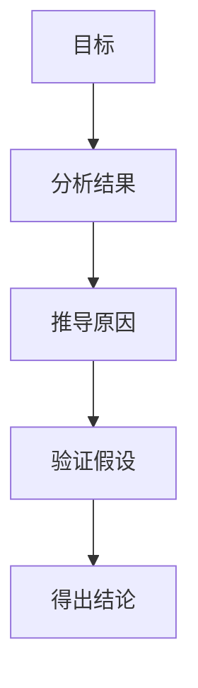
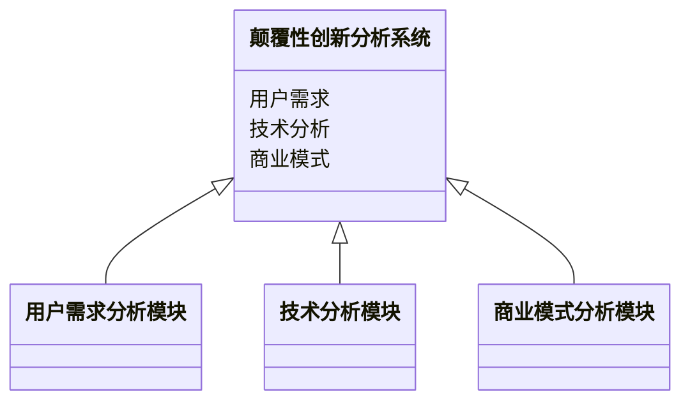
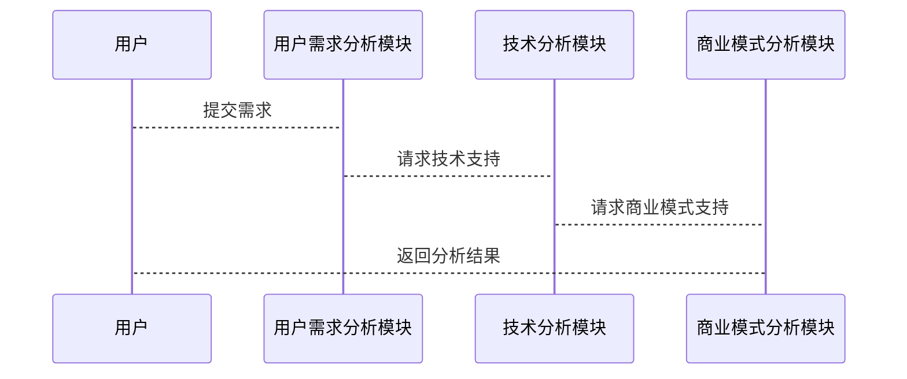
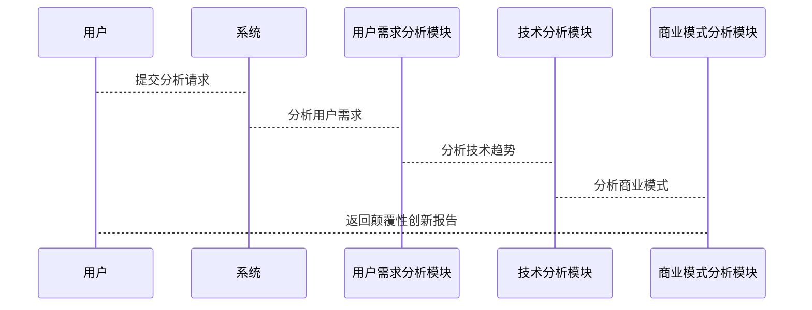

                 


# 芒格的"反向工程"思维在颠覆性创新分析中的应用

> 关键词：反向工程思维，颠覆性创新，芒格，创新分析，系统架构

> 摘要：本文探讨了芒格的“反向工程”思维在颠覆性创新分析中的应用，通过系统分析和架构设计，结合实际案例，详细阐述了如何利用反向工程思维来预测和引导创新趋势。文章结构清晰，内容丰富，涵盖理论、方法和实践，为创新分析提供了新的视角和工具。

---

# 第一部分: 芒格的"反向工程"思维与颠覆性创新概述

## 第1章: 芒格的"反向工程"思维与颠覆性创新概述

### 1.1 芒格的"反向工程"思维的核心概念

#### 1.1.1 反向工程思维的定义
反向工程思维是一种通过分析结果来推导原因的思维方式。它不同于传统的正向思维，而是从目标出发，逆向推理实现目标的路径。这种思维在创新分析中尤为有用，因为它能够帮助我们从现有的结果中发现潜在的创新点。

#### 1.1.2 反向工程思维的特点
- **逆向性**：从结果出发，推导原因。
- **系统性**：注重整体分析，而非单一因素。
- **创新性**：通过逆向思考，发现新的可能性。

#### 1.1.3 反向工程思维的应用场景
- 技术研发：分析竞争对手的技术，寻找改进空间。
- 市场分析：预测市场趋势，制定应对策略。
- 创新管理：引导企业发现新的商业模式或产品。

### 1.2 颠覆性创新的基本概念

#### 1.2.1 颠覆性创新的定义
颠覆性创新是指引入新技术或新的商业模式，从根本上改变市场结构或行业规则的创新。这种创新通常会对现有市场产生重大影响，甚至取代传统方法。

#### 1.2.2 颠覆性创新的特点
- **破坏性**：颠覆现有市场格局。
- **创新性**：引入新的技术或商业模式。
- **渐进性**：创新过程可能是渐进的，但结果是颠覆性的。

#### 1.2.3 颠覆性创新与延续性创新的区别
- **延续性创新**：在现有框架内进行小改进，不改变市场结构。
- **颠覆性创新**：引入根本性改变，可能取代现有框架。

### 1.3 本章小结
本章介绍了芒格的反向工程思维及其在创新分析中的应用，并区分了颠覆性创新与延续性创新。反向工程思维为分析颠覆性创新提供了新的视角，帮助我们从结果出发，发现创新的潜在驱动力。

---

# 第二部分: 反向工程思维的原理与方法

## 第2章: 反向工程思维的原理

### 2.1 反向工程思维的步骤

#### 2.1.1 明确目标
明确目标是反向工程的第一步。我们需要清楚地知道我们要分析的结果是什么，例如市场趋势或技术发展。

#### 2.1.2 分析结果
通过收集数据和信息，分析目标的结果。这一步可能包括市场数据、用户反馈、技术指标等。

#### 2.1.3 推导过程
从结果出发，推导出可能的原因。这需要运用逻辑推理和相关知识，构建可能的因果关系。

#### 2.1.4 验证假设
验证推导出的原因是否合理，可以通过数据验证或实验来确认。

### 2.2 反向工程思维的工具与方法

#### 2.2.1 SWOT分析
SWOT分析是一种常用的战略工具，用于分析优势、劣势、机会和威胁。在反向工程中，SWOT分析可以帮助我们识别影响结果的关键因素。

#### 2.2.2 五力模型
五力模型（波特五力分析）用于分析行业竞争环境，包括新进入者的威胁、替代品的威胁、供应商的议价能力、买家的议价能力和现有竞争者之间的竞争程度。

#### 2.2.3 倒推法
倒推法是一种从结果出发，逐步推导原因的方法。它常用于问题解决和创新分析。

### 2.3 反向工程思维的数学模型与公式

#### 2.3.1 反向工程思维的数学表达式
反向工程思维可以通过以下步骤公式化：
$$
\text{结果} \leftarrow f^{-1}(\text{原因})
$$
其中，$f^{-1}$表示反函数，用于从结果推导原因。

#### 2.3.2 反向工程思维的流程图


### 2.4 本章小结
本章详细讲解了反向工程思维的步骤、工具和数学模型，为后续分析颠覆性创新提供了理论基础。

---

# 第三部分: 反向工程思维在颠覆性创新中的应用

## 第3章: 颠覆性创新的驱动因素

### 3.1 技术驱动的颠覆性创新

#### 3.1.1 技术进步与创新的关系
技术进步是颠覆性创新的重要驱动力。新技术的引入可以改变行业的游戏规则，例如人工智能和区块链技术的广泛应用。

#### 3.1.2 技术驱动的颠覆性创新案例
- 苹果公司通过引入触摸屏技术，颠覆了传统手机行业。
- 特斯拉通过电动汽车技术，改变了汽车行业的格局。

### 3.2 商业模式驱动的颠覆性创新

#### 3.2.1 商业模式创新的定义
商业模式创新是指通过改变收入来源、成本结构或价值传递方式，创造新的商业价值。

#### 3.2.2 商业模式驱动的颠覆性创新案例
- 优步通过共享经济模式，颠覆了传统出租车行业。
- 淘宝通过C2C模式，改变了电子商务行业。

### 3.3 用户需求驱动的颠覆性创新

#### 3.3.1 用户需求分析
用户需求是创新的重要来源。通过分析用户的痛点和需求，可以发现新的创新机会。

#### 3.3.2 用户需求驱动的颠覆性创新案例
- 网易云音乐通过满足年轻用户的需求，颠覆了传统音乐播放器行业。
- 腾讯通过微信满足用户通讯需求，改变了社交媒体行业。

### 3.4 本章小结
本章分析了技术、商业模式和用户需求三个主要驱动力，展示了反向工程思维如何帮助我们识别和利用这些驱动因素进行颠覆性创新。

---

# 第四部分: 反向工程思维的系统分析与架构设计

## 第4章: 系统分析与架构设计方案

### 4.1 问题场景介绍

#### 4.1.1 颠覆性创新分析的常见问题
- 如何识别潜在的颠覆性创新？
- 如何预测颠覆性创新的影响？
- 如何制定应对颠覆性创新的策略？

#### 4.1.2 反向工程思维的应用场景
- 分析竞争对手的技术路线。
- 制定企业创新战略。
- 评估潜在市场的颠覆性创新潜力。

### 4.2 系统功能设计

#### 4.2.1 领域模型设计


#### 4.2.2 系统功能模块划分
- 用户需求分析模块
- 技术分析模块
- 商业模式分析模块

### 4.3 系统架构设计

#### 4.3.1 分层架构设计
- 数据层：收集和存储数据。
- 业务逻辑层：处理数据，进行分析和推理。
- 表示层：展示结果，提供用户界面。

#### 4.3.2 微服务架构设计
- 用户需求分析服务
- 技术分析服务
- 商业模式分析服务

### 4.4 系统接口设计

#### 4.4.1 API接口设计
- 接口1：获取用户需求数据。
- 接口2：获取技术数据。
- 接口3：获取商业模式数据。

#### 4.4.2 接口交互流程设计


### 4.5 系统交互设计

#### 4.5.1 序列图设计


#### 4.5.2 交互流程设计
- 用户提交分析请求。
- 系统分别调用用户需求、技术和商业模式分析模块。
- 各模块协同完成分析，返回结果。

### 4.6 本章小结
本章设计了一个基于反向工程思维的系统架构，详细说明了系统功能模块、架构设计和交互流程，为颠覆性创新分析提供了系统化的解决方案。

---

# 第五部分: 项目实战与案例分析

## 第5章: 项目实战

### 5.1 环境安装与配置

#### 5.1.1 开发环境搭建
- 安装Python和相关开发工具。
- 安装数据分析库（如Pandas、NumPy）和可视化库（如Matplotlib、Seaborn）。

#### 5.1.2 工具安装与配置
- 安装Mermaid工具，用于绘制图表。
- 配置项目依赖，如Flask框架用于Web界面。

### 5.2 系统核心实现

#### 5.2.1 反向工程思维算法实现
```python
def reverse_engineering(target):
    # 分析目标
    data = analyze_data(target)
    # 推导原因
    reasons = derive_reasons(data)
    # 验证假设
    validated_reasons = validate_reasons(reasons)
    return validated_reasons
```

#### 5.2.2 颠覆性创新分析系统实现
```python
class DisruptiveInnovationAnalyzer:
    def __init__(self):
        self.user_demand = []
        self.technology = []
        self.business_model = []
    
    def analyze(self):
        # 用户需求分析
        self.user_demand = self.analyze_user_demand()
        # 技术分析
        self.technology = self.analyze_technology()
        # 商业模式分析
        self.business_model = self.analyze_business_model()
        return self.generate_report()

    def generate_report(self):
        report = "颠覆性创新分析报告\n"
        report += f"用户需求分析：{self.user_demand}\n"
        report += f"技术分析：{self.technology}\n"
        report += f"商业模式分析：{self.business_model}\n"
        return report
```

### 5.3 代码应用解读与分析

#### 5.3.1 代码功能说明
- `reverse_engineering`函数实现反向工程的逻辑。
- `DisruptiveInnovationAnalyzer`类实现系统的整体分析功能，包括用户需求、技术和商业模式分析。

#### 5.3.2 代码实现细节
- 使用Python编写，便于数据处理和可视化。
- 结合数据分析库，提高分析效率和准确性。

### 5.4 项目小结
本项目通过实际案例展示了如何利用反向工程思维进行颠覆性创新分析，提供了系统的实现方法和代码示例，为读者提供了实践参考。

---

# 第六部分: 总结与展望

## 第6章: 总结与展望

### 6.1 最佳实践 Tips
- 结合具体行业特点，灵活运用反向工程思维。
- 定期更新分析模型，适应市场变化。
- 注重数据的准确性和及时性，提高分析结果的可靠性。

### 6.2 小结
本文详细探讨了芒格的反向工程思维在颠覆性创新分析中的应用，通过系统分析和实际案例，展示了如何利用这种思维发现和引导创新。

### 6.3 注意事项
- 数据收集要全面，避免片面结论。
- 分析模型要简洁，避免过度复杂化。
- 验证假设要严谨，确保结果的准确性。

### 6.4 拓展阅读
- 建议阅读《创新者的窘境》和《商业模式创新》等相关书籍，深入了解颠覆性创新的理论和实践。

---

# 作者

作者：AI天才研究院/AI Genius Institute & 禅与计算机程序设计艺术/Zen And The Art of Computer Programming

---

以上是《芒格的"反向工程"思维在颠覆性创新分析中的应用》的完整目录大纲和文章内容。

