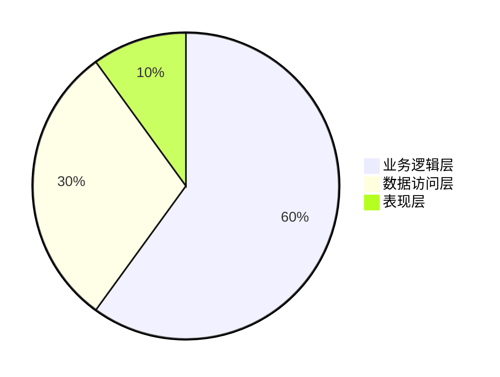
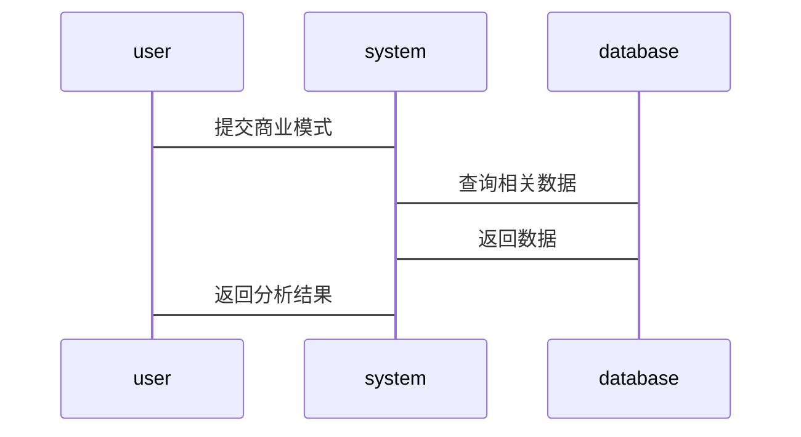

                 


# 芒格的"反向工程"思维在颠覆性商业模式分析中的应用

> 关键词：反向工程思维，颠覆性商业模式，芒格思维模型，商业模式分析，商业创新

> 摘要：本文深入探讨了芒格的“反向工程”思维在分析颠覆性商业模式中的应用。通过详细分析反向工程思维的核心要素、算法与数学模型，以及在商业模式创新中的实际应用，结合芒格思维模型，展示了如何运用这种思维方式来解决复杂的商业问题，实现商业模式的创新与优化。

---

## 第一部分：反向工程思维的定义与背景

### 第1章：反向工程思维的定义与背景

#### 1.1 反向工程思维的定义
反向工程思维是一种从结果出发，逆向推导原因的思维方式。它强调通过分析最终结果，逐步追溯其背后的原因和逻辑，从而揭示事物的本质和规律。

- **反向工程思维的特点**：
  - 以结果为导向，从现象到本质。
  - 强调逻辑推理和因果关系。
  - 适用于复杂系统分析和问题解决。

- **芒格反向工程思维的核心理念**：
  - 通过分析结果，理解其背后的决策逻辑。
  - 强调知识的复利效应，积累跨领域的知识以辅助决策。

- **反向工程思维在商业分析中的应用价值**：
  - 帮助识别商业模式的核心要素。
  - 为商业创新提供新的视角和方法。

#### 1.2 商业模式分析的背景与挑战
商业模式是企业创造和传递价值的方式，而颠覆性商业模式则通过创新手段打破传统模式，创造新的价值。

- **颠覆性商业模式的特点**：
  - 打破传统行业规则。
  - 创造新的市场机会。
  - 基于技术创新或商业模式创新。

- **反向工程思维在商业模式分析中的作用**：
  - 揭示商业模式的成功或失败原因。
  - 提供优化和创新的方向。

#### 1.3 芒格思维模型在商业分析中的应用
芒格的思维模型强调系统性思考和跨领域知识的整合，为商业模式分析提供了独特的视角。

- **芒格思维模型的核心要素**：
  - 知识的复利效应：通过积累和整合知识，形成强大的决策框架。
  - 系统性思维：关注事物之间的联系和整体结构。
  - 谨慎的决策框架：基于逻辑和事实做出决策。

- **芒格投资原则对商业模式分析的启示**：
  - 逆向思维：寻找市场中的空白或被忽视的机会。
  - 风险控制：评估商业模式的可行性和风险。

### 1.4 本章小结
本章介绍了反向工程思维的定义、特点以及在商业模式分析中的应用价值，并结合芒格思维模型，阐述了其在商业创新中的重要性。

---

## 第二部分：反向工程思维的核心要素

### 第2章：反向工程思维的核心要素

#### 2.1 芒格思维模型的构成
芒格的思维模型由多个核心要素构成，包括知识的复利效应、系统性思维和谨慎的决策框架。

- **知识的复利效应**：
  - 通过不断积累和整合知识，形成强大的决策能力。
  - 跨领域知识的结合能够产生协同效应，帮助发现新的商业模式。

- **系统性思维**：
  - 强调事物之间的联系和整体结构。
  - 通过分析系统的各个部分，理解整个系统的运作机制。

- **谨慎的决策框架**：
  - 基于逻辑和事实做出决策。
  - 通过逆向思维寻找市场机会。

#### 2.2 反向工程思维的逻辑框架
反向工程思维的逻辑框架包括以下几个步骤：

1. **确定目标与范围**：明确分析的目标和范围，确保分析的焦点。
2. **分析结果与原因**：从结果出发，分析其背后的原因和逻辑。
3. **提出解决方案与策略**：基于分析结果，提出可行的解决方案和策略。

#### 2.3 反向工程思维在商业模式分析中的应用
反向工程思维在商业模式分析中的应用主要体现在以下几个方面：

- **商业模式的核心要素**：
  - 通过分析商业模式的核心要素，揭示其成功或失败的原因。
  - 例如，分析苹果公司的商业模式，可以发现其在产品设计、供应链管理和用户体验方面的优势。

- **颠覆性商业模式的特征**：
  - 通过反向工程思维，分析颠覆性商业模式的特征，如技术创新、市场定位和客户价值创造。
  - 例如，分析特斯拉的商业模式，可以发现其在电动汽车领域的创新和市场定位策略。

#### 2.4 本章小结
本章详细阐述了反向工程思维的核心要素，包括芒格思维模型的构成、反向工程思维的逻辑框架以及其在商业模式分析中的应用。

---

## 第三部分：反向工程思维在商业模式分析中的应用

### 第3章：反向工程思维在商业模式分析中的应用

#### 3.1 颠覆性商业模式的特征
颠覆性商业模式通常具有以下特征：

- **技术创新**：通过技术创新打破传统行业的技术壁垒。
- **市场定位**：通过差异化定位，吸引特定客户群体。
- **客户价值**：通过提供独特的客户价值，创造新的市场机会。

#### 3.2 反向工程思维在商业模式分析中的步骤
反向工程思维在商业模式分析中的步骤如下：

1. **确定目标与范围**：明确分析的目标和范围。
2. **分析结果与原因**：从结果出发，分析其背后的原因和逻辑。
3. **提出解决方案与策略**：基于分析结果，提出可行的解决方案和策略。

#### 3.3 芒格思维模型在商业模式创新中的应用
芒格思维模型在商业模式创新中的应用主要体现在以下几个方面：

- **知识的复利效应**：
  - 通过积累和整合知识，形成强大的决策能力。
  - 例如，通过整合技术、市场和客户知识，发现新的商业模式机会。

- **系统性思维**：
  - 强调事物之间的联系和整体结构。
  - 例如，通过分析整个产业链的运作机制，发现新的商业模式。

- **谨慎的决策框架**：
  - 基于逻辑和事实做出决策。
  - 例如，通过分析市场趋势和客户需求，制定可行的商业模式。

#### 3.4 本章小结
本章详细阐述了反向工程思维在商业模式分析中的应用，包括颠覆性商业模式的特征、反向工程思维在商业模式分析中的步骤以及芒格思维模型在商业模式创新中的应用。

---

## 第四部分：反向工程思维的算法与数学模型

### 第4章：反向工程思维的算法与数学模型

#### 4.1 反向工程思维的算法原理
反向工程思维的算法原理如下：

1. **输入**：目标和范围。
2. **输出**：解决方案和策略。
3. **步骤**：
   1. 从结果出发，分析其背后的原因和逻辑。
   2. 通过逻辑推理和因果关系，提出可行的解决方案和策略。

#### 4.2 反向工程思维的数学模型
反向工程思维的数学模型可以通过以下公式表示：

$$
\text{解决方案} = f(\text{结果}, \text{原因}, \text{逻辑})
$$

其中，$f$ 表示逻辑推理和因果关系的函数。

#### 4.3 算法实现
以下是反向工程思维算法的实现代码：

```python
def reverse_engineering(result, scope):
    reasons = analyze_result(result)
    causes = identify_causes(reasons)
    solution = derive_solution(causes, scope)
    return solution

def analyze_result(result):
    # 分析结果，返回原因列表
    pass

def identify_causes(reasons):
    # 识别原因，返回因果关系
    pass

def derive_solution(causes, scope):
    # 根据因果关系和范围，推导解决方案
    pass
```

---

## 第五部分：系统分析与架构设计方案

### 第5章：系统分析与架构设计方案

#### 5.1 系统功能设计
- **领域模型**：通过Mermaid类图描述商业模式的核心要素。
- **系统架构设计**：通过Mermaid架构图展示系统的整体结构。
- **系统接口设计**：定义系统之间的接口和交互。
- **系统交互设计**：通过Mermaid序列图展示系统的交互过程。

#### 5.2 系统架构设计
以下是系统架构设计的Mermaid图：



#### 5.3 系统接口设计
系统接口设计如下：

- **输入接口**：接收商业模式的输入数据。
- **输出接口**：返回分析结果和解决方案。

#### 5.4 系统交互设计
以下是系统交互的Mermaid序列图：



---

## 第六部分：项目实战

### 第6章：项目实战

#### 6.1 环境安装
- **工具安装**：安装Mermaid和Python开发环境。
- **依赖管理**：安装所需的第三方库。

#### 6.2 系统核心实现源代码
以下是核心实现的Python代码：

```python
class BusinessModelAnalyzer:
    def __init__(self, data):
        self.data = data

    def analyze(self):
        # 分析商业模式的核心要素
        pass

    def derive_solution(self):
        # 推导解决方案
        pass
```

#### 6.3 代码应用解读与分析
- **代码功能**：分析商业模式的核心要素，推导解决方案。
- **代码结构**：类BusinessModelAnalyzer负责数据分析和解决方案推导。

#### 6.4 实际案例分析
以某公司的商业模式为例，分析其成功或失败的原因，并提出解决方案。

#### 6.5 项目小结
总结项目的主要成果和经验教训。

---

## 第七部分：最佳实践与小结

### 第7章：最佳实践与小结

#### 7.1 最佳实践 tips
- **持续学习**：不断积累知识，提升分析能力。
- **系统性思考**：关注事物之间的联系和整体结构。
- **谨慎决策**：基于逻辑和事实做出决策。

#### 7.2 小结
本章总结了反向工程思维在商业模式分析中的应用，强调了系统性思考和谨慎决策的重要性，并提出了最佳实践的建议。

---

## 作者信息

作者：AI天才研究院/AI Genius Institute & 禅与计算机程序设计艺术/Zen And The Art of Computer Programming

---

通过以上结构和内容，我们可以系统地探讨芒格的反向工程思维在颠覆性商业模式分析中的应用，结合实际案例和算法模型，为读者提供深刻的见解和实用的指导。

