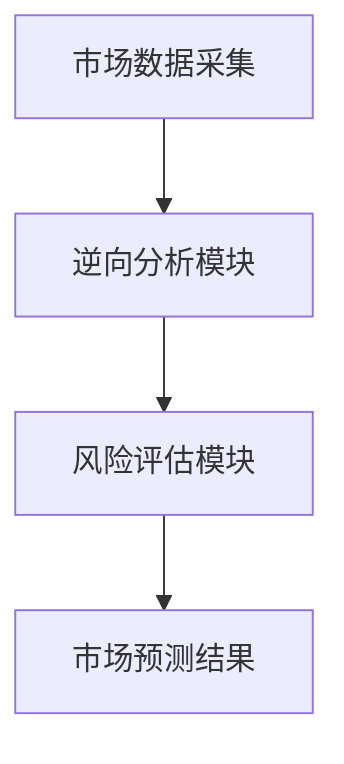

                 


# 芮格的"反向思考"在市场分析中的应用：避免从众误区

---

## 关键词：
芒格、反向思考、市场分析、从众误区、投资策略、风险管理、系统设计

---

## 摘要：
本文深入探讨了芒格提出的“反向思考”方法在市场分析中的应用，重点分析了如何通过逆向思维避免从众误区，从而在市场中找到潜在的投资机会。文章结合市场分析的理论与实践，详细阐述了反向思考的逻辑、方法及其在实际投资中的应用价值。通过具体案例分析和系统设计，本文为读者提供了一套基于反向思考的市场分析框架，帮助投资者在复杂多变的市场环境中做出更明智的决策。

---

## 第1章: 芮格的生平与思想体系

### 1.1 芮格的早年经历与职业背景
查理·芒格（Charlie Munger）是美国著名投资者、伯克希尔哈撒韦公司副董事长，被誉为“价值投资的第二人”。芒格的职业生涯始于法律领域，但他对投资的兴趣源于对经济学和心理学的深刻理解。他的投资理念强调理性思考、长期价值和逆向思维。

### 1.2 "反向思考"的核心概念
芒格提出的“反向思考”是一种与传统思维方式截然不同的方法，它强调从相反的角度出发，寻找市场的空白点和潜在机会。反向思考的核心在于避免从众心理，通过逆向分析找到市场的真正价值。

---

## 第2章: "反向思考"的逻辑与方法

### 2.1 "反向思考"的逻辑框架
反向思考的逻辑框架包括以下几个步骤：
1. **识别市场误区**：分析市场中普遍存在的错误认知和误区。
2. **寻找市场的空白点**：通过逆向分析，发现市场中被忽视的机会。
3. **预测市场趋势的反转点**：通过反向思维，预判市场的变化趋势。

### 2.2 "反向思考"的具体方法
- **逆向分析法**：从市场的结果出发，反推可能的市场行为。
- **对偶分析法**：通过对比市场的正向和反向情况，寻找潜在机会。
- **情景反演法**：设想极端情况，分析其对市场的影响。

---

## 第3章: "反向思考"与市场分析的结合

### 3.1 市场分析的基本原理
市场分析的核心在于理解市场的供需关系、竞争格局和潜在趋势。传统市场分析通常从正向角度出发，而反向思考则强调从市场的对立面寻找机会。

### 3.2 "反向思考"在市场分析中的应用
- **从市场误区出发**：识别市场中普遍存在的错误认知。
- **寻找市场空白点**：发现市场中被忽视的机会。
- **识别市场趋势的反转点**：通过反向思维预判市场的变化。

---

## 第4章: "反向思考"的数学模型与算法原理

### 4.1 逆向分析的数学模型
反向思考可以通过以下数学模型进行建模：
$$
P_{\text{目标}} = \frac{1}{P_{\text{当前}}}
$$
其中，$P_{\text{目标}}$ 是目标市场的价值，$P_{\text{当前}}$ 是当前市场的价值。

### 4.2 逆向分析的算法原理
1. **输入**：市场当前的供需数据。
2. **计算**：通过逆向思维模型，预测市场的潜在反转点。
3. **输出**：目标市场的潜在价值。

---

## 第5章: 系统设计与架构

### 5.1 系统功能设计
- **市场数据采集模块**：收集市场供需数据。
- **逆向分析模块**：应用反向思维模型进行分析。
- **风险评估模块**：评估市场的潜在风险。

### 5.2 系统架构设计


---

## 第6章: 项目实战与案例分析

### 6.1 项目环境搭建
- **工具选择**：使用Python和相关数据分析库（如Pandas、NumPy）。
- **数据来源**：获取市场供需数据。

### 6.2 核心实现代码
```python
def reverse_analysis(current_price):
    target_price = 1 / current_price
    return target_price
```

### 6.3 案例分析
假设当前市场价格为 $50，通过反向分析模型计算出目标价格为 $0.20。这表明市场存在潜在的反转机会。

---

## 第7章: 总结与展望

### 7.1 总结
本文通过芒格的“反向思考”方法，深入分析了市场分析中的应用价值。反向思考不仅是一种思维方式，更是一种系统的分析工具，能够帮助投资者在市场中找到潜在机会。

### 7.2 展望
未来，反向思考的应用将更加广泛，尤其是在人工智能和大数据时代，如何将反向思考与现代技术结合，将是市场分析领域的重要研究方向。

---

## 作者：AI天才研究院/AI Genius Institute  
“禅与计算机程序设计艺术 / Zen And The Art of Computer Programming”

