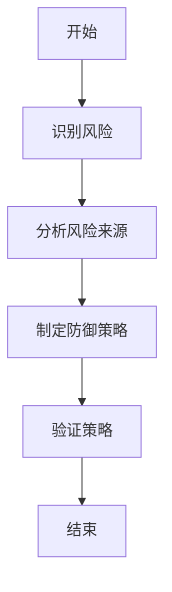
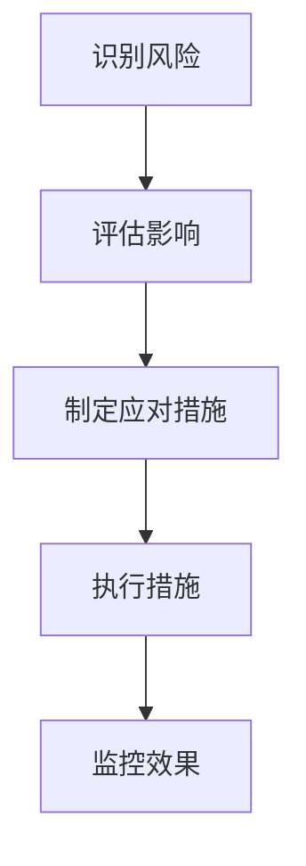
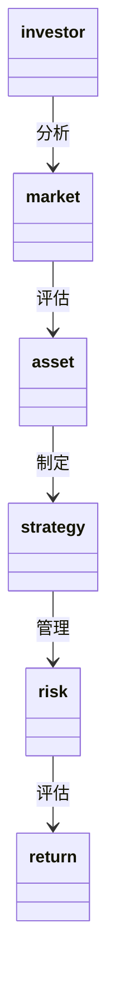
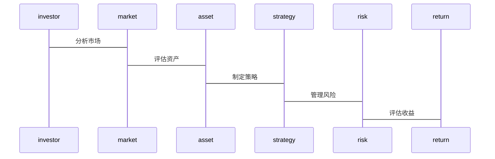

                 


# 芒格的"反向思考"：如何避免投资陷阱

## 关键词：芒格、反向思考、投资陷阱、投资策略、风险管理、价值评估

## 摘要：反向思考是一种通过逆向思维来避免投资陷阱的方法，本文将深入探讨芒格的反向思考理论，分析其在投资决策中的应用，结合系统架构和实际案例，提供如何避免投资陷阱的策略和最佳实践。

---

## 第一章: 芒格的反向思考概述

### 1.1 反向思考的定义与特点

反向思考是一种从对立面出发的思维方式，通过分析问题的反面来寻找解决方案。芒格的反向思考强调在投资决策中，先识别潜在的风险和问题，再制定应对策略。其特点包括：

1. **逆向思维**：从反面思考问题，避免正面思考的常见陷阱。
2. **防御性策略**：通过识别风险点，构建防御性投资组合。
3. **长期视角**：关注长期价值，而非短期波动。

### 1.2 芒格反向思考的背景与重要性

芒格作为投资大师，提出反向思考是为了避免投资者在面对市场波动时的盲目行为。传统投资方法往往关注市场趋势和机会，而反向思考则强调识别潜在风险，避免过度乐观或悲观的影响。

---

## 第二章: 芒格的决策框架

### 2.1 决策框架的核心要素

芒格的决策框架基于以下几个核心要素：

1. **逻辑流程**：从识别风险、分析风险来源到制定防御策略。
2. **机会成本**：评估每项投资的潜在机会成本，避免资源浪费。
3. **长期价值**：关注企业的长期价值，而非短期收益。

### 2.2 决策框架的数学模型

#### 机会成本计算公式：
$$
\text{机会成本} = \sum (\text{潜在收益} - \text{实际收益})
$$

#### 长期价值评估模型：
$$
\text{长期价值} = \sum_{t=1}^{n} \frac{\text{现金流}_t}{(1 + r)^t}
$$

其中，\( r \) 是折现率，\( t \) 是时间。

### 2.3 决策框架的流程图



---

## 第三章: 反向思考的逻辑体系

### 3.1 从结果反推原因

反向思考的一个重要技巧是从结果出发，推导出原因。例如，如果一家公司业绩持续下滑，可以通过分析市场需求、管理问题等反向推导出潜在风险。

### 3.2 识别潜在风险点

#### 风险识别矩阵

| 风险类型 | 市场风险 | 财务风险 | 管理风险 | 技术风险 |
|----------|----------|----------|----------|----------|
| 影响程度 | 高       | 中       | 低       | 高       |

### 3.3 制定防御策略

#### 防御策略框架



---

## 第四章: 系统分析与架构设计

### 4.1 投资决策的系统模型

#### 系统架构图



### 4.2 系统接口与交互设计

#### 交互序列图



---

## 第五章: 项目实战

### 5.1 环境安装与数据准备

#### 工具安装
- 数据分析工具：Python、Pandas、NumPy
- 图形绘制工具：Matplotlib、Mermaid

#### 数据准备
- 历史市场数据
- 财务报表
- 行业分析报告

### 5.2 核心实现与代码解读

#### 代码示例：反向思考框架

```python
def reverse_thinking_analysis(data):
    # 识别潜在风险
    risks = identify_risks(data)
    # 分析风险来源
    risk_sources = analyze_sources(risks)
    # 制定防御策略
    defense_strategy = create_defense(risk_sources)
    return defense_strategy

def identify_risks(data):
    # 具体实现：从数据中识别风险
    pass

def analyze_sources(risks):
    # 具体实现：分析风险来源
    pass

def create_defense(risk_sources):
    # 具体实现：制定防御策略
    pass
```

### 5.3 实际案例分析

#### 案例：科技公司投资陷阱

某科技公司面临技术风险和管理风险，通过反向思考识别潜在风险，制定防御策略，避免投资陷阱。

---

## 第六章: 最佳实践与小结

### 6.1 最佳实践

1. **系统性思考**：将反向思考融入系统分析，构建全面的风险管理体系。
2. **数据驱动决策**：利用数据分析工具和模型，辅助投资决策。
3. **持续学习**：不断更新知识和经验，适应市场变化。

### 6.2 小结

芒格的反向思考是一种强大的投资工具，通过识别潜在风险和制定防御策略，帮助投资者避免投资陷阱。结合系统分析和实际案例，反向思考的应用更加具体和有效。

### 6.3 注意事项

- 避免过度依赖反向思考，结合多种方法进行综合判断。
- 定期评估和调整防御策略，适应市场变化。

### 6.4 拓展阅读

建议阅读芒格的《穷查理宝典》和《投资的艺术》等书籍，深入了解反向思考的更多应用。

---

## 作者：AI天才研究院/AI Genius Institute & 禅与计算机程序设计艺术 /Zen And The Art of Computer Programming

---

通过本文的系统分析和实际案例，读者可以深入理解芒格的反向思考方法，并将其应用于实际投资中，避免常见的投资陷阱，实现稳健的投资收益。

