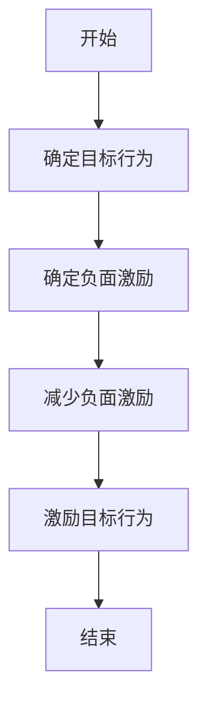
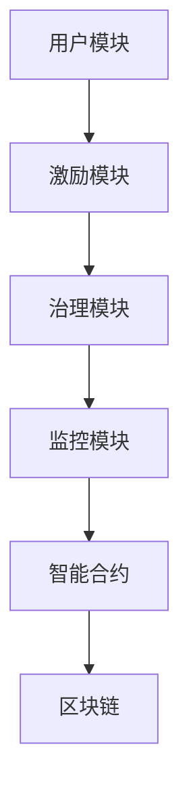

                 


# 芒格的"反向激励"分析在去中心化自治组织(DAO)中的应用

---

## 关键词：反向激励、去中心化自治组织、DAO、激励机制、治理模式

---

## 摘要：本文通过分析芒格的"反向激励"理论，探讨其在去中心化自治组织(DAO)中的应用。结合理论与实践，本文详细阐述了反向激励的原理、DAO的组织结构、两者的关联性，以及在实际中的应用场景。通过数学模型、算法流程图和系统架构图的分析，本文为读者提供了从理论到实践的完整解决方案。

---

## 第一部分：背景介绍

### 第1章：芒格的反向激励理论概述

#### 1.1 芒格的反向激励理论
反向激励是一种通过减少负面激励来达到激励效果的理论。与传统激励理论不同，反向激励强调通过降低惩罚或负面刺激来促进个体或组织的行为改变。其核心在于通过减少不期望的行为来间接激励目标行为的发生。

- **理论背景**：反向激励理论源于行为心理学，强调通过减少负面刺激来增加目标行为。
- **核心概念**：反向激励通过降低惩罚或负面刺激，间接激励目标行为。
- **与传统激励的对比**：
  - 传统激励：通过增加正向刺激（如奖励）来激励行为。
  - 反向激励：通过减少负向刺激（如惩罚）来激励行为。

#### 1.2 去中心化自治组织(DAO)概述
DAO是一种基于区块链技术的去中心化组织形式，其特点是无中心化控制、透明性和自治性。

- **定义与特点**：
  - 去中心化：无单一控制中心，决策由社区成员共同参与。
  - 自治性：通过智能合约自动执行组织规则。
  - 透明性：所有交易和决策记录在区块链上，可追溯且不可篡改。
- **起源与发展**：DAO起源于区块链社区，最早可追溯到2016年的The DAO事件，尽管该事件以失败告终，但推动了DAO概念的进一步发展。
- **组织结构与运作机制**：
  - 组织结构：基于区块链的去中心化结构，成员通过投票参与决策。
  - 运作机制：通过智能合约自动执行组织规则和激励机制。

---

### 第2章：反向激励与DAO的核心概念分析

#### 2.1 反向激励的原理与机制
反向激励的原理在于通过减少负面激励来促进目标行为的发生。其机制包括以下几个方面：

- **减少负面激励**：通过降低惩罚或负面刺激，减少不期望的行为。
- **激励目标行为**：通过减少负面激励，间接激励目标行为的发生。
- **激励强度**：反向激励的强度取决于负面激励的减少程度。

#### 2.2 DAO的组织结构与治理模式
DAO的组织结构和治理模式是其区别于传统组织的重要特征。

- **治理框架**：基于区块链的去中心化治理框架，成员通过投票参与决策。
- **决策机制**：通过智能合约实现自动化的决策执行。
- **激励与惩罚机制**：通过代币激励和惩罚机制，确保成员行为符合组织目标。

#### 2.3 反向激励与DAO的关联性分析
反向激励与DAO在多个方面具有较强的关联性。

- **反向激励的应用场景**：在DAO中，反向激励可以通过减少惩罚机制来激励成员积极参与组织活动。
- **反向激励对DAO治理的影响**：通过减少负面激励，可以降低成员的抵触情绪，提高组织的凝聚力。
- **反向激励与DAO目标的契合点**：DAO的目标是实现去中心化治理，反向激励通过减少负面激励，有助于实现这一目标。

---

## 第二部分：算法原理与数学模型

### 第3章：反向激励算法的数学模型与流程

#### 3.1 反向激励算法的数学模型
反向激励算法可以通过数学模型进行描述，具体如下：

- **核心公式**：$$激励 = 减少的负面激励 + 目标行为的奖励$$
- **激励函数**：$$I(x) = f(x) + g(x)$$，其中$f(x)$表示减少的负面激励，$g(x)$表示目标行为的奖励。
- **优化模型**：通过优化$f(x)$和$g(x)$，使得激励效果最大化。

#### 3.2 反向激励算法的流程图
以下是反向激励算法的流程图：



---

## 第三部分：系统分析与架构设计

### 第4章：基于反向激励的DAO系统分析

#### 4.1 系统功能需求分析
- **功能模块划分**：
  - 用户模块：成员身份验证与管理。
  - 激励模块：反向激励机制的实现。
  - 治理模块：DAO的治理框架与决策机制。
  - 监控模块：系统运行状态的监控与分析。
- **实现目标**：通过反向激励机制，提高成员参与度，实现DAO的自治目标。
- **边界与范围**：系统边界为DAO组织内部的治理与激励机制，不涉及外部市场的交互。

#### 4.2 系统架构设计
以下是系统的总体架构设计：



---

## 第四部分：项目实战与案例分析

### 第5章：反向激励在DAO中的实际应用

#### 5.1 项目环境与工具安装
- **开发环境**：推荐使用基于区块链的开发环境，如Ethereum、Solidity等。
- **开发工具**：安装区块链开发工具（如Geth、Remix）和智能合约编译工具。

#### 5.2 核心代码实现
以下是反向激励算法的核心代码实现（Solidity语言）：

```solidity
contract ReverseIncentive {
    function incentive(uint256 negativeIncentive, uint256 targetBehavior) public pure returns (uint256) {
        return negativeIncentive + targetBehavior;
    }
}
```

#### 5.3 项目案例分析
以一个简单的DAO为例，假设组织希望通过反向激励机制提高成员的参与度。具体步骤如下：

1. **确定目标行为**：目标行为为成员积极参与投票。
2. **确定负面激励**：设定惩罚机制，如不参与投票的成员将失去部分代币。
3. **减少负面激励**：通过激励机制，减少不参与投票的成员数量。
4. **激励目标行为**：通过奖励机制，鼓励成员积极参与投票。

---

## 第五部分：总结与展望

### 第6章：总结与展望

#### 6.1 最佳实践
- 在DAO中实施反向激励机制时，需结合组织目标和成员行为特点，设计合理的激励与惩罚机制。
- 确保系统的透明性和可扩展性，以便根据实际情况进行调整和优化。

#### 6.2 小结
通过本文的分析与实践，我们可以看出反向激励在DAO中的应用具有重要的现实意义。通过合理设计激励机制，可以有效提高成员的参与度，实现组织的自治目标。

#### 6.3 注意事项
- 系统设计需确保透明性和可扩展性。
- 在实施反向激励机制时，需结合组织目标和成员行为特点。

#### 6.4 拓展阅读
- 推荐阅读《去中心化自治组织：理论与实践》。
- 关注区块链领域的最新研究和应用。

---

## 作者：AI天才研究院/AI Genius Institute & 禅与计算机程序设计艺术 /Zen And The Art of Computer Programming

---

**感谢您的阅读！**

