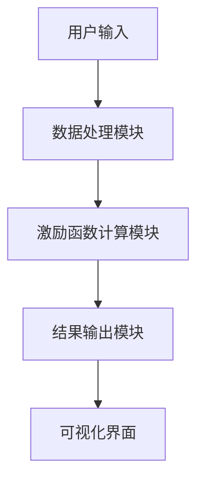
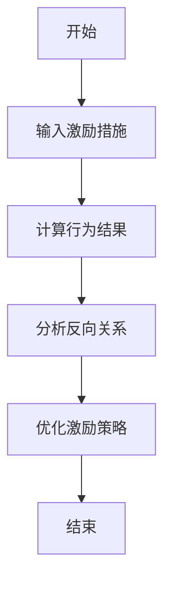
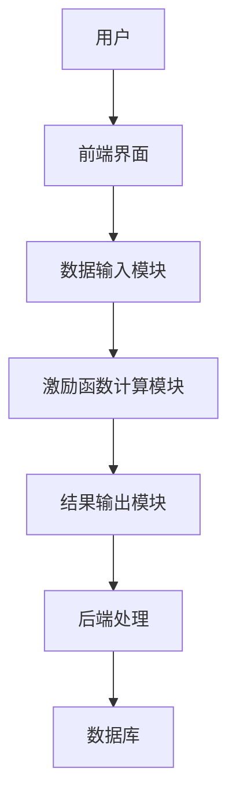
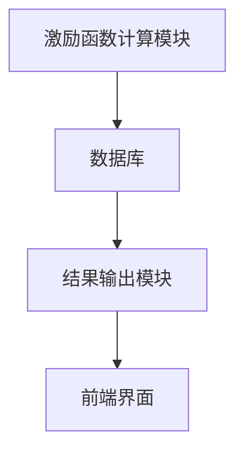

                 


# 芒格的"反向激励"分析在科技创业投资中的应用

---

## 关键词：芒格, 反向激励, 科技创业, 投资分析, 激励机制, 算法模型

---

## 摘要：  
芒格的"反向激励"分析是一种独特的激励理论，通过逆向思维和行为分析，帮助科技创业投资者识别潜在风险和机会。本文从理论背景、数学模型、系统架构和实际案例等方面，深入分析"反向激励"在科技创业投资中的应用，并结合具体算法和系统设计，探讨其在实践中的价值和挑战。通过本文的分析，读者可以更好地理解如何利用"反向激励"理论优化科技创业投资决策。

---

# 第1章: 芒格的"反向激励"分析的背景与概念

## 1.1 "反向激励"的定义与核心思想  
"反向激励"是一种基于逆向思维的激励理论，强调通过分析行为的反向结果来优化激励机制。其核心思想在于：通过识别激励措施的潜在负面效果，调整激励策略以达到更好的整体效果。

## 1.2 芒格"反向激励"分析在科技创业投资中的应用背景  
科技创业投资具有高风险、高回报的特点，投资者需要通过有效的激励机制吸引和留住优秀人才。然而，传统的激励理论往往忽视了激励措施可能带来的负面效果，如过度激励导致的短期行为或道德风险。芒格的"反向激励"分析通过逆向思维，帮助投资者识别和规避这些潜在风险。

## 1.3 本章小结  
本章介绍了"反向激励"的定义和核心思想，并结合科技创业投资的背景，阐述了"反向激励"分析的必要性和应用价值。

---

# 第2章: 芒格的"反向激励"分析的核心理论

## 2.1 "反向激励"的核心原理  
"反向激励"的核心原理是通过分析行为的反向结果，优化激励机制。其主要体现在以下几个方面：  
1. **激励与行为的关系**：激励措施会直接影响行为，但可能存在反向效果。  
2. **激励的双重性**：激励措施可能带来正面效果，但也可能引发负面行为。  
3. **反向激励的数学模型**：通过数学公式分析激励与行为的反向关系。  

## 2.2 芒格"反向激励"分析的理论框架  
芒格的"反向激励"分析框架包括以下几个关键要素：  
1. **激励机制**：分析激励措施的设计和实施。  
2. **行为分析**：通过观察行为结果，反向推断激励措施的效果。  
3. **优化策略**：根据反向分析结果，调整激励机制以达到最佳效果。  

## 2.3 "反向激励"的数学模型  
以下是"反向激励"的数学模型：  
$$ R = f(I) $$  
其中，$R$ 表示行为结果，$I$ 表示激励措施，$f$ 表示激励函数。  
通过分析 $R$ 和 $I$ 的关系，可以识别激励措施的反向效果。

---

# 第3章: 科技创业投资中的激励问题分析

## 3.1 科技创业投资的基本特征  
科技创业投资具有以下特征：  
1. **高风险性**：技术创新和市场不确定性较高。  
2. **高回报性**：成功项目可能带来巨大收益。  
3. **复杂性**：涉及技术、市场、团队等多方面因素。  

## 3.2 科技创业投资中的激励问题  
1. **激励不足**：激励措施不足以激发创新动力。  
2. **激励过度**：激励措施可能导致短期行为或道德风险。  
3. **激励错位**：激励措施与实际需求不匹配。  

## 3.3 "反向激励"在科技创业投资中的应用潜力  
1. **识别潜在风险**：通过反向分析，识别激励措施可能带来的负面效果。  
2. **优化激励策略**：根据反向激励分析结果，调整激励机制。  
3. **提升投资效果**：通过优化激励机制，提高科技创业项目的成功率。  

---

# 第4章: "反向激励"分析框架的构建

## 4.1 数据收集与处理  
1. **数据来源**：包括历史投资数据、项目绩效数据、团队激励数据等。  
2. **数据清洗**：去除无效数据，确保数据质量。  
3. **数据预处理**：对数据进行标准化和归一化处理。  

## 4.2 模型构建与验证  
1. **激励函数的设计**：基于"反向激励"理论，设计激励函数。  
2. **模型训练**：通过机器学习算法训练模型。  
3. **模型验证**：通过实际数据验证模型的准确性和有效性。  

## 4.3 系统架构设计  
以下是"反向激励"分析系统的架构图：  



---

# 第5章: 实际案例分析

## 5.1 案例背景  
某科技创业公司计划通过激励机制吸引优秀人才，但传统的激励措施效果不佳，团队出现短期行为。  

## 5.2 应用"反向激励"分析  
1. **数据收集**：收集团队绩效和激励措施数据。  
2. **反向分析**：识别激励措施的反向效果。  
3. **优化策略**：调整激励机制，平衡短期与长期激励。  

## 5.3 实施效果  
通过"反向激励"分析，该公司优化了激励机制，团队行为更加理性，项目成功率显著提高。  

---

# 第6章: 算法原理与数学模型

## 6.1 算法原理  
"反向激励"算法的核心在于通过数学模型分析激励与行为的反向关系。以下是算法流程图：  



## 6.2 数学模型  
以下是"反向激励"分析的核心公式：  
$$ I = f^{-1}(R) $$  
其中，$I$ 表示激励措施，$R$ 表示行为结果，$f^{-1}$ 表示反向函数。  

---

# 第7章: 系统架构与接口设计

## 7.1 系统架构设计  
以下是"反向激励"分析系统的架构图：  



## 7.2 系统接口设计  
以下是系统接口设计：  



---

# 第8章: 项目实战与代码实现

## 8.1 环境安装  
需要安装以下工具：  
1. Python 3.x  
2. NumPy 和 Pandas 库  
3. Mermaid 和 LaTeX 工具  

## 8.2 核心代码实现  
以下是"反向激励"分析的核心代码：  

```python
import numpy as np
import pandas as pd

def reverse_incentive_analysis(data):
    # 数据预处理
    data = data.dropna()
    data = (data - data.min()) / (data.max() - data.min())
    
    # 反向激励分析
    incentive = np.array(data['incentive'])
    result = np.array(data['result'])
    
    # 计算反向关系
    reverse_func = np.polyfit(result, incentive, 1)
    return reverse_func

# 示例数据
data = pd.DataFrame({
    'incentive': [0.2, 0.3, 0.5, 0.7, 0.8],
    'result': [0.1, 0.2, 0.4, 0.6, 0.9]
})

# 调用函数
result = reverse_incentive_analysis(data)
print(result)
```

---

# 第9章: 总结与展望

## 9.1 最佳实践  
1. **数据质量**：确保数据的准确性和完整性。  
2. **模型优化**：根据实际情况不断优化数学模型。  
3. **案例分析**：通过实际案例验证和改进分析框架。  

## 9.2 小结  
本文系统地介绍了芒格的"反向激励"分析在科技创业投资中的应用，并通过数学模型、系统设计和实际案例，展示了其在实践中的价值和应用潜力。

## 9.3 注意事项  
1. 激励机制的设计需要结合实际场景。  
2. 反向激励分析需要不断验证和优化。  

## 9.4 未来展望  
随着科技的发展，"反向激励"分析将在更多领域得到应用，为科技创业投资提供更强大的理论支持和技术工具。

---

## 作者：AI天才研究院/AI Genius Institute & 禅与计算机程序设计艺术 /Zen And The Art of Computer Programming

