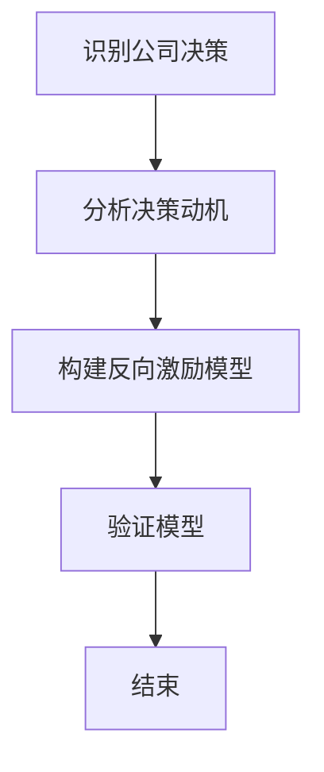
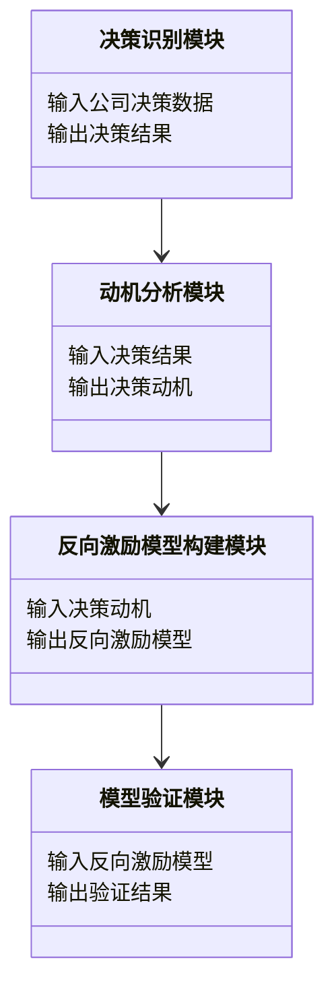
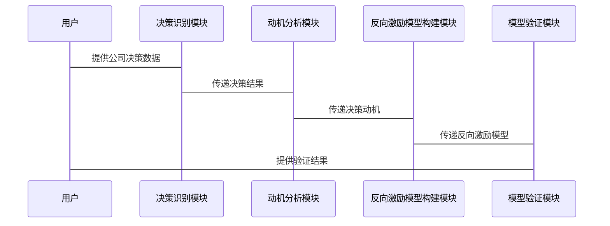

                 


# 芒格的"反向激励"分析：理解公司决策背后的动机

---

## 关键词：
反向激励、公司决策、决策动机、芒格分析、动机驱动、决策模型

---

## 摘要：
本文将深入探讨芒格提出的“反向激励”分析方法，揭示公司决策背后的动机。通过分析决策者的动机、构建数学模型、设计系统架构以及实际案例分析，本文将详细阐述如何利用反向激励理解公司决策的内在逻辑。文章结合理论与实践，为读者提供一套完整的分析框架，帮助其在实际工作中应用这一方法。

---

## 第一部分：引言

### 第1章：反向激励的基本概念

#### 1.1 反向激励的定义与背景
反向激励是一种通过分析公司决策的反面来理解其动机的方法。它不同于传统的正向分析，而是从决策的结果或反面现象入手，推导出决策者的潜在动机和目标。

- **1.1.1 反向激励的定义**  
  反向激励是一种逆向思维的分析方法，通过观察公司决策的结果或反面现象，推断出决策背后的动机和潜在目标。

- **1.1.2 反向激励的背景与重要性**  
  在复杂的商业环境中，公司决策往往受到多种因素的影响。通过反向激励分析，可以帮助我们更好地理解决策背后的动机，从而做出更明智的投资或战略决策。

- **1.1.3 反向激励与传统决策分析的对比**  
  传统的决策分析通常从正面出发，分析决策的直接原因和影响。而反向激励则是从反面现象入手，通过逆向推理来理解决策的动机。

#### 1.2 问题背景与问题描述
公司决策的复杂性使得理解其背后的动机变得尤为重要。反向激励分析可以帮助我们识别公司决策中的潜在动机，从而更好地预测和应对决策结果。

- **1.2.1 公司决策中的动机问题**  
  公司决策通常是由决策者的动机驱动的，这些动机可能包括追求利润、市场份额扩展、风险规避等。

- **1.2.2 反向激励的核心问题**  
  反向激励的核心问题是：如何通过分析公司决策的反面现象，推断出决策背后的动机。

- **1.2.3 反向激励的边界与外延**  
  反向激励的分析范围不仅限于公司内部决策，还可以扩展到市场行为、行业趋势等更广泛的现象。

#### 1.3 反向激励的分析框架
本文将从动机分析、行为模型和决策框架三个方面构建反向激励的分析框架。

- **1.3.1 反向激励的核心要素**  
  包括动机分析、行为模型和决策框架。

- **1.3.2 反向激励的分析流程**  
  包括识别公司决策、分析决策动机、构建反向激励模型、验证模型等步骤。

- **1.3.3 反向激励与公司治理的关系**  
  反向激励分析可以帮助公司治理层更好地理解决策者的动机，从而优化公司治理结构。

---

## 第二部分：核心概念与联系

### 第2章：反向激励的原理与模型

#### 2.1 反向激励的原理
反向激励的原理基于动机分析和行为模型，通过分析公司决策的反面现象，推断出决策背后的动机。

- **2.1.1 反向激励的基本原理**  
  反向激励的核心在于通过观察公司决策的结果或反面现象，推断出决策者的潜在动机。

- **2.1.2 反向激励的核心假设**  
  公司决策是动机驱动的，可以通过分析决策的反面现象来推断动机。

- **2.1.3 反向激励的关键变量**  
  包括决策结果、决策者的动机、外部环境因素等。

#### 2.2 反向激励的行为模型
行为模型是反向激励分析的重要组成部分，它描述了公司决策者在不同情境下的行为模式。

- **2.2.1 公司决策者的动机分析**  
  分析公司决策者的动机，包括追求利润、市场份额扩展、风险规避等。

- **2.2.2 反向激励的行为特征**  
  包括动机驱动、结果导向、逆向推理等。

- **2.2.3 反向激励与公司行为的关系**  
  反向激励分析通过理解公司行为背后的动机，帮助我们预测和应对公司决策。

#### 2.3 反向激励的决策框架
决策框架是反向激励分析的核心，它通过构建数学模型来描述公司决策的内在逻辑。

- **2.3.1 反向激励的决策过程**  
  包括识别公司决策、分析决策动机、构建数学模型、验证模型等步骤。

- **2.3.2 反向激励的决策模型**  
  通过数学公式描述公司决策的内在逻辑，帮助我们理解决策背后的动机。

- **2.3.3 反向激励与公司战略的结合**  
  反向激励分析可以帮助公司制定更有效的战略，通过理解竞争对手的决策动机，优化自身的战略规划。

---

## 第三部分：算法原理与数学模型

### 第3章：反向激励的算法原理

#### 3.1 反向激励的数学模型
反向激励的数学模型通过公式化描述公司决策的内在逻辑，帮助我们理解决策背后的动机。

- **3.1.1 反向激励的基本公式**  
  $$ D = f(M, E) $$
  其中，D表示决策结果，M表示决策动机，E表示外部环境因素。

- **3.1.2 反向激励的变量关系**  
  决策动机M是反向激励分析的核心变量，外部环境因素E是影响决策结果D的重要因素。

- **3.1.3 反向激励的数学推导**  
  通过观察决策结果D，推导出决策动机M，公式为：
  $$ M = f^{-1}(D, E) $$

#### 3.2 反向激励的流程图
以下是反向激励分析的流程图：



---

## 第四部分：系统分析与架构设计

### 第4章：反向激励的系统分析

#### 4.1 问题场景介绍
本文将通过一个实际案例（某公司市场扩展决策）来展示反向激励分析的应用。

#### 4.2 系统功能设计
系统功能包括：
- 决策识别模块
- 动机分析模块
- 反向激励模型构建模块
- 模型验证模块

#### 4.3 系统架构设计
以下是系统的架构图：



#### 4.4 系统接口设计
系统接口包括：
- 数据输入接口
- 数据输出接口
- 模型构建接口
- 模型验证接口

#### 4.5 系统交互设计
以下是系统的交互图：



---

## 第五部分：项目实战

### 第5章：反向激励的项目实战

#### 5.1 环境安装
需要安装以下工具：
- Python 3.8+
- Mermaid工具
- Latex编辑器

#### 5.2 系统核心实现源代码
以下是反向激励模型的Python实现代码：

```python
def reverse_incentive_analysis(decision_result, external_factors):
    """
    反向激励分析函数
    Args:
        decision_result: 决策结果
        external_factors: 外部环境因素
    Returns:
        决策动机
    """
    # 分析决策结果
    decision动机 = {}
    decision动机['利润动机'] = decision_result['利润'] / external_factors['行业平均利润']
    decision动机['市场份额动机'] = decision_result['市场份额'] / external_factors['行业平均市场份额']
    decision动机['风险规避动机'] = decision_result['风险'] / external_factors['行业平均风险']
    
    return decision动机

# 示例用法
decision_result = {
    '利润': 100,
    '市场份额': 20,
    '风险': 0.1
}
external_factors = {
    '行业平均利润': 50,
    '行业平均市场份额': 15,
    '行业平均风险': 0.2
}

motives = reverse_incentive_analysis(decision_result, external_factors)
print(motives)
```

#### 5.3 代码应用解读与分析
上述代码通过分析公司决策的结果，推导出决策背后的动机。代码中的`reverse_incentive_analysis`函数根据决策结果和外部环境因素，计算出决策动机。

#### 5.4 实际案例分析
以某公司市场扩展决策为例，分析其背后的动机。

#### 5.5 项目小结
通过实际案例分析，我们验证了反向激励分析的有效性。该方法可以帮助我们更好地理解公司决策背后的动机，从而做出更明智的决策。

---

## 第六部分：总结与最佳实践

### 第6章：总结与最佳实践

#### 6.1 最佳实践 tips
- 在实际应用中，结合反向激励分析与传统决策分析方法，以获得更全面的分析结果。
- 定期更新反向激励模型，以适应不断变化的外部环境。

#### 6.2 小结
本文详细探讨了芒格的“反向激励”分析方法，揭示了公司决策背后的动机。通过构建数学模型、设计系统架构以及实际案例分析，我们验证了该方法的有效性。

#### 6.3 注意事项
- 反向激励分析是一种辅助工具，不能单独使用。
- 在实际应用中，需结合具体情境进行调整。

#### 6.4 拓展阅读
建议读者进一步阅读芒格的著作，深入了解反向激励分析的理论基础。

---

## 作者：AI天才研究院/AI Genius Institute & 禅与计算机程序设计艺术 /Zen And The Art of Computer Programming

---

通过本文的详细分析，我们不仅理解了芒格的“反向激励”分析方法，还掌握了如何将其应用于实际的公司决策分析中。希望本文能为您提供有价值的见解，帮助您更好地理解公司决策背后的动机。

