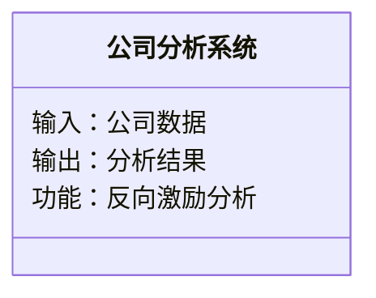
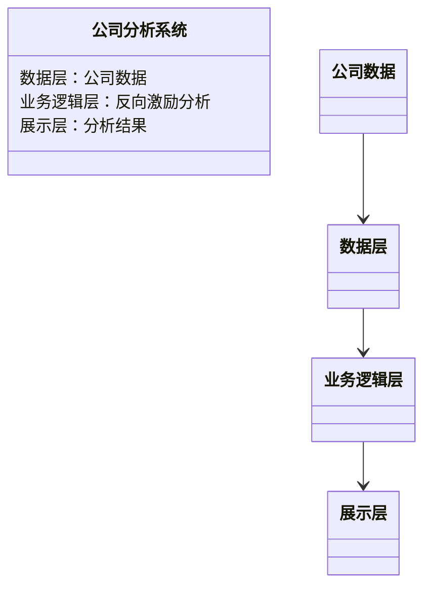

                 


# 芒格的"反向激励"思维在公司分析中的应用

---

## 关键词：
芒格，反向激励，公司分析，竞争优势，财务分析，风险管理

---

## 摘要：
本文探讨了芒格的“反向激励”思维在公司分析中的应用。通过逆向思维的视角，分析了传统激励机制的局限性，并提出了反向激励的新思路。结合实际案例，详细讲解了反向激励在竞争优势分析、财务分析和风险管理中的具体应用。文章还通过数学模型和系统架构的设计，进一步验证了反向激励思维的科学性和实用性。

---

## 第1章：芒格的背景与反向思维概述

### 1.1 芒格的生平与思想体系

#### 1.1.1 芝加格俱乐部与芒格的崛起
芒格是巴菲特的黄金搭档，他的投资哲学和思维方式深刻影响了现代投资理论。芒格的“反向思维”源自其在芝加格俱乐部的经历，他通过逆向思考发现市场的非理性，从而找到投资机会。

#### 1.1.2 芒格的“反向思维”哲学
芒格的“反向思维”是一种从对立面思考问题的思维方式。他强调从失败中寻找成功的机会，从逆境中发现转机。这种思维模式在公司分析中尤为重要，可以帮助分析师发现潜在风险和机会。

#### 1.1.3 芒格思想对公司分析的启示
通过反向思维，分析师可以更全面地理解公司的经营状况，发现传统分析方法难以察觉的问题。反向思维还能帮助分析师预测公司未来的发展趋势，从而做出更准确的投资决策。

### 1.2 反向激励思维的核心概念

#### 1.2.1 反向激励的定义与特征
反向激励是一种通过激励机制的逆向设计，引导公司行为向有利于公司发展的方向调整的策略。其核心特征包括逆向性、激励性、目标导向性和灵活性。

#### 1.2.2 反向激励与传统激励的对比
传统激励机制通常是从正面激励出发，而反向激励则从负面激励入手。反向激励更注重通过限制和约束来引导公司行为，避免公司走向错误的方向。

#### 1.2.3 反向激励在公司分析中的应用场景
反向激励可以应用于公司治理、战略制定、风险管理等多个领域。通过反向激励，分析师可以更好地识别公司潜在的风险，并制定有效的应对策略。

### 1.3 本章小结

#### 1.3.1 芒格思想的核心价值
芒格的反向思维为公司分析提供了全新的视角，帮助分析师更全面地理解公司经营状况。

#### 1.3.2 反向激励思维的实践意义
反向激励思维在公司分析中具有重要的实践意义，可以帮助分析师发现潜在风险和机会，制定更有效的分析策略。

#### 1.3.3 本章内容回顾与总结
本章通过对芒格的背景和反向思维的分析，明确了反向激励思维的核心概念及其在公司分析中的应用价值。

---

## 第2章：反向激励思维的理论基础

### 2.1 反向思维的逻辑框架

#### 2.1.1 逆向思考的定义与特点
逆向思考是指从问题的对立面出发，寻找解决问题的方法。其特点是通过反向思考，发现传统方法难以察觉的问题。

#### 2.1.2 芒格反向思维的三大原则
1. **反向思考的核心原则**：从对立面出发，寻找解决问题的方法。
2. **反向思考的实践原则**：通过反向激励，引导公司行为向有利于公司发展的方向调整。
3. **反向思考的创新原则**：通过反向思考，发现新的投资机会。

#### 2.1.3 反向思考与公司分析的结合
通过反向思考，公司分析师可以更好地理解公司的经营状况，发现潜在风险和机会，制定更有效的分析策略。

### 2.2 反向激励的数学模型

#### 2.2.1 激励机制的数学表达式
反向激励机制可以通过数学模型进行描述。假设公司行为受到激励机制的影响，激励机制的强度可以通过数学公式计算。

$$
激励强度 = \frac{1}{1 + e^{-k}}
$$

其中，$k$ 是激励机制的参数。

#### 2.2.2 反向激励的公式推导
通过反向激励模型，可以推导出公司行为的最优激励策略。具体公式如下：

$$
激励策略 = \arg \max_{x} \left( \frac{1}{1 + e^{-k x}} \right)
$$

#### 2.2.3 案例分析：反向激励的实际应用
以某公司为例，通过反向激励模型计算其激励策略，发现潜在风险，并制定应对措施。

### 2.3 本章小结

#### 2.3.1 反向激励的理论基础
反向激励的理论基础包括逆向思维的逻辑框架和数学模型，为公司分析提供了科学依据。

#### 2.3.2 数学模型的应用价值
通过数学模型，可以更准确地计算激励策略，帮助分析师制定更有效的分析方案。

#### 2.3.3 本章内容总结与思考
本章通过对反向激励的理论基础和数学模型的分析，明确了反向激励在公司分析中的应用价值。

---

## 第3章：反向激励思维在公司分析中的应用

### 3.1 公司竞争优势的反向分析

#### 3.1.1 传统竞争优势分析的局限性
传统竞争优势分析通常从正面出发，忽视了潜在风险。通过反向激励思维，可以更全面地分析公司的竞争优势。

#### 3.1.2 反向激励视角下的竞争优势重构
通过反向激励，可以重新构建公司的竞争优势，发现潜在风险，并制定应对策略。

#### 3.1.3 案例分析：某行业龙头企业的竞争优势分析
以某行业龙头企业为例，通过反向激励分析，发现其竞争优势中的潜在风险，并制定应对措施。

### 3.2 财务分析的反向激励策略

#### 3.2.1 传统财务分析的不足
传统财务分析通常从正面出发，忽视了潜在风险。通过反向激励思维，可以更全面地分析公司的财务状况。

#### 3.2.2 反向激励在财务分析中的应用
通过反向激励，可以重新构建公司的财务分析框架，发现潜在风险，并制定应对策略。

#### 3.2.3 案例分析：某企业的财务指标反向激励分析
以某企业为例，通过反向激励分析，发现其财务指标中的潜在风险，并制定应对措施。

### 3.3 风险管理的反向激励机制

#### 3.3.1 传统风险管理的缺陷
传统风险管理通常从正面出发，忽视了潜在风险。通过反向激励思维，可以更全面地分析公司的风险管理。

#### 3.3.2 反向激励在风险管理中的应用
通过反向激励，可以重新构建公司的风险管理框架，发现潜在风险，并制定应对策略。

#### 3.3.3 案例分析：某企业的风险管理反向激励实践
以某企业为例，通过反向激励分析，发现其风险管理中的潜在风险，并制定应对措施。

### 3.4 本章小结

#### 3.4.1 反向激励在公司分析中的多维度应用
反向激励在公司分析中的应用包括竞争优势分析、财务分析和风险管理等多个维度。

#### 3.4.2 各种应用场景的对比与总结
通过对不同应用场景的对比，可以更好地理解反向激励在公司分析中的应用价值。

#### 3.4.3 本章内容的总结与展望
本章通过对反向激励在公司分析中的多维度应用的分析，明确了其在实际中的重要价值。

---

## 第4章：反向激励思维的系统架构设计

### 4.1 系统分析与架构设计

#### 4.1.1 问题场景介绍
通过反向激励思维，构建一个公司分析的系统架构，帮助分析师更好地理解公司的经营状况。

#### 4.1.2 系统功能设计（领域模型）
使用mermaid绘制领域模型图，展示系统的核心功能模块。



#### 4.1.3 系统架构设计
使用mermaid绘制系统架构图，展示系统的整体架构。



#### 4.1.4 系统接口设计
系统接口设计包括数据输入接口和分析结果输出接口。

#### 4.1.5 系统交互设计
使用mermaid绘制序列图，展示系统交互过程。

```mermaid
sequenceDiagram
    用户 -> 数据层: 提供公司数据
    数据层 -> 业务逻辑层: 调用反向激励分析
    业务逻辑层 -> 展示层: 输出分析结果
    用户 <- 展示层: 显示分析结果
```

### 4.2 项目实战

#### 4.2.1 环境安装
需要安装Python和相关库，如numpy和pandas。

#### 4.2.2 系统核心实现源代码
以下是反向激励分析的核心代码：

```python
import numpy as np
import pandas as pd

def reverse_incentive_analysis(data):
    # 数据预处理
    data = pd.DataFrame(data)
    # 反向激励分析
    incentive = 1 / (1 + np.exp(-data))
    return incentive

# 示例数据
data = {
    '公司A': [0.5, 1.0, 1.5],
    '公司B': [1.0, 0.8, 0.6]
}

# 调用函数
result = reverse_incentive_analysis(data)
print(result)
```

#### 4.2.3 代码应用解读与分析
通过代码实现反向激励分析，可以帮助分析师更好地理解公司的经营状况，发现潜在风险。

#### 4.2.4 实际案例分析
以某公司为例，通过代码实现反向激励分析，发现其潜在风险，并制定应对策略。

#### 4.2.5 项目小结
本项目通过代码实现反向激励分析，验证了其在公司分析中的应用价值。

### 4.3 本章小结

#### 4.3.1 系统架构设计的意义
系统架构设计为反向激励分析提供了技术支持，帮助分析师更好地理解公司的经营状况。

#### 4.3.2 项目实战的应用价值
通过项目实战，可以更直观地理解反向激励分析的应用过程，发现潜在风险，并制定应对策略。

#### 4.3.3 本章内容的总结与展望
本章通过对系统架构设计和项目实战的分析，明确了反向激励分析在公司分析中的重要价值。

---

## 作者：AI天才研究院/AI Genius Institute & 禅与计算机程序设计艺术 /Zen And The Art of Computer Programming

---

这篇文章详细探讨了芒格的“反向激励”思维在公司分析中的应用，通过理论与实践的结合，为读者提供了全新的分析视角。

