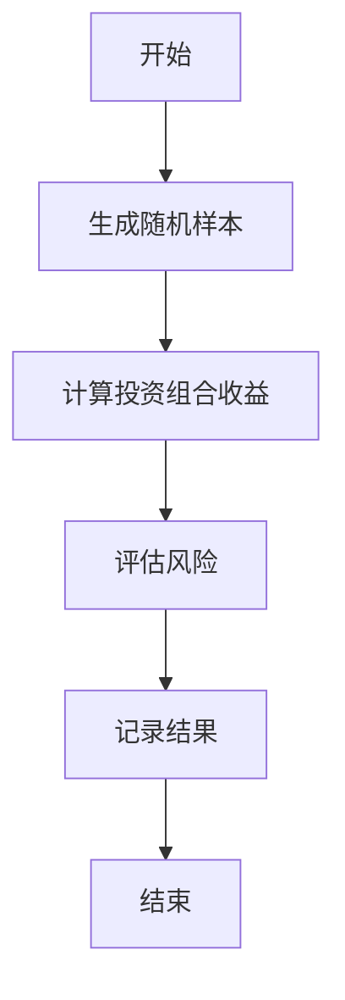
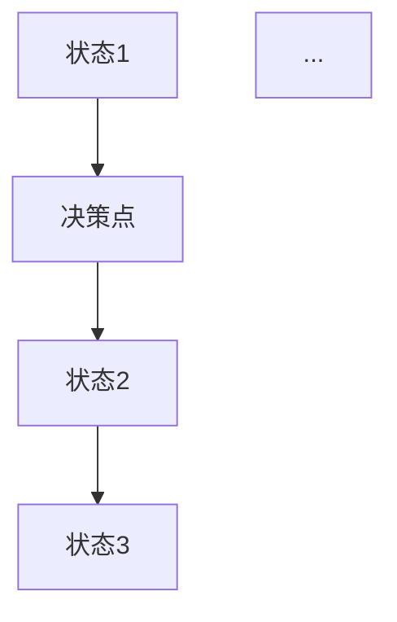
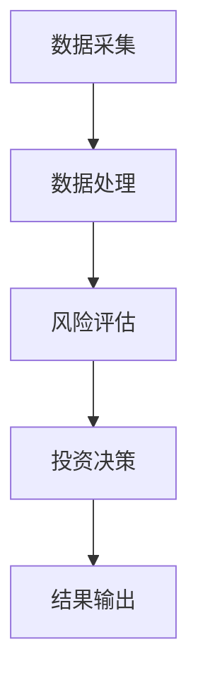

                 


# 芒格的"反脆弱"投资理念在后疫情经济中的应用

---

## 关键词：
- 芒格投资理念  
- 反脆弱理论  
- 后疫情经济  
- 数字经济  
- 投资组合优化  
- 系统架构设计  

---

## 摘要：
本文从芒格的“反脆弱”投资理念出发，结合后疫情经济的特点，详细阐述了该理念在当前经济环境下的应用。通过数学模型、算法原理和系统架构的设计，探讨了如何在不确定性和波动性中寻找投资机会。文章还结合实际案例，分析了反脆弱策略在数字经济、供应链重构等领域的具体应用，并提出了投资组合优化的算法实现和系统设计的建议。最后，本文总结了反脆弱理念的核心价值，并为投资者提供了实践建议。

---

# 第1章：反脆弱理论的背景与核心概念

## 1.1 芝加哥学派与价值投资的碰撞

### 1.1.1 芝加哥学派的理性预期理论
- 芝加哥学派认为市场参与者基于理性预期做出决策。
- 理性预期假设：市场参与者能够预测未来的价格波动。
- 该理论强调市场效率，认为价格反映了所有可用信息。

### 1.1.2 芒格的价值投资理念
- 芒格的投资理念以“第二层思维”为核心。
- 强调寻找市场低估的企业，关注企业的内在价值。
- 投资者应具备独立思考能力，避免随波逐流。

### 1.1.3 反脆弱理论的起源与演变
- 反脆弱理论由 Nassim Taleb 提出，强调系统在压力下的适应能力。
- 与传统投资理念不同，反脆弱策略注重从波动中获益。
- 芒格的投资理念与反脆弱理论在风险管理、长期价值和独立思考上具有相似性。

---

## 1.2 反脆弱理论的定义与特征

### 1.2.1 反脆弱的定义
反脆弱是指系统在面对压力、波动或冲击时，不仅能够存活，还能通过调整和优化，变得更加强大。

### 1.2.2 反脆弱与抗脆弱、脆弱性的对比

| 特性         | 脆弱性         | 抗脆弱性       | 反脆弱性       |
|--------------|----------------|----------------|----------------|
| 定义         | 易受伤害       | 能够抵抗冲击   | 从冲击中获益    |
| 投资策略     | 避免波动       | 降低风险       | 利用波动性       |
| 适用场景     | 稳定的市场     | 高度不确定的市场| 极度波动的市场   |

### 1.2.3 反脆弱的核心属性
- **杠杆效应**：在波动中放大收益。
- **对称性**：收益与风险的非对称性。
- **适应性**：系统能够自我修复并优化。

---

## 1.3 芒格投资理念的核心要素

### 1.3.1 投资中的“第二层思维”
- 第一层思维：只看表面，关注价格。
- 第二层思维：深入分析，关注价值。
- 投资者应具备超越市场的思维能力。

### 1.3.2 谨慎乐观与风险控制
- 芒格强调在乐观中保持谨慎，在谨慎中寻找乐观。
- 风险控制是投资成功的关键。

### 1.3.3 股价波动与内在价值的关系
- 股价波动是市场的噪音，内在价值是核心。
- 投资者应关注企业的长期价值，而非短期波动。

---

# 第2章：反脆弱理论的数学模型与算法原理

## 2.1 反脆弱模型的数学表达

### 2.1.1 反脆弱函数的定义
$$ f(x) = \begin{cases} 
kx & \text{if } x < 0 \\
x + \alpha & \text{if } x \geq 0 
\end{cases} $$

其中，$k$ 是脆弱系数，$\alpha$ 是反脆弱增益。

### 2.1.2 稳定性与波动性的数学关系
$$ \text{稳定性} = \frac{\text{抗风险能力}}{\text{波动幅度}} $$

### 2.1.3 风险-收益平衡的公式推导
$$ R = r - \beta \times \sigma $$

其中，$R$ 是调整后的收益，$r$ 是无风险收益率，$\beta$ 是波动系数，$\sigma$ 是标准差。

---

## 2.2 投资组合优化的算法实现

### 2.2.1 蒙特卡洛模拟的应用


### 2.2.2 非线性优化模型
$$ \min_{x} \frac{1}{2}x^T Q x + c^T x $$

其中，$Q$ 是正定矩阵，$c$ 是目标函数的线性部分。

### 2.2.3 动态规划在投资决策中的应用


---

# 第3章：后疫情经济环境下的投资机会分析

## 3.1 后疫情经济的主要特征

### 3.1.1 数字经济的崛起
- 远程办公、在线教育、电子商务成为主流。
- 数字经济领域的投资机会显著增加。

### 3.1.2 供应链重构的影响
- 区域化供应链成为趋势。
- 本地化生产和区域化投资的重要性增加。

### 3.1.3 远程办公模式的普及
- 办公方式的变化影响房地产、科技行业的发展。

---

## 3.2 反脆弱投资策略在后疫情经济中的应用

### 3.2.1 选择具备反脆弱特性的行业
- 数字经济、医疗健康、云计算等领域具有反脆弱特性。

### 3.2.2 企业抗风险能力的评估模型
$$ \text{抗风险能力} = \frac{\text{现金流}}{\text{负债}} $$

### 3.2.3 投资组合的动态调整策略
- 定期评估投资组合的风险和收益。
- 根据市场变化动态调整投资比例。

---

# 第4章：系统架构与投资决策框架设计

## 4.1 投资决策系统的模块划分

### 4.1.1 数据采集模块
- 数据来源：市场数据、财务报表、行业报告。
- 数据处理：清洗、转换、存储。

### 4.1.2 风险评估模块
- 风险指标：波动率、VaR、CVaR。
- 风险模型：蒙特卡洛模拟、情景分析。

### 4.1.3 投资决策模块
- 投资策略：价值投资、趋势投资、对冲投资。
- 决策引擎：基于机器学习的预测模型。

---

## 4.2 系统架构的流程图设计



---

# 第5章：项目实战与案例分析

## 5.1 项目环境与工具安装

### 5.1.1 Python环境的配置
- 使用 Anaconda 或 virtualenv 创建独立环境。
- 安装必要的库：numpy、pandas、scipy、matplotlib。

### 5.1.2 数据分析工具的安装
- 安装 Jupyter Notebook 或 VS Code 的数据分析插件。

### 5.1.3 代码仓库的搭建
- 使用 Git 创建本地仓库。
- 推送到 GitHub 或 Gitee 仓库。

---

## 5.2 核心代码实现

### 5.2.1 风险评估函数的实现
```python
import numpy as np

def calculate_vaR(data, confidence_level=95):
    data_sorted = np.sort(data)
    percentile = (1 - confidence_level / 100) * len(data_sorted)
    var = data_sorted[int(percentile)]
    return var
```

### 5.2.2 投资组合优化的算法实现
```python
import numpy as np
from scipy.optimize import minimize

def optimize_portfolio(weights, returns, risk_free_rate=0.02):
    n = len(weights)
    objective = lambda w: (w.T @ returns @ w) - risk_free_rate
    constraints = [{'type': 'eq', 'fun': lambda w: np.sum(w) - 1}]
    bounds = [(0, 1) for _ in range(n)]
    result = minimize(objective, np.ones(n)/n, method='SLSQP', bounds=bounds, constraints=constraints)
    return result.x
```

### 5.2.3 系统交互界面的开发
- 使用 Flask 或 Django 框架开发 Web 应界面。
- 实现数据可视化功能，如 K线图、饼图、散点图。

---

## 5.3 案例分析与详细解读

### 5.3.1 案例背景
- 投资者在后疫情经济中选择投资数字经济领域。
- 数据来源：某科技公司的财务报表和行业报告。

### 5.3.2 实战分析
- 数据清洗与预处理。
- 风险评估与投资决策。
- 投资组合优化与动态调整。

### 5.3.3 详细解读
- 通过反脆弱理论选择具备长期增长潜力的企业。
- 结合数学模型和算法优化投资组合。
- 定期评估市场变化，调整投资策略。

---

# 第6章：总结与展望

## 6.1 总结
- 反脆弱理论为投资者提供了在不确定性和波动性中寻找机会的框架。
- 后疫情经济中的投资机会需要结合数字经济、供应链重构等新特征。
- 系统架构和算法优化是实现反脆弱投资策略的关键。

## 6.2 投资建议
- 选择具备反脆弱特性的行业和企业。
- 结合数学模型和算法优化投资组合。
- 定期评估和调整投资策略。

## 6.3 展望
- 数字经济和技术创新将继续推动投资机会。
- 反脆弱理论将在更多领域得到应用和发展。
- 投资者需具备长期视角和独立思考能力。

---

## 作者信息
作者：AI天才研究院/AI Genius Institute  
邮箱：contact@aigenius.org  
网址：https://aigenius.org

--- 

**（以上为完整目录大纲，文章具体内容请根据上述目录进行填充和扩展。）**

