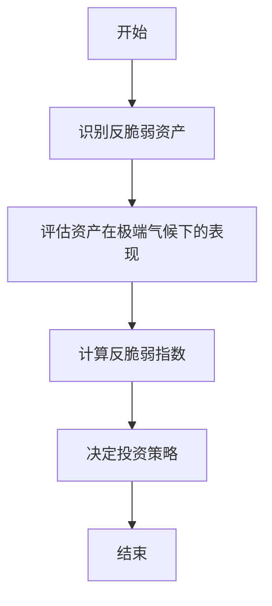
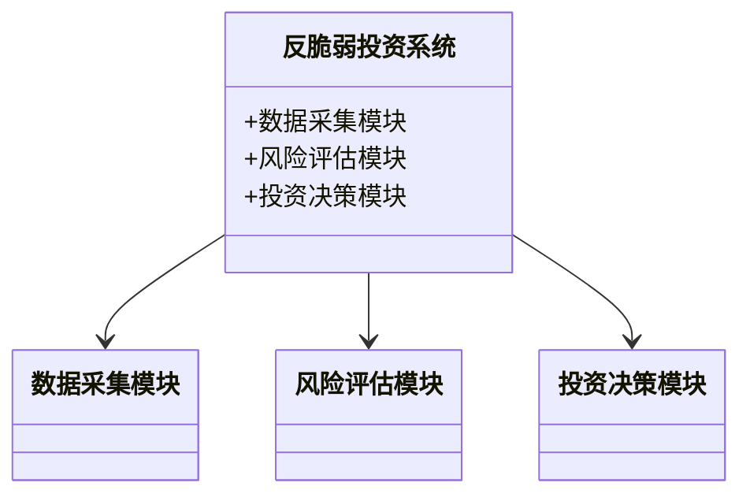
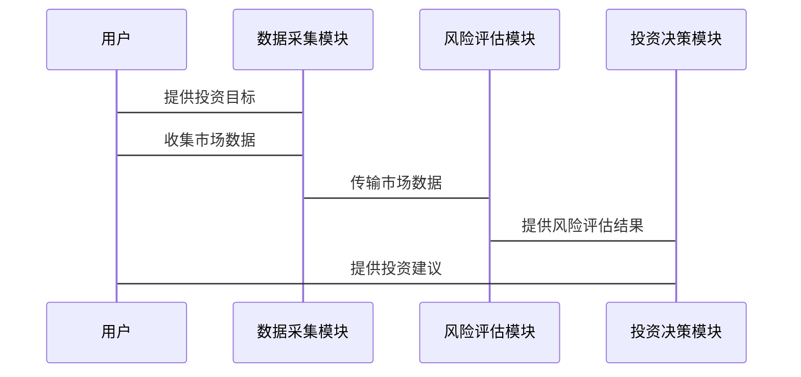

                 


# 芒格的"反脆弱"投资理念在极端气候经济中的应用

> 关键词：反脆弱投资，极端气候经济，风险管理，芒格投资理念，系统架构设计，算法模型

> 摘要：本文深入探讨了芒格的“反脆弱”投资理念在应对极端气候经济中的应用。通过分析极端气候对经济的影响，结合反脆弱投资的核心概念，本文提出了在极端气候经济中构建反脆弱投资系统的策略。文章详细介绍了反脆弱投资的算法原理、数学模型、系统架构设计，并通过实际案例分析展示了如何在极端气候经济中应用反脆弱投资策略。

---

## 第一部分：引言

### 第1章：极端气候经济的背景与挑战

#### 1.1 极端气候的经济学分析

极端气候事件，如洪水、干旱、飓风和极端温度，对全球经济造成了深远的影响。气候变化不仅改变了自然生态系统，还影响了经济活动、市场结构和投资行为。根据联合国政府间气候变化专门委员会（IPCC）的报告，全球气温上升可能导致全球经济损失高达数万亿美元，特别是在农业、能源和金融领域。

#### 1.2 投资与风险管理的挑战

传统投资策略在面对极端气候事件时显得力不从心。例如，股票市场在极端天气事件中往往出现大幅波动，投资者难以通过传统的方法预测和应对这些波动。此外，风险管理的传统方法，如VaR（Value at Risk），在极端事件中往往低估潜在损失，导致投资者在极端情况下面临更大的风险。

---

## 第二部分：芒格的反脆弱投资理念

### 第2章：反脆弱投资的核心概念

#### 2.1 反脆弱的定义与特征

反脆弱性（Antifragility）是由 Nassim Taleb 提出的概念，指系统在面对压力和冲击时不仅能够生存，还能通过适应和增强自身能力而变得更加 robust。与 robust（稳健）和 fragile（脆弱）不同，反脆弱系统能够在压力下成长。

| **特征**       | **反脆弱系统** | **稳健系统** | **脆弱系统** |
|----------------|----------------|---------------|---------------|
| 压力反应        | 利用压力成长    | 不受压力影响   | 受压力损害    |
| 风险偏好        | 偏好高风险、高回报 | 风险中立       | 避免风险       |
| 恢复能力        | 在冲击中增强     | 保持稳定       | 易受冲击影响    |

#### 2.2 反脆弱投资与传统投资的对比

反脆弱投资策略与传统投资策略在多个方面存在显著差异，尤其是在风险偏好和应对策略上。以下是两者的对比：

| **方面**         | **反脆弱投资**                         | **传统投资**                          |
|------------------|---------------------------------------|---------------------------------------|
| 风险态度          | 偏好高风险、高回报                    | 避免高风险，追求稳定回报              |
| 应对冲击          | 利用冲击创造收益，增强系统能力        | 通过分散投资降低风险                 |
| 投资期限          | 长期投资，利用时间复利效应             | 短期投资，避免长期波动                |
| 信息利用          | 善用不对称信息，寻找市场机会          | 依赖公开信息，避免信息不对称          |

---

## 第三部分：反脆弱投资在极端气候经济中的应用

### 第3章：极端气候对经济的影响

#### 3.1 气候变化对农业的影响

气候变化导致极端天气事件增多，影响农作物的生长周期和产量。例如，干旱可能导致农作物减产，从而推高粮食价格，影响全球粮食供应链。

#### 3.2 气候变化对能源行业的影响

极端气候事件可能导致能源基础设施受损，影响能源供应。例如，飓风可能导致石油 refinery 关闭，推高油价。

---

## 第四部分：反脆弱投资的算法与数学模型

### 第4章：反脆弱投资的算法原理

#### 4.1 反脆弱投资决策流程

以下是反脆弱投资决策的流程图：



#### 4.2 反脆弱指数计算公式

反脆弱指数（AFI）用于衡量资产在极端气候下的反脆弱能力，公式如下：

$$ \text{AFI} = \frac{\text{资产在极端气候下的收益}}{\text{资产在正常气候下的收益}} $$

---

## 第五部分：系统架构设计

### 第5章：反脆弱投资系统的架构设计

#### 5.1 系统功能设计

以下是反脆弱投资系统的领域模型：



#### 5.2 系统交互设计

以下是系统的交互流程图：



---

## 第六部分：项目实战

### 第6章：极端气候经济中的反脆弱投资实战

#### 6.1 案例分析：能源行业的反脆弱投资

以某能源公司为例，该公司在极端气候下通过投资可再生能源项目实现了反脆弱。以下是具体步骤：

1. **数据采集**：收集历史气候数据和能源价格数据。
2. **风险评估**：评估极端气候对能源需求和供应的影响。
3. **投资决策**：投资可再生能源项目，如太阳能和风能。

#### 6.2 投资组合优化

以下是投资组合优化的Python代码示例：

```python
import numpy as np
import pandas as pd

# 假设我们有极端气候下的资产收益数据
returns = pd.DataFrame({
    '资产A': [0.2, -0.1, 0.3],
    '资产B': [0.1, -0.2, 0.4],
    '资产C': [0.15, -0.15, 0.35]
})

# 计算反脆弱指数
afi = returns.apply(lambda x: x/x.mean()).mean(axis=1)

print("反脆弱指数:", afi)
```

---

## 第七部分：结论与展望

### 第7章：总结与最佳实践

#### 7.1 小结

本文详细探讨了芒格的反脆弱投资理念在极端气候经济中的应用。通过分析极端气候对经济的影响，结合反脆弱投资的核心概念，提出了在极端气候经济中构建反脆弱投资系统的策略。

#### 7.2 注意事项

- 投资者在应用反脆弱投资策略时，需充分考虑市场波动和政策风险。
- 反脆弱系统需要定期更新和优化，以适应不断变化的气候和市场环境。

#### 7.3 未来展望

随着气候变化的加剧，反脆弱投资理念将在未来变得更加重要。未来的研究可以进一步探讨如何结合人工智能和大数据技术，优化反脆弱投资模型。

---

## 作者：AI天才研究院 & 禅与计算机程序设计艺术

