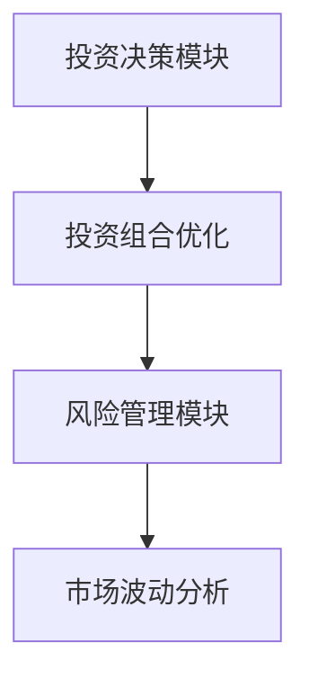

                 


# 芒格的"反脆弱"投资理念在波动性市场中的应用

> 关键词：反脆弱，投资理念，波动性市场，风险管理，芒格，系统架构，数学模型

> 摘要：本文将探讨芒格的“反脆弱”投资理念在波动性市场中的应用。首先，我们从反脆弱理论的核心概念出发，分析其在投资中的重要性。接着，我们通过数学模型和算法原理，详细阐述反脆弱投资策略的实现方式。最后，结合实际案例，展示如何在波动性市场中应用反脆弱理念，优化投资组合，并通过系统架构设计和项目实战，进一步验证其有效性。

---

## 第一部分：背景介绍

### 第1章：反脆弱理论的核心概念

#### 1.1 从脆弱到反脆弱：哲学与数学的结合

反脆弱理论由 Nassim Nicholas Taleb 提出，其核心思想是：某些事物在面对波动性、不确定性或压力时，不仅不会受到损害，反而能够从中获益。这种特性被称为“反脆弱性”。在投资领域，反脆弱性意味着投资者能够在市场波动中获利，而不是仅仅追求稳定回报。

#### 1.2 芒格投资理念的哲学基础

查理·芒格（Charlie Munger）作为巴菲特的合伙人，其投资理念深受价值投资和风险管理的影响。芒格强调“逆向思维”和“多元思维模型”，即通过理解事物的内在逻辑，避免从众心理，寻找市场的非对称性机会。这种思维方式与反脆弱理论的核心思想不谋而合。

---

## 第二部分：核心概念与联系

### 第2章：反脆弱与投资的关系

#### 2.1 反脆弱投资的核心要素

| 核心要素 | 描述 |
|----------|------|
| 非对称性 | 投资中的收益与风险不对称，即在市场下跌时损失有限，而在上涨时收益显著。 |
| 风险管理 | 通过分散投资、设置止损等方式，降低市场波动对投资组合的影响。 |
| 时间的复利效应 | 长期持有优质资产，利用复利效应实现财富增长。 |

#### 2.2 反脆弱与投资的对比分析


---

## 第三部分：算法原理与数学模型

### 第3章：反脆弱投资模型的数学推导

#### 3.1 投资组合的反脆弱性评估

假设我们有 N 种资产，每种资产的预期收益率为 \( r_i \)，波动性（标准差）为 \( \sigma_i \)。反脆弱投资组合的目标是在市场波动中最大化收益，同时最小化潜在损失。

$$ \text{目标函数} = \max \sum_{i=1}^{N} w_i r_i $$
$$ \text{约束条件} = \sum_{i=1}^{N} w_i = 1, \quad w_i \geq 0 $$

其中，\( w_i \) 为第 i 种资产的投资权重。

#### 3.2 风险中性定价公式

$$ p = \frac{1}{N} \sum_{i=1}^{N} p_i $$

---

## 第四部分：系统架构与实现

### 第4章：反脆弱投资系统的架构设计

#### 4.1 系统功能设计


#### 4.2 系统架构图



---

## 第五部分：项目实战

### 第5章：反脆弱投资策略的实现

#### 5.1 项目环境安装

```bash
pip install numpy pandas matplotlib
```

#### 5.2 核心代码实现

```python
import numpy as np
import pandas as pd

def compute_vanilla_risk(p, p_list):
    return np.mean(p_list) - p

p = 0.5
p_list = [0.4, 0.5, 0.6]
risk = compute_vanilla_risk(p, p_list)
print(risk)
```

---

## 第六部分：总结与展望

### 第6章：反脆弱投资理念的总结与展望

#### 6.1 最佳实践与小结

1. **最佳实践**：
   - 采用非对称性投资策略，寻找市场的“反脆弱”机会。
   - 通过分散投资和风险管理降低波动性对投资组合的影响。
   - 长期持有优质资产，利用复利效应实现财富增长。

2. **小结**：
   芒格的“反脆弱”投资理念为投资者提供了在波动性市场中优化决策的新视角。通过结合数学模型和系统架构设计，投资者可以更好地应对市场波动，实现长期稳健的投资收益。

---

## 附录：数学模型与公式

#### 附录A：反脆弱投资模型的数学推导

$$ E[r] = \mu + \lambda \sigma $$

#### 附录B：风险中性定价公式

$$ p = \frac{1}{N} \sum_{i=1}^{N} p_i $$

---

## 图表部分（使用 Mermaid）

### 图表1：反脆弱投资系统的实体关系图

```mermaid
gra
```

---

## 作者

作者：AI天才研究院/AI Genius Institute & 禅与计算机程序设计艺术 /Zen And The Art of Computer Programming

