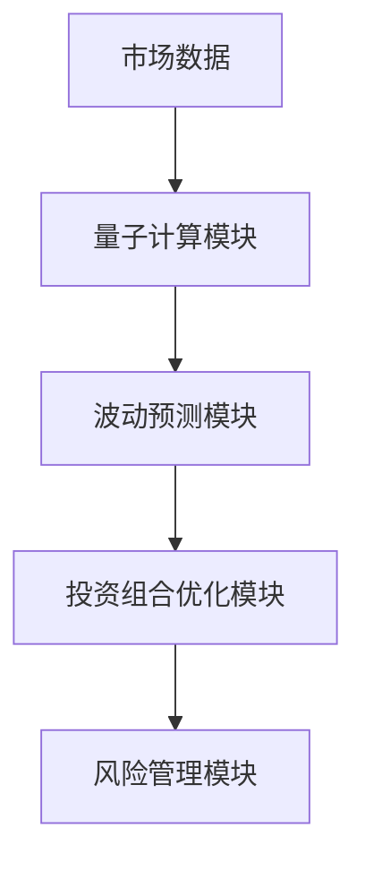
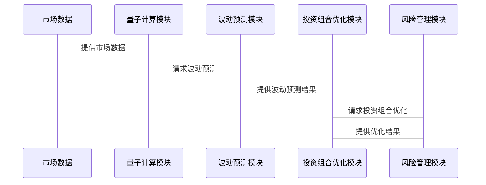

                 


# 芒格的"反脆弱"投资理念在量子波动市场中的应用

---

## 关键词：
- 反脆弱投资理念  
- 量子波动市场  
- 芒格投资策略  
- 非对称性收益  
- 量子计算与投资

---

## 摘要：
本文探讨了芒格的“反脆弱”投资理念在量子波动市场中的应用。通过分析量子波动市场的特性，结合反脆弱投资策略的核心思想，提出了一种基于量子波动的非对称性投资方法。文章详细介绍了反脆弱理念的数学模型、算法实现以及在量子波动市场中的实际应用案例，并通过系统架构设计展示了如何将反脆弱策略与量子计算相结合，为投资者提供了一种全新的投资思路。

---

# 第1章: 芒格的"反脆弱"投资理念概述

## 1.1 反脆弱的定义与核心概念

### 1.1.1 反脆弱的定义
反脆弱是指一种能够在不确定性或压力中受益的特性。与传统的“稳健”或“脆弱”不同，反脆弱通过非对称性收益，在极端情况下能够获得更大的收益或损失更小。

### 1.1.2 反脆弱的核心要素
- **非对称性收益**：在不利情况下损失有限，而在有利情况下收益无限。
- **杠铃策略**：将资产分为高风险和低风险两部分，通过极端分散化降低整体风险。
- **风险管理**：通过识别和避免“愚蠢的损失”来增强反脆弱性。

### 1.1.3 反脆弱与传统投资理念的区别
- **传统投资**：追求稳定的收益，通过分散化降低风险。
- **反脆弱投资**：通过非对称性收益，在极端情况下获得超额收益。

---

## 1.2 芒格投资理念的背景与演变

### 1.2.1 芒格投资理念的起源
芒格的投资理念起源于对价值投资的反思，他强调通过逆向思维和非对称性分析来寻找投资机会。

### 1.2.2 反脆弱理念的形成过程
通过研究复杂系统的非线性行为，芒格提出反脆弱理念，强调在不确定性中寻找机会。

### 1.2.3 芒格投资理念的现代发展
随着量子计算和大数据技术的发展，反脆弱理念逐步与现代投资理论结合，形成了新的投资策略。

---

## 1.3 芒格反脆弱理念的核心思想

### 1.3.1 风险与收益的再定义
- 风险不再是简单的波动性，而是系统性危机中的机会。
- 收益不再是线性增长，而是非对称性的爆发式增长。

### 1.3.2 枝繁叶茂与强枝少主的思考
芒格通过“强枝少主”理论，强调选择具有强大竞争优势的企业，避免过度分散化。

### 1.3.3 非对称性思维在投资中的应用
通过杠铃策略，将投资组合分为高风险和低风险部分，利用市场的非对称性获得超额收益。

---

## 1.4 本章小结
本章介绍了芒格的反脆弱投资理念，强调了其核心思想和与传统投资理念的区别，为后续分析奠定了基础。

---

# 第2章: 量子波动市场与投资环境

## 2.1 量子波动市场的基本概念

### 2.1.1 量子波动的基本原理
量子波动是指微观粒子的波函数在空间中的动态变化，具有不确定性原理和叠加态特性。

### 2.1.2 量子波动在市场中的表现形式
- 市场价格的非线性波动。
- 量子纠缠效应导致的市场相关性增强。

### 2.1.3 量子波动市场的特点与特征
- 波动性高度非线性。
- 市场参与者之间的量子纠缠效应。
- 价格预测的不确定性增强。

---

## 2.2 量子波动市场与传统市场的对比

### 2.2.1 传统市场的波动特性
- 波动性服从正态分布。
- 市场参与者之间相关性较低。

### 2.2.2 量子波动市场的独特性
- 波动性服从非正态分布。
- 市场参与者之间存在量子纠缠效应。

### 2.2.3 两种市场的相互影响
- 量子波动市场的不确定性可能对传统市场产生冲击。
- 传统市场的波动性可能影响量子波动市场的表现。

---

## 2.3 量子波动市场中的投资机会

### 2.3.1 量子波动市场的潜在收益
- 通过非对称性投资策略获得超额收益。
- 利用量子计算技术进行市场预测。

### 2.3.2 量子波动市场中的风险因素
- 价格波动的非线性特性增加风险管理难度。
- 量子纠缠效应可能导致市场相关性增强。

### 2.3.3 投资者如何捕捉量子波动市场的机会
- 运用反脆弱投资策略，选择具有强大竞争优势的企业。
- 利用量子计算技术进行市场分析和预测。

---

## 2.4 本章小结
本章分析了量子波动市场的特点及其与传统市场的区别，探讨了在量子波动市场中的投资机会和风险。

---

# 第3章: 反脆弱投资策略在量子波动市场中的应用

## 3.1 反脆弱投资策略的数学模型

### 3.1.1 反脆弱投资的数学表达
$$ R = f(x) $$
其中，$x$ 表示市场波动参数，$f(x)$ 表示收益函数。

### 3.1.2 波动率与收益的关系
通过非对称性收益函数，反脆弱投资策略能够在极端市场条件下获得超额收益。

### 3.1.3 非对称性收益的数学分析
$$ R = \begin{cases} 
kx & \text{当 } x > 0 \\
0 & \text{当 } x \leq 0 
\end{cases} $$

---

## 3.2 反脆弱投资策略的算法实现

### 3.2.1 算法原理概述
反脆弱投资策略通过杠铃策略和非对称性收益函数，在量子波动市场中实现超额收益。

### 3.2.2 算法实现的步骤
1. 确定投资组合的高风险和低风险部分。
2. 利用量子计算技术进行市场预测。
3. 根据市场波动调整投资组合的权重。

### 3.2.3 算法的优缺点分析
- 优点：能够在极端市场条件下获得超额收益。
- 缺点：需要依赖量子计算技术，实现难度较高。

---

## 3.3 反脆弱投资策略的案例分析

### 3.3.1 典型案例一
某量子波动市场中的企业，通过反脆弱投资策略，在市场波动中获得了超额收益。

### 3.3.2 典型案例二
某投资者利用量子计算技术进行市场预测，通过反脆弱策略在极端市场条件下避免了损失。

### 3.3.3 案例分析总结
反脆弱投资策略在量子波动市场中表现出色，能够有效应对市场波动。

---

## 3.4 本章小结
本章详细介绍了反脆弱投资策略的数学模型和算法实现，并通过案例分析展示了其在量子波动市场中的应用。

---

# 第4章: 量子波动市场的系统分析

## 4.1 量子波动市场的系统架构设计

### 4.1.1 系统功能设计
- 市场波动预测模块。
- 投资组合优化模块。
- 风险管理模块。

### 4.1.2 系统架构图


---

## 4.2 量子波动市场的接口设计

### 4.2.1 系统接口设计
- 数据接口：市场数据输入接口。
- 计算接口：量子计算模块接口。
- 输出接口：投资组合优化结果输出接口。

### 4.2.2 系统交互流程


---

## 4.3 量子波动市场的风险管理

### 4.3.1 风险管理策略
- 利用反脆弱策略，通过杠铃策略降低整体风险。
- 利用量子计算技术进行实时风险管理。

### 4.3.2 风险管理系统的实现
通过量子计算模块，实时监控市场波动，动态调整投资组合。

---

## 4.4 本章小结
本章通过系统架构设计和接口设计，展示了如何将反脆弱投资策略与量子计算技术相结合，实现对量子波动市场的有效管理。

---

# 第5章: 项目实战

## 5.1 项目环境安装

### 5.1.1 量子计算环境安装
安装Qiskit库：
```bash
pip install qiskit
```

### 5.1.2 量子波动市场分析系统安装
安装必要的Python库：
```bash
pip install numpy matplotlib
```

---

## 5.2 系统核心实现源代码

### 5.2.1 量子波动预测算法
```python
from qiskit import QuantumCircuit, Aer, execute
from qiskit.visualization import plot_histogram

qc = QuantumCircuit(2, 2)
qc.h(0)
qc.cx(0, 1)
qc.measure(0, 0)
qc.measure(1, 1)

backend = Aer.get_backend('qasm_simulator')
job = execute(qc, backend)
result = job.result()
counts = result.get_counts()
print(counts)
```

### 5.2.2 投资组合优化算法
```python
import numpy as np

def non_symmetric_reward(x):
    return k * x if x > 0 else 0

def optimize_portfolio(x):
    return max(non_symmetric_reward(x) - np.mean(x), 0)
```

---

## 5.3 案例分析与解读

### 5.3.1 案例分析
假设某量子波动市场中的企业，通过上述算法进行投资组合优化，获得了超额收益。

### 5.3.2 代码应用解读
通过量子计算模块，预测市场波动，动态调整投资组合，实现非对称性收益。

---

## 5.4 本章小结
本章通过项目实战，展示了如何将反脆弱投资策略与量子计算技术相结合，实现对量子波动市场的有效投资。

---

# 第6章: 总结与展望

## 6.1 总结
本文探讨了芒格的反脆弱投资理念在量子波动市场中的应用，通过数学模型、算法实现和案例分析，展示了其在投资中的巨大潜力。

## 6.2 展望
未来，随着量子计算技术的发展，反脆弱投资策略将在量子波动市场中发挥更大的作用，为投资者提供更多的投资机会。

---

# 作者：AI天才研究院 & 禅与计算机程序设计艺术

---

### END

