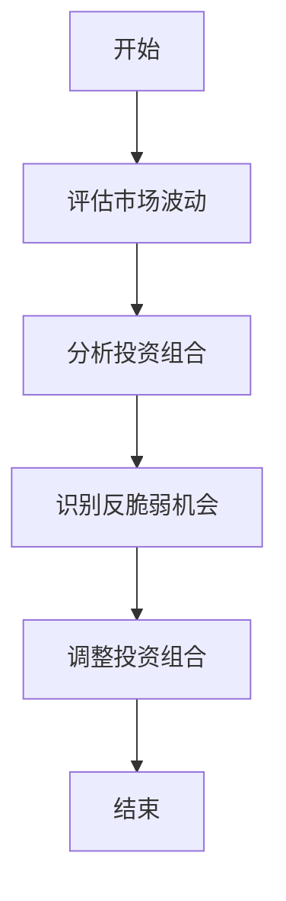

                 


# 芒格的"反脆弱"投资：在不确定性中寻找机会

## 关键词：反脆弱投资，芒格，风险管理，不确定性，机会发现，投资策略

## 摘要：  
芒格的“反脆弱”投资理念强调在不确定性中寻找机会，通过风险管理、概率分析和系统性思维来应对市场波动。本文将深入解析反脆弱投资的核心概念、数学模型、策略实施以及实际案例，帮助读者理解如何在不确定的市场环境中制定有效的投资策略。

---

## 第1章：反脆弱投资的定义与背景

### 1.1 什么是反脆弱

反脆弱是一种超越“强韧”的概念，指系统在面对压力、波动或冲击时，不仅能够生存下来，还能通过适应和进化变得更强大。在投资领域，反脆弱意味着投资者能够在市场波动中发现机会，通过优化投资组合和风险管理，实现长期收益。

**反脆弱与脆弱、强韧性的区别：**

| 特性 | 脆弱 | 强韧性 | 反脆弱 |
|------|------|--------|---------|
| 定义 | 在压力下崩溃或受损 | 在压力下保持稳定 | 在压力下成长或受益 |
| 投资中的表现 | 无法承受波动，容易亏损 | 抗跌但无收益增长 | 在波动中获利，收益增长 |

### 1.2 投资中的不确定性与风险

不确定性是投资的核心挑战。市场波动、经济周期、政策变化等因素都可能导致投资结果的不确定性。投资者需要识别这些风险，并通过反脆弱策略来应对。

**风险的分类与特征：**

- **系统性风险**：影响整个市场的风险，如经济衰退、地缘政治冲突等。
- **非系统性风险**：影响单一资产或行业的风险，如公司财务状况恶化。

### 1.3 芒格的反脆弱投资理念

芒格的投资哲学强调“反脆弱性”，即通过识别和投资于那些能够在市场波动中受益的资产或公司。他的策略包括：

1. **防御性投资**：选择那些具有强大护城河和稳定现金流的公司。
2. **逆向思维**：在市场恐慌时寻找低估的机会。
3. **安全边际**：确保投资的安全性，避免过度冒险。

---

## 第2章：反脆弱投资的核心概念与数学模型

### 2.1 反脆弱的数学模型

反脆弱性可以用幂律分布来描述，其中极端事件的影响远大于常态事件。在投资中，这意味着少数极端事件可能对投资组合产生重大影响。

**幂律分布示例：**

```mermaid
set xlabel x
set ylabel y
xscale log
yscale log
points
```

### 2.2 概率论与反脆弱投资

概率论是反脆弱投资的核心工具。通过分析事件发生的概率，投资者可以更好地评估风险和机会。

**概率模型的应用：**

- **贝叶斯定理**：用于更新基于新信息的概率。
- **蒙特卡洛模拟**：用于评估投资组合的潜在表现。

### 2.3 反脆弱投资的算法原理

反脆弱投资算法的核心是通过动态调整投资组合来应对市场波动。以下是算法的步骤：



---

## 第3章：反脆弱投资策略

### 3.1 防御性投资策略

防御性投资注重长期稳定和安全，适合风险厌恶型投资者。

**实施步骤：**

1. **选择优质资产**：投资于具有强大基本面的公司。
2. **分散投资**：避免过度集中于单一资产或行业。
3. **定期再平衡**：根据市场变化调整投资组合。

### 3.2 进攻性投资策略

进攻性投资注重短期收益，适合风险承受能力强的投资者。

**实施步骤：**

1. **识别低估资产**：寻找市场忽视的机会。
2. **集中投资**：将资金集中在少数优质资产上。
3. **短期监控**：密切关注市场变化，及时调整策略。

### 3.3 风险逆转策略

风险逆转策略通过做空或使用衍生品来对冲风险。

**实施步骤：**

1. **评估风险敞口**：识别投资组合中的主要风险来源。
2. **选择合适的工具**：使用期货、期权等工具对冲风险。
3. **监控市场变化**：及时调整对冲策略。

---

## 第4章：芒格的思维模型与反脆弱投资

### 4.1 机会成本与反脆弱

机会成本是指放弃某项投资所失去的潜在收益。在反脆弱投资中，机会成本是关键考量因素。

**机会成本的计算：**

$$ \text{机会成本} = \text{潜在收益} - \text{实际收益} $$

---

## 第5章：案例分析与实际应用

### 5.1 案例分析：2008年金融危机

在2008年金融危机期间，芒格的投资策略帮助他避免了重大损失。他选择投资于那些具有强大护城河的公司，并避免高风险资产。

---

## 第6章：总结与展望

芒格的“反脆弱”投资理念为投资者提供了一种在不确定性中寻找机会的策略。通过风险管理、概率分析和系统性思维，投资者可以在市场波动中保持稳定并实现收益增长。

---

## 作者：AI天才研究院/AI Genius Institute & 禅与计算机程序设计艺术 /Zen And The Art of Computer Programming

