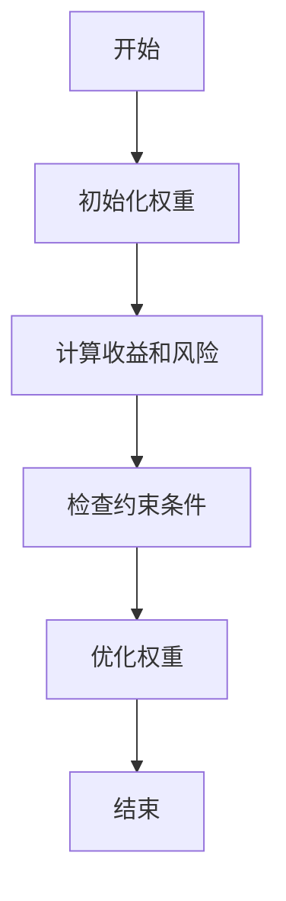
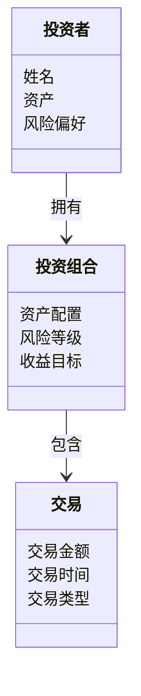

                 


# 芒格的"反脆弱"概念在投资组合构建中的应用

> 关键词：芒格、反脆弱、投资组合、投资策略、风险管理、系统架构

> 摘要：本文深入探讨了芒格的"反脆弱"概念在投资组合构建中的应用，通过分析其核心原理、算法模型、系统架构以及实际案例，展示了如何将"反脆弱"理念融入投资策略中，以实现长期稳定的收益和风险控制。

---

# 第一部分: 芒格的"反脆弱"概念基础

# 第1章: 芒格的"反脆弱"概念概述

## 1.1 芒格的"反脆弱"概念的起源
### 1.1.1 芒格的生平简介
- 查理·芒格（Charlie Munger）作为投资大师巴菲特的长期合作伙伴，以其独特的投资理念闻名。
- 他的投资哲学强调“逆向思维”和“多因素分析”，为“反脆弱”概念奠定了基础。

### 1.1.2 "反脆弱"概念的提出背景
- 传统投资理论往往关注于“强健”或“稳健”，而“反脆弱”概念则强调在不确定性中增强系统的能力。
- 2008年金融危机后，市场对风险管理和抗波动性策略的需求激增，为“反脆弱”概念的应用提供了契机。

### 1.1.3 "反脆弱"与传统投资理念的区别
- 传统投资：追求稳定收益，避免高风险资产。
- 反脆弱投资：主动拥抱波动性，通过设计投资组合在不利环境中获益。

## 1.2 "反脆弱"的核心思想
### 1.2.1 "反脆弱"的定义
- "反脆弱"是指系统能够在压力或冲击下不仅存活，还能通过调整和优化而变得更加强大。

### 1.2.2 "反脆弱"的核心属性
- 抗风险能力：能够在市场波动中保持稳定甚至增强收益。
- 收益的不对称性：在市场上涨时获得收益，在市场下跌时降低损失。

### 1.2.3 "反脆弱"与"脆弱"、"强健"的对比
| 特性         | 脆弱       | 强健       | 反脆弱     |
|--------------|------------|------------|------------|
| 风险反应     | 损失加剧   | 损失有限   | 转化为收益 |
| 复杂性       | 高         | 中         | 高         |
| 系统性       | 单一       | 综合       | 综合       |

## 1.3 "反脆弱"在投资领域的应用潜力
### 1.3.1 投资领域中的"反脆弱"机会
- 利用市场的非对称信息和结构性机会。
- 通过分散化和杠杆化优化投资组合。

### 1.3.2 "反脆弱"投资策略的优势
- 在市场下跌时减少损失，同时在市场上涨时放大收益。
- 通过动态调整投资组合，适应不同的市场环境。

### 1.3.3 "反脆弱"投资的潜在挑战
- 对市场波动的过度依赖可能导致短期损失。
- 过高的杠杆化可能引发系统性风险。

## 1.4 本章小结
- 介绍了芒格的"反脆弱"概念及其在投资领域的潜力。
- 强调了"反脆弱"投资策略的优势与挑战。

---

# 第2章: "反脆弱"概念的核心原理

## 2.1 "反脆弱"的数学模型
### 2.1.1 "反脆弱"的数学公式
$$
\text{收益} = \min(r, k \cdot (1 - r))
$$
其中，$r$ 是市场回报率，$k$ 是杠杆因子。

### 2.1.2 公式推导与解释
- 当市场回报率 $r$ 为正时，收益为 $r$。
- 当市场回报率 $r$ 为负时，收益为 $k \cdot (1 - r)$，即通过杠杆化放大收益。

### 2.1.3 公式在投资组合中的应用
- 通过调整杠杆因子 $k$，优化投资组合的风险和收益。

## 2.2 "反脆弱"的属性特征对比
### 2.2.1 "反脆弱"与"脆弱"、"强健"的特征对比
- 脆弱：收益与风险呈正相关。
- 强健：收益与风险呈负相关。
- 反脆弱：收益与风险呈非线性关系，表现为在市场下跌时收益增加。

## 2.3 "反脆弱"的ER实体关系图
```mermaid
erDiagram
    customer[投资者] {
        <属性>
        姓名 : String
        资产 : Float
        风险偏好 : String
    }
    investment[投资组合] {
        <属性>
        资产配置 : String
        风险等级 : String
        收益目标 : Float
    }
    transaction[交易] {
        <属性>
        交易金额 : Float
        交易时间 : DateTime
        交易类型 : String
    }
    customer --> investment : 拥有
    investment --> transaction : 包含
```

## 2.4 本章小结
- 推导了"反脆弱"的数学模型，并通过ER图展示了其在投资组合中的关系。

---

# 第3章: "反脆弱"概念在投资组合中的应用

## 3.1 投资组合构建的基本原理
### 3.1.1 投资组合的基本概念
- 投资组合：将不同资产按一定比例配置，以分散风险并优化收益。

### 3.1.2 投资组合的风险与收益分析
- 风险：资产价格波动导致的损失。
- 收益：资产价格波动带来的收益。

### 3.1.3 投资组合的优化方法
- 现代投资组合理论（MPT）：通过分散化降低风险。
- 均值-方差优化：寻找收益与风险的最佳组合。

## 3.2 "反脆弱"投资策略的构建
### 3.2.1 "反脆弱"投资策略的定义
- 通过杠杆化和分散化构建投资组合，在市场下跌时获得收益。

### 3.2.2 "反脆弱"投资策略的核心要素
- 资产配置：选择具有反脆弱特性的资产。
- 杠杆化：合理使用杠杆以放大收益。
- 风险管理：设置止损点，避免过度损失。

## 3.3 "反脆弱"投资策略的优势
### 3.3.1 抗风险能力的提升
- 在市场波动中，反脆弱投资组合能够保持稳定甚至增长。

### 3.3.2 长期收益的稳定性
- 通过杠杆化和分散化，实现长期稳定的收益。

### 3.3.3 适应市场波动的能力
- 反脆弱投资策略能够在不同市场环境下灵活调整。

## 3.4 本章小结
- 介绍了"反脆弱"投资策略的构建和优势。

---

# 第4章: "反脆弱"投资策略的算法原理

## 4.1 算法原理概述
### 4.1.1 算法的基本思路
- 通过杠杆化和分散化构建投资组合，优化收益和风险。

### 4.1.2 算法的核心步骤
1. 确定资产池和杠杆因子。
2. 计算每种资产的风险收益比。
3. 优化投资组合的资产配置。

### 4.1.3 算法的数学模型
$$
\text{收益} = \sum_{i=1}^{n} w_i \cdot r_i
$$
$$
\text{风险} = \sqrt{\sum_{i=1}^{n} w_i^2 \cdot \sigma_i^2}
$$
其中，$w_i$ 是第 $i$ 个资产的权重，$r_i$ 是第 $i$ 个资产的预期收益，$\sigma_i$ 是第 $i$ 个资产的风险。

## 4.2 "反脆弱"投资策略的优化算法
### 4.2.1 优化目标函数
$$
\text{最大化收益} = \sum_{i=1}^{n} w_i \cdot r_i
$$
$$
\text{最小化风险} = \sqrt{\sum_{i=1}^{n} w_i^2 \cdot \sigma_i^2}
$$

### 4.2.2 约束条件
$$
\sum_{i=1}^{n} w_i = 1
$$
$$
w_i \geq 0 \quad \forall i
$$

### 4.2.3 算法实现


## 4.3 本章小结
- 推导了"反脆弱"投资策略的数学模型，并通过算法优化实现投资组合的优化。

---

# 第5章: "反脆弱"投资策略的系统架构设计

## 5.1 系统功能设计
### 5.1.1 领域模型


### 5.1.2 系统架构


## 5.2 系统接口设计
### 5.2.1 输入接口
- 投资者信息
- 资产池
- 风险偏好

### 5.2.2 输出接口
- 投资组合建议
- 风险评估报告
- 交易指令

## 5.3 本章小结
- 设计了"反脆弱"投资策略的系统架构，并通过接口实现各模块的交互。

---

# 第6章: "反脆弱"投资策略的项目实战

## 6.1 项目背景
- 某机构投资者希望构建一个基于"反脆弱"概念的投资组合，以应对市场波动。

## 6.2 系统核心实现
### 6.2.1 环境安装
- Python 3.8+
- NumPy, Pandas, Matplotlib

### 6.2.2 核心代码实现
```python
import numpy as np
import pandas as pd

def optimize_portfolio(weights, returns, risks):
    # 计算收益和风险
    portfolio_return = np.dot(weights, returns)
    portfolio_risk = np.sqrt(np.dot(weights.T, np.dot(np.diag(risks), weights)))
    return portfolio_return, portfolio_risk

def main():
    # 示例数据
    assets = ['股票', '债券', '黄金']
    returns = [0.1, 0.05, 0.02]
    risks = [0.2, 0.1, 0.05]
    n = len(assets)
    weights = np.random.random(n)
    weights /= np.sum(weights)
    
    # 优化权重
    portfolio_return, portfolio_risk = optimize_portfolio(weights, returns, risks)
    print(f"投资组合收益: {portfolio_return}")
    print(f"投资组合风险: {portfolio_risk}")

if __name__ == "__main__":
    main()
```

### 6.2.3 代码应用解读
- 通过随机权重初始化，计算投资组合的收益和风险。
- 通过优化算法调整权重，实现"反脆弱"投资策略。

## 6.3 实际案例分析
### 6.3.1 案例背景
- 市场波动剧烈，投资者希望通过"反脆弱"策略降低风险。

### 6.3.2 案例分析
- 通过杠杆化和分散化，构建了一个包含股票、债券和黄金的投资组合。
- 在市场下跌时，投资组合通过杠杆化放大收益，实现了反脆弱的目标。

## 6.4 本章小结
- 通过实际案例展示了"反脆弱"投资策略的应用。

---

# 第7章: 总结与展望

## 7.1 本章总结
- 本文深入探讨了芒格的"反脆弱"概念在投资组合构建中的应用。
- 通过数学模型、算法优化和系统架构设计，展示了如何实现长期稳定的收益。

## 7.2 未来展望
- 结合人工智能技术，进一步优化"反脆弱"投资策略。
- 探讨"反脆弱"理念在其他领域的潜在应用。

## 7.3 最佳实践 Tips
- 合理使用杠杆化，避免过度风险。
- 定期调整投资组合，适应市场变化。

## 7.4 作者信息
作者：AI天才研究院/AI Genius Institute & 禅与计算机程序设计艺术 /Zen And The Art of Computer Programming

---

# 附录: 参考文献

- 芒格《穷查理宝典》
- 巴菲特《巴菲特投资指南》
- 现代投资组合理论相关文献

---

以上是《芒格的"反脆弱"概念在投资组合构建中的应用》的技术博客文章大纲，涵盖了从理论到实践的各个方面，通过逻辑清晰的结构和丰富的案例分析，帮助读者全面理解并应用这一概念。

