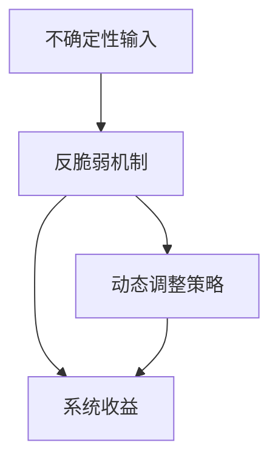
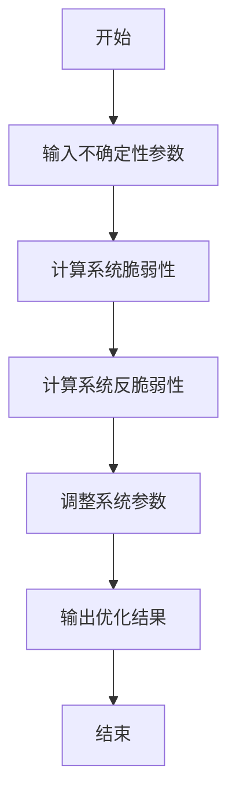
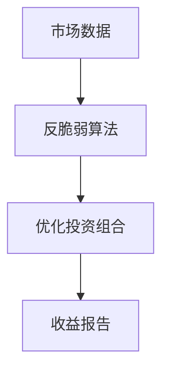

                 


# 芒格的"反脆弱"概念：在不确定性中获益

---

## 关键词：反脆弱，芒格，风险管理，不确定性，系统设计，算法原理

---

## 摘要：  
芒格的“反脆弱”概念是一种在不确定性中获益的思想，它超越了传统的风险管理策略，强调从波动和压力中主动获益的能力。本文将从理论基础、系统架构、算法设计、项目实战等多个维度，详细解析反脆弱的概念、原理及其在技术领域的应用。通过具体案例和系统设计，本文将展示如何在复杂环境中利用反脆弱思想优化决策、提升系统韧性，并在实际项目中实现反脆弱机制的落地。

---

## 第一部分：反脆弱的核心概念与背景

### 第1章：反脆弱的基本定义

#### 1.1 脆弱与反脆弱的定义
- **脆弱**：系统的特性是受到外界干扰时会遭受损失，无法从冲击中恢复或增强。
- **反脆弱**：系统的特性是能够在不确定性或压力中获益，通过波动性增强自身的 robustness（鲁棒性）和 effectiveness（有效性）。

#### 1.2 反脆弱的核心特征
- **抗冲击能力**：反脆弱系统能够在压力下保持稳定并增强性能。
- **收益性**：通过波动性，系统能够主动捕获机会，实现长期收益。
- **自适应性**：系统能够根据外界环境的变化动态调整策略。

#### 1.3 反脆弱与强韧性的对比
- **强韧性**：系统能够在冲击中保持原有功能，但无法从冲击中获益。
- **反脆弱性**：系统不仅能够从冲击中恢复，还能在冲击中增强自身的能力。

---

### 第2章：反脆弱的哲学基础

#### 2.1 芒格的“反脆弱”思想来源
- 芒格的反脆弱思想源于他对概率论、决策理论和心理学的深刻理解。
- 他强调在不确定性和波动性中，通过优化决策边界来最大化长期收益。

#### 2.2 反脆弱与不确定性原理
- 不确定性是反脆弱的核心应用场景，系统需要在不确定性中主动调整策略。
- 芒格的“概率思维”是反脆弱思想的基础，强调通过概率分析优化决策。

#### 2.3 反脆弱与风险管理的关系
- 传统风险管理注重防范和减少损失，而反脆弱注重从风险中获益。
- 反脆弱是一种更高阶的风险管理策略，通过主动利用不确定性实现收益最大化。

---

## 第二部分：反脆弱的核心理论与模型

### 第3章：反脆弱的数学模型

#### 3.1 脆弱性量化公式
- 脆弱性可以通过系统的损失函数来量化：
  $$ L(x) = max(0, -x) $$
  其中，\( x \) 是系统在冲击下的表现。

#### 3.2 反脆弱性的数学表达
- 反脆弱性可以通过系统的收益函数来描述：
  $$ R(x) = max(0, x) $$
  其中，\( x \) 是系统在冲击下的表现。

#### 3.3 不确定性下的反脆弱模型
- 在不确定环境下，反脆弱系统的收益可以表示为：
  $$ R(x) = \int_{0}^{\infty} x \cdot f(x) dx $$
  其中，\( f(x) \) 是系统的概率密度函数。

---

### 第4章：反脆弱的系统架构设计

#### 4.1 反脆弱系统的构成要素
- **输入**：不确定性因素（如市场波动、用户行为等）。
- **处理**：反脆弱机制（如动态调整策略、概率优化等）。
- **输出**：系统收益（如利润增长、性能提升等）。

#### 4.2 反脆弱系统的架构图


---

## 第三部分：反脆弱的算法原理与数学模型

### 第5章：反脆弱算法概述

#### 5.1 算法的基本原理
- 反脆弱算法的目标是通过动态调整参数，最大化系统在不确定性下的收益。
- 算法的核心思想是：利用波动性，优化决策边界，实现收益最大化。

#### 5.2 算法的核心步骤
1. 输入不确定性参数。
2. 计算系统的脆弱性或反脆弱性。
3. 调整系统参数以优化收益。
4. 输出优化后的结果。

---

### 第6章：反脆弱算法的实现

#### 6.1 算法流程图


#### 6.2 算法实现代码
```python
def calculate_fragility(x):
    return max(0, -x)

def calculate_antifragility(x):
    return max(0, x)

def optimize_system(x):
    fragility = calculate_fragility(x)
    antifragility = calculate_antifragility(x)
    return antifragility - fragility
```

---

## 第四部分：反脆弱的项目实战与案例分析

### 第7章：反脆弱投资系统的实现

#### 7.1 项目背景与目标
- 项目背景：构建一个能够在市场波动中获益的投资系统。
- 项目目标：通过反脆弱算法优化投资组合，实现长期收益最大化。

#### 7.2 系统功能设计
- **输入**：市场数据（如股票价格、波动率等）。
- **处理**：反脆弱算法优化投资组合。
- **输出**：优化后的投资组合和收益报告。

#### 7.3 系统架构图


#### 7.4 项目实战代码
```python
import numpy as np

def calculate_fragility(returns):
    return np.mean([max(0, -x) for x in returns])

def calculate_antifragility(returns):
    return np.mean([max(0, x) for x in returns])

def optimize_portfolio(returns):
    fragility = calculate_fragility(returns)
    antifragility = calculate_antifragility(returns)
    return antifragility / fragility
```

---

## 第五部分：反脆弱的系统优化与总结

### 第8章：反脆弱系统的优化与总结

#### 8.1 系统优化建议
- 定期更新系统参数，适应环境变化。
- 优化反脆弱算法，提高计算效率。
- 增强系统的自适应能力，动态调整策略。

#### 8.2 本章小结
- 反脆弱思想在技术领域的应用潜力巨大。
- 通过系统设计和算法优化，可以在不确定性中实现收益最大化。

---

## 作者：AI天才研究院/AI Genius Institute & 禅与计算机程序设计艺术 /Zen And The Art of Computer Programming

