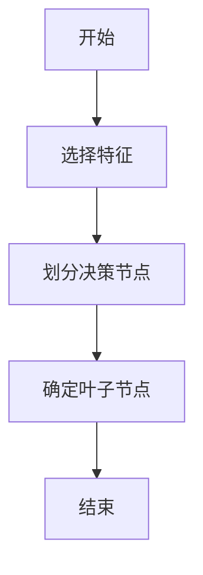
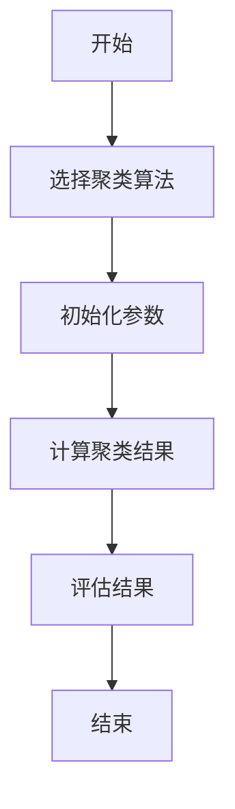
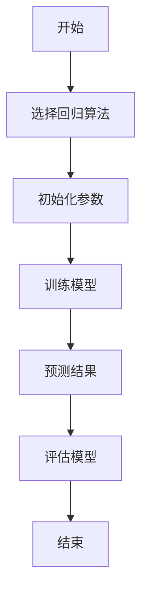
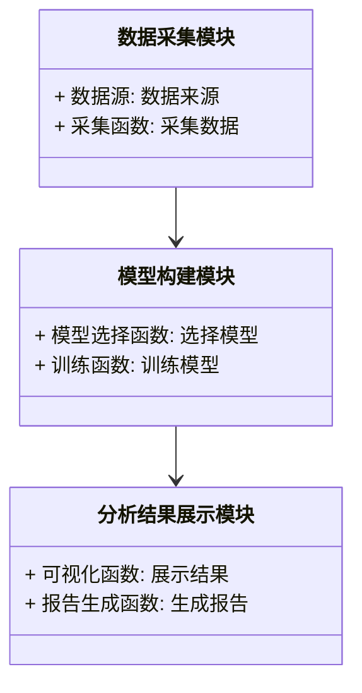
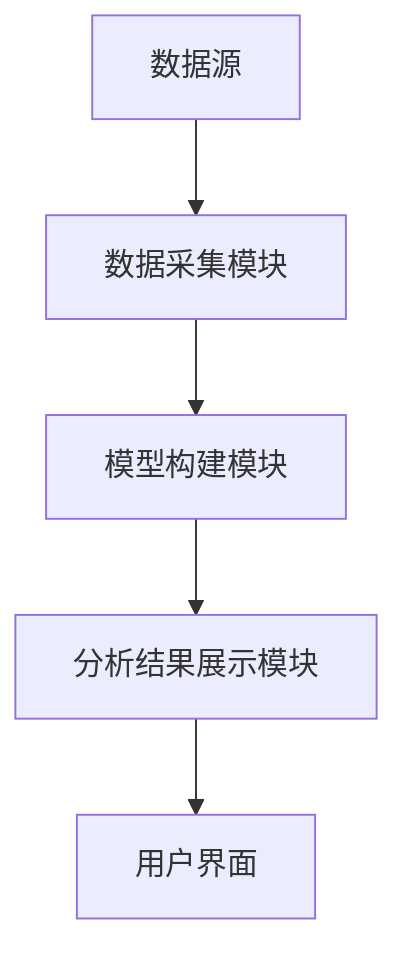
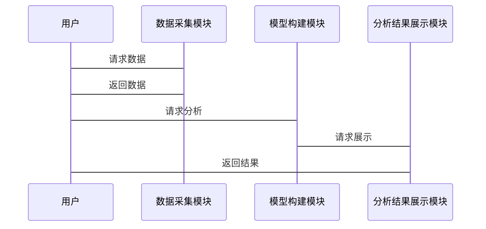

                 


# 芒格的"地图思维"：构建全面的投资分析框架

---

## 关键词
芒格, 投资分析, 地图思维, 系统分析, 算法原理, 系统架构设计, 项目实战

---

## 摘要
芒格的“地图思维”是一种通过构建知识框架、运用思维模型和优化决策机制来分析投资问题的方法。本文从背景介绍、核心要素、算法原理、系统架构设计、项目实战等多个维度，详细阐述地图思维在投资分析中的应用。通过实际案例分析，展示如何利用地图思维构建全面的投资分析框架，并提供代码实现和系统设计的具体方法。文章最后总结了地图思维的优势，并提出了未来的发展方向和最佳实践建议。

---

## 第一部分: 芒格的"地图思维"概述

## 第1章: 芒格的"地图思维"背景介绍

### 1.1 "地图思维"的核心概念

#### 1.1.1 投资分析的背景与问题背景
投资分析是通过对市场、行业和公司的深入研究，评估其潜在价值和风险，从而做出投资决策的过程。传统投资分析方法往往依赖于单一的财务指标或市场趋势，难以全面捕捉影响投资决策的多重因素。

#### 1.1.2 "地图思维"的定义与问题描述
地图思维是一种通过构建系统化的知识框架，整合多维度的思维模型，以全面分析投资问题的方法。它强调在投资分析中，需要像绘制地图一样，将各个相关因素有机结合起来，形成完整的分析体系。

#### 1.1.3 问题解决的思路与方法
地图思维的核心在于将复杂的投资问题分解为多个关键要素，通过构建知识框架和思维模型，逐步分析每个要素之间的关系，最终形成全面的投资决策依据。

#### 1.1.4 地图思维的边界与外延
地图思维的边界在于其分析的深度和广度，其外延则体现在不同领域的应用中，如金融、经济、技术等领域。

#### 1.1.5 核心要素与概念结构
地图思维的核心要素包括知识框架、思维模型、分析工具和决策机制。这些要素相互关联，共同构成了地图思维的分析体系。

### 1.2 地图思维与传统投资分析的区别

#### 1.2.1 传统投资分析的局限性
传统投资分析往往过于依赖单一指标或市场趋势，缺乏系统性和全面性，容易忽视潜在风险和机会。

#### 1.2.2 地图思维的优势与特点
地图思维的优势在于其系统性和全面性，能够整合多维度的信息和模型，帮助投资者更全面地理解市场和投资机会。

#### 1.2.3 两者的对比分析
通过对比分析可以看出，地图思维在投资分析中的优势在于其系统性和全面性，能够更好地应对复杂的投资环境。

### 1.3 地图思维的应用价值

#### 1.3.1 提高投资决策的效率
地图思维通过系统化的分析方法，能够显著提高投资决策的效率，减少分析过程中的重复劳动。

#### 1.3.2 降低投资风险
通过全面分析投资问题，地图思维能够帮助投资者更好地识别和评估潜在风险，从而做出更明智的投资决策。

#### 1.3.3 增强对市场的理解能力
地图思维通过整合多维度的信息和模型，能够帮助投资者更深入地理解市场运行机制，提升对市场的整体认知能力。

---

## 第2章: 地图思维的核心要素

### 2.1 知识框架的构建

#### 2.1.1 知识框架的定义
知识框架是地图思维的基础，它是一个包含多个关键要素的系统化结构，用于整合和分析投资相关的信息。

#### 2.1.2 知识框架的构建方法
知识框架的构建方法包括确定关键要素、定义要素之间的关系、选择合适的工具和方法等。

#### 2.1.3 知识框架的优化与调整
知识框架的优化与调整是一个持续的过程，需要根据实际情况不断更新和完善。

### 2.2 思维模型的分类与应用

#### 2.2.1 常见的思维模型介绍
常见的思维模型包括决策树、聚类分析、回归分析等，这些模型在投资分析中有着广泛的应用。

#### 2.2.2 思维模型的选择与应用
根据具体的投资问题，选择合适的思维模型，并将其应用于实际分析中。

#### 2.2.3 思维模型的动态调整
在实际应用中，需要根据新的信息和变化的环境，动态调整思维模型，以确保分析的有效性。

### 2.3 分析工具的使用

#### 2.3.1 数据分析工具的介绍
数据分析工具包括Python、R、Excel等，这些工具在投资分析中被广泛应用。

#### 2.3.2 数据可视化工具的应用
数据可视化工具如Matplotlib、Tableau等，能够帮助投资者更直观地理解和分析数据。

#### 2.3.3 模型构建工具的选择
根据具体分析需求，选择合适的模型构建工具，如Python的Scikit-learn库。

### 2.4 决策机制的设计

#### 2.4.1 决策机制的定义
决策机制是指根据分析结果，制定投资决策的具体规则和流程。

#### 2.4.2 决策机制的设计步骤
决策机制的设计步骤包括明确决策目标、选择合适的模型、制定决策规则等。

#### 2.4.3 决策机制的优化与改进
根据实际投资结果和市场变化，不断优化和改进决策机制，以提高其有效性和准确性。

---

## 第3章: 地图思维的分析框架

### 3.1 问题分析

#### 3.1.1 投资问题的分类
投资问题可以分为个股分析、行业分析、宏观经济分析等多个类别。

#### 3.1.2 投资问题的分解
将复杂的投资问题分解为多个子问题，逐一进行分析。

#### 3.1.3 分析目标的设定
设定明确的分析目标，如评估某只股票的投资价值。

### 3.2 数据收集

#### 3.2.1 数据来源
数据来源包括公开财务报表、行业报告、市场数据等。

#### 3.2.2 数据清洗
对收集到的数据进行清洗，去除噪音数据，确保数据的准确性和完整性。

#### 3.2.3 数据预处理
对数据进行预处理，如标准化、归一化等，为后续分析做好准备。

### 3.3 模型构建

#### 3.3.1 数据分析模型的选择
根据分析目标，选择合适的数据分析模型，如回归模型、聚类模型等。

#### 3.3.2 模型训练
使用训练数据对模型进行训练，调整模型参数，使其能够准确预测或分类。

#### 3.3.3 模型验证
通过验证数据对模型进行验证，评估其准确性和可靠性。

### 3.4 结果验证

#### 3.4.1 分析结果的解读
对模型输出的结果进行解读，理解其背后的含义。

#### 3.4.2 结果的可视化
通过可视化工具将分析结果以图表形式展示，帮助投资者更好地理解和分析。

#### 3.4.3 结果的优化与调整
根据分析结果，优化和调整分析模型和决策机制，以提高分析的准确性和可靠性。

---

## 第4章: 地图思维的算法原理

### 4.1 决策树算法

#### 4.1.1 决策树的定义
决策树是一种树状结构，用于表示决策过程中可能的选择及其结果。

#### 4.1.2 决策树的构建过程
决策树的构建过程包括特征选择、决策节点划分、叶子节点确定等步骤。

#### 4.1.3 决策树的数学模型
决策树的分类准确率可以通过以下公式计算：
$$ \text{准确率} = \frac{\text{正确分类的样本数}}{\text{总样本数}} $$

#### 4.1.4 决策树的流程图


#### 4.1.5 决策树的Python实现
```python
from sklearn.tree import DecisionTreeClassifier
from sklearn.datasets import make_classification
from sklearn.metrics import accuracy_score

# 生成数据
X, y = make_classification(n_samples=100, n_features=2, n_informative=2, n_redundant=0, random_state=42)

# 创建决策树模型
model = DecisionTreeClassifier()
model.fit(X, y)

# 预测
y_pred = model.predict(X)

# 计算准确率
print("准确率:", accuracy_score(y, y_pred))
```

### 4.2 聚类分析

#### 4.2.1 聚类分析的定义
聚类分析是一种无监督学习方法，用于将数据点划分为不同的类别。

#### 4.2.2 聚类算法的选择
常见的聚类算法包括K-means、层次聚类等。

#### 4.2.3 聚类分析的数学模型
聚类分析的评价指标包括轮廓系数（silhouette score），其计算公式为：
$$ \text{silhouette score} = \frac{c_i - c_j}{\max(c_i, c_j)} $$
其中，$c_i$是样本i的轮廓系数，$c_j$是样本j的轮廓系数。

#### 4.2.4 聚类分析的流程图


#### 4.2.5 聚类分析的Python实现
```python
from sklearn.cluster import KMeans
from sklearn.metrics import silhouette_score
from sklearn.datasets import make_classification

# 生成数据
X, y = make_classification(n_samples=100, n_features=2, n_informative=2, n_redundant=0, random_state=42)

# 创建聚类模型
model = KMeans(n_clusters=2)
model.fit(X)

# 预测聚类结果
y_pred = model.predict(X)

# 计算轮廓系数
print("轮廓系数:", silhouette_score(X, y_pred))
```

### 4.3 回归分析

#### 4.3.1 回归分析的定义
回归分析是一种监督学习方法，用于预测连续型目标变量的值。

#### 4.3.2 回归模型的选择
常见的回归模型包括线性回归、岭回归等。

#### 4.3.3 回归分析的数学模型
线性回归的模型可以表示为：
$$ y = \beta_0 + \beta_1 x + \epsilon $$
其中，$\epsilon$是误差项。

#### 4.3.4 回归分析的流程图


#### 4.3.5 回归分析的Python实现
```python
from sklearn.linear_model import LinearRegression
from sklearn.datasets import make_regression
from sklearn.metrics import mean_squared_error

# 生成数据
X, y = make_regression(n_samples=100, n_features=1, random_state=42)

# 创建回归模型
model = LinearRegression()
model.fit(X, y)

# 预测
y_pred = model.predict(X)

# 计算均方误差
print("均方误差:", mean_squared_error(y, y_pred))
```

---

## 第5章: 地图思维的系统架构设计

### 5.1 项目场景介绍

#### 5.1.1 项目背景
本项目旨在通过地图思维构建一个全面的投资分析系统，帮助投资者更系统地分析投资机会。

#### 5.1.2 项目目标
项目的最终目标是实现一个能够自动化的投资分析系统，能够根据市场变化和公司基本面自动调整投资策略。

#### 5.1.3 项目需求
系统需要具备数据采集、模型构建、分析结果展示等功能。

### 5.2 系统功能设计

#### 5.2.1 系统功能模块划分
系统功能模块包括数据采集模块、模型构建模块、分析结果展示模块等。

#### 5.2.2 功能模块的交互关系
功能模块之间的交互关系可以通过类图表示：


#### 5.2.3 系统架构图
系统架构图可以通过以下方式表示：


#### 5.2.4 系统交互流程
系统交互流程可以通过以下序列图表示：


### 5.3 接口设计

#### 5.3.1 系统接口的定义
系统接口包括数据接口、模型接口和用户接口。

#### 5.3.2 接口的交互协议
接口的交互协议包括HTTP、RESTful API等。

#### 5.3.3 接口的实现方式
接口的实现可以通过Python的Flask框架进行。

---

## 第6章: 地图思维的项目实战

### 6.1 环境安装

#### 6.1.1 系统环境要求
项目需要Python 3.6及以上版本，安装依赖库如Pandas、Matplotlib、Scikit-learn等。

#### 6.1.2 安装依赖
使用以下命令安装依赖：
```bash
pip install pandas matplotlib scikit-learn
```

### 6.2 系统核心实现

#### 6.2.1 数据采集模块的实现
```python
import pandas as pd

def collect_data():
    # 示例数据采集代码
    data = {
        'feature1': [1, 2, 3],
        'feature2': [4, 5, 6],
        'target': [7, 8, 9]
    }
    return pd.DataFrame(data)

if __name__ == "__main__":
    collect_data()
```

#### 6.2.2 模型构建模块的实现
```python
from sklearn.tree import DecisionTreeClassifier

def build_model(X, y):
    model = DecisionTreeClassifier()
    model.fit(X, y)
    return model

if __name__ == "__main__":
    # 示例数据
    X = [[1, 2], [3, 4], [5, 6]]
    y = [0, 1, 0]
    model = build_model(X, y)
    print("模型训练完成")
```

#### 6.2.3 分析结果展示模块的实现
```python
import matplotlib.pyplot as plt

def visualize_results(data, predictions):
    plt.scatter(data, predictions)
    plt.xlabel('Input')
    plt.ylabel('Predictions')
    plt.show()

if __name__ == "__main__":
    # 示例数据
    data = [1, 2, 3]
    predictions = [2, 3, 4]
    visualize_results(data, predictions)
```

### 6.3 代码解读与分析

#### 6.3.1 核心代码实现
核心代码包括数据采集、模型构建和结果展示三部分，分别对应上述的Python代码。

#### 6.3.2 代码功能分析
数据采集模块负责从数据源采集数据，模型构建模块使用机器学习算法训练模型，结果展示模块将分析结果以图形形式展示出来。

### 6.4 实际案例分析

#### 6.4.1 案例背景
以股票投资分析为例，使用地图思维构建分析框架，评估某只股票的投资价值。

#### 6.4.2 案例分析过程
1. 采集相关数据，包括财务指标、市场数据等。
2. 构建分析模型，如决策树模型。
3. 生成分析结果，包括股票的评级和投资建议。
4. 可视化分析结果，帮助投资者更好地理解分析结论。

#### 6.4.3 分析结果解读
通过分析结果，投资者可以更好地理解股票的投资价值，做出更明智的投资决策。

### 6.5 项目总结

#### 6.5.1 项目小结
本项目通过地图思维构建了一个全面的投资分析系统，能够帮助投资者更系统地分析投资机会。

#### 6.5.2 经验总结
在实际应用中，地图思维能够显著提高投资分析的效率和准确性，但也需要根据实际情况不断优化和调整分析模型。

---

## 第7章: 地图思维的总结与展望

### 7.1 地图思维的优势

#### 7.1.1 系统性
地图思维通过构建系统化的知识框架，能够全面分析投资问题。

#### 7.1.2 全面性
地图思维整合了多维度的信息和模型，能够帮助投资者更全面地理解市场和投资机会。

#### 7.1.3 动态性
地图思维能够根据市场变化和公司基本面自动调整投资策略，具有较强的动态适应性。

### 7.2 地图思维的总结

#### 7.2.1 全文总结
地图思维是一种系统化的投资分析方法，通过构建知识框架、运用思维模型和优化决策机制，能够显著提高投资分析的效率和准确性。

#### 7.2.2 核心内容回顾
地图思维的核心要素包括知识框架、思维模型、分析工具和决策机制，这些要素相互关联，共同构成了地图思维的分析体系。

### 7.3 地图思维的未来展望

#### 7.3.1 地图思维的未来发展
地图思维在未来将继续发展，应用领域将更加广泛，分析方法将更加智能化和自动化。

#### 7.3.2 新技术的应用
随着人工智能和大数据技术的发展，地图思维将更多地借助这些新技术，提高分析的准确性和效率。

### 7.4 最佳实践 Tips

#### 7.4.1 投资者建议
投资者在实际应用中，应该根据实际情况灵活调整地图思维的分析框架，选择合适的工具和方法，提高分析的效率和准确性。

#### 7.4.2 技术实现建议
在技术实现方面，应该注重系统的模块化设计，确保各个模块之间的良好交互和协作，提高系统的可扩展性和可维护性。

#### 7.4.3 注意事项
在实际应用中，应该注意数据的准确性和完整性，避免因数据问题导致分析结果的偏差。同时，应该注重模型的优化和调整，确保分析结果的可靠性和有效性。

#### 7.4.4 拓展阅读
建议读者进一步阅读相关书籍和文献，深入了解地图思维的理论和实践，提高自身的投资分析能力。

---

## 作者：AI天才研究院 & 禅与计算机程序设计艺术

---

通过上述内容，我们可以看到，芒格的“地图思维”是一种系统化、全面化的投资分析方法，能够帮助投资者更好地理解和分析市场，做出更明智的投资决策。

