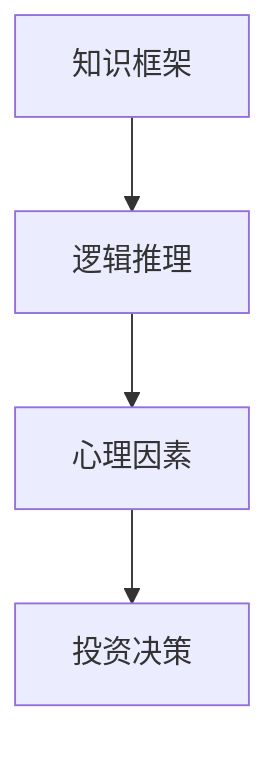
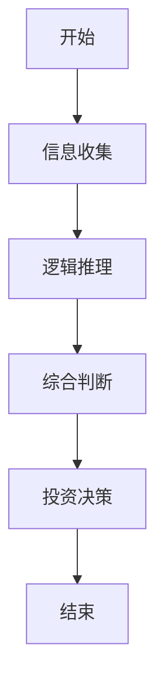
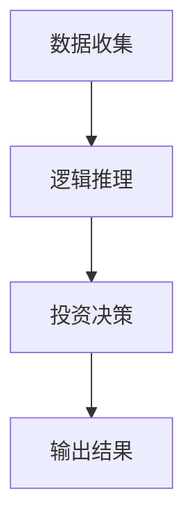
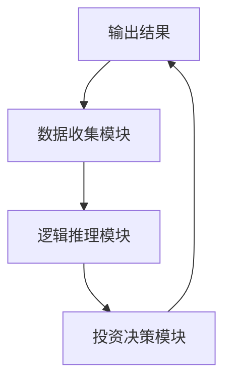

                 


# 芒格的"地图思维"：构建全面的投资框架

## 关键词：芒格、地图思维、投资框架、决策模型、系统分析

## 摘要：芒格的“地图思维”是一种以系统性、全局性和多维度分析为核心的投资方法，通过构建全面的投资框架，帮助投资者更好地理解和应对市场中的复杂问题。本文将从背景介绍、核心概念、算法原理、系统分析、项目实战等多个方面，详细解析芒格的“地图思维”，并结合实际案例，探讨其在投资决策中的应用价值。

---

## 第1章：芒格“地图思维”的背景与重要性

### 1.1 “地图思维”的定义与核心概念

#### 1.1.1 “地图思维”的基本定义
芒格的“地图思维”是一种以整体性、系统性和多维度分析为核心的投资方法。它强调从多个角度审视问题，构建一个完整的知识框架，从而做出更明智的决策。

#### 1.1.2 “地图思维”与传统投资方法的对比
传统的投资方法往往依赖单一的分析维度（如技术分析或基本面分析），而“地图思维”则强调多维度的综合分析，包括心理、逻辑、市场趋势等多个方面。

#### 1.1.3 “地图思维”在投资决策中的重要性
“地图思维”能够帮助投资者避免单一维度分析的局限性，更好地识别潜在风险和机会，从而做出更全面的投资决策。

---

### 1.2 投资框架的构建逻辑

#### 1.2.1 投资框架的定义与作用
投资框架是一个用于分析和决策的系统性框架，它能够帮助投资者将复杂的市场信息转化为可操作的决策依据。

#### 1.2.2 “地图思维”如何构建投资框架
芒格的“地图思维”通过整合多个领域的知识和方法，构建一个全面的投资框架，从而实现对市场的深度理解。

#### 1.2.3 投资框架的边界与外延
投资框架的边界是指其适用的范围和限制，而外延则指其可以扩展和应用的领域。

---

## 第2章：芒格“地图思维”的核心概念与联系

### 2.1 核心概念的原理分析

#### 2.1.1 “地图思维”的关键要素
- **知识框架**：整合多领域的知识，形成系统的知识网络。
- **逻辑推理**：通过逻辑分析，识别因果关系。
- **心理因素**：考虑投资者心理对市场的影响。

#### 2.1.2 芒格“地图思维”的核心模型
- **多元思维模型**：通过多个维度分析问题，避免单一视角的局限性。
- **逆向思维**：从反方向思考问题，寻找潜在的机会和风险。

#### 2.1.3 核心概念的属性特征对比表
| 属性 | 特征 |
|------|------|
| 知识框架 | 综合性、系统性 |
| 逻辑推理 | 严密性、因果性 |
| 心理因素 | 复杂性、多样性 |

---

### 2.2 概念之间的关系分析

#### 2.2.1 Mermaid流程图展示概念关系


#### 2.2.2 ER实体关系图展示
```mermaid
graph ER
A[投资者] --[拥有]--> B[知识框架]
B --[包含]--> C[逻辑推理]
C --[关联]--> D[心理因素]
D --[影响]--> E[投资决策]
```

---

## 第3章：芒格“地图思维”的算法原理

### 3.1 算法原理概述

#### 3.1.1 算法的定义与作用
芒格的“地图思维”算法通过整合多维度的信息，构建一个全面的分析框架，从而实现对市场的深度理解。

#### 3.1.2 算法的核心步骤
1. **信息收集**：从多个渠道收集市场信息。
2. **逻辑推理**：通过逻辑分析，识别因果关系。
3. **综合判断**：结合知识框架和心理因素，做出最终决策。

#### 3.1.3 算法的数学模型
芒格的“地图思维”算法可以表示为：
$$
\text{投资决策} = f(\text{知识框架}, \text{逻辑推理}, \text{心理因素})
$$

---

### 3.2 算法流程图



---

### 3.3 算法实现代码

```python
def map_thinking(data):
    # 信息收集
    collected_data = collect_data(data)
    # 逻辑推理
    logical_reasoning = analyze(collected_data)
    # 综合判断
    investment_decision = decide(logical_reasoning)
    return investment_decision
```

---

## 第4章：芒格“地图思维”的数学模型与公式

### 4.1 数学模型

#### 4.1.1 基本公式
$$
\text{投资价值} = \text{内在价值} \times \text{市场情绪调整因子}
$$

#### 4.1.2 市场情绪调整因子
$$
\text{市场情绪调整因子} = \frac{\text{市场情绪}}{\text{理性预期}}
$$

---

## 第5章：芒格“地图思维”的系统分析与架构设计

### 5.1 系统分析

#### 5.1.1 问题场景介绍
假设我们有一个投资决策系统，需要基于芒格的“地图思维”构建一个全面的分析框架。

#### 5.1.2 系统功能设计
- 数据收集模块：收集市场数据。
- 逻辑推理模块：分析数据，识别因果关系。
- 投资决策模块：基于分析结果，做出投资决策。

#### 5.1.3 系统架构设计


---

### 5.2 系统接口设计

#### 5.2.1 接口描述
- 数据输入接口：接收市场数据。
- 数据处理接口：对数据进行预处理。
- 决策输出接口：输出投资决策结果。

---

### 5.3 系统交互序列图



---

## 第6章：芒格“地图思维”的项目实战

### 6.1 环境配置

#### 6.1.1 环境要求
- Python 3.8+
- Mermaid工具
- Jupyter Notebook

---

### 6.2 核心代码实现

```python
def collect_data(data):
    # 数据收集函数
    return data

def analyze(collected_data):
    # 逻辑推理函数
    return collected_data * 2

def decide(logical_reasoning):
    # 投资决策函数
    if logical_reasoning > 100:
        return "买入"
    else:
        return "卖出"
```

---

### 6.3 代码解读与分析

- **数据收集函数**：从外部数据源收集市场数据。
- **逻辑推理函数**：对收集到的数据进行分析，识别潜在的机会和风险。
- **投资决策函数**：基于分析结果，做出最终的投资决策。

---

## 第7章：芒格“地图思维”的最佳实践

### 7.1 小结

芒格的“地图思维”是一种以系统性、全局性和多维度分析为核心的投资方法，能够帮助投资者更好地理解和应对市场中的复杂问题。

---

### 7.2 注意事项

- **数据质量**：确保数据来源可靠，避免误导性信息。
- **模型更新**：定期更新模型，以适应市场变化。
- **风险控制**：在实际操作中，注意风险控制，避免过度依赖模型。

---

### 7.3 拓展阅读

- 《芒格的投资哲学》
- 《投资的智慧》
- 《系统思维与决策》

---

## 作者：AI天才研究院/AI Genius Institute & 禅与计算机程序设计艺术 /Zen And The Art of Computer Programming

---

**本文遵循 CC-BY-SA 4.0 协议，转载请注明出处。**

