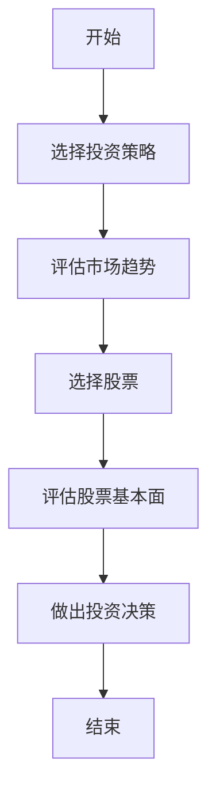
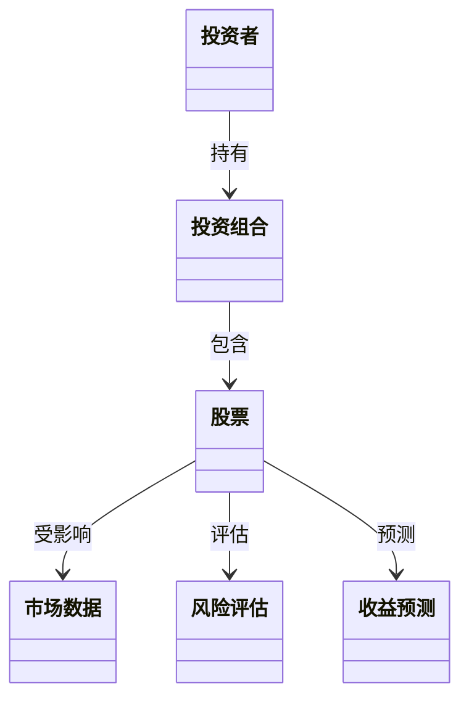
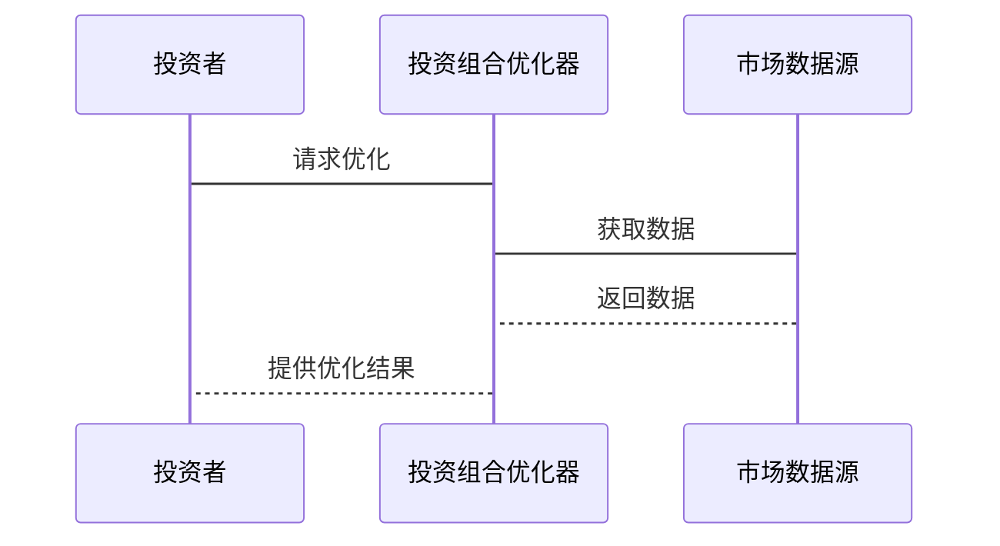

                 


# 芒格的多元思维方式在投资中的运用

**关键词**：芒格、多元思维模型、投资决策、风险管理、价值投资、成长投资

**摘要**：本文探讨了芒格的多元思维模型在投资中的应用，分析了其在价值投资、成长投资以及风险管理中的作用，通过数学模型和系统架构的设计，结合实际案例，展示了如何利用多元思维模型提升投资决策的科学性和准确性。

---

## 第一部分：芒格的多元思维模型概述

### 第1章：芒格的多元思维模型核心概念

#### 1.1 多元思维模型的定义与背景

芒格的多元思维模型是一种通过多学科交叉应用来解决复杂问题的思维方式。其核心在于将不同学科的原理和工具结合起来，以全面、系统的视角分析问题。芒格认为，投资决策不应仅依赖单一学科的视角，而是需要综合运用心理学、经济学、统计学等多学科的知识，从而避免认知偏差和错误决策。

**问题背景**：投资领域充满了不确定性，投资者常常面临信息不全、决策复杂等问题。传统的单一视角分析难以应对复杂的市场变化，容易导致错误决策。

**问题解决方法**：通过多元思维模型，投资者能够从多个角度分析问题，综合不同学科的智慧，提高决策的全面性和准确性。

**模型的边界与外延**：芒格的多元思维模型强调跨学科的应用，但并非所有学科都适用于投资分析。因此，需要明确模型的适用范围和边界，避免过度扩展。

#### 1.2 多元思维模型的核心要素

多元思维模型由多个核心要素组成，包括：

- **跨学科视角**：通过不同学科的交叉应用，获得更全面的分析视角。
- **逆向思维**：从问题的反面出发，寻找解决方案。
- **概率论应用**：通过概率分析，评估投资的可能收益和风险。

**核心概念与联系**：多元思维模型的各要素之间相互作用，共同构成一个完整的分析框架。例如，跨学科视角提供分析工具，逆向思维提供解决问题的新思路，概率论帮助评估决策的可行性。

---

## 第二部分：多元思维模型在投资中的应用

### 第2章：投资决策中的心理偏差与多元思维模型

#### 2.1 投资中的常见心理偏差

- **过度自信偏差**：投资者往往过于相信自己的判断，忽视市场变化。
- **羊群效应**：盲目跟随市场趋势，缺乏独立思考。
- **拉斯维加斯效应**：追求高风险高回报，忽视长期稳健发展。

**应对策略**：通过跨学科视角分析问题，利用逆向思维和概率论评估投资风险，克服心理偏差。

### 第3章：芒格的多元思维模型在价值投资中的应用

#### 3.1 价值投资的基本原理

- **定义与核心原则**：寻找被低估的股票，长期持有优质企业。
- **选股标准**：关注企业的基本面，如盈利能力、财务状况、行业地位等。

#### 3.2 多元思维模型的应用

- **跨学科视角**：通过分析企业的市场地位、财务状况、行业趋势等多方面因素，全面评估其内在价值。
- **逆向思维**：寻找市场忽视的优质企业，发现潜在投资机会。
- **概率论应用**：评估企业的盈利概率，确定投资的安全边际。

### 第4章：芒格的多元思维模型在成长投资中的应用

#### 4.1 成长投资的基本原理

- **定义与核心原则**：投资于具有高成长潜力的企业，追求长期收益。
- **选股标准**：关注企业的成长性、创新能力和市场前景。

#### 4.2 多元思维模型的应用

- **跨学科视角**：分析企业的技术创新、市场需求、竞争环境等多方面因素，评估其成长潜力。
- **逆向思维**：寻找处于成长初期的企业，提前布局未来趋势。
- **概率论应用**：评估企业的成长概率，优化投资组合的风险收益比。

---

## 第三部分：芒格多元思维模型的数学模型与算法

### 第5章：多元思维模型的数学基础

#### 5.1 概率论在投资中的应用

- **概率论的基本原理**：概率是事件发生的可能性，用于评估投资的收益和风险。
- **投资中的概率计算**：通过历史数据和市场趋势，计算投资的期望收益和方差。

**数学公式**：
$$ E(r) = \sum p_i r_i $$
$$ Var(r) = \sum p_i (r_i - E(r))^2 $$

其中，$E(r)$是期望收益率，$Var(r)$是收益率的方差，$p_i$是第$i$种情况的概率，$r_i$是第$i$种情况的收益率。

#### 5.2 决策树在投资分析中的应用

- **决策树的基本原理**：通过树状结构展示不同决策路径及其结果，帮助投资者评估各种可能性。
- **投资决策树的应用**：绘制可能的投资决策路径，计算每种路径的期望收益和风险。

**Mermaid决策树流程图**：


### 第6章：芒格的多元思维模型的算法原理

#### 6.1 决策树算法在投资中的应用

- **决策树的构建**：通过分析市场数据，构建投资决策树，识别关键决策点。
- **算法实现**：使用Python的scikit-learn库，实现决策树的训练和预测。

**Python代码实现**：
```python
from sklearn.tree import DecisionTreeClassifier
from sklearn.datasets import make_classification

# 创建示例数据
X, y = make_classification(n_samples=1000, n_features=4, n_classes=2)

# 训练决策树模型
model = DecisionTreeClassifier()
model.fit(X, y)

# 预测结果
y_pred = model.predict(X)
print("预测准确率:", model.score(X, y))
```

**数学模型**：决策树基于信息论中的信息增益，选择最优特征进行分裂，构建分类模型。

#### 6.2 概率论在风险评估中的应用

- **概率计算**：通过历史数据分析，计算不同投资组合的风险和收益。
- **蒙特卡罗模拟**：模拟多种市场情景，评估投资组合的潜在表现。

**Python代码实现**：
```python
import numpy as np
import matplotlib.pyplot as plt

# 生成随机数据
np.random.seed(42)
returns = np.random.normal(0.05, 0.15, 1000)

# 蒙特卡罗模拟
simulations = 1000
portfolios = np.random.dirichlet(np.ones(simulations), size=2)

# 计算收益和风险
mean_returns = np.mean(portfolios, axis=0) * returns.mean()
var_returns = np.var(portfolios, axis=0) * returns.var()

# 绘制收益与风险图
plt.scatter(mean_returns, var_returns, alpha=0.5)
plt.xlabel('Mean Return')
plt.ylabel('Variance')
plt.title('Monte Carlo Simulation of Investment Portfolios')
plt.show()
```

---

## 第四部分：系统分析与架构设计方案

### 第7章：系统功能设计

#### 7.1 领域模型

**Mermaid类图**：


### 第8章：系统架构设计

#### 8.1 系统架构图

**Mermaid架构图**：
```mermaid
docker
    server InvestmentSystem
    server contains
        service DataCollector
        service InvestmentModel
        service RiskAssessment
    service DataCollector --> service InvestmentModel: 提供数据
    service InvestmentModel --> service RiskAssessment: 分析风险
    service RiskAssessment --> server InvestmentSystem: 输出结果
```

### 第9章：系统接口设计

#### 9.1 系统接口

**Mermaid序列图**：


---

## 第五部分：项目实战

### 第10章：项目实战

#### 10.1 环境安装

安装必要的工具和库：
- Python 3.x
- Jupyter Notebook
- scikit-learn、pandas、numpy等库

#### 10.2 核心代码实现

**投资组合优化代码**：
```python
import numpy as np
from scipy.optimize import minimize

# 定义优化函数
def portfolio_optimization(weights, returns):
    # 权重约束
    return np.sum(weights) - 1

# 定义目标函数
def objective(weights, returns):
    return np.var(weights.dot(returns))

# 约束条件
cons = {'type': 'eq', 'fun': lambda w: portfolio_optimization(w, returns)}

# 初始权重
n_assets = returns.shape[1]
initial_weights = np.array([1.0/n_assets] * n_assets)

# 优化
result = minimize(objective, initial_weights, args=returns, constraints=cons)

print("最优权重:", result.x)
print("最小方差:", result.fun)
```

#### 10.3 实际案例分析

以某成长型企业为例，分析其成长潜力和投资价值，结合多元思维模型进行投资决策。

---

## 第六部分：总结与展望

### 第11章：总结与展望

**最佳实践 tips**：
- 多阅读经典投资书籍，扩展知识面。
- 实践中不断总结经验，优化决策模型。
- 注意投资风险，保持理性思维。

**注意事项**：
- 投资有风险，需谨慎决策。
- 多元思维模型的应用需要时间和经验积累，不可急于求成。

**拓展阅读**：
- 《芒格的智慧》
- 《投资学原理》
- 《风险管理与投资组合优化》

**作者信息**：
作者：AI天才研究院 & 禅与计算机程序设计艺术

---

通过以上结构，本文详细阐述了芒格的多元思维模型在投资中的应用，从理论到实践，从算法到系统架构，为投资者提供了科学的决策方法和工具。希望读者能够通过本文，更好地理解并应用多元思维模型，提升投资决策的准确性和稳健性。

