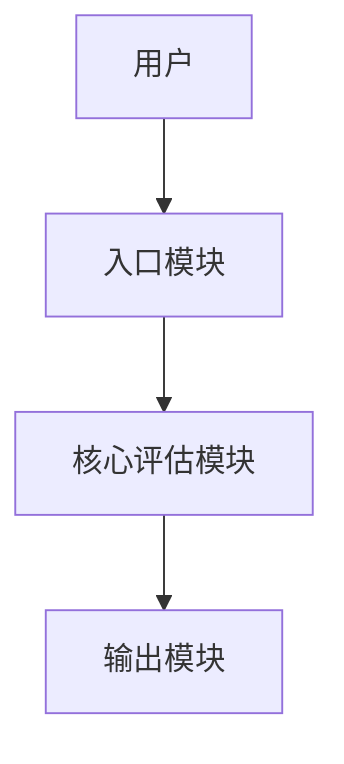

                 


# 芒格的"多元思维格栅"在跨学科创新项目评估中的应用

## 关键词：芒格思维格栅，跨学科创新，项目评估，多元思维模型，系统架构

## 摘要：  
本文探讨了芒格的“多元思维格栅”在跨学科创新项目评估中的应用。通过分析芒格的思维模型，结合跨学科创新的核心原理，提出了一种基于多元思维格栅的创新项目评估方法。该方法整合了多个学科的思维模型，构建了一个动态、系统化的评估框架，能够有效提升创新项目的评估效率和准确性。

---

## 第1章: 多元思维格栅的核心概念

### 1.1 芒格思想的背景与核心理念

#### 1.1.1 芒格的哲学与投资思想  
芒格（Charlie Munger）是伯克希尔·哈撒韦公司的副主席，被誉为“巴菲特的老师”。他的投资哲学和人生智慧的核心是“多元思维格栅”。芒格认为，人类的认知是通过多个学科的思维模型构建起来的，只有通过跨学科的视角，才能更好地理解复杂问题。

$$\text{芒格公式：认知 = 多元思维模型的结合与互动}$$

芒格的思维模型包括心理学、经济学、物理学、化学、生物学等多个学科的核心原理。他认为，通过构建多元思维格栅，可以避免单一学科的局限性，从而做出更明智的决策。

#### 1.1.2 多元思维格栅的定义与内涵  
多元思维格栅是一种将多个学科的思维模型整合在一起的框架。它通过将不同领域的知识交叉融合，形成一个完整的认知体系。多元思维格栅的核心在于：  
1. **模型的多样性**：涵盖多个学科的核心模型。  
2. **模型的关联性**：模型之间相互关联，形成一个动态的系统。  
3. **模型的实用性**：能够应用于实际问题的解决。

#### 1.1.3 跨学科思维的重要性  
跨学科思维是多元思维格栅的核心，它要求我们跳出单一学科的框架，从多个角度审视问题。跨学科思维能够帮助我们更好地理解复杂系统的运作方式，从而在创新项目评估中做出更全面的判断。

### 1.2 多元思维格栅的核心模型

#### 1.2.1 格栅模型的结构与特点  
多元思维格栅的结构可以分为以下几个层次：  
1. **底层模型**：包括物理学、化学、生物学等基础学科的模型。  
2. **中间层模型**：包括经济学、心理学、社会学等应用学科的模型。  
3. **顶层模型**：包括哲学、系统论等综合学科的模型。  

$$\text{格栅模型的公式化表达：}$$  
$$ \text{格栅结构} = \{M_1, M_2, M_3, \ldots, M_n\} $$  
其中，$M_i$ 表示各个学科的思维模型。

#### 1.2.2 格栅模型与跨学科创新的关系  
多元思维格栅通过整合多个学科的模型，为跨学科创新提供了理论基础。创新项目往往涉及多个学科的知识，通过格栅模型，可以更好地理解项目的核心问题，并找到解决方案。

#### 1.2.3 格栅模型的动态更新机制  
多元思维格栅不是一成不变的，它需要根据实际情况不断更新和优化。通过引入新的模型或调整现有模型的权重，可以确保格栅模型始终能够适应复杂的变化。

### 1.3 多元思维格栅的应用场景

#### 1.3.1 投资决策中的应用  
在投资决策中，芒格通过多元思维格栅分析企业的财务状况、市场环境、管理团队等多个方面，从而做出更明智的投资决策。

#### 1.3.2 创新项目评估中的应用  
在创新项目评估中，多元思维格栅可以帮助评估者从技术、市场、用户需求等多个维度进行全面分析。

#### 1.3.3 个人成长与决策优化  
对于个人而言，多元思维格栅可以帮助我们更好地理解自己的优势和劣势，从而做出更优化的决策。

---

## 第2章: 跨学科创新项目评估的基础

### 2.1 跨学科创新的定义与特点

#### 2.1.1 跨学科创新的定义  
跨学科创新是指通过整合多个学科的知识和技术，提出创新的解决方案。跨学科创新的核心在于“交叉”和“融合”，它能够突破单一学科的局限性。

#### 2.1.2 跨学科创新的核心要素  
1. **跨学科知识整合**：整合多个学科的核心知识。  
2. **创新方法论**：采用系统化的创新方法。  
3. **团队协作**：跨学科团队的协作是跨学科创新的关键。

#### 2.1.3 跨学科创新与传统创新的区别  
传统创新通常基于单一学科的知识，而跨学科创新则强调多个学科的交叉与融合。

### 2.2 跨学科创新的思维方式

#### 2.2.1 整体性思维  
整体性思维要求我们在评估创新项目时，从整体的角度出发，考虑项目的所有相关因素。

#### 2.2.2 联系性思维  
联系性思维强调不同学科之间的联系，通过分析这些联系，找到创新的突破口。

#### 2.2.3 综合性思维  
综合性思维要求我们在评估创新项目时，综合考虑多个学科的优缺点，从而做出更全面的判断。

### 2.3 跨学科创新的评估标准

#### 2.3.1 项目创新性评估标准  
1. **创新性**：项目是否具有创新性。  
2. **技术可行性**：项目是否具有技术可行性。  
3. **市场潜力**：项目是否具有市场潜力。

#### 2.3.2 项目可行性评估标准  
1. **资源需求**：项目是否需要大量资源。  
2. **时间周期**：项目是否能够在合理的时间内完成。  
3. **风险评估**：项目是否存在重大风险。

#### 2.3.3 项目可持续性评估标准  
1. **长期价值**：项目是否具有长期价值。  
2. **社会影响**：项目是否对社会产生积极影响。  
3. **环境影响**：项目是否对环境产生负面影响。

---

## 第3章: 多元思维格栅在跨学科创新中的应用

### 3.1 多元思维格栅的跨学科模型构建

#### 3.1.1 格栅模型的跨学科适配性  
多元思维格栅的跨学科适配性是指格栅模型能够适应不同学科的特点。通过调整模型的权重和组合方式，可以确保格栅模型能够适应不同的创新项目。

#### 3.1.2 跨学科模型的构建步骤  
1. **确定目标**：明确跨学科创新项目的评估目标。  
2. **选择模型**：根据目标选择合适的多元思维模型。  
3. **模型组合**：将多个模型组合起来，形成一个完整的评估框架。  
4. **模型优化**：根据实际情况不断优化模型。

#### 3.1.3 跨学科模型的动态调整  
跨学科模型需要根据项目的实际情况进行动态调整。通过实时更新模型的权重和组合方式，可以确保模型始终能够适应项目的最新进展。

### 3.2 多元思维格栅在创新项目评估中的具体应用

#### 3.2.1 项目背景分析  
在创新项目评估中，背景分析是最重要的步骤之一。通过分析项目的背景，可以更好地理解项目的本质和目标。

#### 3.2.2 项目目标与范围的定义  
明确项目的评估目标和范围是评估工作的基础。只有明确目标和范围，才能更好地进行后续的评估工作。

#### 3.2.3 项目评估的系统架构设计  
在创新项目评估中，系统架构设计是关键。通过设计合理的系统架构，可以确保评估工作的高效性和准确性。

---

## 第4章: 跨学科创新项目评估的系统架构设计

### 4.1 项目介绍

#### 4.1.1 项目背景  
本项目旨在通过多元思维格栅评估一个跨学科创新项目，确保项目的评估过程更加系统化和科学化。

#### 4.1.2 项目目标  
本项目的目标是通过多元思维格栅，评估一个跨学科创新项目，并提出改进建议。

### 4.2 系统功能设计

#### 4.2.1 领域模型设计  
领域模型是系统设计的核心。通过构建领域模型，可以更好地理解项目的各个方面。

$$\text{领域模型公式：}$$  
$$ \text{领域模型} = \{U, R, E\} $$  
其中，$U$ 表示用户，$R$ 表示角色，$E$ 表示实体。

#### 4.2.2 系统架构设计  
系统架构设计是系统设计的关键。通过设计合理的系统架构，可以确保系统的高效性和可扩展性。

$$\text{系统架构图：}$$  


---

## 第5章: 跨学科创新项目评估的算法实现

### 5.1 算法原理

#### 5.1.1 算法思想  
多元思维格栅算法的核心思想是通过多个模型的组合，实现对创新项目的全面评估。

#### 5.1.2 算法步骤  
1. **模型选择**：根据项目特点选择合适的多元思维模型。  
2. **模型组合**：将多个模型组合起来，形成一个完整的评估框架。  
3. **模型评估**：根据评估结果不断优化模型。

#### 5.1.3 算法实现  
通过Python代码实现多元思维格栅算法，具体实现步骤如下：

#### 5.1.4 代码实现  
```python
def multi_think_grill(models):
    # 初始化评估结果
    result = 0
    # 组合模型
    for model in models:
        result += model评估结果
    # 返回最终结果
    return result

# 示例代码
models = [model1, model2, model3]
result = multi_think_grill(models)
print(result)
```

### 5.2 算法优化

#### 5.2.1 算法优化思想  
通过动态调整模型的权重，可以提高算法的评估精度。

#### 5.2.2 算法优化实现  
通过引入动态权重调整机制，可以更好地适应项目的实际情况。

---

## 第6章: 跨学科创新项目评估的项目实战

### 6.1 项目环境配置

#### 6.1.1 环境需求  
1. **硬件需求**：需要配置高性能计算机。  
2. **软件需求**：需要安装Python、Jupyter Notebook等工具。

### 6.2 系统核心实现

#### 6.2.1 核心代码实现  
```python
def assess_project(models, project):
    # 初始化评估结果
    result = 0
    # 评估每个模型
    for model in models:
        result += model.assess(project)
    # 返回最终结果
    return result

# 示例代码
models = [economics_model, psychology_model, technology_model]
project = {"name": "智能城市项目", "description": "..."}
result = assess_project(models, project)
print(result)
```

### 6.3 代码应用解读

#### 6.3.1 代码功能解读  
1. **模型评估**：通过调用每个模型的评估方法，对项目进行评估。  
2. **结果汇总**：将多个模型的评估结果汇总，得到最终的评估结果。

### 6.4 实际案例分析

#### 6.4.1 案例背景  
以“智能城市项目”为例，分析多元思维格栅在项目评估中的应用。

#### 6.4.2 案例分析  
通过多元思维格栅，可以从技术、经济、社会等多个维度对智能城市项目进行全面评估。

### 6.5 项目小结

#### 6.5.1 项目总结  
通过多元思维格栅，可以更全面地评估创新项目，提高评估的准确性和效率。

#### 6.5.2 项目经验  
在实际应用中，需要不断优化多元思维格栅模型，以适应项目的实际情况。

---

## 第7章: 总结与展望

### 7.1 总结

#### 7.1.1 芒格思维格栅的核心价值  
芒格思维格栅通过整合多个学科的思维模型，为跨学科创新项目评估提供了理论基础和方法论。

#### 7.1.2 本文的主要内容  
本文通过分析芒格思维格栅在跨学科创新项目评估中的应用，提出了一个系统的评估框架。

### 7.2 展望

#### 7.2.1 未来发展方向  
未来，可以通过引入人工智能技术，进一步优化多元思维格栅模型，提高评估的效率和准确性。

#### 7.2.2 建议与注意事项  
在实际应用中，需要注意模型的动态调整和优化，确保模型始终能够适应项目的实际情况。

---

## 作者：AI天才研究院/AI Genius Institute & 禅与计算机程序设计艺术 /Zen And The Art of Computer Programming

---

**附录**  
- **附录A**：多元思维格栅模型的具体实现细节  
- **附录B**：跨学科创新项目的评估工具推荐  
- **附录C**：相关领域的进一步阅读材料  

---

**结束语**  
芒格的多元思维格栅是一种强大的工具，它能够帮助我们更好地理解复杂问题，并做出更明智的决策。通过将多元思维格栅应用于跨学科创新项目评估，我们可以更全面地分析项目，提高评估的准确性和效率。希望本文能够为相关领域的研究者和实践者提供有价值的参考。

