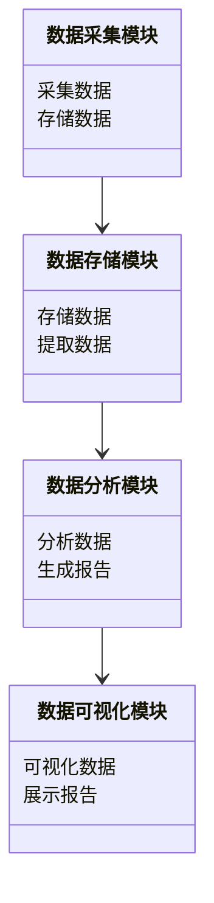
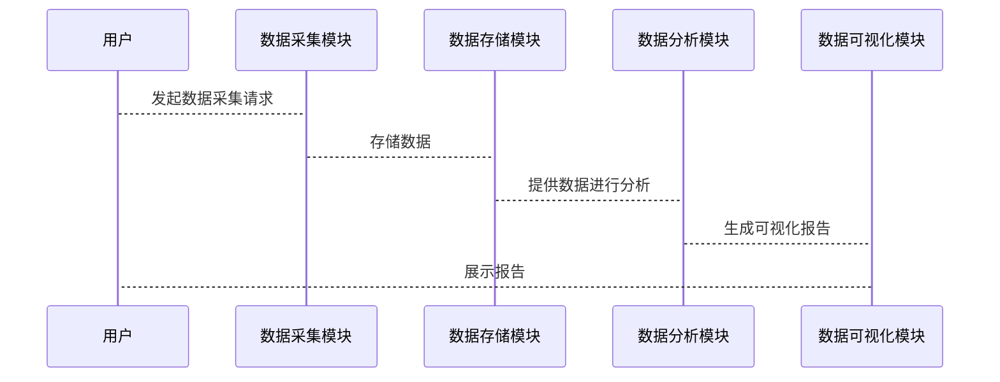

                 


# 芒格的"多元思维格栅"在跨学科技术融合中的应用

## 关键词：多元思维格栅，跨学科技术融合，芒格思维模型，技术融合，系统架构设计

## 摘要：  
芒格的“多元思维格栅”是一种通过多学科交叉思维来解决问题的方法，其核心在于将不同学科的思维方式和知识框架有机地结合起来，形成一个强大的思维系统。在当前技术快速融合的时代，多元思维格栅在跨学科技术融合中展现出独特的优势。本文从芒格多元思维格栅的核心理念出发，结合具体的技术领域（如人工智能、大数据分析和区块链），详细探讨其在技术融合中的应用。通过系统分析和架构设计，本文为技术融合提供了一种新的思维方式和方法论。

---

## 正文

### 第一部分：芒格多元思维格栅概述

#### 第1章：芒格多元思维格栅的核心理念

##### 1.1 多元思维格栅的定义与特点

**1.1.1 多元思维格栅的定义**  
芒格的多元思维格栅是一种通过多学科交叉思维来解决问题的方法。它将不同学科的知识框架（如心理学、经济学、数学、计算机科学等）有机地结合在一起，形成一个强大的思维系统。

**1.1.2 多元思维格栅的核心特点**  
- **多学科交叉**：多元思维格栅的核心在于将多个学科的知识框架结合起来，形成一个综合的思维方式。  
- **动态性**：随着知识的更新和技术的发展，多元思维格栅需要不断更新和调整，以适应新的问题和挑战。  
- **系统性**：多元思维格栅强调系统性思维，注重各个学科知识之间的联系和相互作用。  

**1.1.3 多元思维格栅与传统思维模型的区别**  
传统的思维模型通常局限于单一学科或领域，而多元思维格栅强调跨学科的交叉应用，能够更好地应对复杂问题。

##### 1.2 多元思维格栅的核心要素

**1.2.1 格栅的构成：知识领域与思维维度**  
多元思维格栅由多个知识领域和思维维度构成。例如，心理学中的行为模型、经济学中的成本收益分析、计算机科学中的算法思维等。

**1.2.2 格栅的交叉性：多学科融合的优势**  
通过多学科知识的交叉应用，多元思维格栅能够从多个角度分析问题，从而提供更全面的解决方案。

**1.2.3 格栅的动态性：知识更新与思维进化**  
随着技术的发展和知识的更新，多元思维格栅需要不断吸收新的知识和思维方式，以保持其活力和适应性。

##### 1.3 多元思维格栅的应用场景

**1.3.1 跨学科问题解决**  
在跨学科问题中，多元思维格栅能够提供多角度的分析和解决方案。例如，在医疗领域，可以结合医学知识和数据科学方法，优化诊断和治疗方案。

**1.3.2 技术融合中的思维模型**  
在技术融合中，多元思维格栅能够帮助技术开发者从多个角度思考问题，从而设计出更高效的技术架构。

**1.3.3 企业创新与决策优化**  
企业可以通过多元思维格栅优化决策过程，从多个维度分析问题，从而做出更科学的决策。

##### 1.4 本章小结  
本章介绍了芒格多元思维格栅的核心理念，包括其定义、特点、核心要素以及应用场景。多元思维格栅作为一种跨学科的思维方式，为技术融合和创新提供了新的视角和方法。

---

### 第二部分：跨学科技术融合的背景与挑战

#### 第2章：跨学科技术融合的现状与趋势

##### 2.1 跨学科技术融合的背景

**2.1.1 当前技术发展的多学科交叉趋势**  
随着技术的发展，许多新兴技术（如人工智能、大数据、区块链等）都具有跨学科的特性，需要结合多个领域的知识才能实现创新。

**2.1.2 数字化与智能化时代的跨学科需求**  
在数字化和智能化时代，技术融合已经成为趋势，跨学科思维能力对于技术创新和应用至关重要。

**2.1.3 跨学科技术融合的核心问题**  
跨学科技术融合的核心问题是如何将不同领域的知识和技术有效地结合起来，形成新的解决方案。

##### 2.2 跨学科技术融合的关键挑战

**2.2.1 知识壁垒与学科隔阂**  
不同学科之间的知识壁垒和隔阂可能导致跨学科技术融合的困难。

**2.2.2 技术融合中的协同问题**  
技术融合需要不同领域的专家协同合作，但在实际操作中，可能存在沟通不畅和协作效率低的问题。

**2.2.3 跨学科团队的协作效率**  
跨学科团队的协作效率受到不同领域思维方式和工作习惯的影响，可能影响技术融合的进程。

##### 2.3 跨学科技术融合的未来展望

**2.3.1 新兴技术领域中的跨学科应用**  
新兴技术领域（如AI+医疗、AI+教育等）将更加依赖跨学科技术融合。

**2.3.2 跨学科技术融合对社会创新的推动**  
跨学科技术融合将推动社会创新，解决复杂的现实问题。

**2.3.3 跨学科技术融合的未来趋势**  
未来，跨学科技术融合将更加普遍，成为技术创新和应用的重要方式。

##### 2.4 本章小结  
本章分析了跨学科技术融合的背景、挑战和未来趋势，强调了跨学科思维在技术融合中的重要性。

---

### 第三部分：芒格多元思维格栅在技术融合中的应用

#### 第3章：多元思维格栅与技术融合的核心联系

##### 3.1 多元思维格栅的技术属性分析

**3.1.1 多元思维格栅的技术视角**  
从技术视角来看，多元思维格栅是一种多维度的思维方式，能够帮助技术开发者从多个角度分析问题。

**3.1.2 技术融合中的格栅模型**  
在技术融合中，多元思维格栅可以作为一个框架，帮助整合不同领域的技术知识和方法。

**3.1.3 格栅模型与技术架构的对应关系**  
格栅模型的多学科属性与技术架构的多模块特性有相似之处，可以为技术架构设计提供启发。

##### 3.2 多元思维格栅与技术融合的对比分析

**3.2.1 格栅模型的多学科属性**  
多元思维格栅强调多学科知识的交叉应用，而技术融合需要不同技术领域的协同合作。

**3.2.2 技术融合的多维度特征**  
技术融合涉及多个技术领域和维度，需要综合考虑各种因素。

**3.2.3 两者在问题解决中的协同作用**  
多元思维格栅为技术融合提供了多角度的分析和解决方案，而技术融合则为多元思维格栅提供了实际应用场景。

##### 3.3 多元思维格栅在技术融合中的优势

**3.3.1 提供跨学科视角**  
多元思维格栅能够帮助技术开发者从多个学科的角度思考问题，提供更全面的解决方案。

**3.3.2 促进技术协同创新**  
通过多元思维格栅，不同领域的技术知识和技术方法可以有机结合，促进技术创新。

**3.3.3 提高问题解决效率**  
多元思维格栅的多维度分析能力可以提高问题解决的效率，减少试错成本。

##### 3.4 本章小结  
本章探讨了多元思维格栅与技术融合的核心联系，分析了其在技术融合中的优势和应用潜力。

---

#### 第4章：多元思维格栅在具体技术领域的应用

##### 4.1 多元思维格栅在人工智能中的应用

**4.1.1 人工智能与多元思维格栅的结合**  
人工智能涉及多个学科（如计算机科学、数学、心理学等），多元思维格栅可以帮助人工智能开发者从多个角度思考问题。

**4.1.2 人工智能中的跨学科问题解决**  
例如，在自然语言处理中，可以结合语言学知识和算法优化方法，提高模型的性能。

**4.1.3 人工智能技术融合的案例分析**  
以深度学习和强化学习的结合为例，多元思维格栅可以提供跨学科的思维方式，优化模型设计。

##### 4.2 多元思维格栅在大数据分析中的应用

**4.2.1 大数据分析中的跨学科思维**  
大数据分析需要结合统计学、计算机科学、数据可视化等知识，多元思维格栅能够帮助分析者从多个角度分析数据。

**4.2.2 大数据技术融合的格栅模型**  
通过多元思维格栅，可以将数据采集、存储、分析、可视化等环节有机结合起来，形成一个完整的分析系统。

**4.2.3 实际案例：大数据驱动的决策优化**  
例如，在商业领域，可以结合大数据分析和经济学的成本收益分析，优化企业的决策过程。

##### 4.3 多元思维格栅在区块链技术中的应用

**4.3.1 区块链技术的跨学科特性**  
区块链技术涉及计算机科学、经济学、法学等多个学科，多元思维格栅可以帮助开发者从多个角度思考问题。

**4.3.2 区块链技术融合中的格栅模型**  
通过多元思维格栅，可以将区块链的去中心化特性、安全性、可扩展性等维度结合起来，优化技术设计。

**4.3.3 实际案例：区块链在供应链管理中的应用**  
例如，在供应链管理中，可以结合区块链技术和物流管理知识，优化供应链的透明度和效率。

##### 4.4 本章小结  
本章通过具体技术领域的案例，展示了多元思维格栅在技术融合中的实际应用，证明了其在技术创新和应用中的价值。

---

### 第四部分：系统分析与架构设计方案

#### 第5章：技术融合中的系统分析与架构设计

##### 5.1 问题场景介绍

**5.1.1 技术融合中的问题描述**  
以人工智能和大数据分析的融合为例，技术融合中需要解决数据处理、算法优化、系统集成等问题。

**5.1.2 系统目标与范围**  
系统目标是设计一个高效的人工智能大数据分析系统，系统范围包括数据采集、存储、分析、可视化等模块。

**5.1.3 系统需求分析**  
- 数据处理能力：支持大规模数据的高效处理。  
- 算法优化：实现高效的算法优化和模型训练。  
- 系统集成：实现各模块的协同工作，保证系统的高效性和稳定性。  

##### 5.2 系统功能设计

**5.2.1 领域模型设计（mermaid 类图）**



**5.2.2 系统架构设计（mermaid 架构图）**


**5.2.3 系统接口设计**  
系统接口设计包括数据接口、算法接口、用户接口等，确保各模块之间的高效协作。

**5.2.4 系统交互设计（mermaid 序列图）**



##### 5.3 系统实现与优化

**5.3.1 环境安装与配置**  
需要安装Python、Jupyter Notebook、TensorFlow、Pandas等工具，并配置相应的开发环境。

**5.3.2 核心实现源代码**  
以下是系统核心实现的Python代码示例：

```python
import pandas as pd
import numpy as np
from sklearn.model_selection import train_test_split
from sklearn.ensemble import RandomForestClassifier
from sklearn.metrics import accuracy_score

# 数据加载
data = pd.read_csv('data.csv')

# 数据预处理
X = data.drop('target', axis=1)
y = data['target']

# 数据分割
X_train, X_test, y_train, y_test = train_test_split(X, y, test_size=0.2, random_state=42)

# 模型训练
model = RandomForestClassifier()
model.fit(X_train, y_train)

# 模型预测
y_pred = model.predict(X_test)

# 模型评估
print(f'Accuracy: {accuracy_score(y_test, y_pred)}')
```

**5.3.3 代码应用解读与分析**  
上述代码展示了如何利用Python和机器学习库（如Scikit-learn）进行数据分析和建模。代码加载数据、预处理数据、训练模型并评估模型性能。

**5.3.4 实际案例分析与详细讲解**  
以医疗数据分析为例，利用多元思维格栅，结合医学知识和数据科学方法，优化诊断和治疗方案。

**5.3.5 项目小结**  
本节通过具体案例，展示了多元思维格栅在技术融合中的实际应用，证明了其在系统设计和优化中的价值。

---

## 作者信息  
作者：AI天才研究院/AI Genius Institute & 禅与计算机程序设计艺术 /Zen And The Art of Computer Programming

