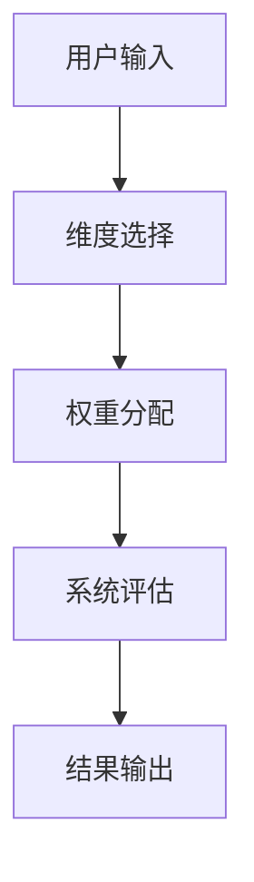

                 


# 《芒格的"多元思维格栅"在跨学科量子技术评估中的应用》

---

## 关键词：
- 多元思维格栅  
- 量子技术  
- 跨学科评估  
- 量子计算  
- 技术评估方法  

---

## 摘要：
芒格的"多元思维格栅"是一种通过整合多个学科的思维方式来提升问题解决能力的方法。本文探讨了如何将这种方法应用于量子技术的跨学科评估中，通过构建一个多维度的分析框架，从物理、计算机科学、数学等角度对量子技术进行系统性分析。文章结合量子技术的基本原理、数学模型和实际应用场景，详细阐述了多元思维格栅在量子技术评估中的具体应用，并通过实际案例展示了其在优化技术评估流程中的优势。

---

# 第1章: 引言

## 1.1 多元思维格栅的核心概念
多元思维格栅（Mental Model Lattice）是芒格提出的一种思维方式，强调通过整合多个学科的核心思想来构建一个立体的知识框架。这种方法能够帮助我们在面对复杂问题时，从多个维度进行分析，避免单一视角的局限性。

## 1.2 量子技术的跨学科特性
量子技术作为一个新兴领域，涉及物理学、计算机科学、数学等多个学科。其复杂性要求我们在评估时，必须综合考虑不同学科的特点和相互作用。

## 1.3 本文的研究意义
本文旨在将多元思维格栅应用于量子技术的跨学科评估中，通过构建一个多维度的分析框架，提升技术评估的全面性和准确性。

---

# 第2章: 量子技术的基本原理

## 2.1 量子叠加原理
量子叠加是量子力学的核心原理之一，描述了量子系统处于多个可能状态的叠加态。例如，一个量子比特（qubit）可以同时处于|0⟩和|1⟩的叠加态：
$$
|ψ⟩ = a|0⟩ + b|1⟩
$$
其中，$a$ 和 $b$ 是复数系数，满足$|a|^2 + |b|^2 = 1$。

## 2.2 量子纠缠原理
量子纠缠是量子系统中粒子之间的一种特殊关联，使得对一个粒子的测量会立即影响另一个粒子的状态。例如，两个纠缠的 qubit 可以表示为：
$$
|ψ⟩ = \frac{1}{\sqrt{2}}(|00⟩ + |11⟩)
$$

## 2.3 量子技术的数学模型
量子技术的核心可以通过矩阵和算符来描述。例如，量子态的演化可以用幺正矩阵表示：
$$
U|ψ⟩ = |ψ'⟩
$$
其中，$U$ 是一个幺正矩阵，$|ψ⟩$ 是初始量子态，$|ψ'⟩$ 是演化后的量子态。

---

# 第3章: 多元思维格栅的构建与应用

## 3.1 多元思维格栅的构建步骤
1. **选择学科**：从相关学科中选择关键的思维方式，例如物理学中的叠加原理、计算机科学中的算法设计、数学中的线性代数。
2. **构建框架**：将这些思维方式整合到一个统一的框架中，形成一个多维度的分析工具。
3. **权重分配**：根据实际问题的重要性，为每个维度分配权重。

## 3.2 多元思维格栅在量子技术评估中的应用
通过多元思维格栅，我们可以从多个维度对量子技术进行评估，例如：
- **技术可行性**：通过物理学和数学模型分析量子技术的实现难度。
- **计算能力**：通过计算机科学的视角评估量子计算机的计算性能。
- **实际应用潜力**：结合经济学和市场分析，评估量子技术的商业价值。

---

# 第4章: 量子技术评估的数学模型

## 4.1 多元思维格栅的权重分配
假设我们有 $n$ 个评估维度，每个维度的权重为 $w_i$，其中 $i = 1, 2, ..., n$。总评价值 $S$ 可以表示为：
$$
S = \sum_{i=1}^{n} w_i \cdot s_i
$$
其中，$s_i$ 是第 $i$ 个维度的评分。

## 4.2 量子技术评估的系统分析
通过构建一个系统模型，我们可以将量子技术的各个组成部分进行量化分析。例如，量子计算机的性能可以通过以下公式评估：
$$
\text{计算能力} = f(\text{量子比特数}, \text{相干时间}, \text{门操作速度})
$$

## 4.3 算法实现
以下是基于多元思维格栅的量子技术评估算法的伪代码：
```python
def quantum_technology_assessment(dimensions, weights):
    total_score = 0
    for i in range(len(dimensions)):
        score = assess_dimension(dimensions[i])
        total_score += weights[i] * score
    return total_score
```

---

# 第5章: 量子技术评估的系统架构

## 5.1 系统架构设计
以下是量子技术评估系统的架构图：


## 5.2 系统功能设计
1. **维度选择**：用户选择需要评估的维度，例如技术可行性、计算能力、实际应用潜力。
2. **权重分配**：用户为每个维度分配权重。
3. **系统评估**：系统根据输入的维度和权重，进行综合评估。
4. **结果输出**：输出评估结果，并提供改进建议。

---

# 第6章: 项目实战

## 6.1 环境安装
要运行以下代码，需要安装Python和相关的库，例如NumPy和Qiskit。

## 6.2 代码实现
以下是基于多元思维格栅的量子技术评估代码示例：
```python
import numpy as np
from qiskit import QuantumCircuit, Aer, execute

# 定义量子电路
qc = QuantumCircuit(2)
qc.h(0)
qc.cx(0, 1)
qc.measure_all()

# 模拟器
simulator = Aer('statevector_simulator')
result = execute(qc, simulator).result()
state = result.get_statevector()

# 计算量子态的概率
prob0 = np.abs(state[0]) ** 2
prob1 = np.abs(state[1]) ** 2
prob2 = np.abs(state[2]) ** 2
prob3 = np.abs(state[3]) ** 2

print(f"概率分布：{prob0}, {prob1}, {prob2}, {prob3}")
```

## 6.3 案例分析
通过上述代码，我们可以分析一个简单量子电路的概率分布，从而评估其计算能力。

---

# 第7章: 结论与展望

## 7.1 结论
本文通过构建一个多维度的分析框架，将芒格的多元思维格栅应用于量子技术的跨学科评估中，展示了其在提升技术评估全面性和准确性方面的优势。

## 7.2 未来展望
未来的研究可以进一步优化多元思维格栅的评估模型，并将其扩展到更多跨学科技术的评估中。

---

# 作者：AI天才研究院/AI Genius Institute & 禅与计算机程序设计艺术 /Zen And The Art of Computer Programming

