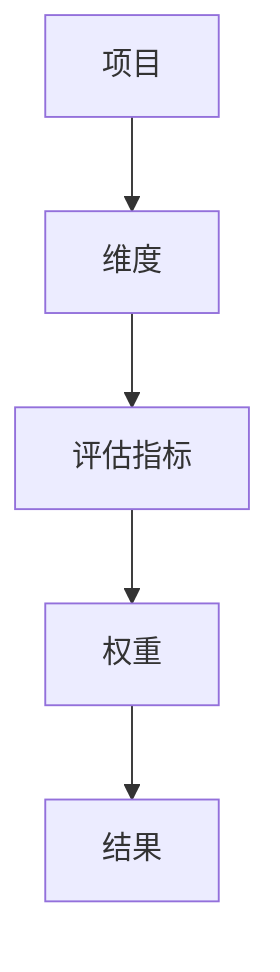
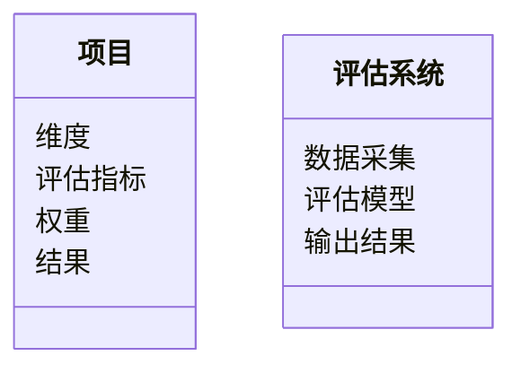
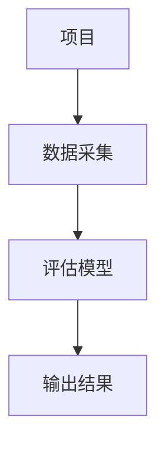
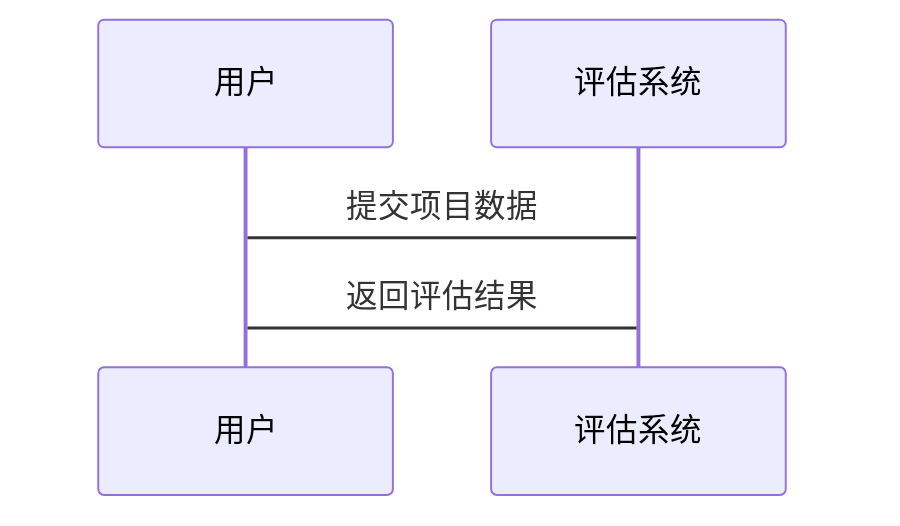

                 


# 芒格的"多元思维格栅"在跨维度创新项目评估中的应用

关键词：芒格、多元思维格栅、跨维度创新、项目评估、算法原理、系统架构

摘要：本文探讨了芒格的多元思维格栅在跨维度创新项目评估中的应用，通过详细分析其理论基础、算法原理、系统架构以及实际案例，展示了如何利用多元思维模型来提升项目评估的准确性和效率。文章内容涵盖从基础概念到实际应用的各个方面，帮助读者全面理解并掌握这一创新方法。

---

## 第一章：芒格的"多元思维格栅"基础与理论

### 1.1 多元思维格栅的背景与概念

#### 1.1.1 芒格的多元思维模型概述
芒格的多元思维模型是一种通过整合多个学科的核心原理来解决复杂问题的方法。它强调从多个维度（如心理学、经济学、工程学等）进行思考，以形成全面的视角。

#### 1.1.2 格栅的概念与特点
格栅是一种用于组织和分类信息的结构化工具。在项目评估中，多元思维格栅通过将不同维度的评估指标进行整合，形成一个综合的评估体系。

#### 1.1.3 跨维度创新项目的定义与特征
跨维度创新项目是指在多个领域或学科之间进行创新的项目。其特征包括复杂性高、涉及领域广、需要多学科协同等。

### 1.2 多元思维格栅的核心要素

#### 1.2.1 格栅的结构与组成
格栅由多个维度和评估指标组成，每个维度都有其特定的权重和评估标准。

#### 1.2.2 核心思维模型的分类
- **决策树模型**：用于分析项目的可行性。
- **机会成本模型**：评估项目的机会成本。
- **资源分配模型**：优化资源分配。

#### 1.2.3 格栅在项目评估中的作用
通过整合多个维度的评估结果，格栅能够提供更全面的项目评估，帮助决策者做出更明智的决策。

---

## 第二章：多元思维格栅的理论基础

### 2.1 格栅的核心模型与原理

#### 2.1.1 决策树模型
决策树模型通过树状结构展示项目可能的决策路径，帮助评估人员分析项目的各种可能性。

#### 2.1.2 机会成本模型
机会成本模型用于评估项目实施后可能错失的其他机会的价值。

#### 2.1.3 资源分配模型
资源分配模型通过优化资源分配，提高项目的整体效率。

### 2.2 多元思维模型的属性对比

| 模型属性 | 决策树模型 | 机会成本模型 | 资源分配模型 |
|----------|------------|--------------|--------------|
| 输入     | 决策节点   | 机会成本     | 资源需求     |
| 输出     | 最优路径   | 机会成本值   | 资源分配方案 |

### 2.3 格栅的ER实体关系图


---

## 第三章：跨维度创新项目评估的算法原理

### 3.1 算法原理概述

#### 3.1.1 算法输入与输出
- **输入**：项目维度、评估指标、权重。
- **输出**：综合评估结果。

#### 3.1.2 算法的基本步骤
1. 确定项目的各个维度和评估指标。
2. 为每个指标分配权重。
3. 计算每个指标的评估值。
4. 综合计算得出最终评估结果。

### 3.2 算法的数学模型与公式

#### 3.2.1 项目评估公式
$$
\text{评估结果} = \sum_{i=1}^{n} w_i \times v_i
$$
其中，$w_i$ 是维度 $i$ 的权重，$v_i$ 是维度 $i$ 的评估值。

#### 3.2.2 权重分配公式
$$
w_i = \frac{v_i}{\sum_{j=1}^{m} v_j}
$$
其中，$m$ 是维度的总数。

### 3.3 算法的实现代码
```python
def project_assessment(dimensions, weights):
    total = sum(weights)
    normalized_weights = [w / total for w in weights]
    return normalized_weights
```

---

## 第四章：系统分析与架构设计方案

### 4.1 系统功能设计

#### 4.1.1 领域模型


#### 4.1.2 系统架构设计


### 4.2 系统接口设计

#### 4.2.1 接口描述
- **输入接口**：接收项目维度和评估指标。
- **输出接口**：输出综合评估结果。

#### 4.2.2 接口交互流程


---

## 第五章：项目实战

### 5.1 环境安装
- 安装Python和相关库（如numpy、pandas）。

### 5.2 核心实现代码

```python
import numpy as np
import pandas as pd

def assess_project(dimensions, weights):
    normalized_weights = [w / sum(weights) for w in weights]
    assessment = {}
    for i in range(len(dimensions)):
        assessment[dimensions[i]] = normalized_weights[i]
    return assessment

# 示例
dimensions = ['技术可行性', '市场潜力', '团队能力']
weights = [0.4, 0.3, 0.3]
result = assess_project(dimensions, weights)
print(result)
```

### 5.3 案例分析
以智能硬件项目为例，评估其技术可行性、市场潜力和团队能力。

---

## 第六章：最佳实践与总结

### 6.1 小结
本文详细探讨了芒格的多元思维格栅在跨维度创新项目评估中的应用，通过理论分析和实际案例，展示了其在提升项目评估效率和准确性方面的优势。

### 6.2 注意事项
- 确保评估指标的全面性。
- 合理分配权重，避免偏颇。

### 6.3 未来趋势
随着AI和大数据技术的发展，多元思维格栅在项目评估中的应用将更加广泛和深入。

---

## 附录

### 参考文献
1. 芒格的多元思维模型相关书籍。
2. 项目评估的数学模型和算法参考文献。

### 技术资料
- Python代码示例。
- 评估系统的架构图和流程图。

---

## 作者

作者：AI天才研究院/AI Genius Institute & 禅与计算机程序设计艺术/Zen And The Art of Computer Programming

---

通过以上详细的内容展开，这篇文章不仅介绍了芒格的多元思维格栅的基本理论，还结合实际案例和算法原理，展示了其在跨维度创新项目评估中的具体应用，帮助读者全面理解和掌握这一方法。

