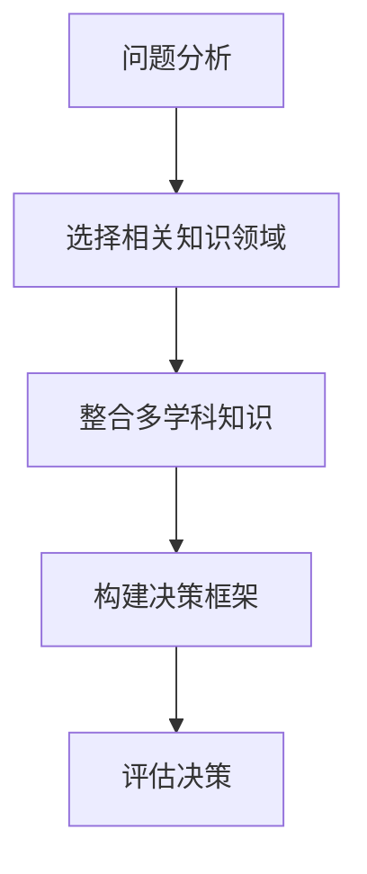
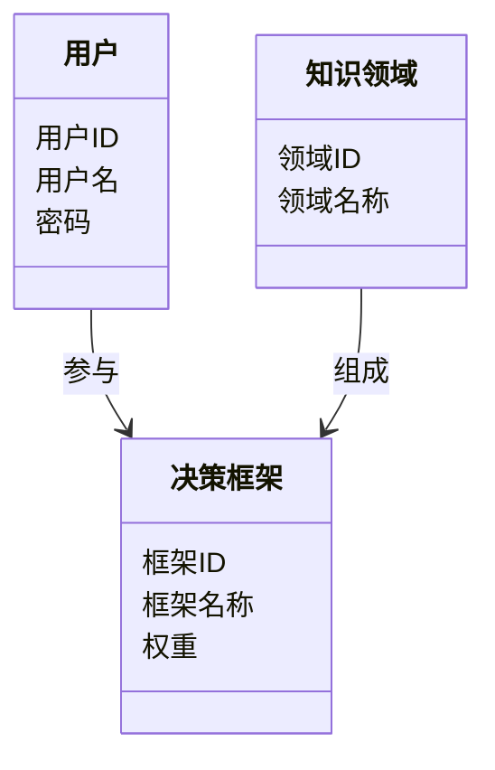
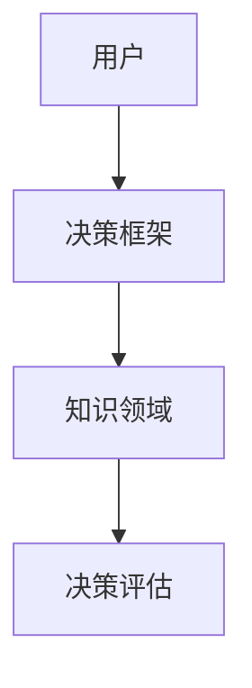

                 


# 芒格的"多元思维格栅"：提高决策质量的系统方法

---

## 关键词

- 多元思维模型
- 决策优化
- 系统思维
- 知识整合
- 项目实战

---

## 摘要

芒格的多元思维模型是一种通过构建多学科思维框架来提高决策质量的方法。本文从背景介绍、核心概念、算法原理、数学模型、系统架构、项目实战到最佳实践，全面解析多元思维模型的原理和应用，帮助读者提升决策能力。

---

## 第一部分：背景介绍

### 第1章：芒格多元思维模型的概述

#### 1.1 多元思维模型的起源与背景

芒格的多元思维模型由查理·芒格提出，旨在通过整合多个学科的知识来优化决策。其背景源于传统决策方法的局限性，传统方法往往依赖单一学科的视角，难以应对复杂问题。

#### 1.2 多元思维模型的核心概念

多元思维模型通过多学科的交叉应用，整合不同领域的知识，形成一个全面的思维框架，从而提高决策的准确性和全面性。

#### 1.3 多元思维模型的应用场景与优势

适用于个人和企业的决策场景，尤其在复杂问题中表现出优势，能够帮助决策者避免片面性，提高决策质量。

---

## 第二部分：核心概念与联系

### 第2章：多元思维模型的核心原理

#### 2.1 多元思维模型的原理与机制

通过多维度分析问题，整合不同学科的见解，形成全面的决策依据。

#### 2.2 多元思维模型的属性特征对比

| 属性 | 多元思维模型 | 传统决策模型 |
|------|-------------|--------------|
| 视角 | 多学科整合 | 单一学科依赖 |
| 决策 | 全面性 | 片面性 |

#### 2.3 多元思维模型的ER实体关系图

```mermaid
erDiagram
    actor 用户 {
        key string 用户ID
        string 用户名
        string 密码
    }
    actor 知识领域 {
        key string 领域ID
        string 领域名称
    }
    user 用户 --> 知识领域 知识领域
```

---

## 第三部分：算法原理讲解

### 第3章：多元思维模型的算法与数学模型

#### 3.1 多元思维模型的算法流程



#### 3.2 多元思维模型的数学模型与公式

决策正确概率公式：

$$
P(\text{决策正确}) = \sum_{i=1}^{n} w_i \cdot f_i
$$

其中，$$w_i$$ 是第 $$i$$ 个思维框架的权重，$$f_i$$ 是第 $$i$$ 个思维框架的贡献值。

---

## 第四部分：系统分析与架构设计方案

### 第4章：系统架构设计

#### 4.1 项目介绍

构建一个投资决策支持系统，应用多元思维模型进行决策优化。

#### 4.2 系统功能设计

领域模型：



#### 4.3 系统架构设计



---

## 第五部分：项目实战

### 第5章：环境安装与核心代码实现

#### 5.1 环境安装

安装Python和相关库，如numpy和pandas。

#### 5.2 核心代码实现

```python
import numpy as np
import pandas as pd

# 多元思维模型权重计算
def calculate_weights(framework_contributions):
    return np.array(framework_contributions) / sum(framework_contributions)

# 决策优化函数
def optimize_decision(framework_contributions):
    weights = calculate_weights(framework_contributions)
    return weights.dot(framework_contributions)

# 示例应用
framework_contributions = [0.2, 0.3, 0.5]
print(optimize_decision(framework_contributions))
```

---

## 第六部分：总结与拓展

### 第6章：总结与注意事项

#### 6.1 最佳实践

- 定期更新知识领域
- 结合实际案例不断优化模型
- 注意权重分配的合理性

#### 6.2 小结

芒格的多元思维模型通过整合多学科知识，帮助决策者提高决策质量，尤其在复杂问题中表现显著。

#### 6.3 注意事项

- 避免知识领域过多导致复杂性
- 定期评估模型的有效性

#### 6.4 拓展阅读

推荐书籍：《思考，快与慢》、《认知的偏见》。

---

## 作者

作者：AI天才研究院/AI Genius Institute & 禅与计算机程序设计艺术/Zen And The Art of Computer Programming

---

通过以上结构，文章详细解析了芒格的多元思维模型的背景、原理、算法、系统架构和项目实战，帮助读者系统地理解和应用这一方法，提升决策质量。

