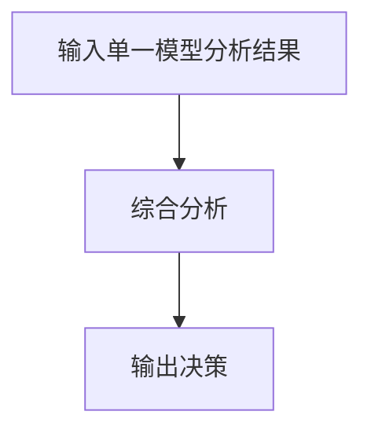
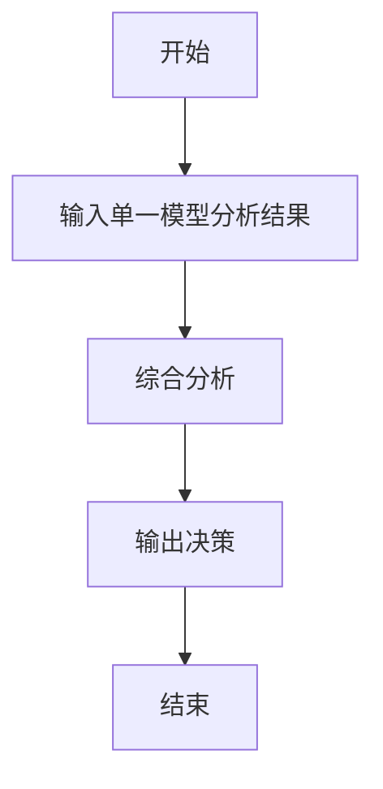
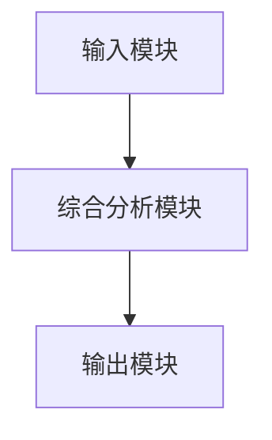

                 


# 芒格的"多元思维模型"在复杂投资环境中的应用

> 关键词：芒格, 多元思维模型, 投资环境, 复杂系统, 投资决策

> 摘要：本文深入探讨了芒格的多元思维模型在复杂投资环境中的应用，结合理论分析和实际案例，系统性地介绍了该模型的核心概念、算法原理、系统架构以及项目实战。通过详细讲解，帮助读者理解多元思维模型在复杂投资决策中的价值和实践方法。

---

# 第一部分: 芒格的"多元思维模型"概述

## 第1章: 多元思维模型的背景与核心概念

### 1.1 多元思维模型的起源与背景

芒格的多元思维模型是一种以跨学科知识为基础的投资方法，其核心在于通过多个不同的思维框架来分析和理解问题。这种方法源于查理·芒格（Charlie Munger）对知识的广泛涉猎和对投资决策的深刻理解。芒格认为，投资决策不应仅依赖单一的视角，而是需要结合多个学科的思维方式，如心理学、经济学、统计学等。

在当前复杂的投资环境中，传统的单一思维模型往往难以应对市场的不确定性。多元思维模型通过整合多个学科的智慧，帮助投资者更全面地分析问题，降低决策风险。

### 1.2 多元思维模型的核心概念与特点

#### 1.2.1 多元思维模型的定义
多元思维模型（Multifactor Mindset Model）是一种通过多个相互关联的思维框架来分析和解决问题的方法。它强调从多个角度看待问题，避免单一视角的局限性。

#### 1.2.2 多元思维模型的核心特点
- **跨学科性**：整合了多个学科的思维方式，如经济学、心理学、统计学等。
- **系统性**：强调对问题进行系统性分析，避免片面性。
- **动态性**：能够适应复杂投资环境的变化，具有较强的灵活性。

#### 1.2.3 多元思维模型与其他投资方法的区别

| 方法 | 焦点 | 优势 | 局限性 |
|------|------|------|--------|
| 单一思维模型 | 单一视角 | 简单易懂 | 易忽略其他因素 |
| 多元思维模型 | 多视角 | 全面性 | 复杂性较高 |

### 1.3 多元思维模型的结构与核心要素

#### 1.3.1 多元思维模型的结构分析
多元思维模型的结构可以分为三个层次：
1. **基础层**：单一学科的思维方式，如经济学的边际成本理论。
2. **中间层**：跨学科的综合思维方式，如将经济学和心理学结合起来分析市场行为。
3. **顶层**：全局视角的综合分析，将多个跨学科思维整合起来，形成最终的决策依据。

#### 1.3.2 核心要素的组成与关系
- **要素**：单一思维框架、跨学科综合思维、全局视角。
- **关系**：通过层级递进的方式，逐步整合多个思维框架，形成全面的分析能力。

#### 1.3.3 多元思维模型的边界与外延
- **边界**：多元思维模型的适用范围是复杂的投资环境，尤其在面对不确定性较高的情况时效果显著。
- **外延**：可以扩展到其他领域，如商业战略、风险管理等。

## 1.4 本章小结

本章介绍了芒格的多元思维模型的背景、核心概念和特点，以及与传统投资方法的区别。通过分析，我们理解了多元思维模型在复杂投资环境中的重要性。

---

## 第2章: 多元思维模型的核心概念与联系

### 2.1 多元思维模型的核心原理

#### 2.1.1 多元思维模型的哲学基础
多元思维模型的哲学基础是查理·芒格提倡的“心智模型”（mental models），即通过构建多个思维方式的框架来理解世界。

#### 2.1.2 多元思维模型的数学基础
多元思维模型可以看作是一种多维度分析方法，类似于数学中的多维空间分析。通过多个维度的综合分析，能够更全面地理解问题。

#### 2.1.3 多元思维模型的实践基础
芒格的多元思维模型来源于他对投资实践的深刻理解，通过结合多个学科的知识，形成了一套独特的分析框架。

### 2.2 多元思维模型的核心概念对比

#### 2.2.1 不同思维模型的特征对比

| 思维模型 | 特征 |
|----------|------|
| 单一模型 | 简单，但片面 |
| 多元模型 | 全面，但复杂 |

#### 2.2.2 多元思维模型与其他投资模型的对比

| 模型 | 优势 | 局限性 |
|------|-------|--------|
| 单一模型 | 简单 | 易忽略其他因素 |
| 多元模型 | 全面 | 复杂性较高 |

#### 2.2.3 多元思维模型在复杂环境中的优势
- **全面性**：能够从多个角度分析问题，降低决策风险。
- **灵活性**：能够适应复杂环境的变化，具有较强的适应性。

### 2.3 多元思维模型的ER实体关系图


---

## 第3章: 多元思维模型的算法原理与数学模型

### 3.1 多元思维模型的算法原理

#### 3.1.1 多元思维模型的输入与输出
- **输入**：多个单一思维模型的分析结果。
- **输出**：综合分析的最终决策。

#### 3.1.2 多元思维模型的算法流程


#### 3.1.3 多元思维模型的优化与改进
通过不断引入新的思维模型，优化算法的准确性。

### 3.2 多元思维模型的数学模型与公式

#### 3.2.1 基础公式与推导
$$
P = \sum_{i=1}^{n} w_i \cdot x_i
$$
其中，\( P \) 是综合决策概率，\( w_i \) 是各个单一模型的权重，\( x_i \) 是各个模型的分析结果。

#### 3.2.2 复杂模型的构建与应用
通过线性组合多个模型的结果，形成最终的综合分析结果。

#### 3.2.3 数学模型的实际案例分析
假设我们有两个单一模型，权重分别为0.4和0.6，结果分别为0.8和0.6。则综合决策概率为：
$$
P = 0.4 \cdot 0.8 + 0.6 \cdot 0.6 = 0.32 + 0.36 = 0.68
$$

### 3.3 多元思维模型的算法流程图



---

## 第4章: 多元思维模型在复杂投资环境中的系统分析与架构设计

### 4.1 复杂投资环境的系统分析

#### 4.1.1 投资环境的复杂性分析
复杂的投资环境通常涉及多个变量，如市场波动、政策变化等。

#### 4.1.2 多元思维模型在复杂环境中的应用
通过多个思维模型的综合分析，能够更全面地理解复杂环境。

#### 4.1.3 复杂投资环境的系统模型
构建一个包含多个变量的系统模型，用于分析投资环境的变化。

### 4.2 投资系统功能设计

#### 4.2.1 系统功能模块划分
- **输入模块**：接收多个单一模型的分析结果。
- **综合分析模块**：对输入结果进行综合分析。
- **输出模块**：生成最终的决策结果。

#### 4.2.2 系统功能模块的实现
通过编写代码实现各个功能模块的交互。

#### 4.2.3 系统功能模块的优化
优化算法，提高系统的运行效率。

### 4.3 投资系统架构设计

#### 4.3.1 系统架构设计


#### 4.3.2 系统架构的实现
通过编写代码实现系统架构的设计。

---

## 第5章: 多元思维模型的项目实战

### 5.1 环境安装

#### 5.1.1 系统环境
- 操作系统：Linux/Windows/macOS
- 开发工具：Python/IDE

#### 5.1.2 安装依赖
安装所需的Python库，如`mermaid`、`numpy`等。

### 5.2 系统核心实现源代码

#### 5.2.1 综合分析模块的实现
```python
def综合分析(输入结果):
    return 综合决策
```

#### 5.2.2 算法实现
```python
def 多元思维算法(模型1, 模型2, 模型3):
    return 综合分析结果
```

### 5.3 代码应用解读与分析

#### 5.3.1 代码实现
通过编写代码实现多元思维模型的综合分析。

#### 5.3.2 代码分析
分析代码的实现过程，理解其工作原理。

### 5.4 实际案例分析

#### 5.4.1 投资环境案例
分析一个具体的复杂投资环境，应用多元思维模型进行决策。

#### 5.4.2 决策过程
详细描述决策过程中的每一步，分析其合理性。

### 5.5 项目小结

通过项目实战，我们验证了多元思维模型在复杂投资环境中的应用价值，进一步理解了其实际操作方法。

---

## 第6章: 多元思维模型的最佳实践、小结、注意事项和拓展阅读

### 6.1 最佳实践

- **持续学习**：不断学习新的思维模型，丰富知识储备。
- **系统性思考**：在分析问题时，尽量从多个角度出发。
- **实际应用**：将多元思维模型应用到实际投资决策中，提高决策的准确性。

### 6.2 小结

本文深入探讨了芒格的多元思维模型在复杂投资环境中的应用，结合理论分析和实际案例，系统性地介绍了该模型的核心概念、算法原理、系统架构以及项目实战。通过详细讲解，帮助读者理解多元思维模型在复杂投资决策中的价值和实践方法。

### 6.3 注意事项

- **复杂性**：多元思维模型的复杂性较高，需要时间和精力去掌握。
- **实际效果**：实际效果依赖于模型的准确性和数据的质量。

### 6.4 拓展阅读

- 《芒格的多元思维模型》
- 《复杂系统的投资策略》
- 《跨学科投资方法》

---

## 作者信息

作者：AI天才研究院/AI Genius Institute & 禅与计算机程序设计艺术 /Zen And The Art of Computer Programming

