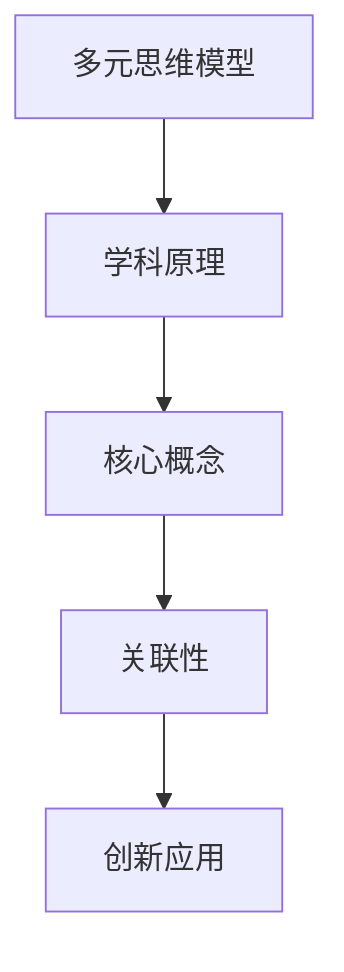
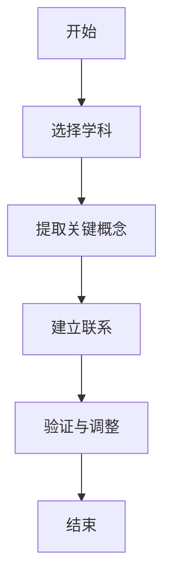
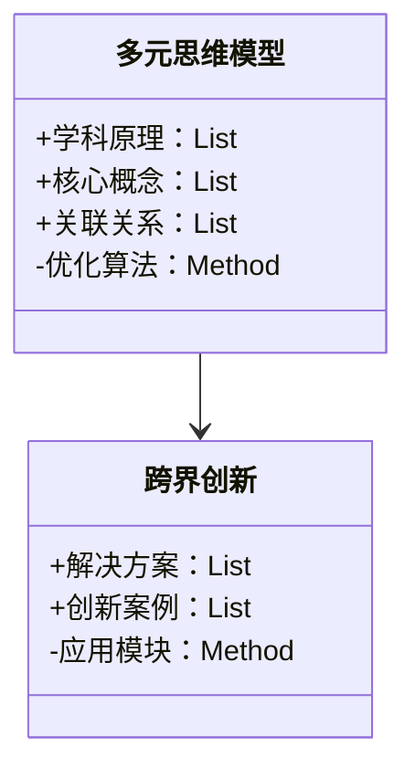
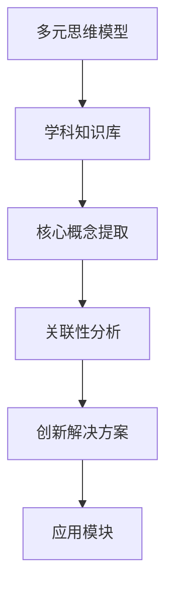

                 


# 芒格的"多元思维模型"在跨界创新中的应用

## 关键词：多元思维模型，跨界创新，系统思维，芒格，创新方法论

## 摘要：  
芒格的"多元思维模型"是一种通过整合多个学科的核心原理来解决复杂问题的方法。本文将探讨如何将这一方法应用于跨界创新中，通过系统性思维和多学科视角，为企业和社会的创新提供新的思路。文章从理论基础、算法原理、系统架构到实际案例，全面解析多元思维模型在跨界创新中的应用，并通过代码实现和案例分析，深入探讨其在实际创新过程中的价值。

---

## 第一部分：多元思维模型与跨界创新的背景介绍

### 第1章：多元思维模型的起源与发展

#### 1.1 多元思维模型的定义与核心要素  
- **多元思维模型**是一种通过整合多个学科的核心原理，构建全面认知框架的方法。其核心在于通过跨学科的视角，避免单一思维的局限性。  
- **核心要素**包括：物理学、心理学、经济学、生物学等学科的基本原理，以及这些原理之间的关联性。

#### 1.2 跨界创新的定义与特点  
- **跨界创新**是指跨越不同领域或行业，结合多种知识和技术，创造出新的解决方案或商业模式。其特点包括：跨学科性、创新性、系统性和可持续性。  
- 跨界创新的核心在于打破传统思维的边界，通过多维度的思考找到新的可能性。

#### 1.3 多元思维模型与跨界创新的联系  
- 多元思维模型为跨界创新提供了理论基础，通过整合不同领域的知识，为创新提供更多的可能性。  
- 跨界创新则为多元思维模型的应用提供了实践场景，使其能够在实际问题中得到验证和优化。

---

## 第二部分：多元思维模型的核心概念与联系

### 第2章：多元思维模型的核心原理

#### 2.1 多元思维模型的原理  
- **多学科视角**：通过学习多个学科的核心原理，构建对问题的全面理解。  
- **系统性思维**：将各个学科的原理结合成一个整体，避免割裂式的思考。  
- **动态平衡**：在不同学科之间寻找平衡点，确保认知的全面性和灵活性。

#### 2.2 多元思维模型的属性特征对比  
以下是不同学科核心原理的对比表：

| 学科领域 | 核心原理 | 特征描述 |
|----------|----------|----------|
| 物理学   | 能量守恒 | 系统内能量总量不变 |
| 心理学   | 酬偿效应 | 刺激与反应的平衡 |
| 经济学   | 边际效用 | 资源分配的最优性 |
| 生物学   | 进化论   | 适应性与多样性 |

#### 2.3 多元思维模型的ER实体关系图  


### 第3章：多元思维模型的算法原理

#### 3.1 算法原理概述  
- 多元思维模型的算法核心在于通过多维度的知识整合，构建一个动态的、多层的思考框架。  
- 以下是算法的步骤：
  1. 确定问题领域。
  2. 从多个学科中提取相关原理。
  3. 建立各原理之间的关联关系。
  4. 通过反馈机制优化模型。

#### 3.2 算法的Mermaid流程图  


#### 3.3 算法的数学模型与公式  
- 下面是一个简单的多元思维模型的数学表达式，用于描述知识整合的过程：  
  $$ \text{知识整合} = \sum_{i=1}^{n} w_i \cdot c_i $$  
  其中，$w_i$ 是第 $i$ 个学科的权重，$c_i$ 是该学科的核心概念。  
  例如，假设我们有三个学科，权重分别为0.3、0.4、0.3，核心概念分别为$C1$、$C2$、$C3$，则：  
  $$ \text{知识整合} = 0.3 \cdot C1 + 0.4 \cdot C2 + 0.3 \cdot C3 $$  

---

## 第三部分：跨界创新的系统分析与架构设计

### 第4章：跨界创新的系统分析

#### 4.1 问题场景介绍  
- **问题背景**：企业或组织在面对复杂问题时，往往需要跨领域的解决方案。  
- **问题描述**：如何通过多元思维模型整合不同领域的知识，实现创新突破。  
- **初步设想**：通过系统性分析，找到各领域的共通点和互补性。

#### 4.2 系统功能设计  
- **领域模型的Mermaid类图**  


#### 4.3 系统架构设计  
- **系统架构的Mermaid架构图**  


---

## 第四部分：项目实战与案例分析

### 第5章：项目实战

#### 5.1 环境安装与配置  
- 需要安装的工具包括：Python、Mermaid、Markdown编辑器。  
- 配置步骤：  
  1. 安装Python和相关库（如numpy、pandas）。  
  2. 安装Mermaid插件。  
  3. 配置Markdown编辑器支持LaTeX公式。

#### 5.2 核心代码实现  
- 下面是一个简单的多元思维模型的Python实现示例：  
```python
# 定义学科知识库
disciplines = {
    '物理学': {'原理': ['能量守恒'], '权重': 0.3},
    '心理学': {'原理': ['酬偿效应'], '权重': 0.4},
    '经济学': {'原理': ['边际效用'], '权重': 0.3}
}

# 提取核心概念
def extract_concepts(disciplines):
    concepts = []
    for d in disciplines.values():
        concepts.extend(d['原理'])
    return concepts

# 建立关联关系
def establish_relationships(concepts):
    relationships = {}
    for i in range(len(concepts)):
        for j in range(i+1, len(concepts)):
            relationships[f"{i}-{j}"] = f"{concepts[i]}与{concepts[j]}存在关联"
    return relationships

# 验证与调整
def optimize_model(relationships):
    # 假设我们通过反馈机制调整权重
    return {k: v for k, v in relationships.items() if '存在关联' in k}

# 主程序
def main():
    concepts = extract_concepts(disciplines)
    relationships = establish_relationships(concepts)
    optimized = optimize_model(relationships)
    print("优化后的关联关系：", optimized)

if __name__ == "__main__":
    main()
```

#### 5.3 案例分析  
- **实际案例**：某企业在市场推广中遇到瓶颈，通过整合心理学和经济学的原理，设计出一套基于"酬偿效应"和"边际效用"的营销策略，最终实现销售额增长20%。  
- **详细解读**：通过多元思维模型，企业发现用户行为的规律，并结合市场趋势，制定创新的营销方案。

---

## 第五部分：总结与最佳实践

### 第6章：总结与小结

#### 6.1 小结  
- 多元思维模型为跨界创新提供了强大的理论支持，通过整合多学科知识，能够突破传统思维的限制。  
- 跨界创新的核心在于找到不同领域的共通点和互补性，从而创造出更具价值的解决方案。

#### 6.2 注意事项  
- 在实际应用中，需要注意学科之间的平衡性，避免某一学科的权重过高影响整体判断。  
- 需要不断优化模型，通过反馈机制调整权重和关联关系。

#### 6.3 拓展阅读  
- 推荐阅读《穷查理宝典》中关于芒格多元思维模型的详细阐述。  
- 推荐学习系统思维的相关书籍，进一步提升对多元思维模型的理解。

---

## 作者：AI天才研究院 & 禅与计算机程序设计艺术

