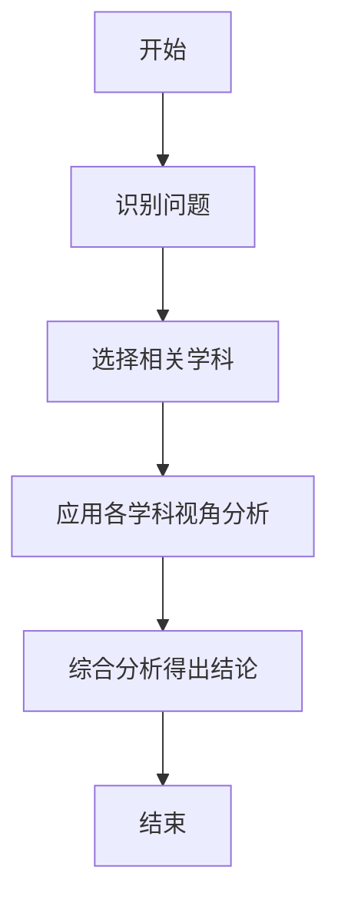
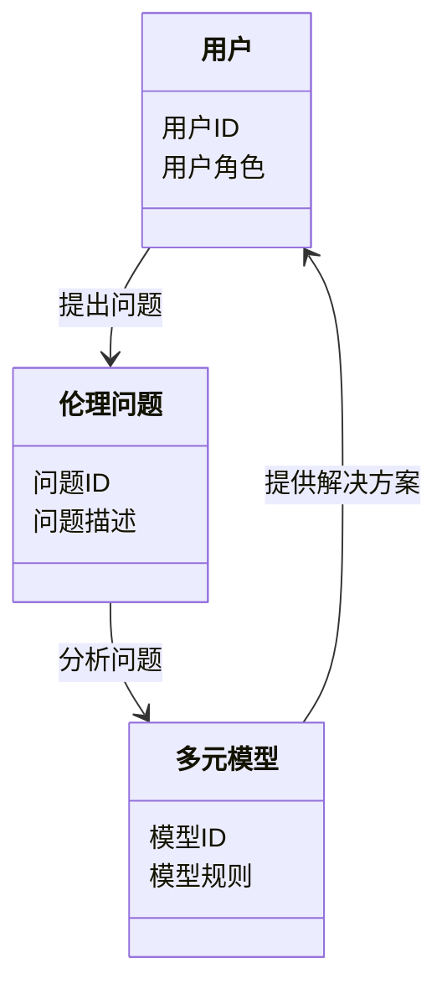

                 


# 芒格的"多元思维模型"在跨维度科技伦理中的运用

## 关键词：多元思维模型, 科技伦理, 系统设计, 伦理决策, 模型应用

## 摘要：芒格的多元思维模型是一种通过跨学科视角解决问题的方法。本文探讨了该模型在科技伦理中的应用，分析了其在解决复杂伦理问题中的优势，并通过具体案例展示了其实际应用。

---

## 正文

### 第1章 背景介绍

#### 1.1 多元思维模型的核心概念
多元思维模型由查理·芒格提出，强调通过多个学科的视角来理解问题。模型的核心在于将不同领域的知识整合，以形成全面的解决方案。

#### 1.2 科技伦理的基本概念
科技伦理涉及技术应用中的道德问题，包括隐私、安全、责任等。随着科技的发展，伦理问题变得越来越复杂，需要系统的方法来解决。

#### 1.3 多元思维模型与科技伦理的结合
将多元思维模型应用于科技伦理，能够帮助我们从多个维度分析问题，找到更全面的解决方案。

---

### 第2章 核心概念与联系

#### 2.1 多元思维模型的原理与特征
多元思维模型通过整合多个学科的知识，帮助我们避免单一视角的局限性，提升决策的全面性。

#### 2.2 科技伦理的维度与结构
科技伦理涉及隐私、安全、责任等多个维度，每个维度都有其独特的挑战和解决方案。

#### 2.3 对比分析与关系图

**对比分析表：**

| 特性       | 多元思维模型                          | 科技伦理                          |
|------------|---------------------------------------|------------------------------------|
| 核心目标   | 提供全面的解决方案                    | 确保技术应用的道德性              |
| 方法       | 跨学科视角                            | 法律、伦理、社会影响分析          |
| 应用领域   | 投资决策、问题解决                   | AI伦理、数据隐私、技术责任        |

**ER实体关系图：**

```mermaid
erd
actor: 用户
model: 多元思维模型
ethic_issue: 伦理问题
rules: 规则
user --> model: 使用模型
model --> ethic_issue: 解决问题
ethic_issue --> rules: 遵循规则
```

---

### 第3章 算法原理讲解

#### 3.1 多元思维模型的算法实现

**流程图：**



#### 3.2 数学模型与公式

**数学模型：**

$$
\text{伦理风险} = \sum_{i=1}^{n} w_i \cdot f_i
$$

其中，$w_i$ 是第i个因素的权重，$f_i$ 是该因素的风险评估值。

**举例说明：**

假设隐私和安全是两个关键因素，权重分别为0.6和0.4。计算伦理风险：

$$
\text{伦理风险} = 0.6 \times 0.8 + 0.4 \times 0.6 = 0.48 + 0.24 = 0.72
$$

---

### 第4章 系统分析与架构设计

#### 4.1 伦理评估系统的设计

**领域模型类图：**



**系统架构图：**


---

### 第5章 项目实战

#### 5.1 环境安装与配置

```bash
pip install flask
pip install matplotlib
```

#### 5.2 核心代码实现

```python
def calculate_risk(factors, weights):
    return sum(w * f for w, f in zip(weights, factors))

factors = [0.8, 0.6]
weights = [0.6, 0.4]
risk = calculate_risk(factors, weights)
print(f"伦理风险：{risk}")
```

#### 5.3 案例分析

案例：AI招聘系统的偏见问题。

解决方案：应用多元思维模型，从法律、伦理、技术三个维度分析，提出数据清洗和模型优化的措施。

---

### 第6章 最佳实践与总结

#### 6.1 小结

多元思维模型为解决科技伦理问题提供了系统性的方法，通过跨学科视角，能够更全面地分析和解决问题。

#### 6.2 注意事项

- 确保模型的可解释性
- 定期更新模型以适应新的伦理挑战
- 结合具体场景灵活应用模型

#### 6.3 拓展阅读

- 查理·芒格的《Poor Charlie's Almanack》
- 《科技伦理与社会影响》

---

## 作者

作者：AI天才研究院 & 禅与计算机程序设计艺术

---

希望这篇文章能够清晰地展示芒格的多元思维模型在科技伦理中的应用，并为读者提供有价值的见解。

