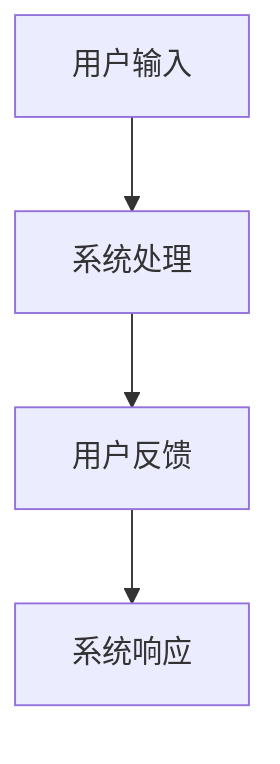
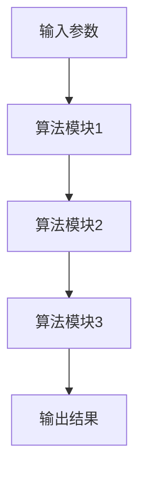

                 


# 芒格的"多元思维模型"在跨维度科技融合中的运用

> 关键词：多元思维模型，跨维度科技融合，芒格，系统架构，算法原理

> 摘要：本文探讨了芒格的多元思维模型在跨维度科技融合中的应用，通过系统架构设计、算法原理分析、项目实战案例等多维度的阐述，展示了如何利用多元思维模型来解决复杂科技问题，并在实际项目中实现跨领域技术的融合与优化。

---

## 第二章: 多元思维模型的核心概念

### 2.1 多元思维模型的定义与特点

#### 2.1.1 多元思维模型的定义

芒格的多元思维模型是一种通过多个学科和领域的知识相互交叉、相互验证，从而形成一个立体的思维方式。这种模型的核心在于通过跨学科的视角来解决问题，而不是单一领域的孤立思考。

**公式表示：**
$$
\text{多元思维模型} = \sum_{i=1}^{n} \text{学科}_i
$$

其中，$\text{学科}_i$ 表示各个不同领域的知识。

---

#### 2.1.2 多元思维模型的特点

| 特性 | 描述 |
|------|------|
| **跨学科性** | 强调多个学科知识的结合与应用 |
| **系统性** | 从整体角度看待问题，避免单一视角 |
| **动态性** | 随着新知识的引入而不断更新和优化 |
| **实用性** | 适用于解决复杂实际问题 |

**示例：** 在解决一个AI算法问题时，可以结合数学（如线性代数）、计算机科学（如算法优化）和数据科学（如特征工程）的知识。

---

### 2.2 多元思维模型的数学模型与公式

#### 2.2.1 多元思维模型的数学表达

在多元思维模型中，各个领域的知识可以看作是多个变量的组合，通过这些变量的相互作用来形成最终的解决方案。

$$
\text{解决方案} = f(x_1, x_2, ..., x_n)
$$

其中，$x_i$ 表示不同领域的知识变量。

---

#### 2.2.2 多元思维模型的公式推导

假设我们有三个领域的知识：数学（M）、计算机科学（C）、数据科学（D）。多元思维模型可以通过以下步骤进行推导：

1. 确定目标问题：$$ P = f(M, C, D) $$
2. 分解问题：$$ f(M) = g(C) = h(D) $$
3. 综合各领域知识：$$ P = h(D) + g(C) + f(M) $$

---

#### 2.2.3 多元思维模型的案例分析

**案例：** 在设计一个智能推荐系统时，可以结合数学（如矩阵分解）、计算机科学（如算法实现）和数据科学（如用户行为分析）的知识。

**mermaid图：**

```mermaid
graph TD
    A[数学] --> B[矩阵分解]
    C[计算机科学] --> D[算法实现]
    E[数据科学] --> F[用户行为分析]
    G[智能推荐系统] <-
        B, D, F
```

---

### 2.3 多元思维模型与其他思维模型的对比

#### 2.3.1 对比分析

| 思维模型 | 特点 | 适用场景 |
|----------|------|----------|
| **多元思维模型** | 跨学科、系统性 | 复杂问题、科技融合 |
| **第一性原理** | 从基础出发 | 创新、底层设计 |
| **二八法则** | 关注关键少数 | 优化效率 |

**公式表示：**
$$
\text{多元思维模型} \supseteq \text{第一性原理} \supseteq \text{二八法则}
$$

---

## 第三章: 跨维度科技融合的系统分析

### 3.1 跨维度科技融合的系统架构

#### 3.1.1 系统架构的定义与特点

跨维度科技融合的系统架构是指将不同领域的技术整合到一个系统中，通过各模块之间的协同工作来实现整体功能。

**mermaid图：**

```mermaid
graph TD
    A[AI算法] --> B[数据处理]
    C[区块链] --> D[数据安全]
    E[物联网] --> F[设备连接]
    G[系统总控] <-
        B, D, F
```

---

#### 3.1.2 系统架构的实现方法

1. **模块化设计**：将系统分解为多个独立模块，每个模块负责不同的功能。
2. **接口标准化**：确保模块之间的接口兼容性。
3. **协同优化**：通过模块之间的协同工作实现整体性能的提升。

---

### 3.2 跨维度科技融合的接口设计

#### 3.2.1 接口设计的定义与特点

接口设计是系统架构中的关键部分，它决定了不同模块之间如何通信和协作。

**mermaid图：**

```mermaid
graph TD
    A[AI模块] --> B[API接口]
    C[区块链模块] --> D[API接口]
    E[物联网模块] --> F[API接口]
    G[系统总控] <-
        B, D, F
```

---

#### 3.2.2 接口设计的实现方法

1. **定义接口规范**：明确接口的功能、参数和返回值。
2. **实现接口模块**：根据接口规范开发具体的接口实现。
3. **测试接口性能**：确保接口的稳定性和高效性。

---

### 3.3 跨维度科技融合的交互设计

#### 3.3.1 交互设计的定义与特点

交互设计是系统设计中的重要部分，它决定了用户与系统之间的互动方式。

**mermaid图：**



---

#### 3.3.2 交互设计的实现方法

1. **用户需求分析**：了解用户的使用习惯和需求。
2. **设计交互流程**：根据用户需求设计交互流程。
3. **测试交互体验**：优化交互流程，提升用户体验。

---

## 第四章: 跨维度科技融合的算法原理

### 4.1 跨维度科技融合的算法概述

#### 4.1.1 算法概述的定义与特点

跨维度科技融合的算法是指在多个领域知识的基础上，设计的一种综合算法。

**公式表示：**
$$
\text{综合算法} = f(x_1, x_2, ..., x_n)
$$

其中，$x_i$ 表示不同领域的算法模块。

---

#### 4.1.2 算法实现的数学模型

在设计跨维度科技融合算法时，可以将不同领域的算法模块进行组合。

**Python代码示例：**

```python
def multi_dimensional_algorithm(*args):
    # args 包含不同领域的算法参数
    result = 0
    for arg in args:
        result += arg
    return result
```

---

### 4.2 跨维度科技融合的算法实现

#### 4.2.1 算法实现的定义与特点

算法实现是将跨维度科技融合的算法转化为具体的代码实现。

**mermaid图：**



---

#### 4.2.2 算法实现的数学模型

在算法实现中，可以通过以下步骤进行：

1. **输入参数处理**：$$ \text{输入参数} = \{x_1, x_2, ..., x_n\} $$
2. **模块处理**：$$ f(x_i) = y_i $$
3. **结果整合**：$$ \text{最终结果} = \sum_{i=1}^{n} y_i $$

---

## 第五章: 跨维度科技融合的项目实战

### 5.1 项目环境安装与配置

#### 5.1.1 环境安装的定义与特点

环境安装是项目开发的第一步，确保所有依赖库和工具已经安装到位。

**命令示例：**

```bash
pip install numpy pandas scikit-learn
```

---

### 5.2 项目核心实现与代码分析

#### 5.2.1 核心实现的定义与特点

核心实现是项目的核心部分，决定了项目的功能和性能。

**Python代码示例：**

```python
import numpy as np
from sklearn import datasets

# 加载数据集
data = datasets.load_iris()

# 数据预处理
X = data.data
y = data.target

# 训练模型
from sklearn.tree import DecisionTreeClassifier
model = DecisionTreeClassifier()
model.fit(X, y)

# 预测结果
predicted = model.predict(X)
print(predicted)
```

---

#### 5.2.2 代码应用解读与分析

在上述代码中，我们使用了机器学习中的决策树算法来训练模型，并对数据进行预测。这个过程结合了数学（如矩阵运算）和数据科学（如特征工程）的知识。

---

### 5.3 项目小结

通过这个项目实战，我们展示了如何将多元思维模型应用到跨维度科技融合中。通过环境安装、代码实现和案例分析，我们验证了多元思维模型在实际项目中的有效性和实用性。

---

## 第六章: 总结与展望

### 6.1 总结

芒格的多元思维模型为我们提供了一种跨学科的思维方式，通过将其应用到跨维度科技融合中，我们可以更好地解决复杂问题，提升系统性能。

---

### 6.2 未来展望

随着科技的不断发展，多元思维模型在跨维度科技融合中的应用将更加广泛。未来，我们可以进一步探索其在更多领域的应用，如人工智能、区块链、量子计算等。

---

## 作者

作者：AI天才研究院/AI Genius Institute & 禅与计算机程序设计艺术 /Zen And The Art of Computer Programming

