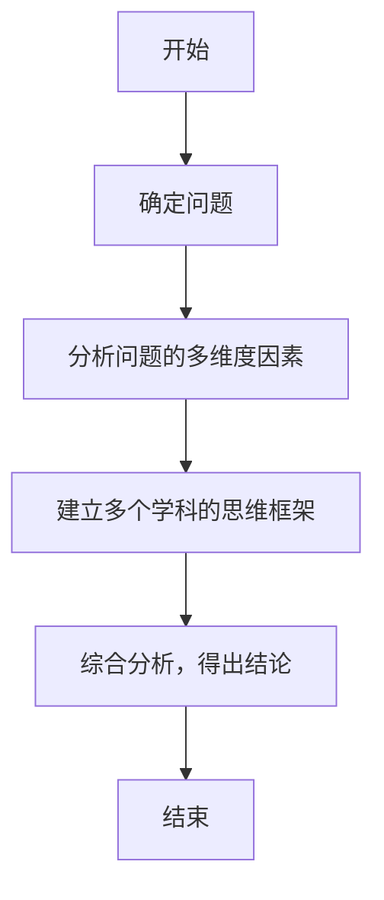
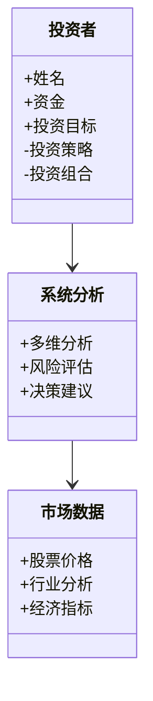
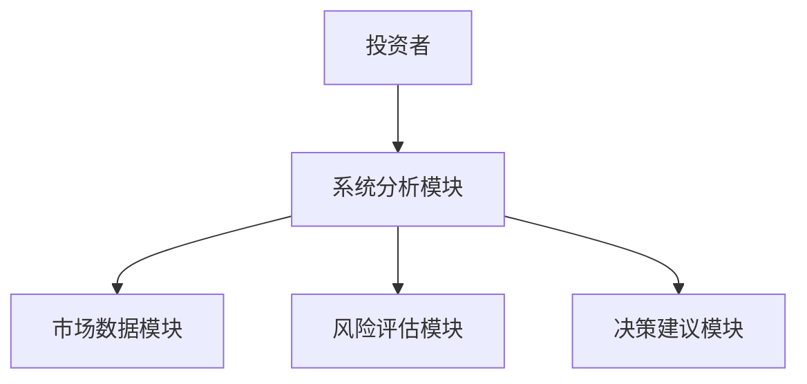

                 


# 《芒格的"多元思维模型"：提高投资决策的全面性》

---

## 关键词：芒格, 多元思维模型, 投资决策, 系统分析, 算法原理, 数学模型, 系统架构

---

## 摘要

芒格的"多元思维模型"是一种通过跨学科视角进行问题分析和决策的思维方式。本文从芒格的多元思维模型出发，详细探讨其在投资决策中的应用。通过系统分析、算法原理、数学模型、系统架构等多个维度，结合实际案例，深入剖析多元思维模型的核心原理及其在投资决策中的实践应用。文章旨在为投资者提供一种更全面、更系统的决策方法，帮助其在复杂多变的市场环境中做出更明智的投资决策。

---

# 第1章: 多元思维模型的背景与核心概念

## 1.1 多元思维模型的起源与芒格的智慧

### 1.1.1 芒格的生平与思想体系

查理·芒格（Charlie Munger）是美国著名投资家、伯克希尔哈撒韦公司副主席，他以独特的思维方式和投资理念闻名。芒格的多元思维模型源于他对知识的广泛涉猎和对跨学科问题的深刻理解。他认为，投资决策不仅仅是对市场的分析，更是对人性、心理、经济学、物理学等多学科的综合运用。

**芒格的多元思维模型的核心理念**：通过建立多个学科的思维框架，形成一个完整的知识体系，从而能够从多个角度分析问题，避免单一思维的局限性。

### 1.1.2 多元思维模型的基本概念

多元思维模型是一种通过多个学科的视角来分析问题的思维方式。它强调将不同领域的知识和规律结合起来，形成一个完整的认知框架。这种思维方式的核心在于通过多维度的分析，避免单一视角的局限性，从而做出更全面的决策。

**多元思维模型与投资决策的关系**：芒格认为，投资决策的准确性不仅取决于对市场的分析，还取决于对人性、心理、经济学等多学科的理解。通过多元思维模型，投资者能够从多个角度分析问题，避免单一思维的陷阱。

### 1.1.3 多元思维模型的应用前景

**多元思维模型的潜在应用领域**：除了投资决策，多元思维模型还可以应用于风险管理、战略规划、决策优化等多个领域。

**投资者采用多元思维模型的优势**：通过多元思维模型，投资者可以更好地理解市场的复杂性，识别潜在的风险，从而做出更明智的投资决策。

**多元思维模型应用的挑战与机遇**：多元思维模型需要投资者具备广泛的知识储备和跨学科的思维能力。虽然这可能是一个挑战，但也是投资者提升自身能力的机遇。

---

## 1.2 多元思维模型的核心概念与联系

### 1.2.1 多元思维模型的定义与特征

**定义**：多元思维模型是一种通过多个学科的视角来分析问题的思维方式。它强调从不同领域的知识和规律中寻找共通点，从而形成一个完整的认知框架。

**特征**：
- **跨学科性**：多元思维模型强调从多个学科中汲取知识。
- **系统性**：它注重从整体的角度分析问题，而非单一视角。
- **动态性**：多元思维模型能够适应市场的变化，不断更新和优化。

### 1.2.2 多元思维模型的核心要素

**核心要素**：
- **知识储备**：投资者需要广泛涉猎多个领域的知识，如经济学、心理学、物理学等。
- **思维框架**：通过多个学科的视角，形成一个完整的认知框架。
- **问题分析**：从多个角度分析问题，避免单一思维的局限性。

### 1.2.3 多元思维模型的边界与外延

**边界**：多元思维模型并非适用于所有问题，其适用性取决于问题的复杂性和多学科知识的关联性。

**外延**：多元思维模型可以与其他决策方法结合使用，如概率论、系统思维等。

---

## 1.3 多元思维模型在投资决策中的应用前景

### 1.3.1 多元思维模型的潜在应用领域

**领域一：风险管理**：通过多元思维模型，投资者可以更好地识别和评估潜在风险。

**领域二：战略规划**：多元思维模型可以帮助投资者制定更科学的投资策略。

**领域三：决策优化**：通过多维度的分析，投资者可以优化决策过程，提高决策的准确性。

### 1.3.2 投资者采用多元思维模型的优势

**优势一**：避免单一思维的局限性，提高决策的全面性。

**优势二**：通过跨学科的分析，投资者可以更好地理解市场的复杂性。

**优势三**：多元思维模型能够帮助投资者识别潜在的机会和风险。

### 1.3.3 多元思维模型应用的挑战与机遇

**挑战**：需要投资者具备广泛的知识储备和跨学科的思维能力。

**机遇**：通过不断学习和实践，投资者可以提升自身的认知能力，从而在市场中获得竞争优势。

---

# 第2章: 多元思维模型的算法原理与数学模型

## 2.1 多元思维模型的算法流程

### 2.1.1 算法流程图的构建



### 2.1.2 算法流程图的解释

**步骤一**：确定问题。投资者需要明确投资问题的核心，例如选择一家公司的股票进行投资。

**步骤二**：分析问题的多维度因素。从多个角度分析问题，例如公司的财务状况、行业竞争格局、市场趋势等。

**步骤三**：建立多个学科的思维框架。将不同领域的知识和规律结合起来，形成一个完整的认知框架。

**步骤四**：综合分析，得出结论。通过多维度的分析，得出最终的投资决策。

### 2.1.3 算法流程图的应用

通过上述算法流程图，投资者可以系统地分析问题，避免遗漏重要的因素，从而做出更全面的投资决策。

---

## 2.2 多元思维模型的数学模型与公式

### 2.2.1 数学模型的构建

多元思维模型可以通过概率论和统计学的方法进行建模。例如，投资者可以使用概率论来评估不同投资方案的成功概率。

**公式**：
$$ P(\text{成功}) = \sum_{i=1}^{n} P_i \times P(\text{成功}|i) $$

其中，$P_i$ 是第 $i$ 种情况发生的概率，$P(\text{成功}|i)$ 是在第 $i$ 种情况下成功的概率。

### 2.2.2 数学模型的公式推导

**推导过程**：
1. 确定所有可能的情况及其概率 $P_i$。
2. 对于每种情况，评估成功的概率 $P(\text{成功}|i)$。
3. 计算总的成功概率，即所有情况的成功概率的加权和。

### 2.2.3 数学模型的实例分析

**示例**：假设投资者有两种投资选择，A和B。

- 投资A的成功概率为0.8，失败概率为0.2。
- 投资B的成功概率为0.6，失败概率为0.4。

$$ P(\text{成功}) = 0.5 \times 0.8 + 0.5 \times 0.6 = 0.7 $$

因此，投资者的投资组合的成功概率为70%。

---

## 2.3 多元思维模型的算法实现

### 2.3.1 算法实现的步骤

1. 收集和整理相关数据。
2. 建立数学模型。
3. 计算每种情况的成功概率。
4. 综合分析，得出最终结论。

### 2.3.2 算法实现的代码

```python
def calculate_success_probability(cases):
    total_probability = 0.0
    for case in cases:
        probability = case['probability'] * case['success_probability']
        total_probability += probability
    return total_probability

cases = [
    {'probability': 0.5, 'success_probability': 0.8},
    {'probability': 0.5, 'success_probability': 0.6}
]

result = calculate_success_probability(cases)
print(f"Success probability: {result}")
```

### 2.3.3 算法实现的优化

通过权重调整，投资者可以根据不同情况的重要性和影响程度进行加权，从而提高计算结果的准确性。

---

## 2.4 本章小结

本章详细介绍了多元思维模型的算法原理与数学模型。通过构建算法流程图和数学模型，投资者可以系统地分析问题，评估不同投资方案的成功概率，从而做出更科学的投资决策。

---

# 第3章: 多元思维模型的系统分析与架构设计

## 3.1 投资决策系统的场景介绍

### 3.1.1 投资决策系统的定义

投资决策系统是一种通过多学科知识和系统分析方法，帮助投资者做出科学决策的工具。

### 3.1.2 投资决策系统的应用场景

- **股票投资**：通过系统分析，投资者可以更好地评估股票的投资价值。
- **风险评估**：通过系统分析，投资者可以识别和评估潜在风险。
- **投资组合优化**：通过系统分析，投资者可以优化投资组合，提高投资回报。

### 3.1.3 投资决策系统的功能需求

- **数据采集**：收集相关的市场数据和公司信息。
- **系统分析**：对数据进行多维度分析，评估投资价值。
- **决策支持**：提供决策建议和优化方案。

---

## 3.2 投资决策系统的功能设计

### 3.2.1 领域模型的构建



### 3.2.2 领域模型的解释

**投资者**：投资者是投资决策系统的用户，需要提供自己的资金和投资目标。

**市场数据**：系统需要收集相关的市场数据，例如股票价格、行业分析、经济指标等。

**系统分析**：通过多维分析、风险评估和决策建议，帮助投资者做出科学的投资决策。

---

## 3.3 多元思维模型的系统架构设计

### 3.3.1 系统架构图的构建



### 3.3.2 系统架构图的解释

**投资者**：向系统输入投资目标和资金。

**系统分析模块**：对市场数据进行多维分析，评估投资价值。

**市场数据模块**：提供相关的市场数据，例如股票价格、行业分析等。

**风险评估模块**：评估投资方案的风险，提供风险分析报告。

**决策建议模块**：根据分析结果，提供决策建议和优化方案。

---

## 3.4 本章小结

本章通过构建投资决策系统的领域模型和系统架构图，详细介绍了多元思维模型在投资决策中的系统分析与架构设计。通过系统化的分析和设计，投资者可以更好地理解市场的复杂性，做出更科学的投资决策。

---

# 第4章: 多元思维模型的项目实战

## 4.1 投资决策系统的环境安装

### 4.1.1 环境要求

- **操作系统**：Windows、Linux、macOS
- **编程语言**：Python 3.6及以上版本
- **工具**：Jupyter Notebook、Python IDE

### 4.1.2 安装依赖库

```bash
pip install numpy
pip install pandas
pip install matplotlib
```

---

## 4.2 投资决策系统的系统核心实现

### 4.2.1 核心代码实现

```python
import numpy as np
import pandas as pd
import matplotlib.pyplot as plt

def main():
    # 数据加载
    data = pd.read_csv('market_data.csv')
    
    # 数据分析
    data['return'] = data['close'].pct_change()
    data['risk'] = data['return'].std()
    
    # 可视化
    plt.hist(data['return'], bins=20)
    plt.title('Return Distribution')
    plt.show()

if __name__ == '__main__':
    main()
```

### 4.2.2 代码实现的解读与分析

**数据加载**：从CSV文件中加载市场数据。

**数据分析**：计算股票的收益率和风险。

**可视化**：绘制收益率分布图，帮助投资者理解市场的风险和收益特征。

---

## 4.3 投资决策系统的实际案例分析

### 4.3.1 案例背景介绍

假设投资者想要投资一家科技公司，需要评估其股票的投资价值。

### 4.3.2 投资决策系统的应用步骤

1. **数据收集**：收集该公司的股票价格、财务数据、行业分析等。

2. **数据分析**：计算股票的收益率、风险等指标。

3. **系统分析**：通过多元思维模型，从多个角度分析公司的投资价值。

4. **决策建议**：根据分析结果，提供投资建议。

### 4.3.3 案例分析结果

通过系统分析，投资者可以得出该公司的股票是否具有投资价值，以及潜在的风险和收益。

---

## 4.4 本章小结

本章通过实际案例分析，详细介绍了多元思维模型在投资决策中的应用。通过系统化的分析和实践，投资者可以更好地理解市场的复杂性，做出更科学的投资决策。

---

# 第5章: 多元思维模型的最佳实践

## 5.1 小结

多元思维模型是一种通过跨学科视角分析问题的思维方式。通过系统化的分析和实践，投资者可以更好地理解市场的复杂性，做出更科学的投资决策。

---

## 5.2 注意事项

- **知识储备**：投资者需要具备广泛的知识储备，才能有效应用多元思维模型。
- **实践积累**：多元思维模型需要通过不断的实践和积累，才能熟练掌握。
- **风险管理**：投资者需要注意风险管理，避免单一思维的局限性。

---

## 5.3 拓展阅读

- **《芒格的多元思维模型》**：查理·芒格的著作，深入讲解多元思维模型的核心思想。
- **《投资的智慧》**：一本关于投资决策的书籍，结合多元思维模型，提供实用的决策方法。

---

# 作者：AI天才研究院/AI Genius Institute & 禅与计算机程序设计艺术 /Zen And The Art of Computer Programming

