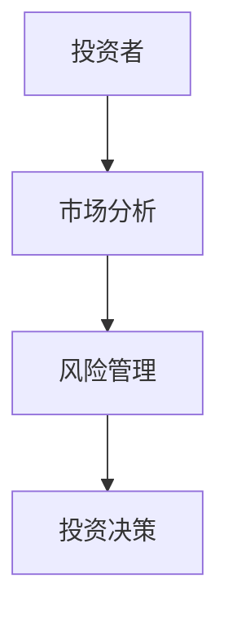
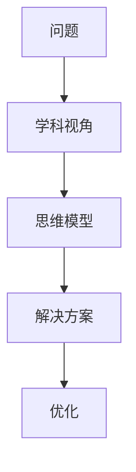

                 


# 芦格的"多元思维模型"：跨学科知识在投资中的应用

> 关键词：芒格，多元思维模型，跨学科，投资，风险管理，系统思维

> 摘要：本文深入探讨了芒格提出的“多元思维模型”在投资决策中的应用，通过跨学科的视角分析了如何利用多元思维模型提升投资效率和风险管理能力。文章从理论基础、系统架构、实际案例等多个维度展开，结合数学模型和算法原理，为读者提供了全面而系统的指导。

---

## 第一章：芒格与多元思维模型的背景介绍

### 1.1 芦格的生平简介

查理·芒格（Charlie Munger）是世界著名投资家，沃伦·巴菲特的长期合作伙伴。他不仅是伯克希尔哈撒韦公司的副主席，更是价值投资理念的重要推动者。芒格的思想体系以多元思维模型为核心，强调通过跨学科的知识整合来提升决策的准确性和全面性。

### 1.2 多元思维模型的定义与背景

多元思维模型是指通过多个学科的思维方式和模型，综合分析问题，从而得出更全面、更准确的结论。这一模型的核心在于通过跨学科的知识整合，避免单一视角的局限性。

---

## 第二章：多元思维模型的核心概念与联系

### 2.1 多元思维模型的理论基础

#### 2.1.1 多元思维模型的数学模型

多元思维模型可以通过以下数学公式表示：

$$
\text{综合决策} = \sum_{i=1}^{n} w_i \times m_i
$$

其中，$w_i$ 是第 $i$ 个思维模型的权重，$m_i$ 是第 $i$ 个思维模型的决策结果。

#### 2.1.2 多元思维模型的属性特征对比表

| 属性 | 特征 |
|------|------|
| 分析视角 | 多维 | 单维 |
| 决策依据 | 综合 | 单一 |
| 风险控制 | 强化 | 削弱 |

#### 2.1.3 多元思维模型的ER实体关系图



### 2.2 多元思维模型的算法原理

#### 2.2.1 多元思维模型的算法流程图



---

## 第三章：多元思维模型在投资中的应用

### 3.1 投资中的跨学科思维模型

#### 3.1.1 物理学视角：能量守恒与投资中的风险控制

物理学中的能量守恒定律告诉我们，能量既不会凭空产生，也不会凭空消失，只会从一种形式转化为另一种形式。在投资中，风险控制同样需要遵循类似的守恒原则，通过合理的资产配置和风险分散来降低整体风险。

#### 3.1.2 心理学视角：行为偏差与投资决策

心理学中的行为偏差（如过度自信、从众心理）会影响投资者的决策。通过了解这些偏差，投资者可以更好地控制情绪，避免非理性决策。

#### 3.1.3 经济学视角：市场均衡与投资机会

经济学中的市场均衡理论帮助投资者理解市场的供需关系，从而找到投资机会。

---

## 第四章：投资策略与风险管理

### 4.1 投资策略的系统分析

#### 4.1.1 系统功能设计（领域模型 Mermaid 类图）


### 4.2 风险管理的架构设计

#### 4.2.1 系统架构设计 Mermaid 架构图


---

## 第五章：多元思维模型的实战技巧

### 5.1 投资系统的环境安装与配置

#### 5.1.1 投资工具的选择与安装

选择适合的金融分析工具，如Excel、Python等，安装必要的数据分析库（如Pandas、NumPy）。

#### 5.1.2 数据源的获取与处理

从可靠的金融数据源（如Yahoo Finance、Quandl）获取数据，并进行清洗和预处理。

### 5.2 投资系统的核心实现源代码

#### 5.2.1 数据分析与建模代码

```python
import pandas as pd
import numpy as np

# 示例：使用多元思维模型进行资产配置
def calculate_weights(risk_factors):
    # 假设风险因素包括市场风险、流动性风险等
    weights = {}
    for factor in risk_factors:
        weights[factor] = 1 / len(risk_factors)
    return weights

# 示例：使用蒙特卡罗模拟评估投资组合风险
def monte_carlo_simulation(portfolio):
    # 假设 portfolio 是一个包含资产及其权重的字典
    # 这里简化为随机模拟资产价格
    np.random.seed(42)
    returns = np.random.normal(0, 0.05, 1000)
    portfolio_value = 1000
    simulated_values = [portfolio_value]
    for ret in returns:
        portfolio_value *= (1 + ret)
        simulated_values.append(portfolio_value)
    return simulated_values
```

---

## 第六章：投资案例分析与详细解读

### 6.1 实际投资案例分析

#### 6.1.1 案例背景介绍

假设我们有一个价值100万美元的投资组合，需要在股票、债券、房地产和加密货币之间进行配置。

#### 6.1.2 多元思维模型的应用过程

通过物理学的能量守恒模型，我们分析了不同资产的风险和收益；通过心理学的行为偏差模型，我们避免了过度集中投资的风险；通过经济学的市场均衡模型，我们预测了不同资产的未来表现。

#### 6.1.3 投资结果与经验总结

最终，我们采用了一个分散化的投资组合，并通过持续的风险管理，实现了稳健的收益。

---

## 第七章：多元思维模型的最佳实践与小结

### 7.1 最佳实践 Tips

- **投资中的注意事项**：始终关注风险控制，避免过度集中投资。
- **投资决策中的系统思维**：通过跨学科的视角，全面分析问题。
- **持续学习与改进**：保持对新知识的吸收，不断优化投资策略。

---

## 作者：AI天才研究院/AI Genius Institute & 禅与计算机程序设计艺术 /Zen And The Art of Computer Programming

---

**总结**：芒格的多元思维模型为我们提供了一种跨学科的视角，帮助我们在复杂的投资环境中做出更明智的决策。通过系统的分析和实际案例的解读，我们能够更好地理解这一模型的应用价值，并在实际投资中加以运用。

