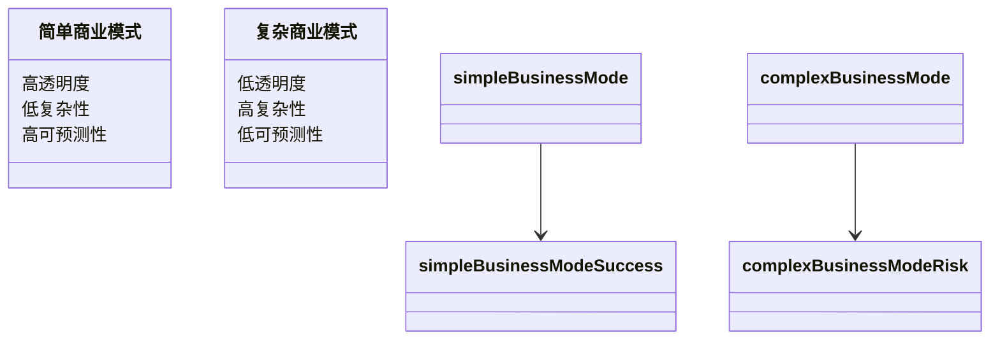

                 


# 芮格的"太难了"篮子：如何避开复杂投资

## 关键词：芒格投资理念，复杂投资，简单商业模式，风险管理，投资策略

## 摘要：芒格的"太难了"篮子是一种通过避免复杂投资来降低风险的投资策略。本文详细分析了复杂投资的定义、特征及潜在风险，并提出了具体的策略以帮助投资者避开复杂投资。通过实际案例分析和系统架构设计，本文为投资者提供了实用的指导和最佳实践。

---

## 第一部分: 芮格的"太难了"篮子概述

### 第1章: 芮格投资理念的背景与核心概念

#### 1.1 芮格的简介与投资哲学
- **1.1.1 芮格的生平与投资背景**
  查理·芒格是伯克希尔·哈撒韦公司的副主席，沃伦·巴菲特的长期合作伙伴。芒格以其独特的投资哲学和思维方式闻名，强调理性思考、避免情绪化决策以及长期价值投资。

  ```mermaid
  graph TD
    A[查理·芒格] --> B[伯克希尔·哈撒韦公司]
    A --> C[沃伦·巴菲特]
    A --> D[长期价值投资]
  ```

- **1.1.2 芮格投资哲学的核心思想**
  芒格的投资哲学强调“逆向思维”，即寻找那些简单、可预测且具有持续竞争优势的企业。他主张避免复杂的投资，专注于那些易于理解和分析的企业。

- **1.1.3 "太难了"篮子的定义与应用场景**
  “太难了”篮子是指那些由于业务模式复杂、财务状况不透明或市场环境不确定而难以分析的企业。芒格建议将这些企业排除在投资范围之外，以降低投资风险。

#### 1.2 复杂投资的定义与特征
- **1.2.1 复杂性评估的维度**
  复杂投资可以从多个维度进行评估，包括业务模式的复杂性、财务状况的透明度以及市场环境的影响。

- **1.2.2 复杂投资的常见指标**
  - 财务杠杆比率：衡量企业的财务风险。
  - 盈利能力指标：如净利率和毛利率。
  - 市场波动性指标：如 beta 系数。

- **1.2.3 复杂投资与简单投资的对比**
  ```mermaid
  classDiagram
    class 复杂投资 {
      高不确定性
      高波动性
      低透明度
    }
    class 简单投资 {
      低不确定性
      低波动性
      高透明度
    }
    复杂投资 --|> 投资风险
    简单投资 --|> 投资回报
  ```

- **1.2.4 复杂投资的潜在风险**
  - 信息不对称的风险：复杂投资通常涉及高难度的分析，投资者难以获得足够的信息来做出明智决策。
  - 市场波动的影响：复杂投资更容易受到市场波动的冲击。
  - 决策失误的代价：复杂的分析过程可能导致决策失误，进而造成重大损失。

### 第2章: 如何判断投资是否过于复杂

#### 2.1 复杂性评估的维度
- **2.1.1 业务模式的复杂性**
  业务模式复杂的企业通常涉及多个业务线或多个市场，这增加了分析的难度。

- **2.1.2 财务状况的透明度**
  财务报表复杂或不透明的企业可能隐藏着财务风险。

- **2.1.3 市场环境的影响**
  复杂的投资环境可能导致企业受到更多外部因素的影响。

#### 2.2 复杂性评估的指标
- **2.2.1 财务杠杆比率**
  财务杠杆比率过高可能意味着企业承担了过多的债务风险。

- **2.2.2 盈利能力指标**
  净利率和毛利率等指标可以帮助评估企业的盈利能力。

- **2.2.3 市场波动性指标**
  beta 系数等指标可以帮助评估企业股票的波动性。

#### 2.3 实际案例分析
- **2.3.1 某复杂投资案例的分析**
  以某科技公司为例，分析其复杂的业务模式和财务状况。

- **2.3.2 案例中的复杂性表现**
  描述该公司的复杂业务模式和高波动性。

- **2.3.3 案例的启示与教训**
  总结该案例的教训，强调复杂投资的风险。

---

## 第二部分: 避开复杂投资的具体策略

### 第3章: 集中投资法

#### 3.1 集中投资的定义
- 集中投资是指将大部分资金投入到少数几只股票中，以减少投资组合的复杂性。

#### 3.2 集中投资的优势
- **3.2.1 简化分析过程**
  集中投资可以减少需要分析的企业数量，降低复杂性。

- **3.2.2 提高投资回报**
  通过集中投资于具有强大竞争优势的企业，投资者可以获得更高的回报。

#### 3.3 集中投资的风险控制
- **3.3.1 风险分散**
  集中投资的风险较高，因此需要通过其他方式分散风险。

- **3.3.2 风险监控**
  定期监控投资组合的表现，及时调整投资策略。

### 第4章: 简单商业模式的选择

#### 4.1 简单商业模式的特征
- **4.1.1 低复杂性**
  业务模式简单明了，易于理解和分析。

- **4.1.2 高可预测性**
  企业的未来表现具有较高的可预测性。

#### 4.2 简单商业模式的优势
- **4.2.1 低风险**
  简单商业模式的企业通常具有较低的经营风险。

- **4.2.2 高透明度**
  业务模式简单的企业通常具有较高的财务透明度。

#### 4.3 如何识别简单商业模式
- **4.3.1 行业分析**
  选择那些业务模式简单且稳定的行业。

- **4.3.2 企业分析**
  通过分析企业的财务报表和业务模式，识别简单商业模式的企业。

### 第5章: 重点关注财务指标

#### 5.1 净利润与收入增长
- 净利润是衡量企业盈利能力的重要指标，收入增长则反映了企业的市场表现。

#### 5.2 资产负债表分析
- 通过分析资产负债表，可以评估企业的财务健康状况。

#### 5.3 现金流状况评估
- 现金流是企业经营健康的重要指标，健康的现金流可以支持企业的持续发展。

---

## 第三部分: 风险管理与心理控制

### 第6章: 风险管理策略

#### 6.1 分散投资策略
- 通过分散投资于不同行业和不同地区的资产，降低投资组合的整体风险。

#### 6.2 价值投资策略
- 价值投资强调购买具有合理估值的企业，避免过度关注短期市场波动。

#### 6.3 长期投资策略
- 长期投资可以帮助投资者避免短期市场波动的影响，同时获得企业的长期增长收益。

### 第7章: 心理控制与决策优化

#### 7.1 避免情绪化决策
- 投资者需要避免因市场波动而产生的情绪化决策。

#### 7.2 坚持长期视角
- 长期视角可以帮助投资者避免短期市场的干扰，专注于企业的长期价值。

#### 7.3 定期复盘与调整
- 定期复盘投资组合的表现，及时调整投资策略。

---

## 第四部分: 案例分析与系统架构设计

### 第8章: 案例分析

#### 8.1 某复杂投资案例的分析
- 通过具体案例分析，说明复杂投资的风险和后果。

#### 8.2 某简单商业模式的成功案例
- 通过具体案例分析，说明简单商业模式的优势和成功的关键因素。

### 第9章: 系统架构设计

#### 9.1 领域模型设计
- 使用 mermaid 绘制领域模型类图，展示简单商业模式和复杂商业模式的区别。



#### 9.2 系统架构设计
- 使用 mermaid 绘制系统架构图，展示如何通过系统化的方法避免复杂投资。

---

## 第五部分: 总结与展望

### 第10章: 总结

#### 10.1 核心内容回顾
- 总结全文的核心内容，强调芒格“太难了”篮子的理念和其在投资中的重要性。

#### 10.2 投资策略总结
- 总结如何通过简单商业模式、财务指标分析和风险管理等策略避免复杂投资。

### 第11章: 展望

#### 11.1 未来投资趋势
- 展望未来投资的趋势，强调简单和透明的投资策略的重要性。

#### 11.2 投资者教育与培训
- 强调投资者教育和培训的重要性，帮助投资者更好地理解和应用芒格的投资理念。

---

## 作者：AI天才研究院/AI Genius Institute & 禅与计算机程序设计艺术 /Zen And The Art of Computer Programming

