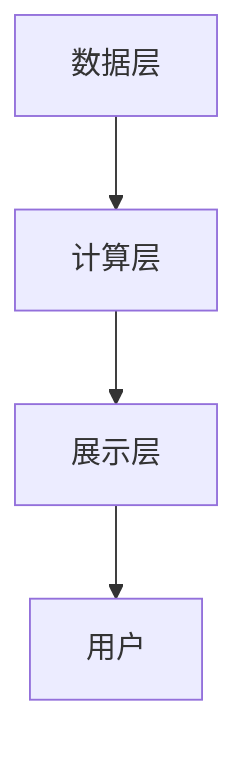

                 


# 芒格的"太难了"篮子：避开复杂投资

> 关键词：芒格，价值投资，简化决策，复杂性管理，投资策略，系统思维，风险管理

> 摘要：芒格的"太难了"篮子是一种简化投资决策的策略，旨在帮助投资者避开复杂且难以管理的投资机会。本文通过分析芒格的投资理念，结合技术方法，详细讲解如何通过简化决策、量化复杂度和构建投资系统来实现高效的复杂性管理，为读者提供一套避开复杂投资的实战指南。

---

## 第一部分: 芒格"太难了"篮子的背景与核心概念

### 第1章: 芒格"太难了"篮子的背景介绍

#### 1.1 投资中的复杂性问题
在现代金融市场上，投资者面临着越来越多复杂的投资机会。复杂的金融工具、频繁的市场波动以及不确定的经济环境，使得投资决策变得异常困难。许多投资者试图通过复杂的模型和策略来应对这些挑战，但结果往往是事倍功半，甚至造成重大损失。

#### 1.2 芒格"太难了"篮子的提出背景
芒格（Charlie Munger）作为巴菲特（Warren Buffett）的长期合作伙伴，以其独特的投资哲学闻名。他提出“太难了”篮子的概念，强调投资者应该专注于自己能够理解的投资机会，避免那些过于复杂且难以管理的投资。这一理念的核心在于简化决策过程，专注于可预测和可控制的领域。

#### 1.3 简化决策在投资中的重要性
简化决策并非意味着忽略复杂性，而是通过筛选和聚焦，找到那些真正值得投资的机会。芒格认为，大多数投资者的时间和精力应该集中在那些简单、可预测且易于管理的投资上，而不是追求复杂和多样化。这种方法不仅能提高投资效率，还能降低风险。

### 第2章: 芒格"太难了"篮子的核心概念与联系

#### 2.1 核心概念的定义与特征
芒格的"太难了"篮子可以被视为一种投资筛选机制，其核心在于以下几个方面：
- **简单性**：专注于那些易于理解和分析的投资机会。
- **可预测性**：选择那些具有稳定商业模式和可预测现金流的企业。
- **可控制性**：确保投资标的的风险在可控范围内。

#### 2.2 核心概念的边界与外延
- **边界**：芒格的"太难了"篮子并不适用于所有类型的投资，它主要关注于那些具有明确竞争优势和稳定财务表现的企业。
- **外延**：虽然芒格的篮子强调简化决策，但并不排斥其他投资策略。它更多是一种筛选工具，帮助投资者快速定位潜在机会。

#### 2.3 核心概念的结构与组成要素
- **目标**：筛选出简单、可预测且易于管理的投资机会。
- **输入**：市场数据、企业基本面、财务指标、行业趋势。
- **输出**：经过筛选的投资标的清单。

---

## 第二部分: 芒格"太难了"篮子的算法与数学模型

### 第3章: 芒格"太难了"篮子的决策模型

#### 3.1 决策模型的原理
芒格的"太难了"篮子是一种基于简单性原则的筛选模型。其核心思想是，通过量化投资标的的复杂性和不确定性，筛选出那些简单、可预测且易于管理的投资机会。

#### 3.2 模型的输入与输出
- **输入**：
  - 投资标的的财务数据（如收入、利润、负债等）。
  - 行业趋势和宏观经济指标。
  - 企业的竞争优势和市场地位。
- **输出**：
  - 投资标的的复杂度评分。
  - 筛选出符合简单性原则的投资机会。

#### 3.3 模型的验证与优化
为了验证模型的有效性，我们可以使用历史数据进行回测。通过比较模型筛选出的投资标的与未筛选标的的表现，评估模型的优劣。优化方向包括：
- 增加更多的指标以更准确地量化复杂性。
- 调整权重，以反映不同因素对复杂性的影响程度。

### 第4章: 芒格"太难了"篮子的数学模型

#### 4.1 投资复杂度的量化公式
为了量化投资标的的复杂性，我们可以设计一个简单的数学模型：

$$
复杂度 = \frac{变量数量}{系统稳定性}
$$

其中：
- 变量数量：影响投资标的的因素数量（如收入、利润、负债等）。
- 系统稳定性：投资标的所在系统的稳定性（如行业波动性、宏观经济稳定性）。

#### 4.2 投资复杂度的计算步骤
1. 收集投资标的的财务数据和行业数据。
2. 确定影响投资标的的主要变量。
3. 量化系统稳定性（例如，通过宏观经济指标）。
4. 计算复杂度评分。
5. 根据评分筛选出复杂度较低的投资标的。

---

## 第三部分: 芒格"太难了"篮子的系统分析与架构设计

### 第5章: 芒格"太难了"篮子的系统分析

#### 5.1 系统分析的背景介绍
为了更好地应用芒格的"太难了"篮子理念，我们需要构建一个完整的投资决策系统。该系统将帮助投资者快速筛选出简单、可预测且易于管理的投资机会。

#### 5.2 系统功能需求
- 数据采集：收集投资标的的财务数据、行业数据和宏观经济数据。
- 复杂度计算：根据量化公式计算投资标的的复杂度评分。
- 标的筛选：根据复杂度评分筛选出符合简单性原则的投资标的。
- 可视化分析：将筛选结果以可视化形式呈现，帮助投资者更好地理解。

#### 5.3 系统模块划分
- 数据采集模块：负责收集数据。
- 复杂度计算模块：负责计算复杂度评分。
- 标的筛选模块：负责筛选出符合简单性原则的投资标的。
- 可视化分析模块：负责将结果以图表形式呈现。

### 第6章: 芒格"太难了"篮子的系统架构设计

#### 6.1 系统架构的层次划分
- 数据层：存储投资标的的财务数据、行业数据和宏观经济数据。
- 计算层：负责复杂度计算和标的筛选。
- 展示层：将结果以可视化形式呈现给用户。

#### 6.2 系统架构图


---

## 第四部分: 芒格"太难了"篮子的项目实战

### 第7章: 芒格"太难了"篮子的项目实战

#### 7.1 环境安装与配置
为了实现芒格"太难了"篮子的投资决策系统，我们需要以下环境和工具：
- Python编程语言。
- 数据处理库（如Pandas）。
- 可视化库（如Matplotlib）。
- 数据源（如Yahoo Finance）。

#### 7.2 核心代码实现
以下是实现芒格"太难了"篮子的Python代码示例：

```python
import pandas as pd
import yfinance as yf

# 下载数据
data = yf.download("AAPL", start="2020-01-01", end="2023-12-31")

# 计算复杂度
def calculate_complexity(data):
    variables = len(data.columns)
    stability = data['Adj Close'].std()
    return variables / stability

complexity = calculate_complexity(data)
print(f"投资复杂度为：{complexity}")
```

#### 7.3 实际案例分析
以苹果公司（AAPL）为例，我们下载其股价数据并计算投资复杂度。通过分析结果，我们可以判断该标的是否符合芒格的"太难了"篮子标准。

---

## 第五部分: 芒格"太难了"篮子的最佳实践与小结

### 第8章: 芒格"太难了"篮子的最佳实践 tips

#### 8.1 简化决策的技巧
- 专注于自己熟悉的投资领域。
- 筛选出简单、可预测且易于管理的投资机会。
- 避免追求复杂和多样化的投资组合。

#### 8.2 避开复杂投资的策略
- 选择具有明确竞争优势的企业。
- 关注企业的财务健康状况。
- 避免投资于波动性过高的行业。

#### 8.3 投资中的风险管理
- 设置止损点。
- 分散投资风险。
- 定期评估和调整投资组合。

### 第9章: 芒格"太难了"篮子的小结与展望

#### 9.1 本书的核心内容回顾
芒格的"太难了"篮子是一种简化投资决策的策略，通过筛选简单、可预测且易于管理的投资机会，帮助投资者避开复杂且难以控制的投资风险。

#### 9.2 未来研究的方向
- 研究更多量化复杂性的指标。
- 探讨如何将芒格的篮子理念应用于不同类型的投资者。
- 开发更加智能化的投资决策系统。

#### 9.3 对读者的寄语
投资是一项长期的事业，芒格的"太难了"篮子为我们提供了一种简化决策的思路。希望读者能够在实际投资中灵活运用这一理念，找到属于自己的投资机会。

---

## 作者：AI天才研究院 & 禅与计算机程序设计艺术

通过本文的分析，我们深入探讨了芒格的"太难了"篮子理念，并结合技术方法，详细讲解了如何通过简化决策、量化复杂度和构建投资系统来实现高效的复杂性管理。希望本文能为读者提供一套避开复杂投资的实战指南，帮助您在投资道路上走得更稳更远。

