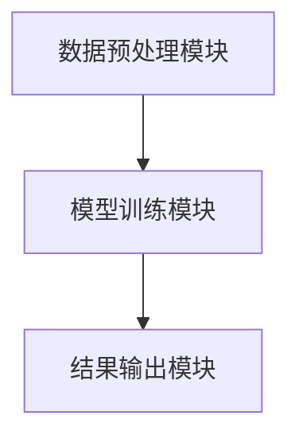
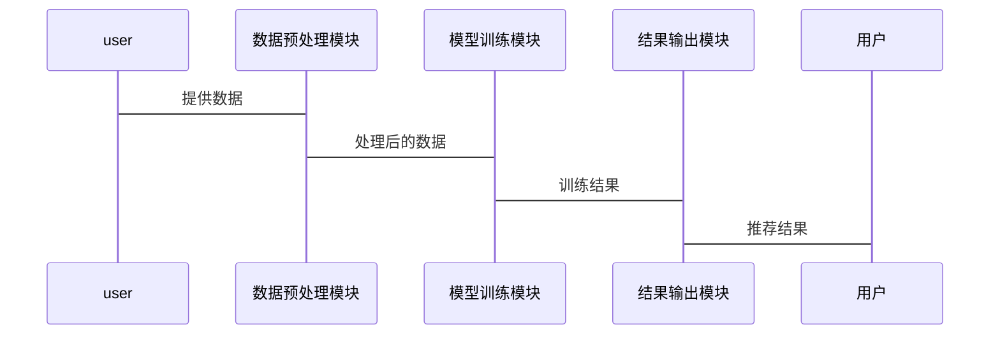

                 


# 芒格的"学习机器"理念在持续学习AI系统开发中的应用

> 关键词：芒格，学习机器，持续学习，AI系统，机器学习

> 摘要：本文探讨了芒格的“学习机器”理念在持续学习AI系统开发中的应用。通过分析学习机器的基本原理、算法实现和系统架构，结合实际案例，详细讲解了如何将芒格的理念融入AI系统的持续学习中，以实现更高效、更智能的系统开发。

---

## 第1章: 芒格的"学习机器"理念概述

### 1.1 芒格的"学习机器"理念背景

#### 1.1.1 芒格的背景与思想体系
查理·芒格（Charlie Munger）是著名投资者巴菲特的导师，他提出了“多元思维模型”（mental models），强调通过多个学科的思维方式来解决问题。他的思想不仅在投资领域产生深远影响，也在人工智能和机器学习领域提供了新的视角。

#### 1.1.2 "学习机器"的核心概念
“学习机器”是指能够通过数据和反馈不断改进自身性能的系统。它强调系统的自适应能力和持续优化，这与芒格的“多元思维模型”不谋而合，因为学习机器需要从多个角度理解和解决问题。

#### 1.1.3 学习机器与AI系统开发的关联
在AI系统开发中，持续学习是实现系统自适应和高效运行的关键。学习机器的理念为AI系统的持续优化提供了理论基础，特别是在处理动态数据和复杂任务时，芒格的思维方式可以帮助系统更好地理解和适应变化。

### 1.2 学习机器的基本原理

#### 1.2.1 学习机器的定义与特征
学习机器是一种能够通过数据输入和反馈不断调整内部参数，从而提高任务执行能力的系统。其核心特征包括：

- **自适应性**：能够根据输入数据和反馈调整自身模型。
- **持续优化**：通过不断学习改进性能，适应新数据和任务需求。
- **多维度思考**：类似于芒格的多元思维模型，学习机器需要从多个角度分析问题。

#### 1.2.2 学习机器的核心算法
学习机器的核心算法包括监督学习、无监督学习和强化学习。每种算法都有其独特的优势和应用场景。

#### 1.2.3 学习机器的分类与应用场景
学习机器可以根据任务类型分为监督学习、无监督学习和强化学习。在实际应用中，学习机器广泛用于推荐系统、自然语言处理、图像识别等领域。

### 1.3 芒格理念与AI系统开发的结合

#### 1.3.1 芒格理念在AI系统开发中的价值
芒格的多元思维模型为AI系统的持续学习提供了理论支持，帮助系统更好地理解和适应复杂问题。

#### 1.3.2 学习机器在持续学习中的作用
学习机器通过持续学习和优化，能够有效应对数据和任务的变化，保持系统的高效性和准确性。

#### 1.3.3 芒格理念对AI系统开发的启示
芒格的理念强调跨学科思维和持续学习的重要性，这为AI系统的开发提供了新的思路和方法。

### 1.4 本章小结
本章介绍了芒格的“学习机器”理念及其在AI系统开发中的应用，强调了持续学习和多元思维模型的重要性，为后续的算法实现和系统设计奠定了基础。

---

## 第2章: 学习机器的核心概念与算法原理

### 2.1 学习机器的核心概念

#### 2.1.1 学习目标与学习策略
学习目标是指系统希望通过学习实现的任务目标，学习策略则是实现目标的具体方法。

#### 2.1.2 学习模型与学习算法
学习模型是系统对问题的抽象表示，学习算法则是实现模型优化的具体方法。

#### 2.1.3 学习数据与特征工程
学习数据是系统输入的基础，特征工程则是对数据进行处理和提取，以提高模型的性能。

### 2.2 学习机器的系统架构

#### 2.2.1 系统输入与输出
系统的输入包括数据和反馈，输出是经过处理后的结果或预测值。

#### 2.2.2 系统功能模块划分
学习机器的系统架构通常包括数据预处理模块、模型训练模块和结果输出模块。

#### 2.2.3 系统组件之间的关系
系统组件之间通过数据流和控制流相互连接，协同完成学习和优化任务。

### 2.3 学习机器的算法特征对比

#### 2.3.1 不同学习算法的对比分析
监督学习、无监督学习和强化学习在算法实现和应用场景上存在差异。

#### 2.3.2 算法性能与复杂度对比
不同算法在性能和复杂度上各有优劣，选择合适的算法需要根据具体任务需求。

#### 2.3.3 算法适用场景的对比
不同算法适用于不同的任务场景，了解其适用场景有助于更好地选择和应用。

### 2.4 本章小结
本章详细讲解了学习机器的核心概念和算法原理，为后续的系统设计和实现奠定了理论基础。

---

## 第3章: 学习机器的算法原理与实现

### 3.1 监督学习算法原理

#### 3.1.1 监督学习的基本概念
监督学习是一种通过标记数据进行训练的学习方法，适用于分类和回归任务。

#### 3.1.2 线性回归算法原理
线性回归是一种简单的监督学习算法，用于预测连续型变量。

#### 3.1.3 支持向量机算法原理
支持向量机是一种常用的监督学习算法，适用于分类和回归任务。

### 3.2 非监督学习算法原理

#### 3.2.1 非监督学习的基本概念
非监督学习是一种通过无标记数据进行训练的学习方法，适用于聚类任务。

#### 3.2.2 K-means聚类算法原理
K-means是一种常用的聚类算法，适用于将数据分成K个簇的情况。

#### 3.2.3 层次聚类算法原理
层次聚类是一种基于数据相似性层次化地将数据进行聚类的方法。

### 3.3 强化学习算法原理

#### 3.3.1 强化学习的基本概念
强化学习是一种通过与环境互动获得奖励的学习方法，适用于机器人控制和游戏AI开发。

#### 3.3.2 Q-learning算法原理
Q-learning是一种基于值函数的强化学习算法，通过更新Q值表来优化决策。

#### 3.3.3 Deep Q-Network算法原理
Deep Q-Network是一种结合深度学习的强化学习算法，适用于复杂任务。

### 3.4 算法实现的数学模型

#### 3.4.1 线性回归的数学模型
线性回归的数学模型可以表示为：
$$ y = \theta_0 + \theta_1x + \epsilon $$
其中，$\theta_0$和$\theta_1$是模型参数，$\epsilon$是误差项。

#### 3.4.2 支持向量机的数学模型
支持向量机的目标是最小化 hinge loss，数学表示为：
$$ \min_{\theta} \sum_{i=1}^n [y_i (x_i \cdot \theta + b) - 1] $$

#### 3.4.3 Q-learning的数学模型
Q-learning的目标是通过更新Q值表来最大化累积奖励，数学表示为：
$$ Q(s, a) = Q(s, a) + \alpha [r + \max_{a'} Q(s', a') - Q(s, a)] $$

### 3.5 算法实现的代码示例

#### 3.5.1 线性回归的Python实现
```python
import numpy as np

# 生成数据
X = np.array([1, 2, 3, 4, 5])
Y = np.array([2, 4, 5, 4, 5])

# 训练模型
theta = np.polyfit(X, Y, 1)

# 预测结果
print(theta)
```

#### 3.5.2 K-means聚类的Python实现
```python
from sklearn.cluster import KMeans

# 生成数据
X = np.random.rand(100, 2)

# 训练模型
kmeans = KMeans(n_clusters=2)
kmeans.fit(X)

# 获取聚类结果
print(kmeans.labels_)
```

### 3.6 本章小结
本章详细讲解了监督学习、非监督学习和强化学习的算法原理，并通过代码示例展示了如何实现这些算法。这些算法为学习机器的持续学习提供了坚实的基础。

---

## 第4章: 学习机器的系统架构设计与实现

### 4.1 系统分析与需求分析

#### 4.1.1 项目背景介绍
本项目旨在开发一个能够持续学习的推荐系统，通过学习用户行为数据来优化推荐效果。

#### 4.1.2 系统功能设计
系统需要实现数据预处理、模型训练和结果输出三个主要功能。

#### 4.1.3 系统功能模块划分
系统分为数据预处理模块、模型训练模块和结果输出模块。

### 4.2 系统架构设计

#### 4.2.1 系统架构图


#### 4.2.2 系统组件之间的关系
数据预处理模块负责对原始数据进行清洗和转换，模型训练模块基于处理后的数据进行训练，结果输出模块将训练结果输出给用户。

### 4.3 系统接口设计

#### 4.3.1 输入接口设计
系统需要接收用户行为数据和反馈信息。

#### 4.3.2 输出接口设计
系统输出推荐结果和性能指标。

### 4.4 系统交互流程

#### 4.4.1 交互流程图


### 4.5 本章小结
本章详细讲解了学习机器的系统架构设计，包括功能模块划分、系统组件关系和交互流程设计，为后续的项目实现奠定了基础。

---

## 第5章: 学习机器的项目实战与分析

### 5.1 项目实战：推荐系统开发

#### 5.1.1 环境安装与配置
安装必要的Python库，如numpy、pandas和scikit-learn。

#### 5.1.2 核心代码实现
实现数据预处理、模型训练和结果输出的代码。

#### 5.1.3 代码功能解读
解读代码的功能，包括数据清洗、特征提取和模型训练。

### 5.2 项目实战：图像分类系统

#### 5.2.1 项目背景介绍
开发一个能够持续学习的图像分类系统，通过学习新数据来优化分类性能。

#### 5.2.2 系统功能设计
系统需要实现图像预处理、模型训练和结果输出三个主要功能。

### 5.3 项目分析与优化

#### 5.3.1 项目分析
分析项目的优缺点，总结经验教训。

#### 5.3.2 优化建议
提出进一步优化的建议，如引入更复杂的算法或改进系统架构。

### 5.4 本章小结
本章通过实际项目展示了学习机器的应用场景和实现过程，帮助读者更好地理解理论知识。

---

## 第6章: 学习机器的最佳实践与未来展望

### 6.1 最佳实践

#### 6.1.1 系统设计中的注意事项
在系统设计中需要注意数据质量和算法选择。

#### 6.1.2 项目开发中的注意事项
在项目开发中需要注意代码的可维护性和扩展性。

#### 6.1.3 持续学习中的注意事项
在持续学习中需要注意数据漂移和模型遗忘问题。

### 6.2 小结

### 6.3 未来展望
未来，学习机器将在更多领域得到应用，算法也将更加复杂和高效。

---

## 第7章: 总结与参考文献

### 7.1 总结
本文详细探讨了芒格的“学习机器”理念在持续学习AI系统开发中的应用，通过理论分析和实际案例展示了如何实现高效的学习系统。

### 7.2 参考文献
1. 芒格的《穷查理宝典》
2. 《机器学习实战》
3. 《深度学习》

---

## 作者：AI天才研究院 & 禅与计算机程序设计艺术

---

通过以上目录和内容，本文系统地探讨了芒格的“学习机器”理念在持续学习AI系统开发中的应用，从理论到实践，层层深入，为读者提供了丰富的知识和实用的指导。

