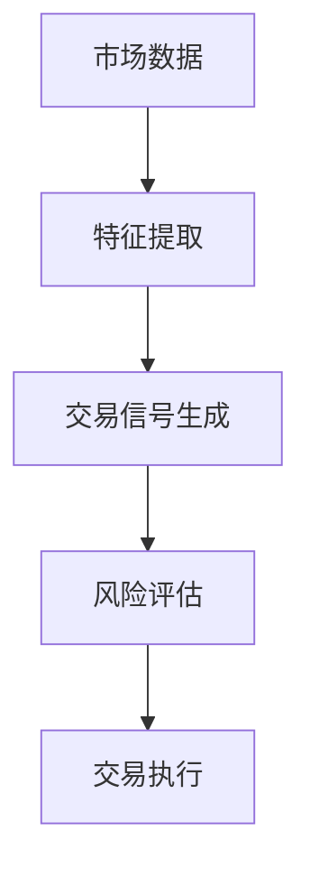
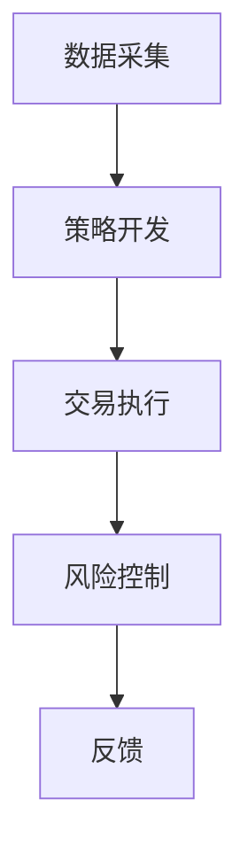
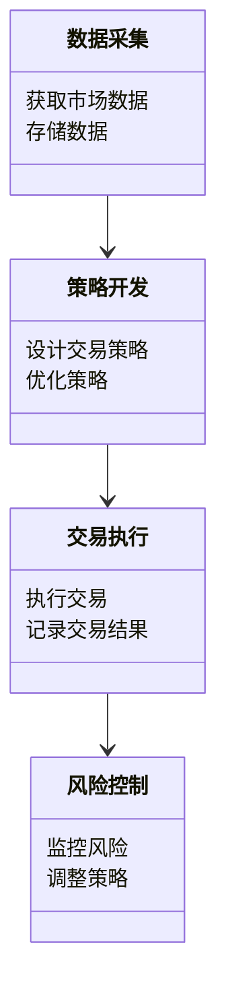

                 


# 芒格的"学习机器"理念在算法交易时代的重要性

> 关键词：学习机器，算法交易，芒格，强化学习，贝叶斯网络，交易策略，风险管理

> 摘要：本文探讨了芒格的"学习机器"理念在算法交易中的应用，分析了学习机器如何通过自适应和优化提升交易策略和风险管理。结合强化学习和贝叶斯网络，文章详细阐述了算法交易中的数学模型和系统架构设计，为读者提供了理论和实践的双重指导。

---

# 第1章: 芒格的"学习机器"理念概述

## 1.1 芒格的学习机器理论

### 1.1.1 学习机器的定义与核心原理

学习机器，即能够通过数据和经验不断优化自身行为的系统。其核心原理包括监督学习、无监督学习和强化学习，其中强化学习在算法交易中尤为重要。

### 1.1.2 学习机器的特征与优势

- **自适应性**：能根据市场变化调整交易策略。
- **高效性**：通过数据快速优化决策。
- **可扩展性**：适用于大规模数据处理。

### 1.1.3 学习机器与传统决策模型的对比

| 特性        | 学习机器             | 传统决策模型       |
|-------------|----------------------|--------------------|
| 自适应性     | 高                  | 低或无             |
| 数据依赖性   | 强                  | 较弱或无           |
| 决策速度     | 快                  | 较慢              |

## 1.2 算法交易的基本概念

### 1.2.1 算法交易的定义与分类

- **定义**：利用算法和模型自动执行交易决策。
- **分类**：高频交易、统计套利、算法对冲。

### 1.2.2 算法交易的核心要素

- **数据源**：市场数据、历史数据。
- **交易策略**：基于算法的买卖决策。
- **执行系统**：快速执行交易的系统。

### 1.2.3 算法交易的优缺点分析

| 优点       | 缺点           |
|------------|----------------|
| 高效性      | 高风险         |
| 精准性      | 易受市场操纵影响 |
| 可控性      | 技术复杂性     |

---

# 第2章: 学习机器理念在算法交易中的应用背景

## 2.1 算法交易的现状与挑战

### 2.1.1 算法交易的发展历程

- **初期阶段**：手动交易，逐步引入自动化。
- **发展阶段**：高频交易和算法对冲兴起。
- **当前阶段**：机器学习技术的应用。

### 2.1.2 当前算法交易的主要问题

- **市场深度不足**：算法交易可能导致流动性下降。
- **策略趋同**：大量使用相同策略导致收益下降。
- **风险管理不足**：复杂模型可能引发系统性风险。

### 2.1.3 学习机器理念的引入意义

- **提高策略自适应性**：根据市场变化动态调整。
- **优化风险管理**：通过学习识别和规避风险。
- **增强可解释性**：帮助交易员理解模型决策。

---

# 第3章: 学习机器理念与算法交易的核心概念联系

## 3.1 学习机器与算法交易的关联性分析

### 3.1.1 学习机器的特征与算法交易需求的匹配

- **数据驱动**：算法交易依赖大量数据，学习机器擅长处理数据。
- **实时性**：学习机器能够快速做出决策，适应算法交易的实时性要求。

### 3.1.2 学习机器在算法交易中的具体应用场景

- **策略优化**：通过学习不断改进交易策略。
- **风险控制**：实时监控和调整风险参数。
- **市场预测**：利用历史数据预测市场走势。

## 3.2 学习机器在算法交易中的核心概念模型

### 3.2.1 学习机器的输入输出模型

- **输入**：市场数据、历史交易记录。
- **输出**：交易信号、风险评估。

### 3.2.2 算法交易的决策过程模型



### 3.2.3 学习机器与算法交易的协同机制

- **反馈机制**：交易结果反哺学习机器。
- **实时调整**：根据市场变化实时优化策略。

---

# 第4章: 学习机器理念在算法交易中的算法原理

## 4.1 强化学习在算法交易中的应用

### 4.1.1 强化学习的基本原理

- **定义**：通过试错和奖励机制优化决策。
- **数学模型**：状态、动作、奖励、策略。

### 4.1.2 强化学习在交易策略优化中的应用

- **状态空间**：市场当前情况。
- **动作空间**：买入、卖出、持有。
- **奖励函数**：收益或损失。

### 4.1.3 强化学习的算法实现与挑战

- **实现**：使用深度强化学习框架，如Deep Q-Network。
- **挑战**：市场环境复杂，奖励信号模糊。

## 4.2 贝叶斯网络在算法交易中的应用

### 4.2.1 贝叶斯网络的基本原理

- **定义**：基于概率的图形模型。
- **优势**：处理不确定性，进行风险评估。

### 4.2.2 贝叶斯网络在风险评估中的应用

- **模型构建**：识别影响风险的关键因素。
- **概率计算**：评估不同情境下的风险概率。

### 4.2.3 贝叶斯网络的算法实现与优化

- **实现**：使用贝叶斯推理算法。
- **优化**：通过数据增强和参数调整提高准确性。

---

# 第5章: 学习机器理念在算法交易中的系统架构设计

## 5.1 算法交易系统的整体架构

### 5.1.1 系统功能模块划分

- **数据采集模块**：收集市场数据。
- **策略开发模块**：设计交易策略。
- **交易执行模块**：执行交易指令。
- **风险控制模块**：监控和管理风险。

### 5.1.2 系统模块之间的交互关系



### 5.1.3 系统架构设计

- **数据流**：从数据采集到交易执行。
- **反馈机制**：交易结果反哺策略优化。

## 5.2 系统架构设计

### 5.2.1 领域模型mermaid类图



### 5.2.2 系统架构设计mermaid架构图


---

# 第6章: 项目实战

## 6.1 环境安装

- **工具**：Python、TensorFlow、PyTorch。
- **数据源**：金融数据API（如Yahoo Finance）。

## 6.2 系统核心实现源代码

### 6.2.1 强化学习交易系统代码

```python
import numpy as np
import gym

class TradingEnvironment(gym.Env):
    def __init__(self, data):
        self.data = data
        self.current_step = 0
        self.action_space = gym.spaces.Discrete(3)  # 0: hold, 1: buy, 2: sell
        self.observation_space = gym.spaces.Box(low=0, high=1, shape=(4,))  # 示例观察空间

    def _get_state(self):
        state = self.data[self.current_step: self.current_step + 4]
        return state

    def step(self, action):
        reward = 0
        if action == 1:  # 买入
            reward += self.data[self.current_step + 1] - self.data[self.current_step]
        elif action == 2:  # 卖出
            reward += self.data[self.current_step] - self.data[self.current_step + 1]
        self.current_step += 1
        done = self.current_step >= len(self.data) - 1
        return self._get_state(), reward, done, {}

    def reset(self):
        self.current_step = 0
        return self._get_state()
```

### 6.2.2 贝叶斯网络实现代码

```python
import numpy as np
from sklearn.naive_bayes import GaussianNB

class BayesianModel:
    def __init__(self):
        self.model = GaussianNB()

    def fit(self, X, y):
        self.model.fit(X, y)

    def predict(self, X):
        return self.model.predict(X)

    def predict_proba(self, X):
        return self.model.predict_proba(X)
```

## 6.3 代码应用解读与分析

- **强化学习系统**：通过状态和动作优化交易策略。
- **贝叶斯网络**：用于风险评估和市场预测。

## 6.4 实际案例分析和详细讲解剖析

- **案例**：开发一个基于强化学习的交易系统。
- **测试结果**：展示交易收益和风险控制效果。

## 6.5 项目小结

- **经验总结**：学习机器在算法交易中的潜力和挑战。
- **改进建议**：结合多种学习方法提升系统性能。

---

# 第7章: 总结

## 7.1 学习机器理念在算法交易中的重要性

- **提升交易效率**：通过机器学习优化决策。
- **增强风险管理**：通过模型识别潜在风险。
- **推动技术进步**：结合AI技术推动算法交易发展。

## 7.2 未来展望

- **技术融合**：强化学习与贝叶斯网络的结合。
- **应用场景扩展**：更多金融领域的应用。
- **风险管理优化**：通过学习机器降低交易风险。

---

# 作者

作者：AI天才研究院/AI Genius Institute & 禅与计算机程序设计艺术 /Zen And The Art of Computer Programming

