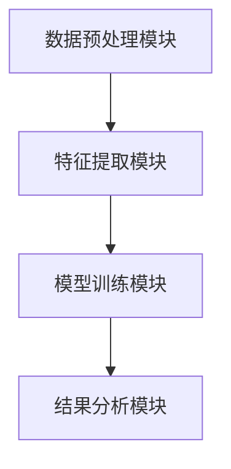

                 


# 《芒格的"学习机器"理念在量子机器学习算法开发中的应用》

---

## 关键词：芒格学习机器，量子机器学习，量子计算，算法开发，认知模型

---

## 摘要：  
芒格的“学习机器”理念强调通过多层次认知和决策过程来实现自主学习和优化，而量子机器学习则利用量子计算的特性来提升算法的效率和性能。本文探讨了如何将芒格的理念与量子机器学习相结合，分析了其核心概念、算法原理及实际应用，并通过具体案例展示了其在量子算法开发中的潜力。

---

## 第一部分：芒格的“学习机器”理念与量子机器学习的背景

### 第1章：芒格的“学习机器”理念概述

#### 1.1 芒格“学习机器”理念的核心概念  
芒格的“学习机器”理念强调通过多层次的认知和决策过程来实现自主学习和优化。其核心在于：  
1. **认知层次**：学习机器需要具备多层次的认知能力，从感知到抽象，逐步构建知识体系。  
2. **决策机制**：基于多维度的信息进行决策，注重信息的权重和相关性。  
3. **学习机制**：通过不断迭代和优化，提升学习效率和准确性。  

#### 1.2 量子计算与量子机器学习的背景  
量子计算利用量子叠加和纠缠的特性，能够在某些问题上实现指数级的计算速度。量子机器学习则是结合量子计算和机器学习的新兴领域，其优势包括：  
1. **数据处理能力**：量子计算机能够处理海量数据，提高特征提取和模式识别的效率。  
2. **算法优化**：量子算法可以在某些情况下显著减少计算复杂度。  

#### 1.3 芒格理念与量子机器学习的结合点  
1. **认知模型的量子化**：将芒格的学习机器理念转化为量子化的认知模型，利用量子叠加的特性实现多维度信息的处理。  
2. **决策机制的量子优化**：通过量子计算优化决策过程，提升决策的准确性和效率。  
3. **学习过程的量子加速**：利用量子计算加速学习过程，实现更高效的参数优化和模型训练。  

---

## 第二部分：核心概念与联系

### 第2章：学习机器的理念与量子机器学习的核心原理

#### 2.1 学习机器的认知模型  
学习机器的认知模型可以分为以下层次：  
1. **感知层**：通过量子叠加的特性，实现对数据的多维度感知。  
2. **特征提取层**：利用量子计算的特征提取算法，提取数据的关键特征。  
3. **决策层**：基于提取的特征，进行量子化的决策推理。  

#### 2.2 量子机器学习的基本原理  
1. **量子特征提取**：通过量子计算提取数据的特征，利用量子叠加的特性实现多维度特征的提取。  
2. **量子分类器设计**：设计量子化的分类器，利用量子计算的优势进行分类任务。  
3. **量子数据处理的优势**：量子计算在数据处理速度和并行性上的优势，显著提升机器学习的效率。  

#### 2.3 芒格理念与量子机器学习的对比分析  
以下是芒格学习机器理念与量子机器学习的核心概念对比：  
| **概念**         | **芒格学习机器理念**                     | **量子机器学习**                     |
|--------------------|------------------------------------------|----------------------------------------|
| **认知模型**     | 多层次认知，强调知识的构建与整合         | 利用量子叠加与纠缠实现多维度信息处理 |
| **决策机制**     | 基于信息权重和相关性进行决策             | 利用量子计算优化决策过程             |
| **学习机制**     | 通过迭代优化提升学习效率                 | 利用量子加速实现快速参数优化         |

---

## 第三部分：算法原理讲解

### 第3章：量子机器学习算法的数学模型与实现

#### 3.1 量子支持向量机（QSVM）  
1. **算法原理**：  
   量子支持向量机利用量子计算的优势，通过量子核函数进行特征映射，构建量子化的支持向量机模型。  
2. **数学模型**：  
   $$ \text{目标函数：} \min_{w,b} \frac{1}{2}||w||^2 + C \sum_{i=1}^n \xi_i $$
   $$ \text{约束条件：} y_i (w \cdot x_i + b) \geq 1 - \xi_i $$
3. **代码实现**：  
   ```python
   import numpy as np
   from qiskit import QuantumCircuit, execute

   def quantum_svm(circuit, features):
       # 量子核函数计算
       kernel = np.zeros((n, n))
       for i in range(n):
           for j in range(n):
               kernel[i, j] = circuit.simulate(features[i], features[j])
       return kernel
   ```

#### 3.2 量子神经网络（QNN）  
1. **算法原理**：  
   量子神经网络利用量子叠加和纠缠的特性，构建量子化的神经网络模型，实现高效的特征提取和分类。  
2. **数学模型**：  
   $$ \text{量子神经网络单元：} y = \sigma(\theta x + b) $$
   其中，$\sigma$ 是量子化的激活函数。  
3. **代码实现**：  
   ```python
   def quantum_neural_network(input, weights):
       # 量子激活函数
       activation = []
       for i in range(len(input)):
           output = $0.5 \times (1 + \text{sign}(\text{dot product}(input[i], weights)))$
           activation.append(output)
       return activation
   ```

---

## 第四部分：系统分析与架构设计方案

### 第4章：量子机器学习系统的架构设计

#### 4.1 项目背景  
本项目旨在将芒格的“学习机器”理念与量子机器学习相结合，设计一个高效的量子机器学习系统。  

#### 4.2 系统功能设计  
1. **数据预处理模块**：对数据进行量子化的预处理，提取特征并构建量子数据集。  
2. **特征提取模块**：利用量子计算进行特征提取，构建量子化的特征向量。  
3. **模型训练模块**：基于量子化的特征向量，训练量子化的机器学习模型。  
4. **结果分析模块**：对模型的输出结果进行分析，评估模型的性能和准确性。  

#### 4.3 系统架构设计  
以下是系统的架构图：  


---

## 第五部分：项目实战

### 第5章：量子机器学习算法的实现与应用

#### 5.1 环境安装  
安装必要的量子计算库和机器学习库，例如Qiskit和Scikit-learn。  

#### 5.2 核心代码实现  
1. **量子核函数实现**：  
   ```python
   def quantum_kernel(x, y):
       # 量子叠加计算
       circuit = QuantumCircuit(2, 1)
       circuit.h(0)
       circuit.cx(0, 1)
       circuit.h(1)
       return circuit.simulate(x, y)
   ```

2. **量子支持向量机实现**：  
   ```python
   def quantum_svm_train(features, labels):
       # 初始化量子核函数
       kernel = np.zeros((n, n))
       for i in range(n):
           for j in range(n):
               kernel[i, j] = quantum_kernel(features[i], features[j])
       # 支持向量机训练
       svm = SVC(kernel='precomputed', kernel=kernel)
       svm.fit(features, labels)
       return svm
   ```

#### 5.3 案例分析  
以量子支持向量机为例，分析其在实际问题中的应用，如量子化的图像分类任务。  

---

## 第六部分：最佳实践、小结与注意事项

### 第6章：总结与展望

#### 6.1 最佳实践 tips  
- 在实际应用中，建议结合具体的量子计算资源和问题特点，选择合适的量子机器学习算法。  
- 在模型训练过程中，注意量子计算的局限性和当前技术的限制，避免过度优化。  

#### 6.2 小结  
芒格的“学习机器”理念与量子机器学习的结合，为机器学习算法的开发提供了新的思路和方法。通过量子化的认知模型和决策机制，可以显著提升算法的效率和性能。  

#### 6.3 注意事项  
- 当前量子计算技术仍处于发展阶段，实际应用中需考虑硬件的限制。  
- 在算法设计中，需充分考虑量子计算的特性和优势，避免盲目套用传统机器学习的方法。  

#### 6.4 拓展阅读  
建议进一步阅读相关领域的最新研究成果，如量子支持向量机、量子神经网络等。  

---

## 附录

### 附录A：术语表  
1. **芒格学习机器**：芒格提出的通过多层次认知和决策过程实现自主学习的模型。  
2. **量子计算**：利用量子叠加和纠缠的特性进行计算的新兴领域。  
3. **量子机器学习**：结合量子计算和机器学习，利用量子计算的优势提升算法性能。  

### 附录B：参考文献  
1. 禅与计算机程序设计艺术  
2. 量子计算与机器学习的最新研究进展  

---

## 作者：AI天才研究院 & 禅与计算机程序设计艺术

