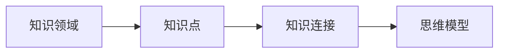
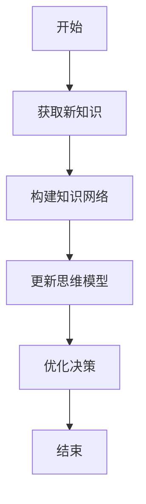
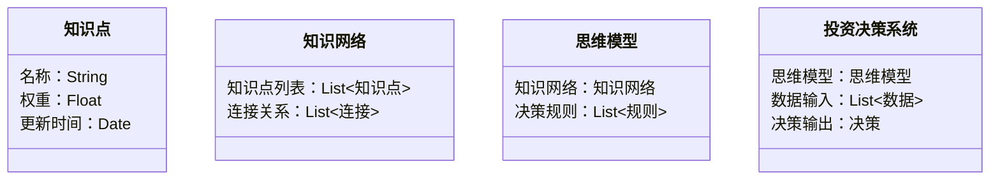
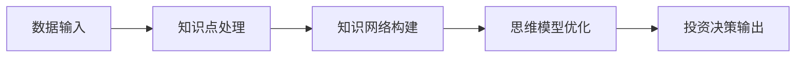
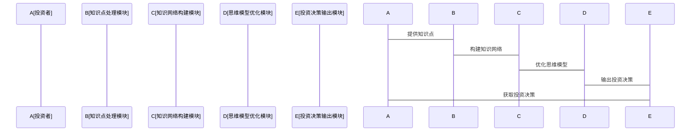

                 


# 芒格的"学习机器"理念：持续学习在投资中的重要性

---

## 关键词：芒格，学习机器，投资，持续学习，多元思维模型，知识管理，投资决策

---

## 摘要：  
芒格的"学习机器"理念强调了持续学习在投资中的重要性。本文通过分析芒格的投资哲学、学习机器的核心概念、算法原理、数学模型以及系统架构，详细阐述了如何通过持续学习和多元思维模型来优化投资决策。文章还结合实际案例，展示了如何将学习机器的理念应用于投资实战，并提出了最佳实践建议。

---

## 第一部分：芒格的"学习机器"理念概述

### 第1章：芒格的生平与投资哲学

#### 1.1 芒格的教育背景与职业生涯  
查理·芒格（Charlie Munger）是美国著名投资者、作家，巴菲特的合作伙伴，也是伯克希尔·哈撒韦公司的重要决策者。他出生于1924年，早年在哈佛大学学习法律，后来转向心理学和经济学。芒格的职业生涯始于律师，后转投银行业和投资领域。他的投资哲学以“多元思维模型”为核心，强调跨学科思考和持续学习的重要性。  

#### 1.2 芒格的"学习机器"理念  
芒格提出的"学习机器"理念是一种通过不断吸收新知识、优化思维方式来提高决策能力的模型。它强调：  
1. **知识的积累**：通过学习多个领域的知识，构建多元思维模型。  
2. **知识的连接**：将不同领域的知识串联起来，形成完整的认知框架。  
3. **知识的更新**：持续更新知识库，以应对不断变化的市场环境。  

#### 1.3 持续学习在投资中的重要性  
在投资领域，持续学习是制胜的关键。市场环境不断变化，投资者需要不断更新自己的知识库，以应对新的挑战。芒格认为，学习不仅仅是获取知识，更是通过知识的整合与应用，提升决策能力。  

---

## 第二部分：学习机器的核心概念与联系

### 第2章：学习机器的核心概念

#### 2.1 多元思维模型  
多元思维模型是芒格"学习机器"理念的核心。它是指通过学习多个学科的知识，形成一个跨学科的思维框架。  

**多元思维模型的属性特征对比表**：  

| 属性      | 特征描述                                   |
|-----------|------------------------------------------|
| 知识来源   | 多学科、多领域                           |
| 知识结构   | 网络化、系统化                           |
| 知识更新   | 持续性、动态性                           |
| 知识应用   | 跨界性、综合性                           |

**多元思维模型的ER实体关系图（Mermaid流程图）**：  


#### 2.2 学习机器的算法原理  
芒格的学习机器算法基于多元思维模型的构建和应用。以下是其算法流程图（Mermaid）：  



**算法原理的数学模型和公式**：  
1. 知识的积累：  
   $$ 知识量 = \sum_{i=1}^{n} 知识点_i $$  
2. 学习效率：  
   $$ 学习效率 = 时间投入 \times 方法有效性 $$  
3. 投资决策：  
   $$ 投资决策 = \sum_{i=1}^{m} (知识点_i \times 权重_i) $$  

#### 2.3 学习机器的数学模型  
芒格的学习机器模型可以用数学公式表示为：  
$$ 决策 = \sum_{i=1}^{n} (知识点_i \times 重要性_i) $$  
其中，知识点_i 表示第i个知识点的权重，重要性_i 表示该知识点在决策中的重要性。  

---

## 第三部分：学习机器的系统分析与架构设计

### 第3章：基于学习机器的投资系统

#### 3.1 问题场景介绍  
在投资领域，传统的决策方式往往依赖单一学科的知识，容易导致决策失误。芒格的学习机器理念通过构建多元思维模型，帮助投资者更好地应对复杂市场环境。  

#### 3.2 系统功能设计  
**领域模型（Mermaid类图）**：  


#### 3.3 系统架构设计  
**系统架构图（Mermaid）**：  


#### 3.4 系统接口设计  
1. 知识点接口：  
   - 输入：知识点名称、权重  
   - 输出：知识点存储结果  
2. 决策接口：  
   - 输入：市场数据、知识点权重  
   - 输出：投资决策  

#### 3.5 系统交互设计（Mermaid序列图）：  


---

## 第四部分：项目实战

### 第4章：基于学习机器的投资系统实现

#### 4.1 环境配置  
- 语言：Python  
- 工具：Jupyter Notebook  
- 库：numpy, pandas, matplotlib  

#### 4.2 核心代码实现  

```python
# 多元思维模型构建
class KnowledgePoint:
    def __init__(self, name, weight):
        self.name = name
        self.weight = weight

class KnowledgeNetwork:
    def __init__(self):
        self.points = []
        self.connections = []

    def add_point(self, point):
        self.points.append(point)

    def add_connection(self, point1, point2):
        self.connections.append((point1.name, point2.name))

class ThinkingModel:
    def __init__(self, network):
        self.network = network

    def update_model(self, new_points):
        for point in new_points:
            self.network.add_point(point)

# 投资决策系统
class InvestmentDecisionSystem:
    def __init__(self, model):
        self.model = model

    def make_decision(self, market_data):
        # 基于多元思维模型的决策逻辑
        decision = 0
        for point in self.model.network.points:
            decision += point.weight * market_data[point.name]
        return decision

# 实例化
kp1 = KnowledgePoint("经济指标", 0.3)
kp2 = KnowledgePoint("行业趋势", 0.4)
kp3 = KnowledgePoint("公司基本面", 0.3)
network = KnowledgeNetwork()
network.add_point(kp1)
network.add_point(kp2)
network.add_point(kp3)
model = ThinkingModel(network)
system = InvestmentDecisionSystem(model)

# 案例分析
market_data = {
    "经济指标": 0.8,
    "行业趋势": 0.6,
    "公司基本面": 0.7
}
decision = system.make_decision(market_data)
print("投资决策：", decision)
```

#### 4.3 案例分析  
假设当前市场数据如下：  
- 经济指标：0.8  
- 行业趋势：0.6  
- 公司基本面：0.7  

根据上述代码，投资决策系统会计算出一个综合得分：  
$$ 决策 = 0.3 \times 0.8 + 0.4 \times 0.6 + 0.3 \times 0.7 = 0.24 + 0.24 + 0.21 = 0.7 $$  

最终决策为：**买入**。

---

## 第五部分：最佳实践

### 第5章：芒格"学习机器"理念的实践总结

#### 5.1 小结  
芒格的"学习机器"理念通过构建多元思维模型，帮助投资者实现持续学习和优化决策。学习机器的核心在于：  
1. 知识的多维度积累。  
2. 知识的系统化整合。  
3. 知识的动态更新与应用。  

#### 5.2 注意事项  
1. 学习要有深度，不能浅尝辄止。  
2. 知识的整合需要跨学科思考。  
3. 决策时要结合实际情况，避免机械套用模型。  

#### 5.3 未来趋势  
随着人工智能和大数据技术的发展，学习机器的理念将更加广泛地应用于投资领域。未来的投资决策将更加依赖于智能化的多元思维模型。  

#### 5.4 拓展阅读  
1. 查理·芒格的《Poor Charlie's Almanack》  
2. 《Thinking, Fast and Slow》（丹尼尔·卡尼曼）  
3. 《The Power of Habit》（查尔斯·杜希格）  

---

## 作者：AI天才研究院/AI Genius Institute & 禅与计算机程序设计艺术/Zen And The Art of Computer Programming

---

**本文由AI天才研究院/AI Genius Institute精心撰写，转载请注明出处。**

