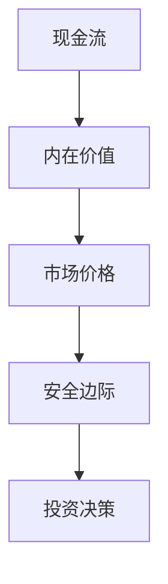

                 


# 芒格的"安全边际"理念在投资中的实践

## 关键词
- 芒格，安全边际，投资，风险管理，价值投资，股票，债券

## 摘要
本文深入探讨了芒格的安全边际理念在投资中的实践应用。通过分析安全边际的核心原理、数学模型及其在股票、债券等资产中的应用，结合实际案例，展示了如何利用安全边际理念进行风险管理、制定投资策略并实现长期投资目标。文章还总结了安全边际理念的优势与局限，并展望了其在现代投资中的未来发展。

---

## 第一章：芒格的安全边际理念概述

### 1.1 芒格的投资哲学
芒格是一位杰出的价值投资者，他提出的“安全边际”理念是其投资哲学的核心。安全边际理念强调在投资决策中留有余地，即通过低估资产的内在价值并以低于该价值的价格购买，以降低投资风险。

#### 1.1.1 价值投资的核心思想
价值投资的核心在于寻找市场价格低于内在价值的资产。芒格认为，内在价值是资产在未来现金流的现值，而市场价格是动态变化的。通过比较两者，可以确定是否存在安全边际。

#### 1.1.2 芒格的多元思维模型
芒格提倡通过跨学科的思维模型来分析问题，这种多元思维模型帮助投资者更全面地评估资产的价值。安全边际理念正是这种多元思维模型的应用之一。

#### 1.1.3 安全边际理念的提出背景
在20世纪，价值投资逐渐兴起，但市场波动和泡沫的出现使得投资者需要一种更稳健的投资方法。芒格的安全边际理念应运而生，旨在通过降低风险来提高投资的稳定性。

### 1.2 安全边际的定义与核心要素
安全边际是市场价格与内在价值之间的差额。当市场价格低于内在价值时，差额即为安全边际。

#### 1.2.1 安全边际的定义
安全边际 = 内在价值 - 市场价格

#### 1.2.2 安全边际的核心要素
- **内在价值**：资产在未来现金流的现值。
- **市场价格**：资产当前的市场交易价格。
- **安全空间**：内在价值与市场价格之间的差额，即安全边际。

#### 1.2.3 安全边际的边界与外延
安全边际的边界在于市场价格波动范围，而外延则涉及市场情绪、宏观经济环境等因素。

### 1.3 安全边际与传统投资理念的对比
传统投资理念往往关注市场的短期波动，而安全边际理念则更注重资产的长期价值。

#### 1.3.1 与技术分析的对比
技术分析依赖于价格和成交量的模式，而安全边际理念关注内在价值和市场价格的差异。

#### 1.3.2 与基本面分析的对比
基本面分析侧重于财务数据，而安全边际理念在基本面分析的基础上加入了价格波动的考量。

#### 1.3.3 与现代投资组合理论的对比
现代投资组合理论强调分散投资以降低风险，而安全边际理念更注重单个资产的内在价值与市场价格的差异。

---

## 第二章：安全边际的核心原理与数学模型

### 2.1 安全边际的数学模型与算法原理
安全边际的计算涉及内在价值和市场价格的比较。

#### 2.1.1 内在价值的计算公式
$$
\text{内在价值} = \sum_{t=1}^{n} \frac{\text{现金流}}{(1 + r)^t}
$$
其中，\( r \) 是折现率，\( t \) 是时间。

#### 2.1.2 安全边际的计算公式
$$
\text{安全边际} = \text{内在价值} - \text{市场价格}
$$

#### 2.1.3 安全边际的动态调整模型
$$
\text{调整后安全边际} = \text{内在价值} \times (1 + \text{调整系数}) - \text{市场价格}
$$

#### 2.1.4 安全边际的算法流程
1. 确定目标资产的现金流。
2. 计算内在价值。
3. 获取市场价格。
4. 计算安全边际。
5. 根据安全边际决定是否投资。

### 2.2 安全边际的数学模型图示


### 2.3 安全边际的Python代码实现
```python
def calculate_intrinsic_value(cash_flows, discount_rate):
    intrinsic_value = 0
    for t in range(len(cash_flows)):
        intrinsic_value += cash_flows[t] / (1 + discount_rate) ** t
    return intrinsic_value

def calculate_margin_of_safety(intrinsic_value, market_price):
    return intrinsic_value - market_price

# 示例
cash_flows = [100, 150, 200]
discount_rate = 0.08
market_price = 150

iv = calculate_intrinsic_value(cash_flows, discount_rate)
mos = calculate_margin_of_safety(iv, market_price)
print(f"内在价值: {iv}")
print(f"市场价格: {market_price}")
print(f"安全边际: {mos}")
```

---

## 第三章：安全边际在股票投资中的应用

### 3.1 股票投资中的安全边际策略
在股票投资中，安全边际策略强调寻找市场价格低于内在价值的股票。

#### 3.1.1 基于市盈率的安全边际分析
市盈率 = 股价 / 每股收益。当市盈率低于行业平均水平时，可能存在安全边际。

#### 3.1.2 基于市净率的安全边际分析
市净率 = 股价 / 每股净资产。当市净率低于行业平均水平时，可能存在安全边际。

#### 3.1.3 基于股息率的安全边际分析
股息率 = 每股股息 / 股价。高股息率且股价合理的股票可能具有安全边际。

### 3.2 股票投资中的安全边际计算实例
以某公司为例，计算其内在价值和安全边际。

#### 3.2.1 具体案例
假设某公司未来三年的现金流分别为100万元、150万元、200万元，折现率为8%，市场价格为150万元。

#### 3.2.2 计算结果
$$
\text{内在价值} = \frac{100}{1.08} + \frac{150}{1.08^2} + \frac{200}{1.08^3} \approx 273 \text{万元}
$$
$$
\text{安全边际} = 273 - 150 = 123 \text{万元}
$$

#### 3.2.3 案例分析
由于安全边际为正值，该股票具有投资价值。

---

## 第四章：安全边际在债券投资中的应用

### 4.1 债券投资中的安全边际策略
在债券投资中，安全边际需要考虑债券的违约风险和市场利率波动。

#### 4.1.1 债券的内在价值计算
债券的内在价值主要取决于其票面价值和市场利率。

#### 4.1.2 债券市场价格与内在价值的比较
当市场价格低于内在价值时，债券具有安全边际。

### 4.2 债券投资中的安全边际计算实例
以某债券为例，计算其内在价值和安全边际。

#### 4.2.1 具体案例
假设某债券面值为1000元，票面利率为5%，剩余期限为5年，市场利率为4%。

#### 4.2.2 计算结果
债券的内在价值可通过现值计算得出：
$$
\text{内在价值} = 1000 \times \sum_{t=1}^{5} \frac{50}{(1 + 0.04)^t} + \frac{1000}{(1 + 0.04)^5} \approx 1042 \text{元}
$$
$$
\text{安全边际} = 1042 - 950 = 92 \text{元}
$$

#### 4.2.3 案例分析
由于安全边际为正值，该债券具有投资价值。

---

## 第五章：安全边际在风险管理中的应用

### 5.1 风险管理中的安全边际策略
风险管理是投资的重要部分，安全边际理念可以帮助投资者降低风险。

#### 5.1.1 风险识别
通过分析市场波动和资产质量，识别潜在风险。

#### 5.1.2 风险评估
评估风险对内在价值和市场价格的影响。

#### 5.1.3 风险管理策略
根据安全边际，调整投资组合以分散风险。

### 5.2 安全边际在风险管理中的案例分析
以某投资组合为例，分析其风险管理和安全边际策略。

#### 5.2.1 投资组合构成
假设投资组合包含股票和债券，总价值为100万元。

#### 5.2.2 风险评估
股票部分的安全边际为50万元，债券部分的安全边际为30万元。

#### 5.2.3 风险管理策略
调整投资比例，增加债券比例以降低风险。

---

## 第六章：安全边际在长期投资中的应用

### 6.1 长期投资中的安全边际策略
长期投资需要关注资产的长期价值和市场波动。

#### 6.1.1 投资组合构建
根据安全边际，构建具有长期价值的资产组合。

#### 6.1.2 动态调整
定期评估投资组合的安全边际，进行动态调整。

### 6.2 长期投资中的安全边际计算实例
以投资组合为例，计算其长期价值和安全边际。

#### 6.2.1 投资组合构成
股票占比60%，债券占比40%，总价值100万元。

#### 6.2.2 计算结果
股票部分的安全边际为20万元，债券部分的安全边际为15万元。

#### 6.2.3 投资策略
保持投资组合的分散性，定期调整资产配置。

---

## 第七章：案例分析：安全边际的成功与失败案例

### 7.1 成功案例分析
以某成功投资案例为例，分析安全边际的应用效果。

#### 7.1.1 案例背景
某投资者购买某股票，市场价格低于内在价值。

#### 7.1.2 计算过程
计算内在价值和安全边际，确认投资价值。

#### 7.1.3 投资结果
股价上涨，投资收益显著。

### 7.2 失败案例分析
以某失败投资案例为例，分析安全边际的局限性。

#### 7.2.1 案例背景
某投资者购买某股票，市场价格接近内在价值。

#### 7.2.2 计算过程
计算安全边际较小，投资风险较高。

#### 7.2.3 投资结果
股价下跌，投资损失。

---

## 第八章：总结与展望

### 8.1 总结
芒格的安全边际理念为投资提供了重要的指导，帮助投资者降低风险，实现稳健收益。

### 8.2 展望
随着市场的发展，安全边际理念将不断创新，适应新的投资环境。

---

## 参考文献
1. 芒格投资经典著作
2. 现代投资组合理论相关文献
3. 价值投资经典案例分析

---

## 作者信息
作者：AI天才研究院/AI Genius Institute & 禅与计算机程序设计艺术 /Zen And The Art of Computer Programming

