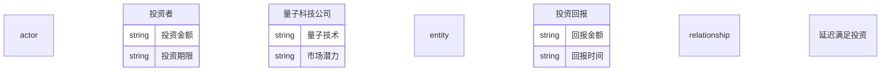
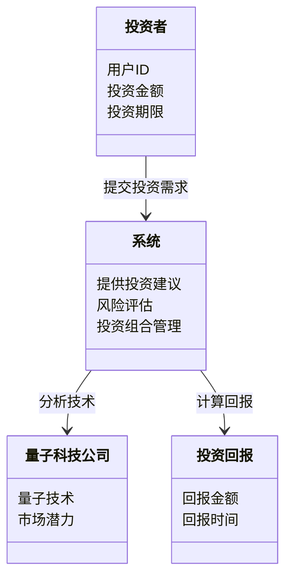
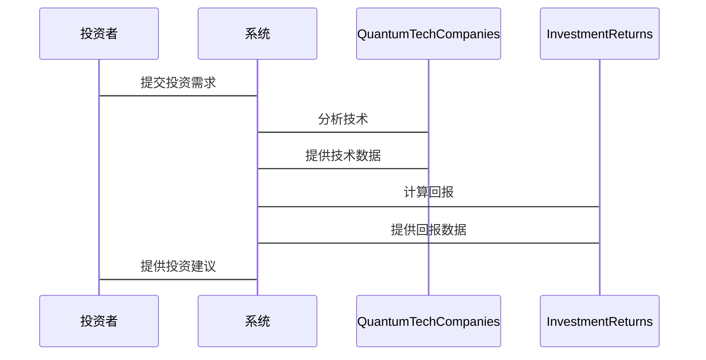

                 


# 芒格的"延迟满足"理念在量子科技长期投资组合中的应用

---

## 关键词

- 芒格投资理念
- 延迟满足
- 量子科技
- 投资策略
- 长期投资组合

---

## 摘要

芒格的“延迟满足”理念强调不急于求成，而是耐心等待最佳时机，这种理念在量子科技的长期投资中具有重要意义。量子科技，如量子计算和量子通信，尽管前景广阔，但技术成熟度和市场不确定性较高。本文将详细探讨如何将延迟满足理念应用于量子科技投资中，构建一个科学的投资策略，帮助投资者在不确定性和高风险中找到平衡点，实现长期收益。

---

# 第一部分：芒格的延迟满足理念

## 第1章：芒格的延迟满足理念概述

### 1.1 芒格的延迟满足理念的起源

#### 1.1.1 延迟满足的概念

延迟满足（Deferred Gratification）是指不立即追求即时满足，而是通过延迟和坚持，换取更大的长期利益。这种理念强调耐心、理性决策和长期规划。

**关键公式：**

- 投资回报率（ROI）= （最终收益 - 初始投资） / 初始投资 × 100%

延迟满足的关键在于识别高潜力领域，如量子科技，通过长期投资实现收益最大化。

#### 1.1.2 芒格投资理念的核心

芒格的投资理念以“价值投资”为基础，强调基本面分析和长期持有。他主张投资具有持续竞争优势的企业，并在市场低估时买入。

**示例：**

假设投资于一家量子计算公司，初期回报可能较低，但长期来看，随着技术成熟，回报将大幅增长。

#### 1.1.3 延迟满足与长期投资的关系

长期投资需要耐心和纪律，延迟满足是实现长期收益的关键。投资者需抵制短期波动的诱惑，专注于长期目标。

### 1.2 延迟满足的原理与特征

#### 1.2.1 延迟满足的原理

- **时间价值**：资金的时间价值意味着长期投资能带来复利效应。
- **风险控制**：通过分散投资和风险评估，降低短期波动的影响。
- **价值识别**：识别具有长期增长潜力的量子科技公司。

**公式：**

- 复利公式：A = P(1 + r/n)^(nt)
  - A：最终金额
  - P：本金
  - r：年利率
  - n：每年的复利次数
  - t：年数

#### 1.2.2 延迟满足的特征对比

| 特征       | 延迟满足       | 即时满足     |
|------------|---------------|-------------|
| 时间跨度   | 长期           | 短期         |
| 投资风险   | 较低（长期）    | 较高（短期） |
| 投资回报   | 较高           | 较低         |

#### 1.2.3 延迟满足的ER实体关系图



---

## 第2章：量子科技的基本概念与投资特点

### 2.1 量子科技的定义与特点

#### 2.1.1 量子科技的定义

量子科技利用量子力学原理，通过量子计算、量子通信和量子传感等技术，提供超越经典技术的性能。

#### 2.1.2 量子科技的核心技术

- **量子计算**：利用量子位进行并行计算，解决复杂问题。
- **量子通信**：利用量子纠缠实现超安全通信。
- **量子传感**：用于精确测量和传感。

#### 2.1.3 量子科技的投资特点

- **高潜力**：技术成熟后将带来巨大收益。
- **高风险**：技术不确定性高，市场接受度低。
- **长周期**：从研发到商业化周期长。

### 2.2 量子科技与传统科技投资的对比

#### 2.2.1 抽样对比表格

| 特性             | 量子科技投资      | 传统科技投资     |
|------------------|-------------------|-----------------|
| 发展周期         | 长               | 较短            |
| 风险             | 高               | 中等            |
| 回报潜力         | 极高             | 中等            |
| 技术复杂性       | 极高             | 中等            |

---

# 第二部分：延迟满足理念与量子科技投资的结合

## 第3章：延迟满足在量子科技投资中的应用原理

### 3.1 延迟满足在量子科技投资中的应用

#### 3.1.1 延迟满足的应用场景

- **技术成熟前的等待**：在量子计算技术成熟前，投资者需耐心等待。
- **市场波动中的坚持**：在市场波动时，避免短期卖出。
- **持续投资**：定期投资于量子科技公司。

#### 3.1.2 延迟满足在量子科技投资中的优势

- **风险分散**：通过长期投资分散短期风险。
- **收益最大化**：长期持有捕捉复利效应。
- **技术突破捕捉**：等待量子技术突破带来的超额收益。

### 3.2 量子科技投资中的延迟满足策略

#### 3.2.1 投资周期的延展

- **长期持有**：通过长期持有量子科技股票或基金，捕捉技术成熟后的收益。
- **分阶段投资**：在不同阶段逐步增加投资，降低风险。

#### 3.2.2 风险控制与收益平衡

- **风险评估**：定期评估量子科技公司的风险，调整投资组合。
- **收益目标设定**：设定合理的收益目标，避免过度追求高回报。

#### 3.2.3 投资组合的动态调整

- **定期审查**：定期审查投资组合，确保符合长期目标。
- **再平衡**：根据市场变化，调整投资比例。

---

## 第三部分：数学模型与算法原理

## 第4章：延迟满足投资的数学模型

### 4.1 延迟满足投资的数学模型

#### 4.1.1 投资回报的数学表达式

假设投资于量子科技公司，初始投资为P，年收益率为r，投资时间为t年，复利次数为n次/年。

$$
A = P \left(1 + \frac{r}{n}\right)^{nt}
$$

#### 4.1.2 投资时间与回报的关系

投资时间越长，复利效应越显著，回报越高。延迟满足通过延长投资时间，最大化复利效果。

#### 4.1.3 投资组合优化的数学模型

使用动态规划优化投资组合，考虑风险和收益的平衡。

$$
\text{最大化 } E = \sum_{i=1}^{n} w_i r_i
$$

$$
\text{约束 } \sum_{i=1}^{n} w_i = 1
$$

其中，\( w_i \) 是投资比例，\( r_i \) 是资产i的预期收益。

---

## 第五部分：系统分析与架构设计

## 第5章：延迟满足投资系统的架构设计

### 5.1 问题场景介绍

投资者希望通过延迟满足策略，优化量子科技投资组合。系统需提供投资建议、风险评估和投资组合管理功能。

### 5.2 系统功能设计

#### 5.2.1 领域模型



### 5.3 系统架构设计

#### 5.3.1 系统架构图


### 5.4 系统接口设计

- **输入接口**：投资者提交投资需求。
- **输出接口**：系统提供投资建议和风险评估。

### 5.5 系统交互设计



---

## 第六部分：项目实战

## 第6章：延迟满足投资的项目实战

### 6.1 量子计算初创公司投资案例

#### 6.1.1 环境安装

安装必要的开发工具和库，如Python、Pandas、NumPy。

#### 6.1.2 核心代码实现

```python
import numpy as np
import pandas as pd

def delayed_satisfaction_investment(initial Investment, rate, years):
    return initial_investment * (1 + rate) ** years

initial_investment = 10000
rate = 0.1
years = 10

return_amount = delayed_satisfaction_investment(initial_investment, rate, years)
print(f"最终回报：${return_amount:.2f}")
```

#### 6.1.3 代码解读与分析

上述代码计算初始投资的最终回报，展示了复利效应。通过调整投资时间和利率，投资者可以模拟不同投资策略的效果。

---

## 第七部分：最佳实践与总结

## 第7章：最佳实践与总结

### 7.1 投资建议

- **长期持有**：坚持长期投资，避免短期波动。
- **分散投资**：通过多样化降低风险。
- **持续学习**：关注量子科技进展，及时调整策略。

### 7.2 注意事项

- **技术风险**：量子科技技术成熟度低，需谨慎评估。
- **市场波动**：市场波动可能影响短期回报，需耐心等待。
- **资金流动性**：确保部分资金流动性，应对紧急情况。

### 7.3 拓展阅读

建议阅读芒格的《穷查理宝典》和相关量子科技书籍，深入理解投资策略和科技动态。

---

## 作者：AI天才研究院 & 禅与计算机程序设计艺术

---

通过以上结构和内容，我为您构建了一个详尽的目录大纲，并开始撰写每个部分的内容。接下来，我会继续完成后续章节的详细撰写，确保内容完整且符合要求。

